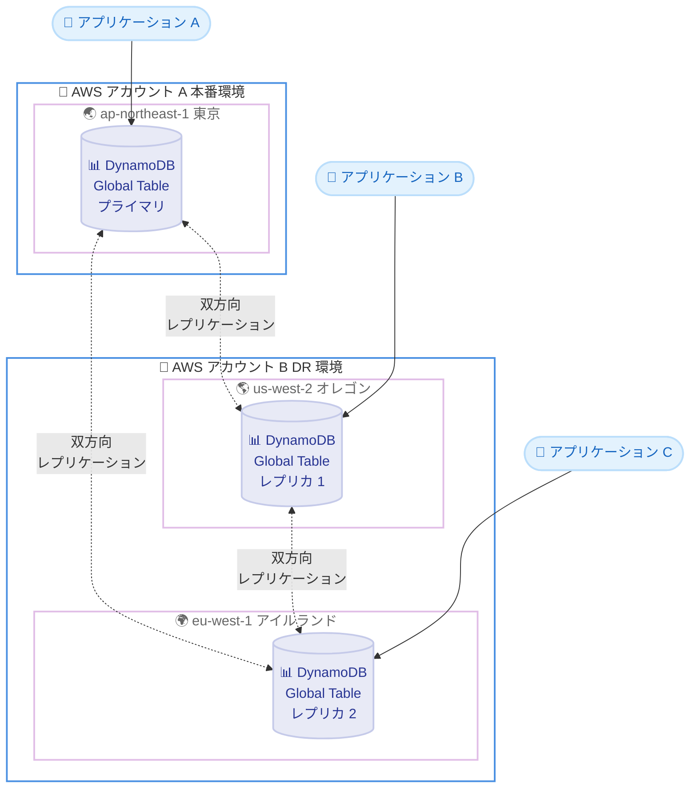

# Amazon DynamoDB Global Tables - マルチアカウント競合解決サポート

**リリース日**: 2026年02月05日
**サービス**: Amazon DynamoDB
**機能**: Global Tables マルチアカウント競合解決

📊 [このアップデートのインフォグラフィックを見る](https://takech9203.github.io/aws-news-summary/20260205-dynamodb-global-tables-multi-account-conflict-resolution.html)
<!-- GitLab Pages URL: https://takech9203.github.io/aws-news-summary/20260205-dynamodb-global-tables-multi-account-conflict-resolution.html -->

## 概要

Amazon DynamoDB Global Tables は、複数の AWS アカウントとリージョンをまたいだレプリケーションのサポートを追加しました。この機能により、アカウントレベルの障害発生時においても、アプリケーションの可用性と耐障害性が大幅に向上します。

これまで DynamoDB Global Tables は、単一の AWS アカウント内の複数リージョン間でのみレプリケーションが可能でした。今回のアップデートにより、AWS Organizations を活用したマルチアカウント戦略を採用している企業が、セキュリティ分離、データ境界ガードレール、ディザスタリカバリ、ワークロード分離などの要件を満たしながら、グローバルなデータレプリケーションを実現できるようになります。

**アップデート前の課題**

- DynamoDB Global Tables は単一の AWS アカウント内でのみレプリケーション可能であり、マルチアカウント環境での利用に制限があった
- アカウントレベルの障害が発生した場合、そのアカウント内の全リージョンのテーブルが影響を受ける可能性があった
- セキュリティ分離やデータ境界ガードレールの要件を満たすために、別のアカウントにデータをレプリケートする必要がある場合、カスタムソリューションを構築する必要があった
- AWS Organizations を活用したマルチアカウント戦略において、グローバルテーブルの利用が制限されていた

**アップデート後の改善**

- DynamoDB Global Tables が複数の AWS アカウント間でレプリケーションを実行できるようになり、アカウントレベルの分離が可能になった
- アカウントレベルの障害発生時でも、別のアカウントのテーブルから継続的にデータアクセスが可能になり、ビジネス継続性が向上した
- AWS Organizations のマルチアカウント戦略と DynamoDB Global Tables を統合でき、セキュリティとコンプライアンスの要件を満たしながらグローバルレプリケーションを実現できるようになった
- カスタムのレプリケーションソリューションを構築・運用する必要がなくなり、運用コストと複雑性が削減された

## アーキテクチャ図



この図は、AWS アカウント A の本番環境にあるプライマリテーブルが、AWS アカウント B の DR 環境にある複数リージョンのレプリカテーブルと双方向レプリケーションを実行している様子を示しています。アカウント A で障害が発生した場合でも、アカウント B のレプリカテーブルから継続的にデータアクセスが可能です。

## サービスアップデートの詳細

### 主要機能

1. **マルチアカウントレプリケーション**
   - DynamoDB Global Tables が複数の AWS アカウント間でデータレプリケーションを実行可能
   - 各アカウントは独立した IAM ポリシー、請求、リソース制限を持つため、セキュリティ分離が強化される
   - AWS Organizations の組織単位 (OU) を活用したアカウント構造と統合可能

2. **アカウントレベルの耐障害性**
   - 単一アカウントで障害が発生しても、他のアカウントのレプリカテーブルから継続的にアクセス可能
   - アプリケーションは障害発生時に別のアカウントのエンドポイントに自動的にフェイルオーバー可能
   - リージョンレベルに加えて、アカウントレベルの冗長性が提供される

3. **既存の Global Tables 機能との統合**
   - 競合解決メカニズム (Last Writer Wins) がマルチアカウント環境でも動作
   - Point-in-Time Recovery (PITR) やオンデマンドバックアップが全てのレプリカで利用可能
   - DynamoDB Streams、Triggers、グローバルセカンダリインデックス (GSI) など既存機能をサポート

## 技術仕様

### レプリケーション設定

マルチアカウント Global Tables を設定する際は、以下の要素を考慮してください。

| 項目 | 詳細 |
|------|------|
| 対応テーブルタイプ | 新規作成テーブル、既存テーブルからの移行の両方に対応 |
| レプリケーション方向 | 双方向レプリケーション (すべてのレプリカ間で同期) |
| 競合解決 | Last Writer Wins (最後の書き込みが優先) |
| レプリケーション遅延 | 通常 1 秒未満 (ネットワーク状況により変動) |
| 整合性モデル | 結果整合性 (各リージョンで最終的に整合) |

### API 変更履歴

| 日付 | サービス | 変更内容 |
|------|----------|----------|
| 2026/02/03 | [Amazon DynamoDB](https://awsapichanges.com/archive/changes/104e8e-dynamodb.html) | 9 updated api methods - マルチアカウント Global Tables サポートのため、CreateTable、CreateGlobalTable、DescribeTable、UpdateTable など 9 つの API メソッドが更新され、新しいパラメータ `GlobalTableSourceArn` と `GlobalTableSettingsReplicationMode` が追加されました |

### IAM 権限要件

マルチアカウント Global Tables を設定するには、以下の IAM 権限が必要です。

```json
{
  "Version": "2012-10-17",
  "Statement": [
    {
      "Effect": "Allow",
      "Action": [
        "dynamodb:CreateGlobalTable",
        "dynamodb:UpdateGlobalTableSettings",
        "dynamodb:DescribeGlobalTable",
        "dynamodb:UpdateTable"
      ],
      "Resource": "arn:aws:dynamodb:*:*:table/*"
    },
    {
      "Effect": "Allow",
      "Action": [
        "iam:CreateServiceLinkedRole"
      ],
      "Resource": "arn:aws:iam::*:role/aws-service-role/dynamodb.amazonaws.com/AWSServiceRoleForDynamoDBReplication"
    }
  ]
}
```

## 設定方法

### 前提条件

1. 複数の AWS アカウントが必要 (最低 2 つ)
2. 各アカウントで DynamoDB テーブルを作成する権限
3. AWS Organizations に参加しているアカウント (推奨)
4. 各リージョンで DynamoDB Global Tables がサポートされていること

### 手順

#### ステップ1: プライマリテーブルの作成

```bash
# アカウント A の東京リージョンでプライマリテーブルを作成
aws dynamodb create-table \
    --table-name GlobalTableExample \
    --attribute-definitions \
        AttributeName=id,AttributeType=S \
    --key-schema \
        AttributeName=id,KeyType=HASH \
    --billing-mode PAY_PER_REQUEST \
    --region ap-northeast-1
```

このコマンドは、アカウント A の東京リージョンに DynamoDB テーブルを作成します。`--billing-mode PAY_PER_REQUEST` を指定することで、オンデマンド課金モードが有効になり、事前のキャパシティプランニングが不要になります。

#### ステップ2: Global Table の作成とレプリカの追加

```bash
# Global Table を作成し、アカウント B のオレゴンリージョンにレプリカを追加
aws dynamodb create-global-table \
    --global-table-name GlobalTableExample \
    --replication-group \
        RegionName=ap-northeast-1 \
        RegionName=us-west-2,GlobalTableSourceArn=arn:aws:dynamodb:us-west-2:ACCOUNT_B_ID:table/GlobalTableExample \
    --region ap-northeast-1
```

このコマンドは、Global Table を作成し、アカウント B のオレゴンリージョンにレプリカを追加します。`GlobalTableSourceArn` パラメータを使用して、別のアカウントのテーブルを指定します。

#### ステップ3: 追加のレプリカの作成

```bash
# アカウント B のアイルランドリージョンに追加のレプリカを作成
aws dynamodb update-table \
    --table-name GlobalTableExample \
    --replica-updates \
        Create={RegionName=eu-west-1,GlobalTableSourceArn=arn:aws:dynamodb:eu-west-1:ACCOUNT_B_ID:table/GlobalTableExample} \
    --region ap-northeast-1
```

このコマンドは、既存の Global Table にアカウント B のアイルランドリージョンのレプリカを追加します。

#### ステップ4: レプリケーション状態の確認

```bash
# Global Table の状態を確認
aws dynamodb describe-global-table \
    --global-table-name GlobalTableExample \
    --region ap-northeast-1
```

このコマンドは、Global Table の現在の状態とすべてのレプリカの情報を返します。`ReplicationStatus` が `ACTIVE` になっていることを確認してください。

## メリット

### ビジネス面

- **ビジネス継続性の向上**: アカウントレベルの障害が発生しても、別のアカウントからデータアクセスが可能なため、ビジネスの中断を最小限に抑えられる
- **コンプライアンス要件への対応**: データ境界ガードレールやセキュリティ分離の要件を満たしながら、グローバルなデータレプリケーションを実現できる
- **運用コストの削減**: カスタムのレプリケーションソリューションを構築・運用する必要がなくなり、開発およびメンテナンスコストが削減される

### 技術面

- **アカウントレベルの分離**: 各アカウントが独立した IAM ポリシー、請求、リソース制限を持つため、セキュリティとガバナンスが強化される
- **マルチリージョン + マルチアカウント冗長性**: リージョンレベルに加えて、アカウントレベルの冗長性が提供され、耐障害性が大幅に向上する
- **シームレスな統合**: 既存の DynamoDB Global Tables 機能 (競合解決、PITR、Streams など) がマルチアカウント環境でもそのまま動作する

## デメリット・制約事項

### 制限事項

- 各アカウントで DynamoDB テーブルを作成・管理する権限が必要であり、IAM 権限の設定が複雑になる可能性がある
- レプリケーション遅延は通常 1 秒未満だが、ネットワーク状況やデータ量により変動する可能性がある
- クロスアカウントアクセスの設定には、適切な IAM ロールと信頼関係の構成が必要

### 考慮すべき点

- マルチアカウント環境では、各アカウントの請求が個別に発生するため、コスト管理が複雑になる可能性がある
- 競合解決は Last Writer Wins (最後の書き込みが優先) のみであり、カスタムの競合解決ロジックは実装できない
- 各レプリカで独立したバックアップと復元が可能だが、すべてのレプリカで一貫したバックアップタイミングを維持するには追加の調整が必要

## ユースケース

### ユースケース1: ディザスタリカバリ (DR) 環境の構築

**シナリオ**: 金融機関が本番環境 (アカウント A) とは別のアカウント (アカウント B) に DR 環境を構築し、アカウントレベルの障害に備える。

**実装例**:
```bash
# 本番アカウント (アカウント A) のプライマリテーブル
aws dynamodb create-table \
    --table-name TransactionData \
    --attribute-definitions AttributeName=transactionId,AttributeType=S \
    --key-schema AttributeName=transactionId,KeyType=HASH \
    --billing-mode PAY_PER_REQUEST \
    --region ap-northeast-1

# DR アカウント (アカウント B) にレプリカを作成
aws dynamodb create-global-table \
    --global-table-name TransactionData \
    --replication-group \
        RegionName=ap-northeast-1 \
        RegionName=us-west-2,GlobalTableSourceArn=arn:aws:dynamodb:us-west-2:ACCOUNT_B_ID:table/TransactionData \
    --region ap-northeast-1
```

**効果**: アカウント A で障害が発生した場合でも、アカウント B の DR 環境から継続的にトランザクションデータにアクセスでき、ビジネスの中断を最小限に抑えられます。

### ユースケース2: セキュリティ分離とデータ境界ガードレールの実装

**シナリオ**: ヘルスケア企業が、コンプライアンス要件を満たすために、患者データを別のアカウントに分離し、データ境界ガードレールを実装する。

**実装例**:
```bash
# メインアカウントのテーブル
aws dynamodb create-table \
    --table-name PatientRecords \
    --attribute-definitions AttributeName=patientId,AttributeType=S \
    --key-schema AttributeName=patientId,KeyType=HASH \
    --billing-mode PAY_PER_REQUEST \
    --region us-east-1

# セキュアアカウントにレプリカを作成 (厳格な IAM ポリシー適用)
aws dynamodb create-global-table \
    --global-table-name PatientRecords \
    --replication-group \
        RegionName=us-east-1 \
        RegionName=eu-central-1,GlobalTableSourceArn=arn:aws:dynamodb:eu-central-1:SECURE_ACCOUNT_ID:table/PatientRecords \
    --region us-east-1
```

**効果**: 患者データを別のアカウントに分離することで、セキュリティとコンプライアンスの要件を満たしながら、必要に応じてデータにアクセスできます。

### ユースケース3: 開発・テスト・本番環境の分離

**シナリオ**: SaaS 企業が、開発 (アカウント Dev)、テスト (アカウント Test)、本番 (アカウント Prod) の各環境を別のアカウントに分離し、データを共有する。

**実装例**:
```bash
# 本番アカウントのテーブル
aws dynamodb create-table \
    --table-name UserProfiles \
    --attribute-definitions AttributeName=userId,AttributeType=S \
    --key-schema AttributeName=userId,KeyType=HASH \
    --billing-mode PAY_PER_REQUEST \
    --region us-west-2

# テストアカウントにレプリカを作成
aws dynamodb create-global-table \
    --global-table-name UserProfiles \
    --replication-group \
        RegionName=us-west-2 \
        RegionName=us-east-1,GlobalTableSourceArn=arn:aws:dynamodb:us-east-1:TEST_ACCOUNT_ID:table/UserProfiles \
    --region us-west-2
```

**効果**: 開発・テスト環境が本番データのレプリカを使用できるため、リアルなテストが可能になります。各環境が独立したアカウントにあるため、誤って本番データを変更するリスクが低減されます。

## 料金

マルチアカウント Global Tables の料金は、既存の DynamoDB Global Tables の料金体系と同じです。

### 料金体系

- **読み取り・書き込みリクエスト**: 各レプリカで個別に課金されます (オンデマンドまたはプロビジョニング済みキャパシティ)
- **ストレージ**: 各レプリカのデータストレージに対して課金されます
- **レプリケーションコスト**: レプリカ間のデータ転送に対して追加料金が発生します
- **クロスアカウント転送**: 異なるアカウント間のデータ転送には、標準の AWS データ転送料金が適用されます

### 料金例

| 使用量 | 月額料金 (概算) |
|--------|------------------|
| 2 つのアカウント、各 1 リージョン、1GB データ、100 万リクエスト/月 | 約 $2.50 (各アカウントで約 $1.25) |
| 2 つのアカウント、各 2 リージョン、10GB データ、1000 万リクエスト/月 | 約 $50.00 (各アカウントで約 $25.00) |
| 3 つのアカウント、各 1 リージョン、100GB データ、1 億リクエスト/月 | 約 $750.00 (各アカウントで約 $250.00) |

**注意**: 実際の料金はリージョン、リクエストタイプ (読み取り/書き込み)、データ転送量により異なります。詳細は AWS 料金ページを参照してください。

## 利用可能リージョン

このアップデートは、DynamoDB Global Tables がサポートされている全ての AWS リージョンで利用可能です。これには以下が含まれます。

- 米国東部 (バージニア北部、オハイオ)
- 米国西部 (オレゴン、北カリフォルニア)
- 欧州 (アイルランド、フランクフルト、ロンドン、パリ、ストックホルム、ミラノ)
- アジアパシフィック (東京、ソウル、シンガポール、シドニー、ムンバイ、香港、大阪)
- 南米 (サンパウロ)
- カナダ (中部)
- 中東 (バーレーン)
- アフリカ (ケープタウン)

## 関連サービス・機能

- **AWS Organizations**: マルチアカウント環境の管理と統制を提供し、DynamoDB Global Tables のマルチアカウント構成と統合できます
- **AWS Identity and Access Management (IAM)**: クロスアカウントアクセスの制御と、各アカウントのリソースへのアクセス権限を管理します
- **DynamoDB Streams**: テーブルへの変更をキャプチャし、Lambda 関数や他のサービスと連携できます (マルチアカウント環境でも利用可能)
- **AWS Backup**: DynamoDB テーブルの自動バックアップと復元を管理でき、マルチアカウント Global Tables のバックアップ戦略に統合できます
- **Amazon CloudWatch**: DynamoDB Global Tables のメトリクスとログを収集し、パフォーマンスとヘルスを監視できます

## 参考リンク

- 📊 [インフォグラフィック](https://takech9203.github.io/aws-news-summary/20260205-dynamodb-global-tables-multi-account-conflict-resolution.html)
- [公式発表 (What's New)](https://aws.amazon.com/about-aws/whats-new/2026/02/dynamodb-gt-multi-account/)
- [DynamoDB Global Tables ドキュメント](https://docs.aws.amazon.com/amazondynamodb/latest/developerguide/GlobalTables.html)
- [DynamoDB 料金ページ](https://aws.amazon.com/dynamodb/pricing/)
- [AWS Organizations ドキュメント](https://docs.aws.amazon.com/organizations/)

## まとめ

Amazon DynamoDB Global Tables のマルチアカウントサポートにより、AWS Organizations を活用したマルチアカウント戦略を採用している企業が、セキュリティ分離、データ境界ガードレール、ディザスタリカバリなどの要件を満たしながら、グローバルなデータレプリケーションを実現できるようになりました。アカウントレベルの障害に対する耐障害性が向上し、ビジネス継続性が強化されます。既存の DynamoDB Global Tables を使用している場合は、この新機能を活用してマルチアカウント構成に移行することを検討してください。
