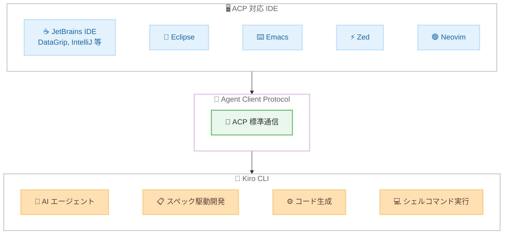

# Kiro - Agent Client Protocol (ACP) サポート

**リリース日**: 2026 年 2 月 5 日
**サービス**: Kiro
**機能**: Agent Client Protocol (ACP) サポート

📊 [このアップデートのインフォグラフィックを見る](https://takech9203.github.io/awsnews-summary/20260205-kiro-adopts-acp.html)

## 概要

Kiro CLI が Agent Client Protocol (ACP) をサポートしました。ACP は、コードエディタと AI コーディングエージェント間の通信を標準化するプロトコルです。これにより、Kiro のエージェント型 AI 機能を、JetBrains IDE、Eclipse、Emacs、Zed、Neovim など、ACP 対応のさまざまな IDE から直接利用できるようになりました。

ACP は、Language Server Protocol (LSP) が言語サーバーとエディタの通信を標準化したのと同様に、AI エージェントとエディタの通信を標準化するプロトコルです。ACP 以前は、エージェントとエディタの組み合わせごとにカスタム統合が必要でしたが、ACP により 1 つのプロトコルで複数の IDE と連携できるようになります。

**アップデート前の課題**

- AI エージェントと各エディタの統合にはそれぞれカスタムの実装が必要だった
- 専門特化型 IDE (DataGrip、Xcode、Android Studio など) で Kiro の機能を利用できなかった
- エージェントとエディタの組み合わせが増えるたびに統合コストが増大していた

**アップデート後の改善**

- ACP 標準プロトコルにより、対応 IDE から Kiro をカスタムエージェントとして利用可能
- 専門特化型 IDE のドメイン知識と Kiro のエージェント機能を組み合わせて活用可能
- 1 つのプロトコルで複数の IDE との統合が実現

## アーキテクチャ図



ACP 対応 IDE が標準プロトコルを介して Kiro CLI と通信し、各 IDE のドメイン知識と Kiro のエージェント機能を組み合わせて活用する構成を示しています。

## サービスアップデートの詳細

### 主要機能

1. **ACP プロトコルサポート**
   - Kiro CLI が ACP に対応し、`--acp` フラグで ACP モードを起動
   - LSP と同様のアーキテクチャで、エディタとエージェント間の標準通信を実現
   - 1 つのプロトコル実装で複数の IDE に対応

2. **マルチ IDE 対応**
   - JetBrains IDE (DataGrip、IntelliJ IDEA 等)、Eclipse、Emacs、Zed、Neovim、Toad に対応
   - 各 IDE の AI Chat 機能からカスタムエージェントとして Kiro を追加可能
   - 将来的に Xcode、Android Studio、RStudio、Jupyter なども対象

3. **IDE ドメイン知識との統合**
   - 専門特化型 IDE のドメインインテリジェンス (例: DataGrip のスキーマ情報) と Kiro のエージェント機能を組み合わせ
   - SQL クエリ生成、デバッグ、マイグレーションスクリプト作成など IDE 固有のユースケースに対応
   - チャットインターフェースからシェルコマンドの実行も可能

## 技術仕様

### ACP と LSP の比較

| 項目 | LSP | ACP |
|------|-----|-----|
| 対象 | 言語サーバー | AI コーディングエージェント |
| 目的 | エディタと言語サーバー間の通信標準化 | エディタと AI エージェント間の通信標準化 |
| 効果 | N x M の統合を N + M に削減 | エージェントと IDE の統合を標準化 |

### 対応 IDE 一覧

| IDE | カテゴリ |
|-----|----------|
| JetBrains IDE | 汎用・専門特化型 |
| Eclipse | Java 開発 |
| Emacs | テキストエディタ |
| Neovim | テキストエディタ |
| Zed | モダンエディタ |
| Toad | データベース管理 |

### ACP 設定ファイル

```json
{
  "mcpServers": {
    "kiro": {
      "command": "/path/to/kiro",
      "args": ["--acp"]
    }
  }
}
```

JetBrains IDE の場合、`~/.jetbrains/acp.json` にこの設定を配置します。

## 設定方法

### 前提条件

1. Kiro CLI がインストール済みであること
2. Kiro CLI で認証が完了していること
3. ACP 対応の IDE がインストール済みであること

### 手順

#### ステップ 1: Kiro CLI のインストールと認証

```bash
# Kiro CLI のインストール後、認証を実行
kiro auth login
```

Kiro CLI をインストールし、認証を完了させます。

#### ステップ 2: ACP 設定ファイルの作成

JetBrains IDE (DataGrip 等) の場合、以下の設定ファイルを作成します。

```bash
mkdir -p ~/.jetbrains
cat > ~/.jetbrains/acp.json << 'EOF'
{
  "mcpServers": {
    "kiro": {
      "command": "/path/to/kiro",
      "args": ["--acp"]
    }
  }
}
EOF
```

`/path/to/kiro` を実際の Kiro CLI のパスに置き換えてください。

#### ステップ 3: IDE でカスタムエージェントを追加

1. DataGrip (または対応する JetBrains IDE) を開く
2. AI Chat パネルを開く
3. メニューから "Add Custom Agent" を選択
4. ACP 設定ファイルのパスを指定

設定完了後、AI Chat のドロップダウンに Kiro が表示されます。

## メリット

### ビジネス面

- **開発環境の選択肢拡大**: 開発者が使い慣れた IDE で Kiro のエージェント機能を活用可能
- **統合コストの削減**: ACP 標準プロトコルにより個別のカスタム統合が不要
- **専門チームの生産性向上**: DBA、モバイル開発者など専門特化型 IDE ユーザーも Kiro を利用可能

### 技術面

- **プロトコル標準化**: LSP と同様のアーキテクチャで信頼性の高い通信を実現
- **ドメイン知識の活用**: IDE 固有の情報 (スキーマ、型情報等) と AI エージェントの組み合わせ
- **拡張性**: ACP 対応 IDE が増えるたびに自動的に Kiro の利用範囲が拡大

## デメリット・制約事項

### 制限事項

- ACP 対応 IDE のみで利用可能 (非対応 IDE では Kiro IDE または CLI を直接使用)
- IDE ごとの ACP 設定方法が異なる場合がある
- ACP はまだ新しいプロトコルであり、IDE ごとの実装成熟度に差がある可能性がある

### 考慮すべき点

- Kiro CLI のパスを環境に合わせて正しく設定する必要がある
- IDE のバージョンが ACP に対応しているか事前に確認が必要

## ユースケース

### ユースケース 1: DataGrip でのデータベース開発

**シナリオ**: DBA が DataGrip を使用して SQL クエリの生成やパフォーマンスチューニングを行う

**実装例**:
```json
{
  "mcpServers": {
    "kiro": {
      "command": "/usr/local/bin/kiro",
      "args": ["--acp"]
    }
  }
}
```

**効果**: DataGrip のスキーマ情報と Kiro のエージェント機能を組み合わせ、SQL クエリ生成、スロークエリのデバッグ、マイグレーションスクリプトの作成を効率化

### ユースケース 2: Neovim でのフルスタック開発

**シナリオ**: Neovim を常用する開発者が、ターミナル環境を離れずに AI エージェント機能を活用する

**実装例**:
```
Neovim の ACP プラグイン設定で Kiro CLI のパスを指定し、
チャットインターフェースからコード生成やシェルコマンド実行を利用
```

**効果**: 使い慣れたエディタ環境を維持しながら、Kiro のスペック駆動開発やコード生成機能を利用可能

### ユースケース 3: JetBrains IDE でのエンタープライズ開発

**シナリオ**: IntelliJ IDEA を使用する Java 開発チームが、既存の開発フローに AI エージェントを統合する

**実装例**:
```json
{
  "mcpServers": {
    "kiro": {
      "command": "/opt/kiro/bin/kiro",
      "args": ["--acp"]
    }
  }
}
```

**効果**: IntelliJ IDEA の強力な Java サポートと Kiro のエージェント機能を組み合わせ、テストデータ生成、複雑な結合条件の解説、リファクタリング提案を実現

## 利用可能リージョン

グローバル

## 関連サービス・機能

- **Kiro 0.9**: カスタムサブエージェント、Agent Skills、エンタープライズ制御の同時リリース
- **MCP (Model Context Protocol)**: 外部ツールとの統合プロトコル
- **LSP (Language Server Protocol)**: ACP の設計思想の基盤となったプロトコル

## 参考リンク

- 📊 [インフォグラフィック](https://takech9203.github.io/awsnews-summary/20260205-kiro-adopts-acp.html)
- [公式ブログ](https://kiro.dev/blog/kiro-adopts-acp/)
- [Changelog](https://kiro.dev/changelog/)
- [Kiro CLI ドキュメント](https://kiro.dev/docs/cli/)
- [Kiro 公式サイト](https://kiro.dev/)

## まとめ

Kiro CLI の ACP サポートにより、JetBrains IDE、Eclipse、Emacs、Zed、Neovim など多様な IDE から Kiro のエージェント機能を利用できるようになりました。ACP は LSP と同様にエディタとエージェント間の通信を標準化するプロトコルであり、専門特化型 IDE のドメイン知識と AI エージェントの組み合わせという新しい開発体験を提供します。使い慣れた IDE で AI エージェント機能を活用したい開発者は、Kiro CLI の ACP モードをぜひお試しください。
