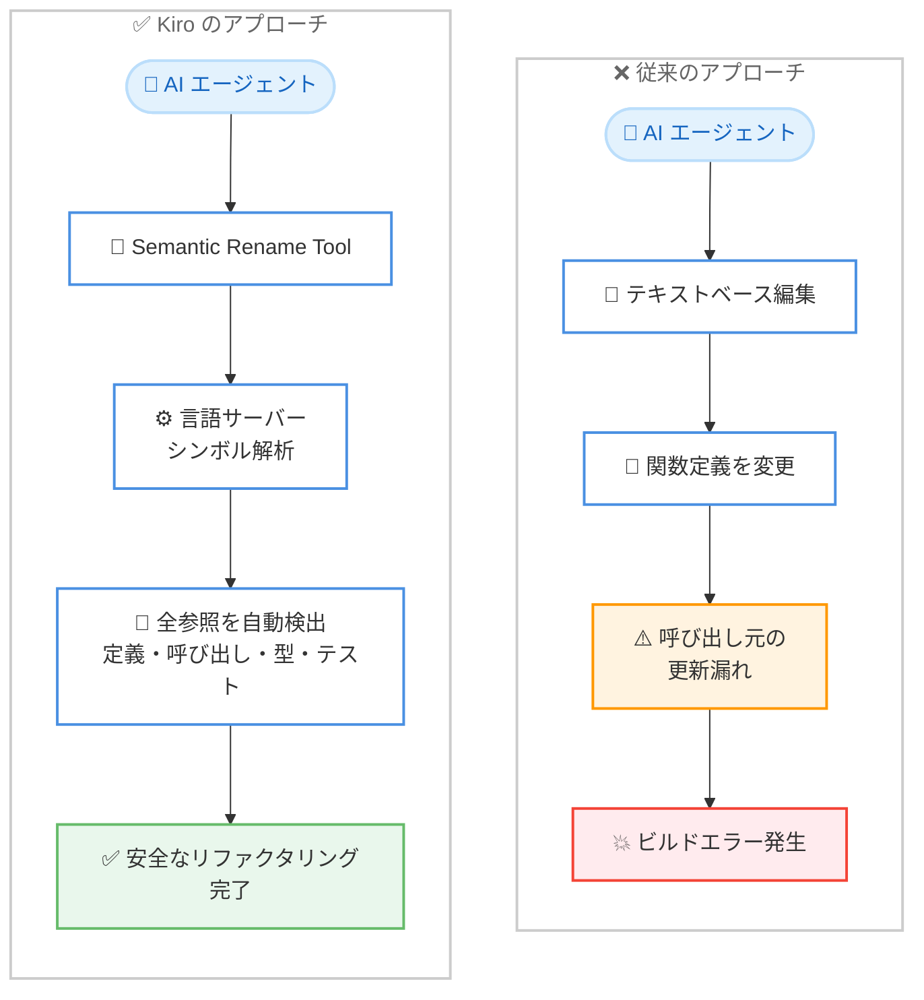

# Kiro - プログラム解析によるリファクタリングツール

**リリース日**: 2026 年 2 月 5 日
**サービス**: Kiro
**機能**: セマンティックリファクタリングツール

📊 [このアップデートのインフォグラフィックを見る](https://takech9203.github.io/aws-news-summary/20260205-kiro-refactoring-made-right.html)

## 概要

Kiro に 2 つのセマンティックリファクタリングツールが追加されました。AI コーディングアシスタントはコード生成には優れていますが、リファクタリングではテキストベースの編集として扱うため、参照の更新漏れやビルドエラーが頻繁に発生していました。今回のアップデートでは、IDE の言語サーバーが持つプログラム解析能力をエージェントに公開することで、構造的に正確なリファクタリングを実現します。

Semantic Rename Tool と Smart Relocate Tool の 2 つのツールにより、シンボル名の変更やファイルの移動がコードベース全体で安全に実行されます。これらは VSCode の F2 リネームやファイルドラッグアンドドロップと同等の機能をプログラム的に提供するもので、TypeScript、JavaScript、TSX、JSX をネイティブサポートし、Python、Go、Java は言語拡張機能を通じて対応します。

**アップデート前の課題**

- LLM はリファクタリングをテキスト編集として扱い、コードベースのセマンティック構造を理解できなかった
- 関数名の変更時に呼び出し元、型定義、インポート文、テストの更新が漏れることがあった
- ファイル移動時にインポートパス、バレルファイル、モジュール解決の設定が壊れることがあった
- 手動での検索・置換による修正はエラーが発生しやすく、時間がかかっていた

**アップデート後の改善**

- 言語サーバーのシンボル解析により、コードベース全体でのリネームが確実に実行される
- ファイル移動時にすべての参照パスが自動的に更新される
- パスエイリアスやモノレポなどのエッジケースにも対応
- エージェントがリファクタリングを指示し、IDE の言語サーバーが正確性を検証する分業が実現

## アーキテクチャ図



従来のアプローチでは LLM がテキストパターンマッチングでリネームを試みるため参照の更新漏れが発生するのに対し、Kiro のアプローチでは言語サーバーのシンボル解析を活用してコードベース全体の参照を自動的に更新します。

## サービスアップデートの詳細

### 主要機能

1. **Semantic Rename Tool**
   - VSCode のシンボルリネーム API (F2 キーと同等) をプログラム的に公開
   - `vscode.prepareRename` でリネームの妥当性を事前検証
   - `vscode.executeDocumentRenameProvider` でワークスペース全体の編集を生成
   - 関数定義、呼び出し元、型定義、インポート/エクスポート文、テスト、ドキュメントを一括更新

2. **Smart Relocate Tool**
   - VSCode のファイル移動機能 (`vscode.WorkspaceEdit.renameFile`) を活用
   - ファイル移動時にすべてのインポートパスを自動更新
   - VSCode エクスプローラーでのドラッグアンドドロップと同等の機能をプログラム的に提供
   - バレルファイル、モジュール解決の前提、設定ファイルも含めて更新

3. **IDE とエージェントの分業モデル**
   - エージェントがリファクタリングの意図を判断し、ツールを選択
   - IDE の言語サーバーがセマンティック解析と正確性の検証を担当
   - パターンマッチングではなくプログラム解析に基づく確実な変更

## 技術仕様

### 対応言語

| 言語 | サポート方式 |
|------|-------------|
| TypeScript | ネイティブサポート |
| JavaScript | ネイティブサポート |
| TSX | ネイティブサポート |
| JSX | ネイティブサポート |
| Python | 言語拡張機能経由 |
| Go | 言語拡張機能経由 |
| Java | 言語拡張機能経由 |

### 従来の失敗パターンと解決

| 従来の操作 | 失敗パターン | Kiro での解決 |
|-----------|-------------|--------------|
| メソッド名の変更 | 定義は更新されるが呼び出し元が未更新 | Semantic Rename で全参照を一括更新 |
| Lint エラー修正 | 関数名を変更しても全ての使用箇所に伝播されない | 言語サーバーが全使用箇所を検出して更新 |
| ファイル移動 | インポート文が旧パスのまま壊れる | Smart Relocate で全インポートパスを自動更新 |

### リファクタリングが難しい理由

リファクタリングはコードベースのセマンティック構造に対するグラフ探索問題です。以下に影響範囲の例を示します。

**関数名の変更の影響範囲**:
- すべての呼び出し元
- 型定義
- インポート/エクスポート文
- テストコード
- ドキュメント

**ファイル移動の影響範囲**:
- インポートパス
- バレルファイル
- モジュール解決の前提
- 設定ファイル

## メリット

### ビジネス面

- **開発速度の向上**: 手動での検索・置換が不要になり、リファクタリング作業が高速化
- **品質向上**: 参照の更新漏れによるビルドエラーやランタイムエラーが削減
- **大規模リファクタリングの実現**: モノレポやパスエイリアスを含む複雑なプロジェクトでも安全にリファクタリング可能

### 技術面

- **言語認識**: モジュール解決の仕組みを理解した上でリファクタリングを実行
- **安全性**: 動作中のコードを壊す可能性が大幅に低減
- **エッジケース対応**: パスエイリアス、モノレポ、バレルファイルなどの複雑なケースに対応
- **IDE 連携**: 言語サーバーの成熟した解析能力をエージェントが活用

## デメリット・制約事項

### 制限事項

- ネイティブサポートは TypeScript、JavaScript、TSX、JSX に限定
- Python、Go、Java は対応する言語拡張機能のインストールが必要
- 言語サーバーが対応していない言語ではセマンティックリファクタリングが利用できない

### 考慮すべき点

- 言語拡張機能の品質がリファクタリングの精度に影響する
- 動的に生成されるコードや文字列内のシンボル参照は検出対象外の場合がある
- 大規模なコードベースでは言語サーバーのインデックス作成に時間がかかる場合がある

## ユースケース

### ユースケース 1: 大規模コードベースでの関数リネーム

**シナリオ**: 数百のファイルから参照される共通ユーティリティ関数の名前を変更する必要がある

**実装例**:
```
エージェントへの指示: "getUserData 関数を fetchUserProfile にリネームしてください"

Kiro の処理:
1. Semantic Rename Tool が vscode.prepareRename で妥当性を検証
2. vscode.executeDocumentRenameProvider で全参照を検出
3. 関数定義、全呼び出し元、型定義、テストを一括更新
```

**効果**: 手動での grep 検索や置換が不要になり、参照漏れのリスクがゼロに

### ユースケース 2: モノレポでのファイルリストラクチャリング

**シナリオ**: モノレポ内でモジュールのディレクトリ構造を再編成する

**実装例**:
```
エージェントへの指示: "src/utils/auth.ts を src/modules/auth/utils.ts に移動してください"

Kiro の処理:
1. Smart Relocate Tool が vscode.WorkspaceEdit.renameFile を実行
2. モノレポ内の全パッケージのインポートパスを自動更新
3. バレルファイルのエクスポートパスも更新
```

**効果**: 複数パッケージにまたがるインポートパスの更新が自動化され、ビルドエラーを防止

### ユースケース 3: Lint エラーの安全な修正

**シナリオ**: Lint ルール変更により命名規則に違反する関数名を一括修正する

**実装例**:
```
エージェントへの指示: "camelCase の命名規則に従って get_user_data を getUserData にリネームしてください"

Kiro の処理:
1. Semantic Rename Tool がシンボルの全使用箇所を解析
2. 関数定義と全呼び出し元を一括でリネーム
3. テストファイルの参照も自動更新
```

**効果**: Lint エラー修正が安全に完了し、修正に伴う新たなエラーの発生を防止

## 利用可能リージョン

グローバル

## 関連サービス・機能

- **Kiro 0.9**: カスタムサブエージェント、Agent Skills、エンタープライズ制御を含む同時リリース
- **VSCode Language Server Protocol**: セマンティックリファクタリングの基盤となる言語サーバー機能
- **MCP (Model Context Protocol)**: Kiro がツールを公開するためのプロトコル基盤

## 参考リンク

- 📊 [インフォグラフィック](https://takech9203.github.io/aws-news-summary/20260205-kiro-refactoring-made-right.html)
- [公式ブログ](https://kiro.dev/blog/refactoring-made-right/)
- [Kiro](https://kiro.dev/)
- [ドキュメント](https://kiro.dev/docs/)

## まとめ

Kiro のセマンティックリファクタリングツールは、AI コーディングアシスタントの最大の弱点の 1 つであるリファクタリングの不正確さを、IDE の言語サーバー連携により解決する重要なアップデートです。テキストベースの編集からプログラム解析ベースの編集へ移行することで、大規模コードベースでのリファクタリングの安全性と効率が大幅に向上します。TypeScript や JavaScript を主要言語とするプロジェクトでは、即座にこの機能を活用してリファクタリング作業の品質向上を図ることを推奨します。
