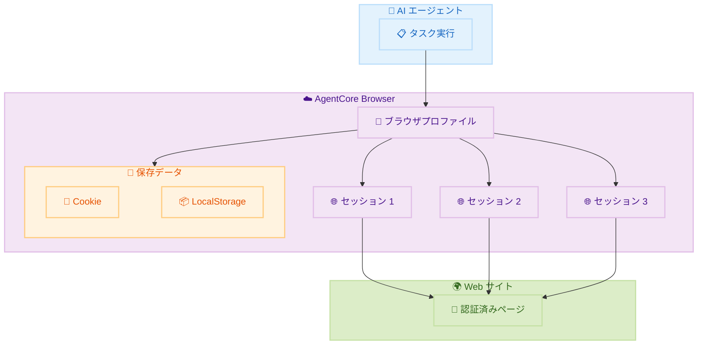

# Amazon Bedrock AgentCore Browser - ブラウザプロファイル

**リリース日**: 2026 年 2 月 6 日
**サービス**: Amazon Bedrock AgentCore Browser
**機能**: ブラウザプロファイル

📊 [このアップデートのインフォグラフィックを見る](https://takech9203.github.io/awsnews-summary/20260206-amazon-bedrock-agentcore-browser-profiles.html)

## 概要

Amazon Bedrock AgentCore Browser がブラウザプロファイル機能をサポートしました。これにより、複数のブラウザセッション間で認証状態を再利用できるようになり、繰り返しのログインフローが不要になります。この機能は、毎日数百から数千の自動化ブラウザセッションを処理するエンタープライズ顧客のセッションセットアップ時間を数分から数十秒に短縮します。

ブラウザプロファイルは、Cookie やローカルストレージなどのブラウザデータを複数のセッション間で永続化し再利用します。一度 Web サイトに認証してセッションをブラウザプロファイルに保存すれば、そのプロファイルを使用して新しいセッションを開始する際に認証状態が保持されたままログイン状態が維持されます。

**アップデート前の課題**

- 各ブラウザセッションで毎回ログインフローを実行する必要があった
- 大量の自動化セッションでセットアップ時間が累積し、処理効率が低下していた
- 認証を必要とする Web サイトでのエージェントタスク自動化が困難だった

**アップデート後の改善**

- 認証状態をプロファイルとして保存し、複数セッションで再利用可能
- セッションセットアップ時間を数分から数十秒に短縮
- 手動ログイン介入なしでエージェントが認証済み Web サイトでタスクを実行可能

## アーキテクチャ図



ブラウザプロファイルが認証情報を保持し、複数のセッションが同じプロファイルを使用して認証済み状態でアクセスできます。

## サービスアップデートの詳細

### 主要機能

1. **認証状態の永続化**
   - Cookie とローカルストレージを保存
   - 複数セッション間で認証状態を共有
   - 一度の認証で継続的なアクセス

2. **柔軟なセッションモード**
   - 読み取り専用モード: プロファイルを変更せずに使用
   - 永続モード: セッション中の変更をプロファイルに保存
   - 並列処理: 複数セッションが同じプロファイルを同時使用可能

3. **パフォーマンス最適化**
   - セットアップ時間を数分から数十秒に短縮
   - 大量のセッション処理に対応
   - エンタープライズスケールの自動化を実現

### API 変更履歴

| 日付 | サービス | 変更内容 |
|------|----------|----------|
| 2026/02/05 | [Amazon Bedrock AgentCore Control](https://awsapichanges.com/archive/changes/7c51a6-bedrock-agentcore-control.html) | 4 new api methods - ブラウザプロファイル管理 API |
| 2026/02/05 | [Amazon Bedrock AgentCore](https://awsapichanges.com/archive/changes/7c51a6-bedrock-agentcore.html) | 1 new 2 updated api methods - プロファイル永続化サポート |

## 技術仕様

### セッションモード

| モード | 説明 | ユースケース |
|--------|------|--------------|
| 読み取り専用 | プロファイルを変更せず使用 | 複数の並列セッション |
| 永続 | 変更をプロファイルに保存 | 認証フローの実行 |

### 保存されるデータ

| データタイプ | 説明 |
|--------------|------|
| Cookie | セッション Cookie、永続 Cookie |
| ローカルストレージ | Web アプリケーションのローカルデータ |

## 設定方法

### 前提条件

1. Amazon Bedrock AgentCore へのアクセス
2. 適切な IAM 権限
3. プロファイル管理権限

### 手順

#### ステップ 1: ブラウザプロファイルの作成

```python
import boto3

client = boto3.client('bedrock-agentcore')

# プロファイルの作成
response = client.create_browser_profile(
    profileName='my-auth-profile',
    description='認証状態を保持するプロファイル'
)

profile_id = response['profileId']
```

AgentCore API を使用して新しいブラウザプロファイルを作成します。

#### ステップ 2: 認証セッションの実行

```python
# 認証を実行してプロファイルに保存
session = client.start_browser_session(
    profileId=profile_id,
    sessionMode='PERSISTENT'
)

# ログインフローを実行
# ...

# セッション終了時にプロファイルが更新される
client.stop_browser_session(sessionId=session['sessionId'])
```

永続モードでセッションを開始し、認証を実行してプロファイルに保存します。

#### ステップ 3: プロファイルを使用した並列セッション

```python
# 認証済みプロファイルを使用して複数セッションを並列実行
for i in range(10):
    session = client.start_browser_session(
        profileId=profile_id,
        sessionMode='READ_ONLY'  # プロファイルを変更しない
    )
    # 認証済み状態でタスクを実行
```

読み取り専用モードで複数のセッションが同じプロファイルを使用できます。

## メリット

### ビジネス面

- **処理効率向上**: セットアップ時間の大幅削減で処理スループット向上
- **コスト削減**: 認証フローの実行回数削減によるリソース効率化
- **自動化拡大**: 認証が必要なサイトでの自動化が容易に

### 技術面

- **スケーラビリティ**: 大量の並列セッションを効率的に処理
- **信頼性**: 認証状態の安定した保持
- **柔軟性**: 読み取り専用と永続モードの選択

## デメリット・制約事項

### 制限事項

- セッションタイムアウトにより認証が切れる可能性
- 一部の Web サイトでは Cookie ベースの認証が制限される場合あり

### 考慮すべき点

- 認証情報のセキュリティ管理が重要
- プロファイルの定期的な更新が必要な場合あり

## ユースケース

### ユースケース 1: 大量の Web スクレイピング

**シナリオ**: 認証が必要な複数のページから定期的にデータを収集

**実装例**:
```python
# 一度認証してプロファイルに保存
# 以降は認証なしで毎日データ収集を実行
```

**効果**: 毎回のログイン処理が不要になり、処理時間を大幅短縮

### ユースケース 2: エンタープライズワークフロー自動化

**シナリオ**: 社内システムへのログインが必要な業務プロセスを自動化

**効果**: 手動介入なしで認証済みシステムへのアクセスを自動化

### ユースケース 3: テスト自動化

**シナリオ**: 認証が必要な Web アプリケーションの E2E テスト

**効果**: テスト実行ごとのログイン時間を削減し、テストサイクルを高速化

## 料金

AgentCore Browser の標準料金が適用されます。ブラウザプロファイル機能自体の追加料金はありません。

## 利用可能リージョン

以下の 14 リージョンで利用可能です。

- US East (N. Virginia, Ohio)
- US West (Oregon)
- Asia Pacific (Mumbai, Singapore, Sydney, Tokyo, Seoul)
- Europe (Frankfurt, Ireland, London, Paris, Stockholm)
- Canada (Central)

## 関連サービス・機能

- **Amazon Bedrock Agents**: AI エージェントとの統合
- **Amazon Bedrock AgentCore**: ブラウザ自動化基盤
- **AWS Secrets Manager**: 認証情報の安全な管理

## 参考リンク

- 📊 [インフォグラフィック](https://takech9203.github.io/awsnews-summary/20260206-amazon-bedrock-agentcore-browser-profiles.html)
- [公式発表 (What's New)](https://aws.amazon.com/about-aws/whats-new/2026/02/amazon-bedrock-agentcore-browser-profiles/)
- [Browser Profiles ドキュメント](https://docs.aws.amazon.com/bedrock-agentcore/latest/devguide/browser-profiles.html)
- [AgentCore リージョン情報](https://docs.aws.amazon.com/bedrock-agentcore/latest/devguide/agentcore-regions.html)

## まとめ

Amazon Bedrock AgentCore Browser のブラウザプロファイル機能により、認証状態の再利用が可能になり、大量のブラウザ自動化セッションを効率的に処理できるようになりました。特にエンタープライズ環境での Web 自動化において、セットアップ時間の大幅な削減とスループットの向上が期待できます。AgentCore Browser を利用している組織は、この機能を活用して自動化ワークフローの効率化を検討してください。
