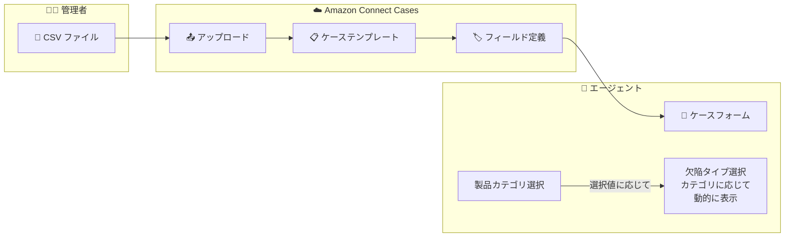

# Amazon Connect Cases - CSV アップロードによる関連フィールドオプションのマッピング

**リリース日**: 2026 年 2 月 6 日
**サービス**: Amazon Connect Cases
**機能**: CSV upload for related field options

📊 [このアップデートのインフォグラフィックを見る](https://takech9203.github.io/aws-news-summary/20260206-amazon-connect-cases-csv-related-field-options.html)

## 概要

Amazon Connect Cases が CSV ファイルを使用した関連フィールドオプションのマッピングをサポートしました。この機能により、他のフィールド値に基づいて表示されるフィールドオプションを CSV ファイルで一括定義できるようになり、複雑なフィールド関係の設定が大幅に簡素化されます。

例えば、「製品カテゴリ」の選択に基づいて表示される「欠陥タイプ」の選択肢を、手動で個別に設定する代わりに CSV ファイルで一括インポートできます。これにより、オンボーディング作業と設定時間が大幅に削減されます。

**アップデート前の課題**

- フィールド間の関係を手動で個別に設定する必要があった
- 多数のオプションがある場合、設定作業が膨大になっていた
- 設定変更のバージョン管理が困難だった

**アップデート後の改善**

- CSV ファイルで関連フィールドオプションを一括定義可能
- 大規模なフィールド関係を効率的に設定
- 設定の更新や変更管理が容易に

## アーキテクチャ図



管理者が CSV でフィールド関係を定義し、エージェントのケースフォームで動的にオプションが表示されます。

## サービスアップデートの詳細

### 主要機能

1. **CSV インポート機能**
   - フィールド間の関係を CSV 形式で一括定義
   - 既存の設定に追加または上書き
   - バルクアップロードで設定時間を短縮

2. **動的フィールドオプション**
   - 親フィールドの選択値に基づいて子フィールドのオプションを表示
   - 複数レベルの依存関係をサポート
   - リアルタイムでフォームが更新

3. **設定管理の簡素化**
   - CSV ファイルによるバージョン管理
   - 設定変更の追跡が容易
   - テスト環境から本番環境への移行が簡単

## 技術仕様

### CSV フォーマット例

```csv
parent_field,parent_value,child_field,child_value
product_category,Electronics,defect_type,Screen Issue
product_category,Electronics,defect_type,Battery Problem
product_category,Electronics,defect_type,Connectivity Issue
product_category,Furniture,defect_type,Structural Damage
product_category,Furniture,defect_type,Surface Scratch
product_category,Furniture,defect_type,Assembly Issue
product_category,Clothing,defect_type,Size Issue
product_category,Clothing,defect_type,Color Defect
product_category,Clothing,defect_type,Material Damage
```

### API 変更履歴

| 日付 | サービス | 変更内容 |
|------|----------|----------|
| 2026/02/04 | [Amazon Connect Cases](https://awsapichanges.com/archive/changes/b02439-cases.html) | 5 updated methods - CSV アップロード対応 |

## 設定方法

### 前提条件

1. Amazon Connect インスタンスで Cases が有効化されていること
2. ケーステンプレートに依存関係を設定するフィールドが存在すること
3. 管理者権限

### 手順

#### ステップ 1: CSV ファイルの準備

```csv
# field_relationships.csv
parent_field_id,parent_option_id,child_field_id,child_option_id
product_category,electronics_001,defect_type,screen_001
product_category,electronics_001,defect_type,battery_001
product_category,electronics_001,defect_type,connectivity_001
product_category,furniture_002,defect_type,structural_001
product_category,furniture_002,defect_type,surface_001
```

フィールド ID とオプション ID を使用して関係を定義した CSV ファイルを作成します。

#### ステップ 2: Amazon Connect Cases コンソールでアップロード

1. Amazon Connect 管理コンソールにアクセス
2. Cases > テンプレート > 対象テンプレートを選択
3. フィールド設定 > 関連フィールドオプション
4. CSV ファイルをアップロード

#### ステップ 3: 設定の確認

```bash
# AWS CLI でフィールド設定を確認
aws connect-cases get-template \
  --domain-id "domain-12345" \
  --template-id "template-67890"
```

アップロードされた関連フィールド設定を確認します。

## メリット

### ビジネス面

- **オンボーディング時間短縮**: 複雑なフィールド関係を素早く設定
- **設定ミス削減**: 手動設定によるエラーを防止
- **運用効率化**: 設定の一括更新が可能

### 技術面

- **バージョン管理**: CSV ファイルで設定履歴を管理
- **環境移行の簡素化**: テスト→本番の設定移行が容易
- **スケーラビリティ**: 大量のオプションも効率的に管理

## デメリット・制約事項

### 制限事項

- CSV フォーマットの仕様に従う必要がある
- フィールド ID とオプション ID の正確な指定が必要
- 複雑な条件ロジックには対応していない場合がある

### 考慮すべき点

- CSV ファイルのエンコーディング (UTF-8 推奨)
- 大量データのアップロード時のタイムアウト
- 既存設定との整合性確認

## ユースケース

### ユースケース 1: カスタマーサポートの欠陥分類

**シナリオ**: 製品カテゴリごとに異なる欠陥タイプを選択させたい

**実装例**:
```csv
product_category,Electronics,defect_type,Screen Malfunction
product_category,Electronics,defect_type,Power Issue
product_category,Appliances,defect_type,Motor Failure
product_category,Appliances,defect_type,Temperature Control
```

**効果**: エージェントが適切な欠陥タイプを素早く選択でき、正確な分類が可能

### ユースケース 2: IT サービスデスク

**シナリオ**: サービスカテゴリに応じたサブカテゴリを動的に表示したい

**実装例**:
```csv
service_category,Network,subcategory,VPN Issue
service_category,Network,subcategory,Connectivity Problem
service_category,Hardware,subcategory,Laptop Repair
service_category,Hardware,subcategory,Peripheral Issue
service_category,Software,subcategory,License Request
service_category,Software,subcategory,Installation Help
```

**効果**: チケット分類の精度向上と対応時間の短縮

### ユースケース 3: 保険請求処理

**シナリオ**: 保険商品タイプに応じた請求理由を選択させたい

**実装例**:
```csv
insurance_type,Auto,claim_reason,Collision
insurance_type,Auto,claim_reason,Theft
insurance_type,Home,claim_reason,Water Damage
insurance_type,Home,claim_reason,Fire
insurance_type,Health,claim_reason,Hospitalization
insurance_type,Health,claim_reason,Prescription
```

**効果**: 保険タイプに適した請求理由のみを表示し、入力エラーを防止

## 料金

この機能は Amazon Connect Cases の標準料金に含まれます。追加料金は発生しません。

### 料金例

| 項目 | 料金 |
|------|------|
| Amazon Connect Cases | 月額使用量に基づく従量課金 |
| CSV アップロード機能 | 追加料金なし |

## 利用可能リージョン

Amazon Connect Cases が利用可能な以下のリージョンで利用できます:

- US East (N. Virginia)
- US West (Oregon)
- Canada (Central)
- Europe (Frankfurt, London)
- Asia Pacific (Seoul, Singapore, Sydney, Tokyo)
- Africa (Cape Town)

## 関連サービス・機能

- **Amazon Connect**: コンタクトセンターサービス
- **Amazon Connect Cases**: ケース管理機能
- **Amazon Connect Contact Lens**: 会話分析
- **Amazon Connect Wisdom**: ナレッジ管理

## 参考リンク

- 📊 [インフォグラフィック](https://takech9203.github.io/aws-news-summary/20260206-amazon-connect-cases-csv-related-field-options.html)
- [公式発表 (What's New)](https://aws.amazon.com/about-aws/whats-new/2026/02/amazon-connect-cases-csv-related-field-options/)
- [Amazon Connect Cases Web ページ](https://aws.amazon.com/connect/cases/)
- [ドキュメント - フィールド依存関係の CSV アップロード](https://docs.aws.amazon.com/connect/latest/adminguide/case-field-dependent-csv-upload.html)

## まとめ

Amazon Connect Cases の CSV アップロード機能により、複雑なフィールド関係の設定が大幅に簡素化されました。製品カテゴリと欠陥タイプ、サービスカテゴリとサブカテゴリなど、依存関係のあるフィールドオプションを CSV で一括定義でき、オンボーディング時間と設定ミスを削減できます。コンタクトセンターのケース管理を効率化したい組織にとって、非常に有用な機能です。
