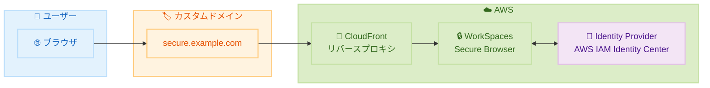

# Amazon WorkSpaces Secure Browser - カスタムドメインサポート

**リリース日**: 2026 年 2 月 6 日
**サービス**: Amazon WorkSpaces Secure Browser
**機能**: カスタムドメイン

📊 [このアップデートのインフォグラフィックを見る](https://takech9203.github.io/awsnews-summary/20260206-amazon-workspaces-secure-browser-custom-domains.html)

## 概要

Amazon WorkSpaces Secure Browser がカスタムドメインをサポートしました。これにより、デフォルトのポータル URL の代わりに、独自のドメイン名を使用して WorkSpaces Secure Browser ポータルへのアクセスを設定できるようになりました。この機能により、組織のブランディングに沿ったドメインを使用した、より統合されたユーザーエクスペリエンスを提供できます。

管理者は WorkSpaces Secure Browser ポータルにカスタムドメインを追加し、リバースプロキシ (例: Amazon CloudFront) を設定するだけで利用を開始できます。設定後、トラフィックはリバースプロキシを経由してポータルエンドポイントにルーティングされ、WorkSpaces Secure Browser は認証・認可後に自動的にユーザーを設定されたカスタムドメインにリダイレクトします。

**アップデート前の課題**

- デフォルトの AWS 提供 URL を使用する必要があり、ブランディングの一貫性が損なわれていた
- ユーザーが複雑な URL を覚える必要があった
- 組織のセキュリティポリシーで特定のドメインのみを許可している場合に対応が困難だった

**アップデート後の改善**

- 組織独自のドメイン名でポータルにアクセス可能
- ブランディングの一貫性を維持したユーザーエクスペリエンス
- 既存の ID プロバイダー (IdP) との統合がより自然に

## アーキテクチャ図



ユーザーはカスタムドメインにアクセスし、CloudFront を経由して WorkSpaces Secure Browser に接続します。

## サービスアップデートの詳細

### 主要機能

1. **カスタムドメイン設定**
   - 独自ドメインをポータルに割り当て
   - デフォルト URL の代替として機能
   - 複数ポータルで異なるドメインを使用可能

2. **認証フローの統合**
   - AWS Identity Center との連携
   - 独自 IdP のサポート
   - IdP 開始フローとサービスプロバイダー開始フローの両方に対応

3. **自動リダイレクト**
   - 認証・認可後にカスタムドメインへ自動リダイレクト
   - シームレスなユーザーエクスペリエンス

## 技術仕様

### 認証サポート

| 認証方式 | 説明 |
|----------|------|
| AWS Identity Center | AWS のマネージド ID サービス |
| 独自 IdP | SAML 2.0 対応の ID プロバイダー |
| IdP 開始フロー | IdP からのログイン開始 |
| SP 開始フロー | サービスプロバイダーからのログイン開始 |

### リバースプロキシ要件

| 項目 | 要件 |
|------|------|
| 推奨サービス | Amazon CloudFront |
| SSL/TLS | 必須 |
| DNS 設定 | CNAME または A レコード |

## 設定方法

### 前提条件

1. Amazon WorkSpaces Secure Browser ポータル
2. 独自ドメインと DNS 管理権限
3. リバースプロキシ (Amazon CloudFront 推奨)
4. SSL/TLS 証明書

### 手順

#### ステップ 1: カスタムドメインの追加

1. WorkSpaces Secure Browser コンソールに移動
2. 対象のポータルを選択
3. 「Custom domain」セクションでドメインを追加

#### ステップ 2: リバースプロキシの設定

Amazon CloudFront を使用する場合:

1. CloudFront ディストリビューションを作成
2. オリジンに WorkSpaces Secure Browser のエンドポイントを設定
3. SSL/TLS 証明書を関連付け

#### ステップ 3: DNS 設定

```
# DNS レコードの例
secure.example.com CNAME d1234abcd.cloudfront.net
```

ドメインの DNS 設定で CloudFront ディストリビューションを指すように設定します。

## メリット

### ビジネス面

- **ブランド一貫性**: 組織のドメインを使用した統一されたユーザー体験
- **ユーザビリティ向上**: 覚えやすい URL でアクセス
- **追加コストなし**: この機能自体は無料で提供

### 技術面

- **セキュリティポリシー適合**: 特定ドメインのみ許可するポリシーに対応
- **柔軟な認証**: 複数の認証方式をサポート
- **CloudFront 統合**: AWS サービスとのシームレスな連携

## デメリット・制約事項

### 制限事項

- リバースプロキシの設定が別途必要
- DNS 設定の変更が必要
- SSL/TLS 証明書の管理が必要

### 考慮すべき点

- CloudFront の料金が追加で発生
- DNS 伝播に時間がかかる場合がある

## ユースケース

### ユースケース 1: 企業ブランドの統一

**シナリオ**: 全社的なブランディングガイドラインに沿った URL を使用したい

**実装例**:
- カスタムドメイン: `secure-browser.company.com`
- 既存の企業 IdP と統合
- 社内ポータルからのリンクを設定

**効果**: 従業員が慣れ親しんだドメインでアクセスし、信頼性を向上

### ユースケース 2: マルチテナント環境

**シナリオ**: 複数の部門や顧客に異なるポータルを提供

**実装例**:
- 部門 A: `secure-a.company.com`
- 部門 B: `secure-b.company.com`

**効果**: 部門ごとに独立したブランディングとアクセス管理

## 料金

カスタムドメイン機能自体は追加コストなしで利用可能です。WorkSpaces Secure Browser は従量課金制です。CloudFront などのリバースプロキシには別途料金が発生します。

詳細は [WorkSpaces Secure Browser 料金ページ](https://aws.amazon.com/workspaces/secure-browser/pricing/) を参照してください。

## 利用可能リージョン

以下の 10 リージョンで利用可能です。

- US East (N. Virginia)
- US West (Oregon)
- Canada (Central)
- Europe (Frankfurt, London, Ireland)
- Asia Pacific (Tokyo, Mumbai, Sydney, Singapore)

## 関連サービス・機能

- **Amazon CloudFront**: リバースプロキシとして推奨
- **AWS Certificate Manager**: SSL/TLS 証明書の管理
- **AWS Identity Center**: 認証の統合

## 参考リンク

- 📊 [インフォグラフィック](https://takech9203.github.io/awsnews-summary/20260206-amazon-workspaces-secure-browser-custom-domains.html)
- [公式発表 (What's New)](https://aws.amazon.com/about-aws/whats-new/2026/02/amazon-workspaces-secure-browser-custom-domains/)
- [カスタムドメイン ドキュメント](https://docs.aws.amazon.com/workspaces-web/latest/adminguide/custom-domains.html)
- [WorkSpaces Secure Browser 料金](https://aws.amazon.com/workspaces/secure-browser/pricing/)

## まとめ

Amazon WorkSpaces Secure Browser のカスタムドメインサポートにより、組織は自社ブランドに沿った URL でセキュアブラウザ環境を提供できるようになりました。追加コストなしで利用可能であり、CloudFront との統合も容易です。WorkSpaces Secure Browser を利用している組織は、ブランディングの一貫性とユーザーエクスペリエンス向上のため、この機能の導入を検討してください。
