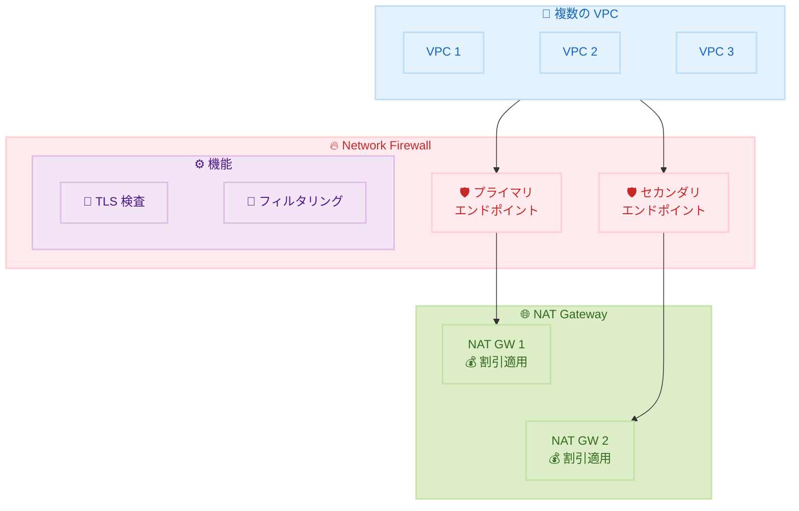

# AWS Network Firewall - 新しい料金引き下げ

**リリース日**: 2026 年 2 月 6 日
**サービス**: AWS Network Firewall
**機能**: 料金引き下げ

📊 [このアップデートのインフォグラフィックを見る](https://takech9203.github.io/aws-news-summary/20260206-aws-network-firewall-new-price-reduction.html)

## 概要

AWS Network Firewall が 2 つの料金改善を発表しました。Network Firewall のセカンダリエンドポイントとサービスチェーンされた NAT Gateway に対する時間単位およびデータ処理の割引が追加されました。また、暗号化されたネットワークトラフィックの TLS 検査を可能にする Advanced Inspection の追加データ処理料金が廃止されました。

これらの改善により、Network Firewall の複数 VPC エンドポイント機能と TLS 検査機能を使用するアーキテクチャのコスト削減が実現します。

**アップデート前の課題**

- NAT Gateway 割引はプライマリ Network Firewall エンドポイントに限定されていた
- TLS 検査の Advanced Inspection には追加のデータ処理料金 ($0.001/GB 〜 $0.009/GB) が発生していた
- 複数 VPC を保護するアーキテクチャでコストが高くなりがちだった

**アップデート後の改善**

- NAT Gateway 割引がプライマリとセカンダリの両方のファイアウォールエンドポイントに適用
- 13 リージョンで Advanced Inspection の追加データ処理料金が廃止
- TLS 検査をよりコスト効率的に実装可能

## アーキテクチャ図



プライマリとセカンダリの両方のエンドポイントでサービスチェーンされた NAT Gateway に割引が適用されます。

## サービスアップデートの詳細

### 主要な料金改善

1. **NAT Gateway 割引の拡張**
   - 以前: プライマリエンドポイントのみに割引適用
   - 現在: セカンダリエンドポイントにも割引適用
   - 時間単位およびデータ処理の両方に適用

2. **Advanced Inspection 料金廃止**
   - TLS 検査の追加データ処理料金を廃止
   - 対象: 13 リージョン
   - 廃止された料金: $0.001/GB 〜 $0.009/GB

### 対象リージョン (Advanced Inspection 料金廃止)

| リージョン | 廃止された追加料金 |
|------------|-------------------|
| Middle East (Bahrain) | $0.001/GB - $0.009/GB |
| Asia Pacific (Hong Kong) | $0.001/GB - $0.009/GB |
| Asia Pacific (Tokyo) | $0.001/GB - $0.009/GB |
| Asia Pacific (Osaka) | $0.001/GB - $0.009/GB |
| Asia Pacific (Mumbai) | $0.001/GB - $0.009/GB |
| EU (Milan) | $0.001/GB - $0.009/GB |
| South America (São Paulo) | $0.001/GB - $0.009/GB |
| US West (N. California) | $0.001/GB - $0.009/GB |
| Africa (Cape Town) | $0.001/GB - $0.009/GB |
| Asia Pacific (Seoul) | $0.001/GB - $0.009/GB |
| Asia Pacific (Singapore) | $0.001/GB - $0.009/GB |
| Asia Pacific (Sydney) | $0.001/GB - $0.009/GB |
| Asia Pacific (Melbourne) | $0.001/GB - $0.009/GB |

## 技術仕様

### 複数 VPC エンドポイント

| 機能 | 説明 |
|------|------|
| 接続可能 VPC 数 | 1 つの Network Firewall に対して AZ あたり最大 50 VPC |
| エンドポイントタイプ | プライマリ、セカンダリ |
| NAT Gateway 割引 | 両方のエンドポイントタイプに適用 |

### TLS 検査 (Advanced Inspection)

| 項目 | 詳細 |
|------|------|
| 機能 | 暗号化トラフィックの復号と検査 |
| 追加料金 | 廃止 (13 リージョン) |
| 設定 | Advanced Inspection 有効化で利用可能 |

## 設定方法

### 前提条件

1. AWS Network Firewall の設定
2. 複数 VPC エンドポイントまたは TLS 検査を使用するアーキテクチャ
3. 適切な IAM 権限

### 料金改善の適用

これらの料金改善は、対象構成に自動的に適用されます。顧客側でのアクションは不要です。

### TLS 検査の有効化

```bash
# Network Firewall で TLS 検査を有効化する例
aws network-firewall update-firewall-policy \
    --firewall-policy-arn arn:aws:network-firewall:region:account:firewall-policy/policy-name \
    --firewall-policy '{
        "StatelessDefaultActions": ["aws:forward_to_sfe"],
        "StatelessFragmentDefaultActions": ["aws:forward_to_sfe"],
        "TLSInspectionConfiguration": {
            "TLSInspectionConfigurationArn": "arn:aws:network-firewall:region:account:tls-inspection-configuration/config-name"
        }
    }'
```

このコマンドで TLS 検査を有効化し、追加料金なしで暗号化トラフィックの検査が可能になります。

## メリット

### ビジネス面

- **コスト削減**: 複数 VPC 保護のコストが低下
- **TLS 検査の普及**: 追加料金なしで暗号化トラフィック検査が可能
- **予算計画の簡素化**: 追加のデータ処理料金を考慮不要

### 技術面

- **アーキテクチャの柔軟性**: 複数 VPC エンドポイントをコスト効率的に使用
- **セキュリティ強化**: TLS 検査の導入障壁が低下
- **運用の簡素化**: 料金体系がシンプルに

## デメリット・制約事項

### 制限事項

- Advanced Inspection 料金廃止は 13 リージョンのみ
- その他のリージョンでは引き続き追加料金が発生する可能性

### 考慮すべき点

- 既存の予算計画を更新する必要がある場合あり
- TLS 検査にはパフォーマンスへの影響を考慮

## ユースケース

### ユースケース 1: マルチ VPC セキュリティアーキテクチャ

**シナリオ**: 50 以上の VPC を 1 つの Network Firewall で保護

**効果**: セカンダリエンドポイントの NAT Gateway 割引により、大規模環境でのコスト削減

### ユースケース 2: 暗号化トラフィックの検査

**シナリオ**: HTTPS トラフィックの中身を検査して脅威を検出

**効果**: 追加料金なしで TLS 検査を実装し、セキュリティ体制を強化

### ユースケース 3: 東京リージョンでの運用

**シナリオ**: 東京リージョンで TLS 検査を使用

**効果**: 以前発生していた追加データ処理料金が廃止され、コスト削減

## 料金

料金改善は自動的に適用されます。詳細は [AWS Network Firewall 料金ページ](https://aws.amazon.com/network-firewall/pricing/) を参照してください。

### 料金改善の概要

| 改善項目 | 対象 | 効果 |
|----------|------|------|
| NAT Gateway 割引拡張 | プライマリ + セカンダリエンドポイント | 時間・データ処理料金の割引 |
| Advanced Inspection 料金廃止 | 13 リージョン | $0.001-$0.009/GB の削減 |

## 利用可能リージョン

これらの料金改善は、Network Firewall が提供されているすべての AWS リージョンで利用可能です。

## 関連サービス・機能

- **NAT Gateway**: VPC からのアウトバウンド接続
- **AWS Certificate Manager**: TLS 検査用証明書の管理
- **VPC**: ネットワーク分離とセキュリティ

## 参考リンク

- 📊 [インフォグラフィック](https://takech9203.github.io/aws-news-summary/20260206-aws-network-firewall-new-price-reduction.html)
- [公式発表 (What's New)](https://aws.amazon.com/about-aws/whats-new/2026/02/aws-network-firewall-new-price-reduction/)
- [AWS Network Firewall 料金](https://aws.amazon.com/network-firewall/pricing/)
- [Network Firewall ドキュメント](https://docs.aws.amazon.com/network-firewall/latest/developerguide/firewall-creating.html)

## まとめ

AWS Network Firewall の料金引き下げにより、複数 VPC の保護と TLS 検査の実装がよりコスト効率的になりました。特に東京、大阪を含む 13 リージョンでの Advanced Inspection 料金廃止は、日本で運用している顧客にとって大きなメリットです。Network Firewall を使用している、または検討している組織は、これらの料金改善を活用してセキュリティアーキテクチャを見直すことを推奨します。
