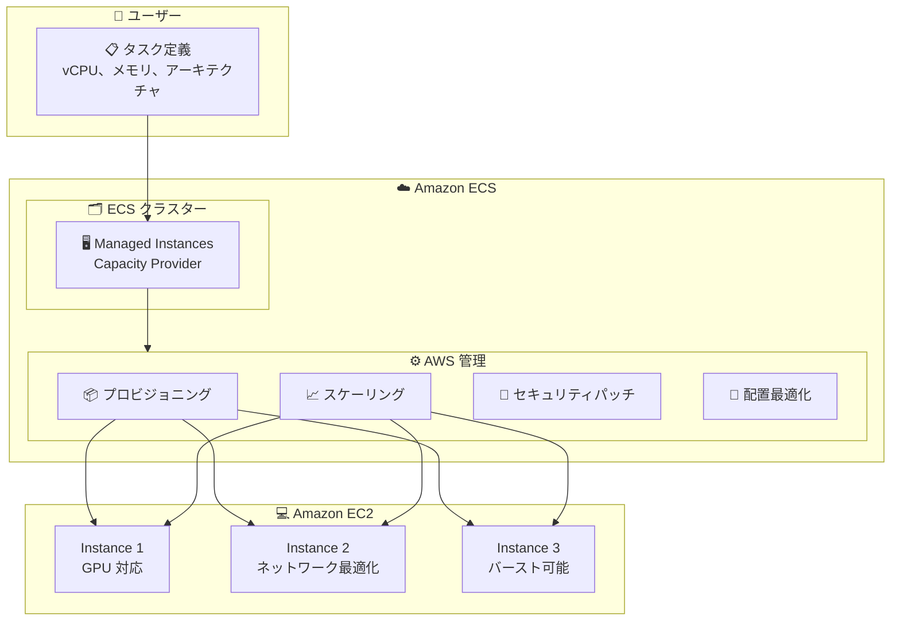

# Amazon ECS Managed Instances - AWS European Sovereign Cloud での提供開始

**リリース日**: 2026 年 2 月 6 日
**サービス**: Amazon Elastic Container Service (Amazon ECS)
**機能**: ECS Managed Instances in AWS European Sovereign Cloud

📊 [このアップデートのインフォグラフィックを見る](https://takech9203.github.io/awsnews-summary/20260206-ecs-mi-european-sovereign-cloud.html)

## 概要

Amazon ECS Managed Instances が AWS European Sovereign Cloud で利用可能になりました。ECS Managed Instances は、インフラストラクチャ管理のオーバーヘッドを排除しながら、Amazon EC2 のフル機能にアクセスできる完全マネージド型のコンピューティングオプションです。

インフラストラクチャ運用を AWS にオフロードすることで、必要なアプリケーションパフォーマンスとシンプルさを両立しながら、総所有コスト (TCO) を削減できます。

**アップデート前の課題**

- EC2 インスタンスの手動プロビジョニング、設定、運用が必要だった
- セキュリティパッチの適用を手動で管理する必要があった
- タスク配置の最適化を手動で行う必要があった

**アップデート後の改善**

- インフラストラクチャ管理を AWS にオフロード可能
- 14 日ごとの自動セキュリティパッチ適用
- ワークロード要件に応じた EC2 インスタンスの動的スケーリング
- タスク配置の継続的な最適化によるコスト削減

## アーキテクチャ図



ユーザーはタスク要件を定義するだけで、AWS がインフラストラクチャの管理を自動で行います。

## サービスアップデートの詳細

### 主要機能

1. **フルマネージド EC2 プロビジョニング**
   - タスク要件 (vCPU、メモリ、CPU アーキテクチャ) を指定するだけ
   - AWS が最適な EC2 インスタンスを自動プロビジョニング
   - AWS 制御のアクセスでアカウント内に作成

2. **動的スケーリングと最適化**
   - ワークロード要件に応じた EC2 インスタンスの自動スケール
   - タスク配置の継続的最適化でインフラコストを削減
   - 使用率に基づいた効率的なリソース活用

3. **自動セキュリティパッチ**
   - 14 日ごとに自動でセキュリティパッチを適用
   - セキュリティ態勢を常に最新に維持
   - 手動パッチ管理の負担を排除

4. **柔軟なインスタンスタイプ指定**
   - GPU アクセラレーテッドインスタンス
   - ネットワーク最適化インスタンス
   - バースト可能パフォーマンスインスタンス
   - 優先するインスタンスファミリーを指定可能

## 技術仕様

### サポートされる設定

| 項目 | 詳細 |
|------|------|
| CPU アーキテクチャ | x86_64、ARM64 |
| インスタンスタイプ | 汎用、GPU、ネットワーク最適化、バースト可能など |
| スケーリング | 自動 (ワークロード連動) |
| セキュリティパッチ | 14 日ごと自動適用 |

### Managed Instances Capacity Provider 設定例

```json
{
  "capacityProviders": [
    {
      "name": "managed-instances",
      "type": "MANAGED_INSTANCES",
      "managedInstancesConfiguration": {
        "instanceTypes": ["c6i.xlarge", "c6i.2xlarge", "c7g.xlarge"],
        "cpuArchitecture": "X86_64",
        "scaling": {
          "minimumScalingStepSize": 1,
          "maximumScalingStepSize": 10,
          "targetCapacity": 100
        }
      }
    }
  ]
}
```

## 設定方法

### 前提条件

1. AWS European Sovereign Cloud へのアクセス
2. Amazon ECS クラスターの作成権限
3. 適切な IAM ロールとポリシー

### 手順

#### ステップ 1: ECS クラスターで Managed Instances を有効化

```bash
# AWS Console、ECS MCP Server、または IaC ツールから設定
aws ecs create-cluster \
  --cluster-name my-sovereign-cluster \
  --capacity-providers managed-instances \
  --default-capacity-provider-strategy capacityProvider=managed-instances,weight=1 \
  --region eu-sovereign-1
```

ECS クラスターを作成し、Managed Instances を Capacity Provider として設定します。

#### ステップ 2: タスク定義の作成

```json
{
  "family": "my-app",
  "requiresCompatibilities": ["EC2"],
  "cpu": "2048",
  "memory": "4096",
  "runtimePlatform": {
    "cpuArchitecture": "X86_64",
    "operatingSystemFamily": "LINUX"
  },
  "containerDefinitions": [
    {
      "name": "app",
      "image": "my-app:latest",
      "essential": true
    }
  ]
}
```

必要な vCPU、メモリ、CPU アーキテクチャを指定したタスク定義を作成します。

#### ステップ 3: サービスのデプロイ

```bash
# サービスを作成してタスクをデプロイ
aws ecs create-service \
  --cluster my-sovereign-cluster \
  --service-name my-service \
  --task-definition my-app:1 \
  --desired-count 3 \
  --capacity-provider-strategy capacityProvider=managed-instances,weight=1
```

Managed Instances を使用してサービスをデプロイします。

## メリット

### ビジネス面

- **TCO 削減**: インフラ管理のオーバーヘッドを排除
- **運用効率化**: インフラ運用から開発に集中
- **コンプライアンス対応**: European Sovereign Cloud でデータ主権要件を満たす

### 技術面

- **自動最適化**: タスク配置の継続的最適化でコスト効率向上
- **セキュリティ強化**: 自動パッチ適用でセキュリティ態勢を維持
- **柔軟性**: EC2 のフル機能 (GPU、ネットワーク最適化等) を活用

## デメリット・制約事項

### 制限事項

- Managed Instances の管理手数料が EC2 コストに追加
- インスタンスへの直接 SSH アクセスは制限される
- 特定のカスタマイズ (カスタム AMI 等) には制約がある場合あり

### 考慮すべき点

- AWS Fargate との比較でユースケースに応じた選択が必要
- 既存のワークロード移行時は互換性を確認

## ユースケース

### ユースケース 1: EU データ主権要件

**シナリオ**: EU のデータ保護規制に準拠しながら、コンテナワークロードを運用したい

**実装例**:
```
AWS European Sovereign Cloud
    └── ECS クラスター (Managed Instances)
        └── EU 居住者データ処理アプリケーション
```

**効果**: データ主権要件を満たしながら、マネージドなコンテナ運用を実現

### ユースケース 2: GPU ワークロード

**シナリオ**: ML 推論ワークロードを GPU インスタンスで実行したい

**実装例**:
```json
{
  "managedInstancesConfiguration": {
    "instanceTypes": ["g5.xlarge", "g5.2xlarge"],
    "cpuArchitecture": "X86_64"
  }
}
```

**効果**: GPU インスタンスの手動管理なしで ML ワークロードを運用

### ユースケース 3: 可変ワークロード

**シナリオ**: トラフィックの変動が大きいアプリケーションを効率的に運用したい

**実装例**:
```
ピーク時: 自動で EC2 インスタンスをスケールアウト
オフピーク: 自動でスケールインしてコスト削減
```

**効果**: 需要に応じた自動スケーリングで最適なコストパフォーマンスを実現

## 料金

### 料金体系

| 項目 | 説明 |
|------|------|
| EC2 インスタンス料金 | 通常の EC2 料金 |
| Managed Instances 管理料金 | プロビジョニングされたコンピュートの管理費用 |

## 利用可能リージョン

- AWS European Sovereign Cloud

## 関連サービス・機能

- **AWS Fargate**: サーバーレスコンテナ実行
- **Amazon ECS MCP Server**: Infrastructure as Code でのクラスター管理
- **Amazon EC2**: 基盤となるコンピューティングリソース

## 参考リンク

- 📊 [インフォグラフィック](https://takech9203.github.io/awsnews-summary/20260206-ecs-mi-european-sovereign-cloud.html)
- [公式発表 (What's New)](https://aws.amazon.com/about-aws/whats-new/2026/02/ecs-mi-european-sovereign-cloud/)
- [ECS Managed Instances 機能ページ](https://aws.eu/ecs/managed-instances/)
- [ドキュメント](https://docs.aws.eu/AmazonECS/latest/developerguide/ManagedInstances.html)
- [AWS News ローンチブログ](https://aws.amazon.com/blogs/aws/announcing-amazon-ecs-managed-instances-for-containerized-applications)

## まとめ

Amazon ECS Managed Instances が AWS European Sovereign Cloud で利用可能になり、EU のデータ主権要件を満たしながらフルマネージドなコンテナ運用が実現できるようになりました。インフラストラクチャ管理を AWS にオフロードし、自動スケーリング、セキュリティパッチ適用、タスク配置最適化の恩恵を受けられます。EU 内でコンテナワークロードを運用する組織にとって、重要な選択肢となります。
