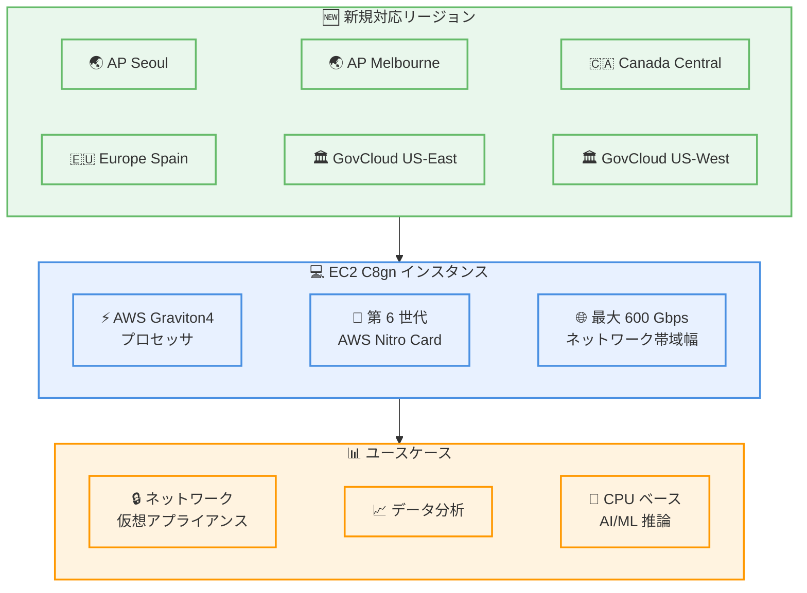

# Amazon EC2 C8gn インスタンス - 追加リージョンでの提供開始 (2026 年 2 月)

**リリース日**: 2026 年 2 月 9 日
**サービス**: Amazon EC2
**機能**: C8gn インスタンスのリージョン拡大

📊 [このアップデートのインフォグラフィックを見る](https://takech9203.github.io/aws-news-summary/20260209-amazon-ec2-c8gn-instances-additional-regions.html)

## 概要

Amazon EC2 C8gn インスタンスが、Asia Pacific (Seoul、Melbourne)、Canada (Central)、Europe (Spain)、AWS GovCloud (US-East、US-West) の各リージョンで新たに利用可能になりました。C8gn インスタンスは AWS Graviton4 プロセッサを搭載し、Graviton3 ベースの C7gn インスタンスと比較して最大 30% 優れたコンピューティングパフォーマンスを提供するネットワーク最適化インスタンスです。

C8gn インスタンスは第 6 世代 AWS Nitro Card を搭載し、ネットワーク最適化 EC2 インスタンスの中で最高となる最大 600 Gbps のネットワーク帯域幅を実現します。ネットワーク仮想アプライアンス、データ分析、CPU ベースの AI/ML 推論など、ネットワーク集約型ワークロードに最適です。

**アップデート前の課題**

- C8gn インスタンスが利用可能なリージョンが限られており、Seoul、Melbourne、Canada (Central)、Spain、GovCloud では利用できなかった
- GovCloud リージョンでは最新世代のネットワーク最適化 Graviton ベースインスタンスが利用できなかった
- データレジデンシーやコンプライアンス要件のあるワークロードで、特定のリージョンに C8gn インスタンスをデプロイできなかった

**アップデート後の改善**

- 6 つの追加リージョンで C8gn インスタンスが利用可能になり、合計 24 リージョンに拡大
- GovCloud (US-East、US-West) で Graviton4 ベースのネットワーク最適化インスタンスが利用可能になり、政府機関向けワークロードに対応
- グローバルなワークロード展開において、より多くのリージョンで一貫したインスタンスタイプを選択可能に

## アーキテクチャ図



今回のアップデートで新たに対応した 6 リージョンと、C8gn インスタンスの主要コンポーネント、対象ワークロードの関係を示しています。

## サービスアップデートの詳細

### 主要機能

1. **AWS Graviton4 プロセッサ**
   - 最新世代の Graviton4 プロセッサを搭載
   - Graviton3 ベースの C7gn インスタンスと比較して最大 30% 優れたコンピューティングパフォーマンス
   - エネルギー効率の向上による Arm ベースの高性能コンピューティング

2. **第 6 世代 AWS Nitro Card**
   - 最新の Nitro Card により最大 600 Gbps のネットワーク帯域幅を実現
   - ネットワーク最適化 EC2 インスタンスの中で最高のネットワーク帯域幅
   - 高スループットのネットワーク処理が可能

3. **スケーラブルなインスタンスサイズ**
   - 最大 48xlarge までのインスタンスサイズ
   - 最大 384 GiB のメモリ
   - Amazon EBS への最大 60 Gbps の帯域幅

4. **Elastic Fabric Adapter (EFA) サポート**
   - 16xlarge、24xlarge、48xlarge、metal-24xl、metal-48xl サイズで EFA ネットワーキングをサポート
   - 密結合クラスターにデプロイされたワークロードのレイテンシーを低減
   - クラスター間の高スループット通信を実現

## 技術仕様

### インスタンス仕様

| 項目 | 詳細 |
|------|------|
| プロセッサ | AWS Graviton4 |
| Nitro Card | 第 6 世代 |
| 最大ネットワーク帯域幅 | 600 Gbps |
| 最大 EBS 帯域幅 | 60 Gbps |
| 最大インスタンスサイズ | 48xlarge |
| 最大メモリ | 384 GiB |
| EFA サポート | 16xlarge、24xlarge、48xlarge、metal-24xl、metal-48xl |

### 利用可能なインスタンスサイズ

- c8gn.medium
- c8gn.large
- c8gn.xlarge
- c8gn.2xlarge
- c8gn.4xlarge
- c8gn.8xlarge
- c8gn.12xlarge
- c8gn.16xlarge
- c8gn.24xlarge
- c8gn.metal-24xl
- c8gn.48xlarge
- c8gn.metal-48xl

## 設定方法

### 前提条件

1. AWS アカウントと適切な IAM 権限
2. 対象リージョンへのアクセス
3. 必要な VPC およびサブネット設定

### 手順

#### ステップ 1: C8gn インスタンスの起動

```bash
# AWS CLI を使用して C8gn インスタンスを起動
aws ec2 run-instances \
  --image-id ami-xxxxxxxxxxxxxxxxx \
  --instance-type c8gn.16xlarge \
  --region ap-northeast-2 \
  --subnet-id subnet-xxxxxxxxxxxxxxxxx \
  --security-group-ids sg-xxxxxxxxxxxxxxxxx \
  --key-name my-key-pair
```

Seoul リージョン (ap-northeast-2) で C8gn.16xlarge インスタンスを起動するコマンドです。EFA をサポートするサイズを選択しています。

#### ステップ 2: 利用可能なインスタンスタイプの確認

```bash
# 利用可能な C8gn インスタンスタイプを確認
aws ec2 describe-instance-types \
  --filters "Name=instance-type,Values=c8gn.*" \
  --region ap-northeast-2 \
  --query "InstanceTypes[].{Type:InstanceType,vCPU:VCpuInfo.DefaultVCpus,Memory:MemoryInfo.SizeInMiB,Network:NetworkInfo.NetworkPerformance}" \
  --output table
```

対象リージョンで利用可能な C8gn インスタンスタイプとスペックを一覧表示するコマンドです。

#### ステップ 3: EFA を有効にしたインスタンスの起動

```bash
# EFA を有効にして C8gn インスタンスを起動
aws ec2 run-instances \
  --image-id ami-xxxxxxxxxxxxxxxxx \
  --instance-type c8gn.48xlarge \
  --region ap-northeast-2 \
  --network-interfaces "DeviceIndex=0,SubnetId=subnet-xxxxxxxxxxxxxxxxx,Groups=sg-xxxxxxxxxxxxxxxxx,InterfaceType=efa" \
  --key-name my-key-pair
```

EFA ネットワーキングを有効にして C8gn.48xlarge インスタンスを起動するコマンドです。EFA は 16xlarge 以上のサイズで利用可能です。

## メリット

### ビジネス面

- **グローバル展開の拡大**: 6 つの追加リージョンで利用可能になることで、データレジデンシーやレイテンシー要件に応じた柔軟なデプロイが可能に
- **GovCloud 対応**: 米国政府機関向けの厳格なコンプライアンス要件を満たしながら、最新のネットワーク最適化インスタンスを活用可能
- **コスト最適化**: Graviton4 の優れた価格パフォーマンスにより、ネットワーク集約型ワークロードのコストを削減

### 技術面

- **高ネットワークスループット**: 最大 600 Gbps のネットワーク帯域幅により、大量のデータ転送が可能
- **低レイテンシー**: EFA サポートにより、密結合クラスターでの低レイテンシー通信を実現
- **スケーラビリティ**: 最大 48xlarge までの豊富なインスタンスサイズにより、ワークロードに応じた柔軟なスケーリングが可能

## デメリット・制約事項

### 制限事項

- EFA ネットワーキングは 16xlarge 以上のサイズでのみサポート
- Graviton4 は Arm ベースのプロセッサであり、x86 アーキテクチャ向けにコンパイルされたアプリケーションは再コンパイルまたは Arm 互換版への移行が必要
- 一部のサードパーティソフトウェアが Arm アーキテクチャに対応していない場合がある

### 考慮すべき点

- x86 ベースのインスタンスから移行する場合、アプリケーションの Arm 互換性を事前に検証する必要がある
- ネットワーク帯域幅を最大限に活用するには、適切なインスタンスサイズの選択と Enhanced Networking の設定が重要
- 既存の C7gn インスタンスからの移行時には、パフォーマンステストを実施して期待される改善を確認することを推奨

## ユースケース

### ユースケース 1: ネットワーク仮想アプライアンス

**シナリオ**: ファイアウォール、ロードバランサー、IDS/IPS などのネットワークセキュリティアプライアンスを、Seoul リージョンで高スループットで実行する必要がある。

**実装例**:
```bash
# Seoul リージョンでネットワークアプライアンス用 C8gn インスタンスを起動
aws ec2 run-instances \
  --image-id ami-xxxxxxxxxxxxxxxxx \
  --instance-type c8gn.16xlarge \
  --region ap-northeast-2 \
  --network-interfaces "DeviceIndex=0,SubnetId=subnet-xxxxxxxxxxxxxxxxx,Groups=sg-xxxxxxxxxxxxxxxxx,InterfaceType=efa"
```

**効果**: 600 Gbps のネットワーク帯域幅により、大規模なトラフィック処理が可能になり、セキュリティ機能を維持しながら高いスループットを実現できる。

### ユースケース 2: データ分析

**シナリオ**: 大量のデータストリームをリアルタイムで処理し、分析する必要がある。Melbourne リージョンのデータソースに近い場所で処理したい。

**実装例**:
```bash
# Melbourne リージョンでデータ分析用 C8gn インスタンスを起動
aws ec2 run-instances \
  --image-id ami-xxxxxxxxxxxxxxxxx \
  --instance-type c8gn.24xlarge \
  --region ap-southeast-4 \
  --subnet-id subnet-xxxxxxxxxxxxxxxxx \
  --security-group-ids sg-xxxxxxxxxxxxxxxxx
```

**効果**: 高いネットワーク帯域幅と Graviton4 の優れたコンピューティングパフォーマンスにより、データソースに近い場所で大量のデータを効率的に処理し、リアルタイム分析が可能になる。

### ユースケース 3: GovCloud での CPU ベース AI/ML 推論

**シナリオ**: 米国政府機関が、FedRAMP 準拠の環境で大規模な AI/ML モデルの推論を CPU で実行し、低レイテンシーで結果を返す必要がある。

**実装例**:
```bash
# GovCloud で AI/ML 推論用 C8gn インスタンスを起動
aws ec2 run-instances \
  --image-id ami-xxxxxxxxxxxxxxxxx \
  --instance-type c8gn.48xlarge \
  --region us-gov-east-1 \
  --iam-instance-profile Name=ML-Inference-Role
```

**効果**: GovCloud でコンプライアンス要件を満たしながら、Graviton4 の高いコンピューティングパフォーマンスと 600 Gbps のネットワーク帯域幅により、多数の推論リクエストを効率的に処理できる。

## 料金

C8gn インスタンスは、オンデマンドインスタンス、Savings Plans、スポットインスタンス、専用インスタンスおよび専用ホストとして購入できます。料金はリージョンとインスタンスサイズによって異なります。

詳細な料金については、[Amazon EC2 料金ページ](https://aws.amazon.com/ec2/pricing/) を参照してください。

## 利用可能リージョン

C8gn インスタンスは、以下の AWS リージョンで利用可能です。

**新規対応リージョン (2026 年 2 月 9 日)**:
- Asia Pacific (Seoul)
- Asia Pacific (Melbourne)
- Canada (Central)
- Europe (Spain)
- AWS GovCloud (US-East)
- AWS GovCloud (US-West)

**既存対応リージョンを含む全リージョン**:
- US East (N. Virginia、Ohio)
- US West (Oregon、N. California)
- Europe (Frankfurt、Stockholm、Ireland、London、Spain)
- Asia Pacific (Singapore、Malaysia、Sydney、Thailand、Mumbai、Seoul、Melbourne)
- Middle East (UAE)
- Africa (Cape Town)
- Canada West (Calgary)
- Canada (Central)
- AWS GovCloud (US-East、US-West)

## 関連サービス・機能

- **AWS Graviton4**: 最新世代の AWS 設計の Arm ベースプロセッサ
- **AWS Nitro System**: EC2 インスタンスに高パフォーマンス、高セキュリティ、高い革新性を提供する基盤
- **Elastic Fabric Adapter (EFA)**: HPC および ML アプリケーション向けの高スループット、低レイテンシーのネットワークインターフェース
- **Amazon EBS**: EC2 インスタンス向けの高性能ブロックストレージ

## 参考リンク

- 📊 [インフォグラフィック](https://takech9203.github.io/aws-news-summary/20260209-amazon-ec2-c8gn-instances-additional-regions.html)
- [公式発表 (What's New)](https://aws.amazon.com/about-aws/whats-new/2026/02/amazon-ec2-c8gn-instances-additional-regions/)
- [AWS Blog - New Amazon EC2 C8gn instances](https://aws.amazon.com/blogs/aws/new-amazon-ec2-c8gn-instances-powered-by-aws-graviton4-offering-up-to-600gbps-network-bandwidth/)
- [Amazon C8gn Instances](https://aws.amazon.com/ec2/instance-types/c8g/)
- [Level up your compute with AWS Graviton](https://aws.amazon.com/ec2/graviton/level-up-with-graviton/)
- [Amazon EC2 料金ページ](https://aws.amazon.com/ec2/pricing/)

## まとめ

Amazon EC2 C8gn インスタンスが Asia Pacific (Seoul、Melbourne)、Canada (Central)、Europe (Spain)、AWS GovCloud (US-East、US-West) の 6 リージョンで新たに利用可能になりました。これにより、C8gn インスタンスの提供リージョンはさらに拡大し、グローバルな展開が容易になりました。特に GovCloud での提供開始により、米国政府機関のコンプライアンス要件を満たしながら、Graviton4 プロセッサと最大 600 Gbps のネットワーク帯域幅を活用したネットワーク集約型ワークロードの実行が可能になります。ネットワーク仮想アプライアンス、データ分析、CPU ベースの AI/ML 推論などのワークロードで C8gn インスタンスの活用を検討してください。
