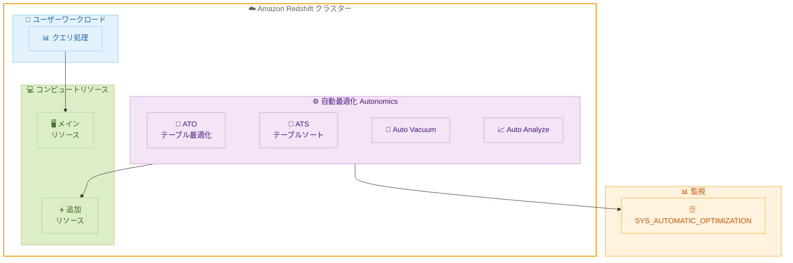

# Amazon Redshift - 自動最適化用の追加コンピュートリソース割り当て

**リリース日**: 2026 年 2 月 9 日
**サービス**: Amazon Redshift
**機能**: 自動最適化機能への追加コンピュートリソース割り当て

📊 [このアップデートのインフォグラフィックを見る](https://takech9203.github.io/aws-news-summary/20260209-amazon-redshift-allocate-extra-compute-for-automatic-optimizations.html)

## 概要

Amazon Redshift が自動最適化機能 (autonomics) 用に追加のコンピュートリソースを割り当てる機能をサポートしました。これにより、データベース管理者はクラスターに追加リソースを割り当て、ユーザーアクティビティが高い期間でも自動最適化を継続実行できるようになりました。

従来は、ユーザーワークロードが高負荷の時間帯には自動最適化の実行をスケジュールする必要がありましたが、この機能により手動スケジューリングが不要になります。自動テーブル最適化 (ATO)、自動テーブルソート (ATS)、Auto Vacuum、Auto Analyze などの最適化機能が、ユーザーワークロードに影響を与えることなく確実に実行されます。

**アップデート前の課題**

- 自動最適化機能がユーザーワークロードとリソースを競合する場合があった
- 高負荷時間帯を避けて最適化を手動でスケジュールする必要があった
- 最適化処理の実行状況を詳細に把握することが困難だった

**アップデート後の改善**

- 追加コンピュートリソースを割り当てて、ユーザーワークロードに影響なく自動最適化を実行可能
- プロビジョニングクラスター向けにコスト制御機能を提供し、自動最適化に使用するリソース量を制限可能
- 新しい SYS_AUTOMATIC_OPTIMIZATION システムテーブルで詳細な監視が可能

## アーキテクチャ図



ユーザーワークロードはメインリソースを使用し、自動最適化は追加リソースを使用することで、両者が競合せずに動作します。

## サービスアップデートの詳細

### 主要機能

1. **追加コンピュートリソースの割り当て**
   - 自動最適化専用のリソースをクラスターに追加
   - ユーザーワークロードとの競合を回避
   - 高負荷時間帯でも最適化を継続実行

2. **コスト制御機能**
   - プロビジョニングクラスター向けのリソース制限設定
   - 自動最適化に使用するリソース量の上限を指定可能
   - コストと最適化のバランスを調整

3. **監視機能の強化**
   - 新しい SYS_AUTOMATIC_OPTIMIZATION システムテーブル
   - プロビジョニングクラスターとサーバーレスワークグループの両方に対応
   - 自動最適化操作の詳細情報を提供

### 対象となる自動最適化機能

| 機能 | 説明 |
|------|------|
| Automatic Table Optimization (ATO) | テーブル構造の自動最適化 |
| Automatic Table Sorting (ATS) | テーブルデータの自動ソート |
| Auto Vacuum | 削除されたデータの領域回収 |
| Auto Analyze | 統計情報の自動更新 |

## 技術仕様

### システムテーブル

新しい `SYS_AUTOMATIC_OPTIMIZATION` テーブルで以下の情報を確認できます。

```sql
SELECT * FROM SYS_AUTOMATIC_OPTIMIZATION
WHERE start_time > DATEADD(hour, -24, GETDATE())
ORDER BY start_time DESC;
```

このクエリにより、過去 24 時間の自動最適化操作の詳細を確認できます。

### 設定パラメータ

| パラメータ | 説明 |
|------------|------|
| extra_compute_for_autonomics | 自動最適化用の追加リソース有効化 |
| autonomics_resource_limit | 自動最適化に使用するリソース量の上限 |

## 設定方法

### 前提条件

1. Amazon Redshift クラスター (プロビジョニングまたはサーバーレス)
2. クラスター管理者権限
3. AWS Management Console または CLI へのアクセス

### 手順

#### ステップ 1: 追加コンピュートリソースの有効化

AWS Management Console から設定する場合:

1. Amazon Redshift コンソールに移動
2. 対象のクラスターを選択
3. 「Properties」タブで「Edit」をクリック
4. 「Automatic optimizations」セクションで追加リソースを有効化

#### ステップ 2: リソース制限の設定 (オプション)

```sql
-- プロビジョニングクラスターでリソース制限を設定
ALTER SYSTEM SET autonomics_resource_limit = 20;
```

このコマンドで自動最適化に使用するリソースを全体の 20% に制限します。

#### ステップ 3: 監視の確認

```sql
-- 自動最適化操作の確認
SELECT optimization_type, status, start_time, end_time, resources_used
FROM SYS_AUTOMATIC_OPTIMIZATION
WHERE start_time > DATEADD(day, -7, GETDATE())
ORDER BY start_time DESC
LIMIT 100;
```

過去 7 日間の自動最適化操作を確認するクエリです。

## メリット

### ビジネス面

- **運用負荷軽減**: 手動スケジューリングが不要になり、DBA の作業負荷を削減
- **パフォーマンス向上**: 最適化が継続的に実行されることで、クエリパフォーマンスを維持
- **コスト最適化**: リソース制限機能により、最適化コストを管理可能

### 技術面

- **ワークロード分離**: ユーザークエリと最適化処理が競合しない
- **可観測性向上**: 新しいシステムテーブルで詳細な監視が可能
- **自動化**: 24 時間 365 日の継続的な最適化を実現

## デメリット・制約事項

### 制限事項

- 追加コンピュートリソースには追加コストが発生する可能性
- サーバーレスワークグループではリソース制限設定が異なる場合あり

### 考慮すべき点

- 既存のスケジュール設定との整合性確認が必要
- リソース制限値の最適な設定は環境により異なる

## ユースケース

### ユースケース 1: 24 時間稼働の分析環境

**シナリオ**: グローバルチームが 24 時間アクセスする分析環境で、メンテナンスウィンドウを設けられない

**実装例**:
```sql
-- 追加リソースを有効化し、ユーザー影響なく最適化を実行
ALTER SYSTEM SET extra_compute_for_autonomics = ON;
```

**効果**: メンテナンスウィンドウなしで継続的な最適化を実現

### ユースケース 2: コスト重視の環境

**シナリオ**: 最適化は必要だが、追加コストを最小限に抑えたい

**実装例**:
```sql
-- 追加リソースを有効化しつつ、使用量を制限
ALTER SYSTEM SET extra_compute_for_autonomics = ON;
ALTER SYSTEM SET autonomics_resource_limit = 10;
```

**効果**: コストを抑えながら基本的な最適化を維持

## 料金

追加コンピュートリソースの使用には、通常の Amazon Redshift 料金に加えて追加料金が発生する可能性があります。詳細は [Amazon Redshift 料金ページ](https://aws.amazon.com/redshift/pricing/) を参照してください。

## 利用可能リージョン

この機能は Amazon Redshift がサポートされているすべての AWS リージョンで利用可能です。

## 関連サービス・機能

- **Amazon Redshift Advisor**: パフォーマンス改善の推奨事項を提供
- **Amazon Redshift Data Sharing**: クラスター間でのデータ共有
- **Amazon Redshift Serverless**: サーバーレス分析環境

## 参考リンク

- 📊 [インフォグラフィック](https://takech9203.github.io/aws-news-summary/20260209-amazon-redshift-allocate-extra-compute-for-automatic-optimizations.html)
- [公式発表 (What's New)](https://aws.amazon.com/about-aws/whats-new/2026/02/amazon-redshift-allocate-extra-compute-for-automatic-optimizations/)
- [ドキュメント - Allocating extra compute resources for automatic database optimization](https://docs.aws.amazon.com/redshift/latest/dg/t_extra-compute-autonomics.html)
- [Amazon Redshift 料金](https://aws.amazon.com/redshift/pricing/)

## まとめ

Amazon Redshift の自動最適化用追加コンピュートリソース機能により、データベース管理者はユーザーワークロードに影響を与えることなく、継続的な最適化を実現できるようになりました。特に 24 時間稼働環境や高負荷環境において、手動スケジューリングの負担を軽減しながらパフォーマンスを維持できます。既存の Redshift 環境での早期導入検討を推奨します。
