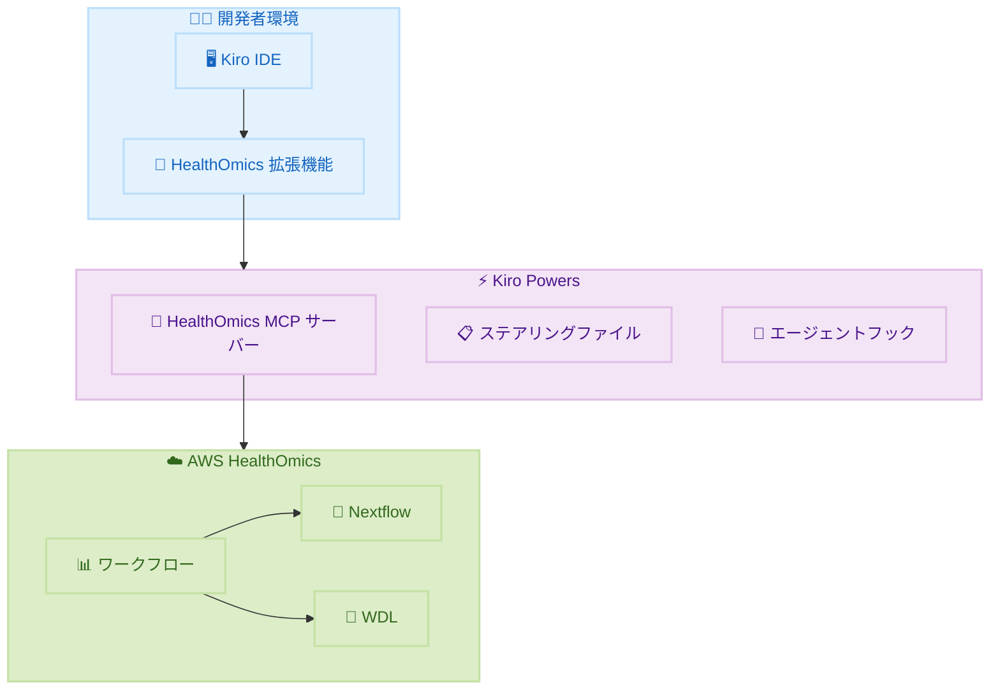

# AWS HealthOmics - Kiro Power と Kiro IDE 拡張機能

**リリース日**: 2026 年 2 月 9 日
**サービス**: AWS HealthOmics
**機能**: Kiro Power および Kiro IDE 拡張機能によるバイオインフォマティクスワークフロー開発

📊 [このアップデートのインフォグラフィックを見る](https://takech9203.github.io/awsnews-summary/20260209-aws-healthomics-introduces-kiro-plugin-for-bioinformatics-workflow-development.html)

## 概要

AWS HealthOmics が Kiro Power と Kiro IDE 拡張機能を発表しました。これにより、AI エージェント支援による開発で HealthOmics ワークフローの作成、実行、デバッグ、最適化がより迅速に行えるようになります。Kiro IDE の HealthOmics 拡張機能を使用すると、Nextflow や WDL などのドメイン固有言語でワークフローを直接 Kiro インターフェース内で作成、変更、分析できます。

AWS HealthOmics は HIPAA 対象サービスであり、フルマネージドなバイオインフォマティクスワークフローで大規模な科学的発見を加速します。

**アップデート前の課題**

- バイオインフォマティクスワークフローの作成と最適化に専門知識が必要だった
- Nextflow や WDL の構文エラーやエンジン互換性問題のデバッグが困難だった
- ワークフロー実行の失敗診断に時間がかかっていた

**アップデート後の改善**

- AI エージェント支援によりワークフロー作成と最適化が高速化
- 構文ハイライト、コード補完、トラブルシューティングガイダンスを提供
- エンジン互換性チェック、パフォーマンス最適化推奨、自動実行分析と障害診断を実現

## アーキテクチャ図



Kiro IDE と HealthOmics 拡張機能が Kiro Powers を通じて AWS HealthOmics と連携し、AI 支援のワークフロー開発を実現します。

## サービスアップデートの詳細

### 主要機能

1. **Kiro Power for HealthOmics**
   - HealthOmics MCP サーバーをパッケージ化
   - ワークフロー作成と最適化に関する専門知識を Kiro エージェントに提供
   - ステアリングファイルとエージェントフックを含む

2. **Kiro IDE 拡張機能**
   - Nextflow と WDL の構文ハイライト
   - コード補完機能
   - トラブルシューティングガイダンス
   - HealthOmics エンジン互換性チェック
   - パフォーマンス最適化推奨
   - 自動実行分析と障害診断
   - ワークフローインポート/エクスポート機能

3. **AI エージェント支援開発**
   - Model Context Protocol (MCP) を活用
   - 専門的なバイオインフォマティクス知識を提供
   - ワークフロー開発の高速化

## 技術仕様

### サポートされる言語

| 言語 | 説明 |
|------|------|
| Nextflow | データ駆動型計算パイプライン用 DSL |
| WDL (Workflow Description Language) | 生物医学データ分析ワークフロー記述言語 |

### Kiro Powers コンポーネント

| コンポーネント | 説明 |
|----------------|------|
| MCP サーバー | HealthOmics との通信を処理 |
| ステアリングファイル | ワークフロー最適化のガイダンス |
| エージェントフック | 開発イベントへの自動対応 |

## 設定方法

### 前提条件

1. Kiro IDE のインストール
2. AWS アカウントと HealthOmics へのアクセス
3. 適切な IAM 権限

### 手順

#### ステップ 1: Kiro Power のインストール

1. [https://kiro.dev/powers/](https://kiro.dev/powers/) にアクセス
2. HealthOmics Kiro Power を検索
3. インストール手順に従ってセットアップ

#### ステップ 2: Kiro IDE 拡張機能のインストール

1. [Open VSX Registry](https://open-vsx.org/extension/amazonwebservices/aws-healthomics-extension) にアクセス
2. AWS HealthOmics Extension をダウンロード
3. Kiro IDE にインストール

#### ステップ 3: ワークフロー開発の開始

Kiro IDE で新しい Nextflow または WDL ファイルを作成し、AI エージェント支援を活用してワークフローを開発します。

## メリット

### ビジネス面

- **開発速度向上**: AI 支援により、ワークフロー開発時間を大幅に短縮
- **品質向上**: 自動エラー検出と最適化推奨により、高品質なワークフローを作成
- **専門知識の民主化**: AI がバイオインフォマティクスの専門知識を提供

### 技術面

- **統合開発環境**: IDE 内で完結したワークフロー開発
- **自動診断**: 実行失敗の原因を自動分析
- **互換性保証**: エンジン互換性を事前にチェック

## デメリット・制約事項

### 制限事項

- Kiro IDE が必要 (他の IDE では利用不可)
- HealthOmics がサポートするリージョンに限定

### 考慮すべき点

- AI の推奨は最終的に人間による確認が必要
- 新しいツールの学習コストが発生する可能性

## ユースケース

### ユースケース 1: ゲノム解析パイプラインの作成

**シナリオ**: 新しいゲノム解析ワークフローを迅速に作成したい

**実装例**:
```nextflow
// Kiro IDE で AI 支援を活用して Nextflow ワークフローを作成
workflow {
    // AI が最適なパラメータと構造を提案
}
```

**効果**: 専門知識がなくても高品質なワークフローを短時間で作成

### ユースケース 2: 既存ワークフローの最適化

**シナリオ**: 実行時間が長いワークフローのパフォーマンスを改善したい

**効果**: AI がボトルネックを特定し、最適化案を自動提案

## 料金

Kiro Power と IDE 拡張機能は無料で提供されます。AWS HealthOmics の実行には標準料金が適用されます。

## 利用可能リージョン

AWS HealthOmics がサポートされているリージョンで利用可能です。

## 関連サービス・機能

- **AWS HealthOmics**: フルマネージドなバイオインフォマティクスサービス
- **Kiro IDE**: AI 支援統合開発環境
- **Amazon Omics**: ゲノミクスデータの保存と分析

## 参考リンク

- 📊 [インフォグラフィック](https://takech9203.github.io/awsnews-summary/20260209-aws-healthomics-introduces-kiro-plugin-for-bioinformatics-workflow-development.html)
- [公式発表 (What's New)](https://aws.amazon.com/about-aws/whats-new/2026/01/aws-healthomics-introduces-kiro-plugin-for-bioinformatics-workflow-development/)
- [Kiro Powers](https://kiro.dev/powers/)
- [Open VSX Registry - HealthOmics Extension](https://open-vsx.org/extension/amazonwebservices/aws-healthomics-extension)
- [AWS HealthOmics](https://aws.amazon.com/healthomics/)

## まとめ

AWS HealthOmics の Kiro Power と IDE 拡張機能により、バイオインフォマティクスワークフローの開発が大幅に効率化されました。AI エージェント支援により、専門知識の有無に関わらず、高品質なワークフローを迅速に作成できます。生命科学やヘルスケア分野で HealthOmics を利用している組織は、この新しいツールの評価を推奨します。
