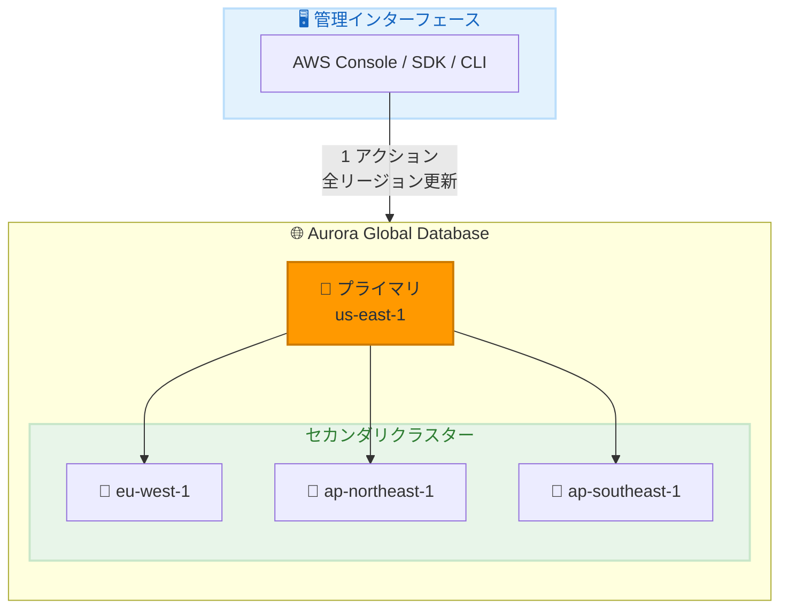

# Amazon Aurora Global Database - マネージドマイナーバージョンアップグレード

**リリース日**: 2026 年 2 月 10 日
**サービス**: Amazon Aurora
**機能**: Global Database のマネージドマイナーバージョンアップグレード

📊 [このアップデートのインフォグラフィックを見る](https://takech9203.github.io/awsnews-summary/20260210-amazon-aurora-global-database-managed-minor.html)

## 概要

Amazon Aurora Global Database がグローバルトポロジー全体でのマネージドマイナーバージョンアップグレードをサポートしました。この機能により、各クラスターを個別にアップグレードする必要がなくなり、AWS Management Console、SDK、または CLI から一括でアップグレードを実行できます。

Aurora Global Database は単一の Aurora データベースを最大 11 の AWS リージョンにまたがって展開でき、リージョン全体の障害からの災害復旧とグローバルに分散したアプリケーションへの高速ローカル読み取りを提供します。今回のアップデートにより、グローバルクラスター管理の運用オーバーヘッドが大幅に削減されます。

**アップデート前の課題**

- Global Database の各クラスターを個別にアップグレードする必要があった
- マルチリージョン環境でのバージョン整合性の維持が困難だった
- アップグレードプロセスの調整に時間とリソースが必要だった

**アップデート後の改善**

- 単一のアクションですべてのリージョンのクラスターを一括アップグレード
- 最小限のダウンタイムでグローバルトポロジー全体をアップグレード
- バージョン管理の一元化により運用オーバーヘッドを削減

## アーキテクチャ図



単一のマネージド操作で、プライマリとすべてのセカンダリクラスターが選択したマイナーバージョンにアップグレードされます。

## サービスアップデートの詳細

### 主要機能

1. **一括マイナーバージョンアップグレード**
   - 全リージョンのクラスターを単一アクションでアップグレード
   - プライマリとセカンダリを自動的に調整
   - 最小限のダウンタイム

2. **複数の管理インターフェース**
   - AWS Management Console からの実行
   - AWS CLI による自動化
   - AWS SDK でのプログラム的制御

3. **運用の簡素化**
   - 個別クラスターのアップグレード管理が不要
   - バージョン整合性の自動維持
   - アップグレードステータスの一元監視

## 技術仕様

### サポートされるエンジン

| エンジン | サポート状況 |
|---------|-------------|
| Aurora PostgreSQL | ✅ サポート |
| Aurora MySQL | 今後のサポート予定 |

### アップグレードプロセス

| フェーズ | 説明 |
|---------|------|
| 準備 | アップグレード互換性のチェック |
| プライマリ更新 | プライマリクラスターのアップグレード |
| レプリケーション | セカンダリクラスターへの伝播 |
| 完了 | 全クラスターの更新確認 |

## 設定方法

### 前提条件

1. Aurora PostgreSQL を使用する Global Database
2. アップグレード対象のマイナーバージョンがサポートされていること
3. 適切な IAM 権限

### 手順

#### ステップ 1: 現在のバージョンの確認

```bash
aws rds describe-global-clusters \
  --global-cluster-identifier my-global-cluster \
  --query 'GlobalClusters[0].EngineVersion'
```

Global Database の現在のエンジンバージョンを確認します。

#### ステップ 2: 利用可能なアップグレードターゲットの確認

```bash
aws rds describe-db-engine-versions \
  --engine aurora-postgresql \
  --engine-version 15.4 \
  --query 'DBEngineVersions[0].ValidUpgradeTarget[*].EngineVersion'
```

現在のバージョンからアップグレード可能なバージョンを確認します。

#### ステップ 3: マネージドアップグレードの実行

```bash
aws rds modify-global-cluster \
  --global-cluster-identifier my-global-cluster \
  --engine-version 15.6 \
  --apply-immediately
```

このコマンドで Global Database 全体がバージョン 15.6 にアップグレードされます。

#### ステップ 4: アップグレードステータスの監視

```bash
aws rds describe-global-clusters \
  --global-cluster-identifier my-global-cluster \
  --query 'GlobalClusters[0].Status'
```

アップグレードの進行状況を監視します。

## メリット

### ビジネス面

- **運用コスト削減**: 個別アップグレードの管理工数を大幅に削減
- **リスク軽減**: 一貫したアップグレードプロセスでエラーを防止
- **可用性の維持**: 最小限のダウンタイムでアップグレード完了

### 技術面

- **バージョン一貫性**: 全クラスターが同一バージョンで動作を保証
- **自動調整**: プライマリとセカンダリ間のアップグレード順序を自動管理
- **簡素化された自動化**: 単一の API コールでグローバルアップグレードを実行

## デメリット・制約事項

### 制限事項

- 現時点では Aurora PostgreSQL のみサポート
- メジャーバージョンアップグレードは対象外
- アップグレード中は書き込み操作に影響が出る可能性

### 考慮すべき点

- アップグレード前にアプリケーションの互換性をテスト
- メンテナンスウィンドウの計画
- ロールバック計画の準備

## ユースケース

### ユースケース 1: グローバル E コマースプラットフォーム

**シナリオ**: 5 つのリージョンに展開された E コマースサイトの定期バージョンアップグレード

**実装例**:
```bash
# 月次メンテナンスでのグローバルアップグレード
aws rds modify-global-cluster \
  --global-cluster-identifier ecommerce-global-db \
  --engine-version 15.6 \
  --apply-immediately
```

**効果**: 5 リージョンのアップグレードを数時間から数分に短縮

### ユースケース 2: セキュリティパッチの緊急適用

**シナリオ**: セキュリティ脆弱性に対応するためのマイナーバージョンアップグレード

**実装例**:
```bash
# 緊急セキュリティアップグレード
aws rds modify-global-cluster \
  --global-cluster-identifier production-global-db \
  --engine-version 15.6.1 \
  --apply-immediately
```

**効果**: 全リージョンに迅速にセキュリティパッチを適用

### ユースケース 3: 自動化されたアップグレードパイプライン

**シナリオ**: CI/CD パイプラインでの定期的なデータベースアップグレード

**実装例**:
```yaml
# GitHub Actions でのアップグレード自動化
- name: Upgrade Global Database
  run: |
    aws rds modify-global-cluster \
      --global-cluster-identifier ${{ secrets.GLOBAL_DB_ID }} \
      --engine-version ${{ inputs.target_version }} \
      --apply-immediately
```

**効果**: データベースアップグレードを CI/CD パイプラインに統合

## 料金

マネージドマイナーバージョンアップグレード機能自体に追加料金はありません。標準の Aurora Global Database 料金が適用されます。

| 項目 | 料金 |
|------|------|
| アップグレード操作 | 無料 |
| Global Database | 標準料金 |
| データ転送 | リージョン間転送料金 |

## 利用可能リージョン

Aurora Global Database をサポートするすべての商用 AWS リージョンおよび AWS GovCloud (US) リージョンで利用可能です。

## 関連サービス・機能

- **Amazon RDS Blue/Green Deployments**: メジャーバージョンアップグレードやスキーマ変更に使用
- **Amazon CloudWatch**: アップグレード中のモニタリング
- **AWS Backup**: アップグレード前のスナップショット取得

## 参考リンク

- 📊 [インフォグラフィック](https://takech9203.github.io/awsnews-summary/20260210-amazon-aurora-global-database-managed-minor.html)
- [公式発表 (What's New)](https://aws.amazon.com/about-aws/whats-new/2026/02/amazon-aurora-global-database-managed-minor/)
- [Aurora Global Database アップグレードドキュメント](https://docs.aws.amazon.com/AmazonRDS/latest/AuroraUserGuide/aurora-global-database-upgrade.html)
- [Aurora PostgreSQL Global Database](https://docs.aws.amazon.com/AmazonRDS/latest/AuroraUserGuide/Concepts.Aurora_Fea_Regions_DB-eng.Feature.GlobalDatabase.html#Concepts.Aurora_Fea_Regions_DB-eng.Feature.GlobalDatabase.apg)

## まとめ

Amazon Aurora Global Database のマネージドマイナーバージョンアップグレード機能により、グローバルに分散したデータベースクラスターの管理が大幅に簡素化されました。Aurora PostgreSQL を使用している Global Database ユーザーは、この新機能を活用してアップグレード運用を効率化し、バージョン管理の複雑さを軽減してください。
