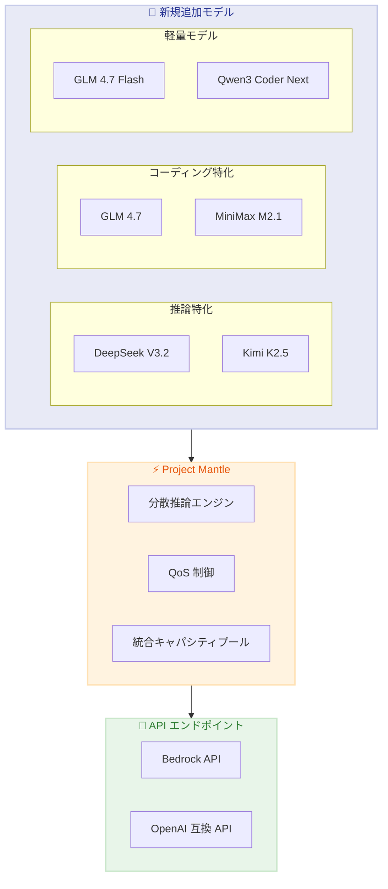

# Amazon Bedrock - 6 つの新しいオープンウェイトモデルを追加

**リリース日**: 2026 年 2 月 10 日
**サービス**: Amazon Bedrock
**機能**: DeepSeek V3.2、MiniMax M2.1、GLM 4.7、Kimi K2.5、Qwen3 Coder Next のサポート

📊 [このアップデートのインフォグラフィックを見る](https://takech9203.github.io/awsnews-summary/20260210-amazon-bedrock-adds-support-six-open-weights-models.html)

## 概要

Amazon Bedrock に 6 つの新しいオープンウェイトモデルが追加されました。DeepSeek V3.2、MiniMax M2.1、GLM 4.7、GLM 4.7 Flash、Kimi K2.5、Qwen3 Coder Next の 6 モデルは、フロンティアレベルの推論能力とエージェンティックコーディング機能を提供します。

これらのモデルは Project Mantle と呼ばれる新しい分散推論エンジンによって提供され、OpenAI API 互換のエンドポイントもサポートしています。エンタープライズ AI ワークロードの全スペクトラムをカバーし、大幅に低い推論コストでフロンティアクラスの性能を実現します。

**アップデート前の課題**

- Amazon Bedrock で利用可能なオープンウェイトモデルの選択肢が限られていた
- 最新のフロンティアモデルへのアクセスにはカスタムデプロイメントが必要だった
- 高度な推論やコーディングタスク向けのモデル選択肢が少なかった

**アップデート後の改善**

- 6 つの最先端オープンウェイトモデルにフルマネージドでアクセス可能
- Project Mantle による高性能で信頼性の高いサーバーレス推論
- OpenAI API 互換エンドポイントで既存アプリケーションからの移行が容易

## アーキテクチャ図



Project Mantle を介して 6 つのオープンウェイトモデルが統合され、Bedrock API と OpenAI 互換 API の両方からアクセス可能です。

## サービスアップデートの詳細

### 主要機能

1. **フロンティア推論モデル**
   - **DeepSeek V3.2**: 最先端の推論とエージェンティックインテリジェンス
   - **Kimi K2.5**: 高度な推論タスクに最適化

2. **自律コーディングモデル**
   - **GLM 4.7**: 大規模出力ウィンドウを持つ自律コーディング
   - **MiniMax M2.1**: 自律コーディングの新標準

3. **軽量・コスト効率モデル**
   - **GLM 4.7 Flash**: 本番デプロイメント向けに最適化
   - **Qwen3 Coder Next**: コスト効率に優れた軽量コーディングモデル

### モデル特性比較

| モデル | 強み | ユースケース |
|--------|------|--------------|
| DeepSeek V3.2 | フロンティア推論 | 複雑な問題解決、エージェント開発 |
| Kimi K2.5 | エージェンティックインテリジェンス | マルチステップタスク、自律エージェント |
| GLM 4.7 | 大規模出力ウィンドウ | 長文コード生成、ドキュメント作成 |
| MiniMax M2.1 | 自律コーディング | 自動プログラミング、コードレビュー |
| GLM 4.7 Flash | 低レイテンシ | リアルタイム応答、チャットボット |
| Qwen3 Coder Next | コスト効率 | 大規模コーディングワークロード |

## 技術仕様

### Project Mantle の特徴

| 機能 | 説明 |
|------|------|
| 分散推論エンジン | 大規模 ML モデルサービング向けに最適化 |
| 自動キャパシティ管理 | 統合プールによる効率的なリソース利用 |
| QoS 制御 | 洗練されたサービス品質管理 |
| OpenAI API 互換 | 既存アプリケーションからの移行が容易 |

### API 変更履歴

| 日付 | サービス | 変更内容 |
|------|----------|----------|
| 2026/02/10 | Amazon Bedrock | 6 つの新しいオープンウェイトモデルのサポート追加 |

## 設定方法

### 前提条件

1. Amazon Bedrock へのアクセス権限を持つ AWS アカウント
2. 使用するモデルへのアクセスを有効化
3. 適切な IAM ポリシーの設定

### 手順

#### ステップ 1: モデルアクセスの有効化

Amazon Bedrock コンソールで使用したいモデルへのアクセスをリクエストします。

#### ステップ 2: Bedrock API での使用

```python
import boto3

bedrock_runtime = boto3.client('bedrock-runtime')

response = bedrock_runtime.invoke_model(
    modelId='deepseek.v3-2',
    body='{"prompt": "複雑な数学問題を解いてください...", "max_tokens": 2048}'
)
```

このコードは DeepSeek V3.2 モデルを呼び出して推論を実行します。

#### ステップ 3: OpenAI 互換 API での使用

```python
from openai import OpenAI

client = OpenAI(
    base_url="https://bedrock-runtime.us-east-1.amazonaws.com/model/deepseek.v3-2/converse",
    api_key="<AWS_CREDENTIALS>"
)

response = client.chat.completions.create(
    model="deepseek.v3-2",
    messages=[{"role": "user", "content": "Hello!"}]
)
```

OpenAI SDK を使用して Amazon Bedrock のモデルにアクセスできます。

## メリット

### ビジネス面

- **コスト削減**: オープンウェイトモデルにより推論コストを大幅に削減
- **選択肢の拡大**: 用途に応じた最適なモデル選択が可能
- **移行の容易さ**: OpenAI API 互換により既存システムからの移行が簡単

### 技術面

- **フロンティア性能**: 最先端のオープンウェイトモデルにアクセス
- **サーバーレス**: インフラ管理不要でスケーラブル
- **統合キャパシティ**: Project Mantle による効率的なリソース管理

## デメリット・制約事項

### 制限事項

- モデルごとに異なるトークン制限やコンテキストウィンドウ
- 一部機能は特定のモデルでのみ利用可能
- リージョンによる利用可能性の違い

### 考慮すべき点

- 各モデルの特性を理解して適切なユースケースに適用
- OpenAI API 互換機能は一部制限がある場合がある

## ユースケース

### ユースケース 1: 複雑な推論タスク

**シナリオ**: 金融機関がリスク分析のための複雑な推論を自動化

**実装例**:
```python
response = bedrock_runtime.invoke_model(
    modelId='deepseek.v3-2',
    body={
        "prompt": "以下の財務データを分析し、リスク評価を行ってください...",
        "max_tokens": 4096,
        "temperature": 0.1
    }
)
```

**効果**: 高精度な推論により、リスク分析の品質と速度が向上

### ユースケース 2: 自律的なコード生成

**シナリオ**: 開発チームがコードベースの自動リファクタリングを実施

**実装例**:
```python
response = bedrock_runtime.invoke_model(
    modelId='glm.4-7',
    body={
        "prompt": "以下のコードをモダンな Python スタイルにリファクタリングしてください...",
        "max_tokens": 8192
    }
)
```

**効果**: 大規模出力ウィンドウにより、長いコードファイルの一括処理が可能

### ユースケース 3: コスト効率の高い大規模処理

**シナリオ**: スタートアップが大量のカスタマーサポートチケットを処理

**実装例**:
```python
# 軽量モデルで大量処理
for ticket in tickets:
    response = bedrock_runtime.invoke_model(
        modelId='glm.4-7-flash',
        body={"prompt": f"チケットを分類してください: {ticket}"}
    )
```

**効果**: GLM 4.7 Flash の低コストで大量のチケット処理を実現

## 料金

料金はモデルごとに異なります。オープンウェイトモデルは一般的にプロプライエタリモデルより低コストで利用できます。

| モデルカテゴリ | コスト特性 |
|----------------|-----------|
| フロンティア推論 | 中〜高 (複雑なタスク向け) |
| 自律コーディング | 中 (長文出力対応) |
| 軽量モデル | 低 (大量処理向け) |

詳細な料金は Amazon Bedrock 料金ページを参照してください。

## 利用可能リージョン

Amazon Bedrock が利用可能なリージョンで順次展開されます。詳細は AWS リージョン表を確認してください。

## 関連サービス・機能

- **Amazon Bedrock Agents**: 新しいモデルでより高度なエージェントを構築
- **Amazon Bedrock Knowledge Bases**: RAG パイプラインで新モデルを活用
- **Amazon SageMaker**: カスタムファインチューニングが必要な場合の選択肢

## 参考リンク

- 📊 [インフォグラフィック](https://takech9203.github.io/awsnews-summary/20260210-amazon-bedrock-adds-support-six-open-weights-models.html)
- [公式発表 (What's New)](https://aws.amazon.com/about-aws/whats-new/2026/02/amazon-bedrock-adds-support-six-open-weights-models/)
- [Amazon Bedrock コンソール](https://console.aws.amazon.com/bedrock/)
- [Amazon Bedrock ドキュメント](https://docs.aws.amazon.com/bedrock/latest/userguide/getting-started.html)
- [Project Mantle ドキュメント](https://docs.aws.amazon.com/bedrock/latest/userguide/bedrock-mantle.html)

## まとめ

Amazon Bedrock への 6 つのオープンウェイトモデル追加は、エンタープライズ AI ワークロードに大きな選択肢を提供します。DeepSeek V3.2 や Kimi K2.5 でフロンティアレベルの推論を、GLM 4.7 や MiniMax M2.1 で自律コーディングを、GLM 4.7 Flash や Qwen3 Coder Next でコスト効率の高い大規模処理を実現できます。Project Mantle と OpenAI API 互換により、既存システムからの移行も容易です。
