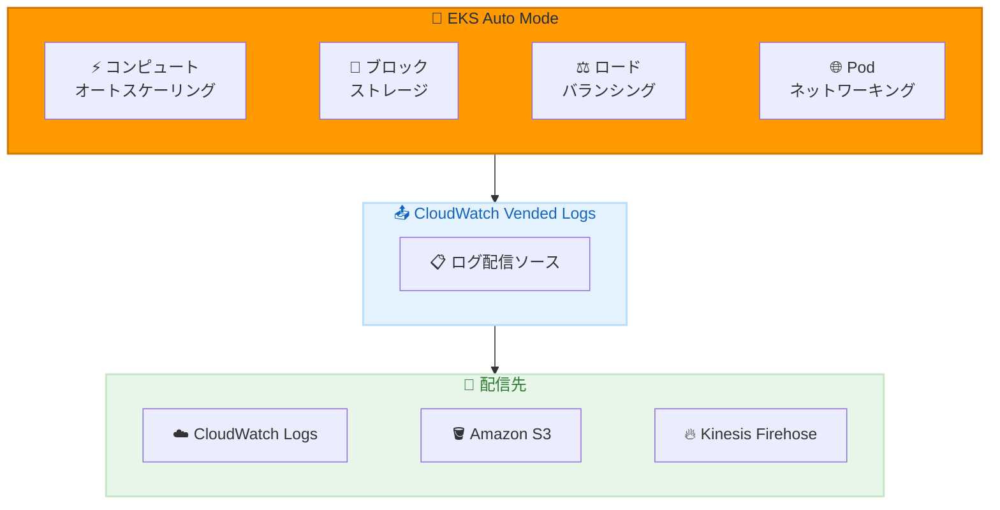

# Amazon EKS Auto Mode - CloudWatch Vended Logs による拡張ロギング

**リリース日**: 2026 年 2 月 10 日
**サービス**: Amazon Elastic Kubernetes Service (EKS)
**機能**: Auto Mode マネージド機能の CloudWatch Vended Logs 統合

📊 [このアップデートのインフォグラフィックを見る](https://takech9203.github.io/awsnews-summary/20260210-amazon-eks-auto-mode-enhanced-logging.html)

## 概要

Amazon EKS Auto Mode のマネージド機能が Amazon CloudWatch Vended Logs のログ配信ソースとして設定可能になりました。これにより、EKS Auto Mode クラスターの監視とトラブルシューティングが大幅に改善され、コンピュートオートスケーリング、ブロックストレージ、ロードバランシング、Pod ネットワーキングのログを自動収集できます。

CloudWatch Vended Logs は標準の CloudWatch Logs と比較して低価格で提供され、AWS 認証・認可が組み込まれた信頼性の高いログ配信を実現します。ログの配信先として CloudWatch Logs、Amazon S3、Amazon Kinesis Data Firehose を選択できます。

**アップデート前の課題**

- EKS Auto Mode のマネージド機能からのログ収集が困難だった
- オートスケーリングやストレージ関連の問題のトラブルシューティングに時間がかかった
- マネージド機能の動作の可視性が限られていた

**アップデート後の改善**

- Auto Mode の各マネージド機能を CloudWatch Vended Logs 配信ソースとして設定可能
- コンピュート、ストレージ、ネットワーキングの問題を迅速に特定
- 標準 CloudWatch Logs より低価格でログを収集

## アーキテクチャ図



EKS Auto Mode の 4 つのマネージド機能からのログが CloudWatch Vended Logs を経由して、選択した配信先に送信されます。

## サービスアップデートの詳細

### 主要機能

1. **マネージド機能ごとのログ配信設定**
   - コンピュートオートスケーリングのログ
   - ブロックストレージのログ
   - ロードバランシングのログ
   - Pod ネットワーキングのログ

2. **柔軟な配信先選択**
   - Amazon CloudWatch Logs - リアルタイム分析とアラート
   - Amazon S3 - 長期保存と分析
   - Amazon Kinesis Data Firehose - ストリーム処理

3. **コスト最適化**
   - CloudWatch Vended Logs の低価格料金
   - AWS 認証・認可が組み込み済み
   - 信頼性の高いログ配信

## 技術仕様

### API 変更履歴

| 日付 | サービス | 変更内容 |
|------|----------|----------|
| 2026/02/09 | [Amazon Elastic Kubernetes Service](https://awsapichanges.com/archive/changes/d7d1a5-eks.html) | 10 updated methods - VendedLogsUpdate のサポート追加 |

### ログ配信設定項目

| 項目 | 説明 |
|------|------|
| 配信ソース | Auto Mode 機能 (compute, storage, lb, networking) |
| 配信先タイプ | CloudWatch Logs, S3, Kinesis Data Firehose |
| フィルタリング | ログレベル、コンポーネントによるフィルタ |

### 料金比較

| ログタイプ | 取り込み料金 |
|-----------|-------------|
| CloudWatch Vended Logs | 標準料金より低価格 |
| 標準 CloudWatch Logs | 標準料金 |

## 設定方法

### 前提条件

1. EKS Auto Mode が有効なクラスター
2. CloudWatch Logs、S3、または Kinesis Data Firehose の設定
3. 適切な IAM 権限

### 手順

#### ステップ 1: CloudWatch API でログ配信を設定

```bash
aws logs put-delivery-source \
  --name eks-auto-mode-compute \
  --resource-arn arn:aws:eks:ap-northeast-1:123456789012:cluster/my-cluster \
  --log-type AUTO_MODE_COMPUTE
```

このコマンドは EKS Auto Mode のコンピュートオートスケーリングをログ配信ソースとして登録します。

#### ステップ 2: 配信先の作成

```bash
aws logs put-delivery-destination \
  --name my-auto-mode-logs \
  --output-format json \
  --delivery-destination-configuration \
    "destinationResourceArn=arn:aws:logs:ap-northeast-1:123456789012:log-group:/eks/auto-mode"
```

CloudWatch Logs グループを配信先として設定します。

#### ステップ 3: 配信の作成

```bash
aws logs create-delivery \
  --delivery-source-name eks-auto-mode-compute \
  --delivery-destination-arn arn:aws:logs:ap-northeast-1:123456789012:delivery-destination/my-auto-mode-logs
```

ソースと配信先を接続してログ配信を開始します。

#### ステップ 4: AWS Console での設定

1. EKS コンソールでクラスターを選択
2. 「Observability」タブを開く
3. 「Auto Mode logging」セクションで配信を設定

## メリット

### ビジネス面

- **運用効率の向上**: Auto Mode クラスターの問題を迅速に特定して解決
- **コスト削減**: Vended Logs の低価格料金でログ収集コストを削減
- **可視性の向上**: マネージド機能の動作を詳細に把握

### 技術面

- **統合監視**: 4 つのマネージド機能を一元的にモニタリング
- **柔軟な配信先**: ユースケースに応じて最適な配信先を選択
- **セキュア**: AWS 認証・認可が組み込まれた信頼性の高いログ配信

## デメリット・制約事項

### 制限事項

- EKS Auto Mode クラスターのみ対象
- 各配信先のストレージ料金は別途発生
- 一部の詳細なログは追加設定が必要な場合がある

### 考慮すべき点

- ログ量に応じたストレージ容量の計画
- 適切なログ保持期間の設定
- コスト管理のためのログフィルタリングの検討

## ユースケース

### ユースケース 1: オートスケーリング問題のトラブルシューティング

**シナリオ**: ノードのスケールアウトが期待通りに動作しない

**実装例**:
```bash
# CloudWatch Logs Insights でオートスケーリングログをクエリ
fields @timestamp, @message
| filter component = "compute-autoscaler"
| filter @message like /scale/
| sort @timestamp desc
| limit 50
```

**効果**: オートスケーリングの決定プロセスを可視化して問題を特定

### ユースケース 2: ストレージ関連エラーの調査

**シナリオ**: PersistentVolumeClaim がバインドされない

**実装例**:
```bash
# ストレージコントローラーのログを確認
fields @timestamp, @message
| filter component = "storage-controller"
| filter @message like /error|failed/i
| sort @timestamp desc
```

**効果**: EBS ボリュームのプロビジョニング問題を迅速に特定

### ユースケース 3: 長期ログ分析のための S3 保存

**シナリオ**: コンプライアンス要件のためログを長期保存

**実装例**:
```bash
# S3 を配信先として設定
aws logs put-delivery-destination \
  --name auto-mode-logs-archive \
  --output-format json \
  --delivery-destination-configuration \
    "destinationResourceArn=arn:aws:s3:::my-eks-logs-bucket"
```

**効果**: 低コストでログを長期保存し、必要に応じて Athena で分析

## 料金

配信先のサービス料金が適用されます。

| 配信先 | 料金 |
|--------|------|
| CloudWatch Logs | Vended Logs 料金 (標準より低価格) |
| Amazon S3 | S3 ストレージ料金 |
| Kinesis Data Firehose | Firehose 料金 |

## 利用可能リージョン

EKS Auto Mode が利用可能なすべてのリージョンで利用できます。

## 関連サービス・機能

- **Amazon CloudWatch**: ログ分析、メトリクス、アラーム
- **Amazon S3**: ログの長期保存
- **Amazon Kinesis Data Firehose**: リアルタイムストリーム処理
- **Amazon Athena**: S3 に保存されたログの分析

## 参考リンク

- 📊 [インフォグラフィック](https://takech9203.github.io/awsnews-summary/20260210-amazon-eks-auto-mode-enhanced-logging.html)
- [公式発表 (What's New)](https://aws.amazon.com/about-aws/whats-new/2026/02/amazon-eks-auto-mode-enhanced-logging/)
- [Amazon EKS ドキュメント](https://docs.aws.amazon.com/eks/latest/userguide/auto-observability.html)

## まとめ

Amazon EKS Auto Mode の CloudWatch Vended Logs 統合により、マネージド Kubernetes 機能の監視とトラブルシューティングが大幅に改善されました。コンピュート、ストレージ、ネットワーキングのログを低価格で収集し、問題を迅速に特定できます。EKS Auto Mode を使用している場合は、この新機能を有効化してクラスターの可視性を向上させてください。
