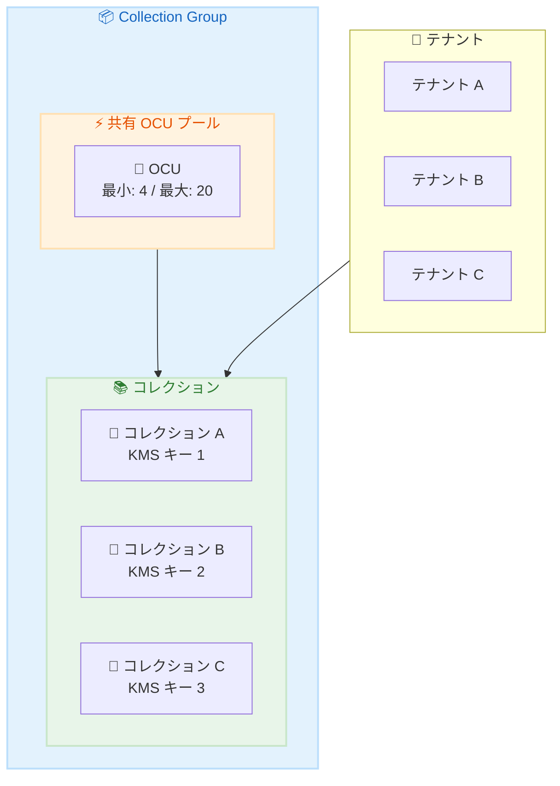

# Amazon OpenSearch Serverless - Collection Groups によるコスト最適化

**リリース日**: 2026 年 2 月 10 日
**サービス**: Amazon OpenSearch Serverless
**機能**: Collection Groups

📊 [このアップデートのインフォグラフィックを見る](https://takech9203.github.io/awsnews-summary/20260210-amazon-opensearch-serverless-supports-collection-groups.html)

## 概要

Amazon OpenSearch Serverless が Collection Groups をサポートしました。この新機能により、異なる AWS KMS キーを持つコレクション間で OpenSearch Compute Units (OCU) を共有できるようになり、コレクションレベルのセキュリティとアクセス制御を維持しながらコスト最適化を実現できます。

Collection Groups では、最大 OCU 制限に加えて最小 OCU 割り当ても指定できるため、起動時から予測可能なパフォーマンスを確保し、レイテンシに敏感なアプリケーションのコールドスタート遅延を排除できます。

**アップデート前の課題**

- 異なる KMS キーを使用するコレクションは個別にコンピューティングリソースを消費
- マルチテナントワークロードでのコスト効率が悪かった
- コールドスタート時のパフォーマンス遅延が発生

**アップデート後の改善**

- 異なる KMS キーのコレクションでもコンピューティングリソースを共有可能
- 最小 OCU 設定でコールドスタート遅延を排除
- 共有コンピューティングモデルで全体の OCU コストを削減

## アーキテクチャ図



異なる KMS キーで暗号化された複数のコレクションが、Collection Group 内で OCU プールを共有します。

## サービスアップデートの詳細

### 主要機能

1. **OCU の共有**
   - 異なる KMS キーのコレクション間で OCU を共有
   - 共有コンピューティングモデルでコスト削減
   - コレクションレベルのセキュリティは維持

2. **最小 OCU 設定**
   - 起動時から保証されたベースラインキャパシティ
   - コールドスタート遅延の排除
   - レイテンシに敏感なアプリケーションに最適

3. **柔軟なキャパシティ管理**
   - 最小・最大 OCU の両方を設定可能
   - ワークロードに応じた動的スケーリング
   - コスト制御と予測可能なパフォーマンスの両立

## 技術仕様

### Collection Group の設定項目

| 項目 | 説明 |
|------|------|
| 最小 OCU | 保証されたベースラインキャパシティ |
| 最大 OCU | スケールアップの上限 |
| KMS キー | コレクションごとに異なるキーを指定可能 |

### OCU の仕様

| 項目 | 説明 |
|------|------|
| OCU | OpenSearch Compute Unit |
| インデックス OCU | インデックスとクエリの処理 |
| 検索 OCU | 検索クエリの処理 |

## 設定方法

### 前提条件

1. OpenSearch Serverless が有効な AWS アカウント
2. 複数の KMS キー (マルチテナント環境の場合)
3. 適切な IAM 権限

### 手順

#### ステップ 1: Collection Group の作成

```bash
aws opensearchserverless create-collection-group \
  --name my-collection-group \
  --min-capacity 4 \
  --max-capacity 20
```

最小 4 OCU、最大 20 OCU の Collection Group を作成します。

#### ステップ 2: コレクションの作成とグループへの追加

```bash
# コレクション A (KMS キー 1)
aws opensearchserverless create-collection \
  --name tenant-a-collection \
  --type SEARCH \
  --collection-group-name my-collection-group \
  --kms-key-arn arn:aws:kms:ap-northeast-1:123456789012:key/key-1

# コレクション B (KMS キー 2)
aws opensearchserverless create-collection \
  --name tenant-b-collection \
  --type SEARCH \
  --collection-group-name my-collection-group \
  --kms-key-arn arn:aws:kms:ap-northeast-1:123456789012:key/key-2
```

異なる KMS キーを使用するコレクションを同じ Collection Group に追加します。

#### ステップ 3: キャパシティの調整

```bash
aws opensearchserverless update-collection-group \
  --name my-collection-group \
  --min-capacity 8 \
  --max-capacity 40
```

ワークロードに応じて Collection Group のキャパシティを調整します。

## メリット

### ビジネス面

- **コスト削減**: 共有コンピューティングモデルで OCU コストを削減
- **マルチテナント対応**: 異なる暗号化キーでテナント分離を維持
- **予測可能な料金**: 最小・最大 OCU でコストを制御

### 技術面

- **コールドスタート排除**: 最小 OCU 設定で即座にパフォーマンスを発揮
- **セキュリティ維持**: KMS キーによるコレクション単位の暗号化
- **スケーラビリティ**: 需要に応じた動的スケーリング

## デメリット・制約事項

### 制限事項

- Collection Group 内のコレクション数に上限がある可能性
- 最小 OCU を設定すると常時課金が発生
- Collection Group の作成後は一部の設定変更に制限

### 考慮すべき点

- 最小 OCU はコストと引き換えにパフォーマンスを保証
- ワークロードパターンを分析して適切な OCU 設定を決定

## ユースケース

### ユースケース 1: SaaS マルチテナントプラットフォーム

**シナリオ**: SaaS プロバイダーが顧客ごとに分離されたデータを提供

**実装例**:
```bash
# 顧客ごとに異なる KMS キーでコレクションを作成
for customer in customer1 customer2 customer3; do
  aws opensearchserverless create-collection \
    --name ${customer}-logs \
    --collection-group-name saas-collection-group \
    --kms-key-arn arn:aws:kms:ap-northeast-1:123456789012:key/${customer}-key
done
```

**効果**: 顧客間のデータ分離を維持しながらコンピューティングコストを共有

### ユースケース 2: レイテンシ重視のアプリケーション

**シナリオ**: E コマースサイトの商品検索でコールドスタートを排除

**実装例**:
```bash
aws opensearchserverless create-collection-group \
  --name search-group \
  --min-capacity 8 \
  --max-capacity 32

aws opensearchserverless create-collection \
  --name product-search \
  --type SEARCH \
  --collection-group-name search-group
```

**効果**: 最小 8 OCU により常時高速な検索レスポンスを保証

### ユースケース 3: コンプライアンス要件対応

**シナリオ**: 部門ごとに異なる暗号化キーが必要な規制環境

**実装例**:
```bash
# 各部門のコンプライアンス要件に合わせた KMS キーを使用
aws opensearchserverless create-collection \
  --name finance-logs \
  --collection-group-name enterprise-group \
  --kms-key-arn $FINANCE_KMS_KEY

aws opensearchserverless create-collection \
  --name hr-logs \
  --collection-group-name enterprise-group \
  --kms-key-arn $HR_KMS_KEY
```

**効果**: 部門ごとの暗号化要件を満たしながらコストを最適化

## 料金

Collection Group では、グループ全体の OCU 使用量に基づいて課金されます。

| 項目 | 料金 |
|------|------|
| OCU (インデックス) | 時間単位で課金 |
| OCU (検索) | 時間単位で課金 |
| 最小 OCU | 設定した最小値は常時課金 |

## 利用可能リージョン

Amazon OpenSearch Serverless が提供されているすべてのリージョンで利用可能です。

## 関連サービス・機能

- **AWS KMS**: コレクションの暗号化キー管理
- **Amazon CloudWatch**: OCU メトリクスの監視
- **AWS IAM**: アクセス制御とポリシー管理

## 参考リンク

- 📊 [インフォグラフィック](https://takech9203.github.io/awsnews-summary/20260210-amazon-opensearch-serverless-supports-collection-groups.html)
- [公式発表 (What's New)](https://aws.amazon.com/about-aws/whats-new/2026/02/amazon-opensearch-serverless-supports-collection-groups/)
- [OpenSearch Serverless ドキュメント](https://docs.aws.amazon.com/opensearch-service/latest/developerguide/serverless-collection-groups.html)
- [リージョン可用性](https://docs.aws.amazon.com/general/latest/gr/opensearch-service.html)

## まとめ

Amazon OpenSearch Serverless の Collection Groups により、マルチテナントワークロードでのコスト最適化とセキュリティ維持の両立が実現しました。異なる KMS キーを使用するコレクション間で OCU を共有し、最小 OCU 設定でコールドスタートを排除できます。マルチテナント SaaS やコンプライアンス要件のあるエンタープライズ環境で、この新機能を活用してコストを削減してください。
