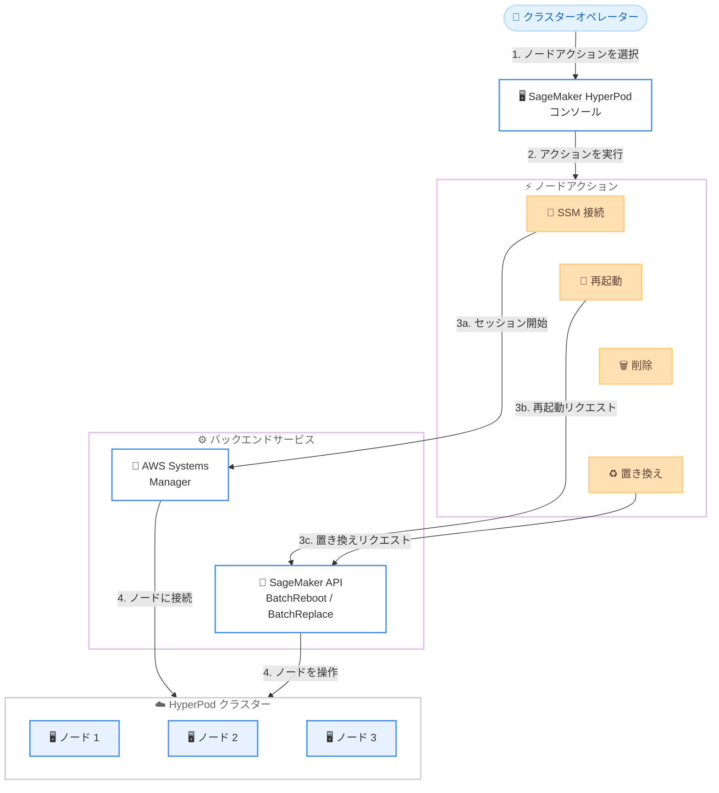

# Amazon SageMaker HyperPod - コンソールからのノードアクション管理

**リリース日**: 2026 年 2 月 10 日
**サービス**: Amazon SageMaker HyperPod
**機能**: コンソールからの個別ノードアクション操作

## 概要

Amazon SageMaker HyperPod が、AWS コンソールから個別のクラスターノードを直接管理するノードアクション機能をサポートしました。HyperPod クラスターオペレーターは、大規模な AI/ML ワークロードを管理する際にノードへの接続やトラブルシューティング、応答しないインスタンスの再起動、劣化したノードの置き換えなどの操作が必要になります。今回のアップデートにより、これらの操作をコンソール上の統一されたインターフェースから実行できるようになりました。

SageMaker HyperPod は、大規模言語モデル (LLM)、拡散モデル、基盤モデル (FM) などの最先端モデルの開発に向けた、耐障害性のある AI/ML クラスターをプロビジョニングするためのサービスです。

**アップデート前の課題**

- ノードへの接続には SSM 接続文字列を手動で構築する必要があり、クラスター ID やインスタンスグループ名、インスタンス ID を個別に取得して組み立てる手間があった
- ノードの再起動や置き換えなどのリカバリアクションは CLI コマンドの実行が必要で、コンソールからの操作ができなかった
- 複数ノードに対する一括操作を効率的に実行する手段がなく、ノード障害の解決に時間がかかっていた
- メモリオーバーランや検出困難なハードウェア劣化など、自動リカバリでは対応できないシナリオでの手動介入が煩雑だった

**アップデート後の改善**

- コンソールから SSM 接続用の CLI コマンドが自動生成され、コピー機能付きで提供されるようになった
- コンソール上で直接 SSM セッションを起動し、ノードに接続できるようになった
- 手動でのノードの再起動、削除、置き換えがコンソールから実行可能になった
- バッチ操作により複数ノードへのアクションを同時に実行でき、ノード障害を数分で解決できるようになった

## アーキテクチャ図



コンソールからノードアクションを選択すると、SSM 接続の場合は AWS Systems Manager を通じてノードに接続し、再起動や置き換えの場合は SageMaker API (BatchRebootClusterNodes / BatchReplaceClusterNodes) を通じてノードを操作するアーキテクチャを示しています。

## サービスアップデートの詳細

### 主要機能

1. **SSM 接続の簡素化**
   - コンソールからノードを選択すると、SSM 接続用の CLI コマンドが自動的に生成される
   - `sagemaker-cluster:[cluster-id]_[instance-group-name]-[instance-id]` 形式の接続文字列が自動構築される
   - コピー機能付きで提供されるため、ターミナルに貼り付けるだけで接続可能
   - コンソール上で直接 SSM セッションを起動するオプションも提供

2. **手動ノードリカバリアクション**
   - **再起動**: 一時的なソフトウェア問題、システムハング、メモリリーク、GPU ドライバーの問題などからの回復に使用
   - **削除**: 不要になったノードや回復不能なノードをクラスターから削除
   - **置き換え**: GPU 障害、メモリやネットワークの故障、繰り返しのヘルスチェック失敗など、ハードウェア関連の問題に対応

3. **バッチ操作**
   - 複数ノードに対するアクションを同時に実行可能
   - 大規模なリカバリシナリオを効率的に処理
   - ノード障害を数分で解決可能

## 技術仕様

### ノードアクション一覧

| アクション | 説明 | 使用シナリオ |
|-----------|------|-------------|
| SSM 接続 | ノードへの SSM セッションを開始 | トラブルシューティング、ログ確認 |
| 再起動 | ノードを再起動してリカバリ | システムハング、メモリリーク、GPU ドライバー問題 |
| 削除 | ノードをクラスターから削除 | 回復不能なノードの除去 |
| 置き換え | ノードを新しいインスタンスで置換 | GPU 障害、ネットワーク故障、ハードウェア劣化 |

### SSM 接続文字列の形式

```
sagemaker-cluster:[cluster-id]_[instance-group-name]-[instance-id]
```

例: クラスター ID が `aa11bbbbb222`、インスタンスグループ名が `controller-group`、インスタンス ID が `i-111222333444555aa` の場合は以下の形式になります。

```
sagemaker-cluster:aa11bbbbb222_controller-group-i-111222333444555aa
```

### 対応 API

| API 名 | 説明 |
|--------|------|
| BatchRebootClusterNodes | 指定したノードを一括再起動 |
| BatchReplaceClusterNodes | 指定したノードを一括置き換え |

## 設定方法

### 前提条件

1. Amazon SageMaker HyperPod クラスターが作成済みであること
2. AWS Systems Manager (SSM) がセットアップ済みであること
3. 必要な IAM 権限が付与されていること (SageMaker および SSM へのアクセス権限)

### 手順

#### ステップ 1: HyperPod クラスター管理ページにアクセス

AWS Management Console から Amazon SageMaker を開き、HyperPod のクラスター管理ページにアクセスします。

#### ステップ 2: ノードを選択してアクションを実行

クラスター詳細ページでノード一覧から対象ノードを選択し、利用可能なノードアクションを実行します。

#### ステップ 3: SSM 経由でノードに接続する場合

コンソールから直接 SSM セッションを起動するか、自動生成された CLI コマンドをコピーしてターミナルで実行します。

```bash
# コンソールで自動生成される SSM 接続コマンドの例
aws ssm start-session \
    --target sagemaker-cluster:aa11bbbbb222_controller-group-i-111222333444555aa \
    --region us-west-2
```

このコマンドは、指定された HyperPod クラスターノードに SSM セッションを開始します。コンソールでは、クラスター ID、インスタンスグループ名、インスタンス ID が自動的に埋め込まれた状態で提供されます。

#### ステップ 4: ノードの再起動または置き換えを実行する場合

コンソールからノードを選択し、再起動または置き換えアクションを選択します。CLI で実行する場合は以下のコマンドを使用します。

```bash
# ノードを一括再起動
aws sagemaker batch-reboot-cluster-nodes \
    --cluster-name arn:aws:sagemaker:us-west-2:123456789:cluster/my-cluster \
    --node-ids i-0123456789abcdef0 i-0fedcba9876543210

# ノードを一括置き換え
aws sagemaker batch-replace-cluster-nodes \
    --cluster-name arn:aws:sagemaker:us-west-2:123456789:cluster/my-cluster \
    --node-ids i-0123456789abcdef0 i-0fedcba9876543210
```

`batch-reboot-cluster-nodes` はノードの再起動、`batch-replace-cluster-nodes` はノードの置き換えを実行します。いずれも複数のノード ID を指定してバッチ操作が可能です。

## メリット

### ビジネス面

- **ダウンタイムの最小化**: コンソールからの迅速なノード操作により、AI トレーニングや推論ワークロードの中断時間を削減
- **運用効率の向上**: SSM 接続文字列の手動構築や CLI コマンドの作成が不要になり、オペレーターの作業時間を短縮
- **大規模運用の簡素化**: バッチ操作により複数ノードの問題を同時に解決でき、大規模クラスターの管理が容易に

### 技術面

- **統一されたインターフェース**: SSM 接続、再起動、削除、置き換えのすべてのノードアクションを単一のコンソールから実行可能
- **自動生成される接続情報**: SSM 接続文字列が自動構築されるため、手動でのクラスター ID やインスタンス ID の取得が不要
- **Slurm と EKS の両方に対応**: オーケストレーターに依存しない一貫したノード管理体験を提供

## デメリット・制約事項

### 制限事項

- 自動リカバリ (auto-resume) で対応可能な障害は引き続き自動で処理されるため、手動操作はメモリオーバーランや検出困難なハードウェア劣化など特定のシナリオに限定される
- ノードの置き換えには、Availability Zone 内でのインスタンスの空き状況やライフサイクルスクリプトの実行時間に依存するため、処理時間が変動する

### 考慮すべき点

- ノードの置き換え中は、該当ノードの状態を手動で変更したり Slurm コントローラーを再起動したりしないこと (置き換え失敗の原因となる)
- SSM セッションで最初に接続するとルートユーザーとなるため、ジョブの実行前に適切なユーザー (ubuntu など) に切り替えること
- 最小権限の原則に従い、クラスターノードへのアクセス権限を適切に管理すること

## ユースケース

### ユースケース 1: GPU 障害ノードの迅速な置き換え

**シナリオ**: 大規模な LLM トレーニング中に一部のノードで GPU 障害が発生し、自動リカバリでは検出されないハードウェア劣化が原因でトレーニングジョブが遅延している。

**実装例**:
1. HyperPod コンソールのクラスター管理ページでノード一覧を確認
2. 障害が発生しているノードを選択
3. 「置き換え」アクションを実行して、新しいインスタンスでノードを置換
4. バッチ操作で複数の障害ノードを同時に置き換え

**効果**: 時間に敏感な AI トレーニングワークロードのダウンタイムを最小限に抑え、トレーニングジョブを迅速に再開できる。

### ユースケース 2: ノードのトラブルシューティング

**シナリオ**: クラスター内のノードで予期しないエラーが発生し、原因を調査するためにノードに直接接続してログを確認する必要がある。

**実装例**:
1. HyperPod コンソールで対象ノードを選択
2. SSM 接続アクションを選択
3. コンソール上で直接 SSM セッションを起動、または自動生成された CLI コマンドをコピーしてターミナルで実行
4. ノードに接続してログやシステム状態を調査

**効果**: SSM 接続文字列を手動で構築する必要がなくなり、トラブルシューティングの開始までの時間を大幅に短縮できる。

### ユースケース 3: 一時的な問題からのノード一括リカバリ

**シナリオ**: 推論ワークロード実行中に複数のノードでメモリオーバーランが発生し、ノードが応答しなくなった。

**実装例**:
1. HyperPod コンソールで応答していない複数のノードを選択
2. バッチ操作で「再起動」アクションを一括実行
3. ノードが再起動され、正常な状態に回復したことを確認

**効果**: 複数ノードの再起動を同時に実行できるため、大規模クラスターでの一時的な障害からの回復を数分で完了できる。

## 料金

この機能は SageMaker HyperPod コンソールに組み込まれており、ノードアクション機能自体に追加料金は発生しません。通常の SageMaker HyperPod の料金体系が適用されます。

### 料金例

SageMaker HyperPod の料金は使用するインスタンスタイプとストレージに基づいて計算されます。詳細は [Amazon SageMaker 料金ページ](https://aws.amazon.com/sagemaker/pricing/) を参照してください。

## 利用可能リージョン

Amazon SageMaker HyperPod がサポートされているすべての AWS リージョンで利用可能です。詳細なリージョンリストは [AWS リージョンとサービス](https://aws.amazon.com/about-aws/global-infrastructure/regional-product-services/) を参照してください。

## 関連サービス・機能

- **AWS Systems Manager (SSM)**: HyperPod クラスターノードへのセキュアなリモートアクセスを提供するサービス
- **Amazon SageMaker HyperPod サービスクォータ検証**: クラスター作成前のクォータ自動検証機能
- **Amazon SageMaker HyperPod ライフサイクルスクリプトデバッグ**: ライフサイクルスクリプトのトラブルシューティング機能強化

## 参考リンク

- [公式発表 (What's New)](https://aws.amazon.com/about-aws/whats-new/2026/02/amazon-sagemaker-hyperpod-node-actions/)
- [ドキュメント: ノードの置き換え・再起動](https://docs.aws.amazon.com/sagemaker/latest/dg/sagemaker-hyperpod-resiliency-slurm-replace-faulty-instance.html)
- [ドキュメント: クラスターノードへのアクセス](https://docs.aws.amazon.com/sagemaker/latest/dg/sagemaker-hyperpod-run-jobs-slurm-access-nodes.html)
- [Amazon SageMaker 料金ページ](https://aws.amazon.com/sagemaker/pricing/)

## まとめ

Amazon SageMaker HyperPod のコンソールからのノードアクション機能により、SSM 接続、再起動、削除、置き換えといったノード操作を統一されたインターフェースから直接実行できるようになりました。SSM 接続文字列の手動構築や CLI コマンドの作成が不要になり、バッチ操作による複数ノードの同時処理も可能です。時間に敏感な AI トレーニングや推論ワークロードにおいてダウンタイムを最小化し、クラスターオペレーターの運用効率を大幅に向上させるアップデートです。大規模な HyperPod クラスターを運用している組織は、この機能を活用してノード管理を効率化することを推奨します。
