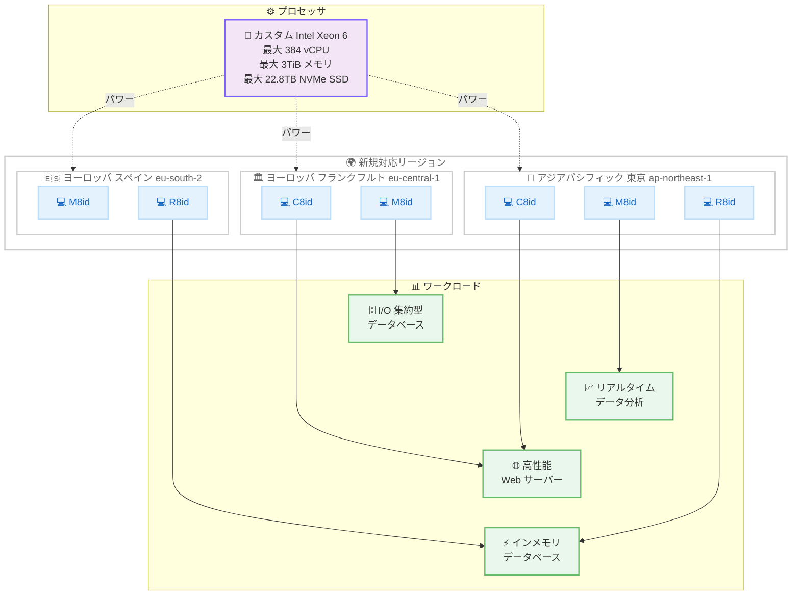

# Amazon EC2 - C8id, M8id, R8id インスタンスが東京リージョンを含む追加リージョンで利用可能に

**リリース日**: 2026 年 2 月 10 日
**サービス**: Amazon EC2
**機能**: C8id, M8id, R8id インスタンスのリージョン拡大

📊 [このアップデートのインフォグラフィックを見る](https://takech9203.github.io/awsnews-summary/20260210-c8id-m8id-and-r8id-in-additional-regions.html)

## 概要

AWS は 2026 年 2 月 10 日、カスタム Intel Xeon 6 プロセッサを搭載した Amazon EC2 C8id、M8id、R8id インスタンスが、ヨーロッパ (フランクフルト)、アジアパシフィック (東京)、ヨーロッパ (スペイン) リージョンで新たに利用可能になったことを発表しました。これらのインスタンスは、前世代の C6id、M6id、R6id インスタンスと比較して最大 43% の性能向上と 3.3 倍のメモリ帯域幅を実現し、最大 384 vCPU、3TiB のメモリ、22.8TB の NVMe SSD ストレージを提供します。

今回のアップデートにより、C8id および M8id インスタンスはヨーロッパ (フランクフルト) およびアジアパシフィック (東京) リージョンで利用可能になりました。M8id インスタンスはさらにヨーロッパ (スペイン) リージョンでも利用可能です。R8id インスタンスはヨーロッパ (スペイン) およびアジアパシフィック (東京) リージョンで新たに利用可能になりました。東京リージョンの追加により、日本のお客様もこれらの高性能インスタンスを低レイテンシーで活用できるようになりました。

**アップデート前の課題**

- C8id および M8id インスタンスは米国リージョンのみで利用可能で、東京やフランクフルトのユーザーは最新世代のインスタンスを利用できなかった
- R8id インスタンスはフランクフルトリージョンで利用可能だったが、東京やスペインリージョンでは利用できなかった
- 東京リージョンの日本のユーザーは、I/O 集約型ワークロードでカスタム Intel Xeon 6 プロセッサの性能を活用するためにリージョン間通信が必要だった

**アップデート後の改善**

- C8id、M8id、R8id インスタンスが東京リージョンで利用可能になり、日本国内のワークロードを低レイテンシーで実行可能に
- フランクフルトリージョンで C8id と M8id が追加され、ヨーロッパのデータローカリティ要件に対応可能に
- スペインリージョンで M8id と R8id が追加され、南ヨーロッパでの選択肢が拡大
- 前世代比最大 43% の性能向上と 3.3 倍のメモリ帯域幅をより多くのリージョンで活用可能に

## アーキテクチャ図



このアーキテクチャ図は、今回のリージョン拡大で新たに C8id、M8id、R8id インスタンスが利用可能になった 3 つのリージョンと、カスタム Intel Xeon 6 プロセッサによって駆動される各インスタンスファミリーが対応するワークロードの関係を示しています。

## サービスアップデートの詳細

### 主要機能

1. **リージョン拡大の詳細**
   - C8id および M8id: ヨーロッパ (フランクフルト)、アジアパシフィック (東京) リージョンに追加
   - M8id: ヨーロッパ (スペイン) リージョンにも追加
   - R8id: ヨーロッパ (スペイン)、アジアパシフィック (東京) リージョンに追加

2. **高性能プロセッサ**
   - カスタム Intel Xeon 6 プロセッサ搭載
   - 前世代の C6id/M6id/R6id と比較して最大 43% の性能向上
   - 3.3 倍のメモリ帯域幅

3. **大容量ローカルストレージ**
   - 最大 22.8TB の NVMe SSD ストレージ
   - 前世代の 3 倍の容量
   - I/O 集約型ワークロードに最適化

4. **Instance Bandwidth Configuration**
   - ネットワークと EBS 帯域幅の 25% 柔軟な配分
   - ワークロード特性に応じた最適なリソース割り当てが可能

5. **ワークロード別の性能向上**
   - I/O 集約型データベースワークロードで最大 46% の性能向上
   - リアルタイムデータ分析で最大 30% 高速なクエリ結果

## 技術仕様

### インスタンスファミリー比較

| ファミリー | 用途 | 最大 vCPU | 最大メモリ | 最大 NVMe ストレージ |
|-----------|------|----------|-----------|---------------------|
| C8id | コンピュート最適化 | 384 | 768 GiB | 22.8 TB |
| M8id | 汎用 | 384 | 1.5 TiB | 22.8 TB |
| R8id | メモリ最適化 | 384 | 3 TiB | 22.8 TB |

### 性能向上の詳細

| メトリクス | 前世代比 (C6id/M6id/R6id) |
|-----------|--------------------------|
| 全般的な性能 | 最大 43% 向上 |
| メモリ帯域幅 | 3.3 倍 |
| I/O 集約型データベース | 最大 46% 向上 |
| リアルタイムデータ分析クエリ | 最大 30% 高速化 |
| NVMe ストレージ容量 | 3 倍 |
| 帯域幅の柔軟な配分 | 25% (Instance Bandwidth Configuration) |

### 推奨ワークロード

| インスタンス | 推奨ワークロード |
|-------------|-----------------|
| C8id | 高性能 Web サーバー、バッチ処理、分散分析、広告配信、動画エンコード、ゲームサーバー |
| M8id | アプリケーションサーバー、マイクロサービス、エンタープライズアプリ、中小規模データベース |
| R8id | インメモリデータベース、リアルタイムビッグデータ分析、大規模インメモリキャッシュ、科学計算 |

### API 変更履歴

| 日付 | サービス | 変更内容 |
|------|----------|----------|
| 2026/02/11 | [Amazon Elastic Compute Cloud](https://awsapichanges.com/archive/changes/b18289-ec2.html) | 25 updated methods - 新リージョンでの C8id/M8id/R8id インスタンスサポートに関連する EC2 API の 25 のメソッドが更新されました |

## 設定方法

### 前提条件

1. AWS アカウントと EC2 起動権限
2. 対象リージョン (東京、フランクフルト、スペイン) へのアクセス
3. 適切なサービスクォータの確認

### 手順

#### ステップ 1: 利用可能なインスタンスタイプの確認

```bash
# 東京リージョンで利用可能な C8id インスタンスタイプを確認
aws ec2 describe-instance-types \
  --filters "Name=instance-type,Values=c8id*" \
  --region ap-northeast-1 \
  --query "InstanceTypes[].{Type:InstanceType,vCPU:VCpuInfo.DefaultVCpus,Memory:MemoryInfo.SizeInMiB}" \
  --output table
```

このコマンドは、東京リージョンで利用可能な C8id インスタンスタイプとそのスペックを表示します。

#### ステップ 2: インスタンスの起動

```bash
# 東京リージョンで M8id インスタンスを起動
aws ec2 run-instances \
  --instance-type m8id.24xlarge \
  --image-id ami-xxxxxxxxxxxxxxxxx \
  --subnet-id subnet-xxxxxxxxxxxxxxxxx \
  --security-group-ids sg-xxxxxxxxxxxxxxxxx \
  --key-name my-key-pair \
  --region ap-northeast-1
```

このコマンドは、東京リージョン (ap-northeast-1) で M8id インスタンスを起動します。

#### ステップ 3: Instance Bandwidth Configuration の確認

```bash
# インスタンスタイプが帯域幅の重み付け調整をサポートしているか確認
aws ec2 describe-instance-types \
  --instance-types m8id.24xlarge \
  --query 'InstanceTypes[0].NetworkInfo.BandwidthWeightingSupport' \
  --region ap-northeast-1
```

インスタンスタイプが Instance Bandwidth Configuration をサポートしているか確認します。

#### ステップ 4: 購入オプションの選択

C8id、M8id、R8id インスタンスは、以下の購入オプションで利用できます。

- **Savings Plans**: 1 年または 3 年のコミットメントで割引
- **オンデマンドインスタンス**: 使用した分だけ支払い
- **スポットインスタンス**: 未使用の EC2 容量を大幅な割引で利用

## メリット

### ビジネス面

- **東京リージョンでの低レイテンシー**: 日本国内のユーザーやアプリケーションが最新世代のインスタンスを低レイテンシーで利用でき、ユーザー体験が向上
- **データローカリティとコンプライアンス対応**: フランクフルト、スペイン、東京の各リージョンでデータ所在地要件を満たしながら高性能コンピューティングを実現
- **コスト効率の向上**: 前世代比最大 43% の性能向上により、少ないインスタンス数で同等以上のパフォーマンスを実現可能
- **柔軟な購入オプション**: Savings Plans、オンデマンド、スポットインスタンスに対応

### 技術面

- **高い I/O 性能**: 最大 22.8TB の NVMe SSD ストレージによる低レイテンシーストレージアクセス
- **大幅なメモリ帯域幅向上**: 前世代比 3.3 倍のメモリ帯域幅により、インメモリ処理の高速化を実現
- **帯域幅の柔軟な配分**: Instance Bandwidth Configuration により、ネットワークと EBS 帯域幅を 25% の範囲で柔軟に調整可能
- **ワークロード最適化**: I/O 集約型データベースで最大 46%、リアルタイムデータ分析で最大 30% の性能向上

## デメリット・制約事項

### 制限事項

- インスタンスファミリーによって利用可能なリージョンが異なる (C8id はスペインリージョンでは未提供)
- 前世代インスタンスからの移行には AMI 互換性の確認が必要
- 一部の古い OS バージョンではドライバ更新が必要な場合がある

### 考慮すべき点

- 大容量 NVMe SSD はインスタンスストレージ (エフェメラルストレージ) のため、永続的なデータ保存には Amazon EBS との併用が必要
- 大規模インスタンスは起動時間が長くなる可能性がある
- 適切なインスタンスファミリーの選択には、ワークロードの特性 (コンピュート集約型、汎用、メモリ集約型) を考慮する必要がある
- スポットインスタンスの中断リスクを考慮した設計が必要

## ユースケース

### ユースケース 1: 東京リージョンでの高性能データベース

**シナリオ**: 日本国内の金融機関が、大規模な OLTP データベースを低レイテンシーで運用し、I/O 集約型のトランザクション処理を高速化したい。

**実装例**:
```bash
# 東京リージョンで R8id インスタンスを起動
aws ec2 run-instances \
  --instance-type r8id.24xlarge \
  --image-id ami-xxxxxxxxxxxxxxxxx \
  --subnet-id subnet-xxxxxxxxxxxxxxxxx \
  --security-group-ids sg-xxxxxxxxxxxxxxxxx \
  --key-name my-key-pair \
  --region ap-northeast-1
```

**効果**: R8id の大容量メモリ (最大 3TiB) と高速 NVMe SSD ストレージにより、I/O 集約型データベースワークロードで最大 46% の性能向上を実現。東京リージョンでの運用により、国内ユーザーへのレイテンシーを最小化。

### ユースケース 2: フランクフルトリージョンでのリアルタイム分析

**シナリオ**: ヨーロッパの E コマース企業が、リアルタイムでユーザー行動データを分析し、パーソナライズされた推奨を提供したい。

**実装例**:
```bash
# フランクフルトリージョンで M8id インスタンスを起動
aws ec2 run-instances \
  --instance-type m8id.16xlarge \
  --image-id ami-xxxxxxxxxxxxxxxxx \
  --subnet-id subnet-xxxxxxxxxxxxxxxxx \
  --security-group-ids sg-xxxxxxxxxxxxxxxxx \
  --key-name my-key-pair \
  --region eu-central-1
```

**効果**: M8id の汎用的なバランスと最大 30% 高速なクエリ結果により、リアルタイムデータ分析のレスポンスタイムを大幅に短縮。GDPR 準拠のためのデータローカリティ要件にも対応。

### ユースケース 3: 東京リージョンでのゲームサーバー

**シナリオ**: オンラインゲーム運営企業が、日本国内のプレイヤー向けに高性能なゲームサーバーを低レイテンシーで提供したい。

**実装例**:
```bash
# 東京リージョンで C8id インスタンスを起動
aws ec2 run-instances \
  --instance-type c8id.8xlarge \
  --image-id ami-xxxxxxxxxxxxxxxxx \
  --subnet-id subnet-xxxxxxxxxxxxxxxxx \
  --security-group-ids sg-xxxxxxxxxxxxxxxxx \
  --key-name my-key-pair \
  --region ap-northeast-1
```

**効果**: C8id のコンピュート最適化性能と NVMe SSD による高速 I/O により、ゲーム内のレスポンスタイムが短縮。Instance Bandwidth Configuration でネットワーク帯域幅を優先的に割り当てることで、多数の同時接続プレイヤーに対応。

## 料金

C8id、M8id、R8id インスタンスの料金は、インスタンスタイプ、リージョン、購入オプションによって異なります。

### 購入オプション

| オプション | 特徴 |
|-----------|------|
| Savings Plans | 1 年または 3 年のコミットメントで最大 72% 割引 |
| オンデマンド | コミットメントなし、時間単位の課金 |
| スポットインスタンス | 最大 90% 割引、中断の可能性あり |

詳細な料金については、[Amazon EC2 料金ページ](https://aws.amazon.com/ec2/pricing/) をご確認ください。

## 利用可能リージョン

今回のアップデートにより、各インスタンスファミリーの利用可能リージョンは以下の通りです。

### C8id インスタンス

| リージョン | ステータス |
|-----------|----------|
| 米国東部 (バージニア北部) - us-east-1 | 既存 |
| 米国東部 (オハイオ) - us-east-2 | 既存 |
| 米国西部 (オレゴン) - us-west-2 | 既存 |
| ヨーロッパ (フランクフルト) - eu-central-1 | **新規** |
| アジアパシフィック (東京) - ap-northeast-1 | **新規** |

### M8id インスタンス

| リージョン | ステータス |
|-----------|----------|
| 米国東部 (バージニア北部) - us-east-1 | 既存 |
| 米国東部 (オハイオ) - us-east-2 | 既存 |
| 米国西部 (オレゴン) - us-west-2 | 既存 |
| ヨーロッパ (フランクフルト) - eu-central-1 | **新規** |
| ヨーロッパ (スペイン) - eu-south-2 | **新規** |
| アジアパシフィック (東京) - ap-northeast-1 | **新規** |

### R8id インスタンス

| リージョン | ステータス |
|-----------|----------|
| 米国東部 (バージニア北部) - us-east-1 | 既存 |
| 米国東部 (オハイオ) - us-east-2 | 既存 |
| 米国西部 (オレゴン) - us-west-2 | 既存 |
| ヨーロッパ (フランクフルト) - eu-central-1 | 既存 |
| ヨーロッパ (スペイン) - eu-south-2 | **新規** |
| アジアパシフィック (東京) - ap-northeast-1 | **新規** |

## 関連サービス・機能

- **Amazon EBS**: 高性能永続ストレージとの組み合わせ。Instance Bandwidth Configuration で EBS 帯域幅を最適に配分可能
- **AWS Nitro System**: C8id/M8id/R8id インスタンスの基盤となるハイパーバイザーテクノロジー
- **Amazon EC2 Auto Scaling**: 需要に応じた自動スケーリングで、C8id/M8id/R8id インスタンスを効率的に管理
- **AWS Compute Optimizer**: ワークロードに最適なインスタンスタイプの推奨
- **Amazon CloudWatch**: インスタンスのパフォーマンスメトリクスの監視

## 参考リンク

- 📊 [インフォグラフィック](https://takech9203.github.io/awsnews-summary/20260210-c8id-m8id-and-r8id-in-additional-regions.html)
- [公式発表 (What's New)](https://aws.amazon.com/about-aws/whats-new/2026/02/c8id-m8id-and-r8id-in-additional-regions/)
- [Amazon EC2 インスタンスタイプ](https://aws.amazon.com/ec2/instance-types/)
- [Amazon EC2 料金ページ](https://aws.amazon.com/ec2/pricing/)
- [Amazon EC2 ドキュメント](https://docs.aws.amazon.com/ec2/)

## まとめ

Amazon EC2 C8id、M8id、R8id インスタンスが東京リージョンを含む追加リージョンで利用可能になったことにより、日本およびヨーロッパのお客様もカスタム Intel Xeon 6 プロセッサによる最大 43% の性能向上と 3.3 倍のメモリ帯域幅を活用できるようになりました。I/O 集約型データベースワークロードで最大 46% の性能向上、リアルタイムデータ分析で最大 30% のクエリ高速化が実現されます。東京リージョンでは C8id、M8id、R8id の 3 ファミリーすべてが利用可能なため、コンピュート最適化、汎用、メモリ最適化のそれぞれのニーズに応じて最適なインスタンスを選択できます。Instance Bandwidth Configuration による帯域幅の柔軟な配分機能も含め、ワークロードの特性に合わせたインスタンスへの移行を検討してください。
