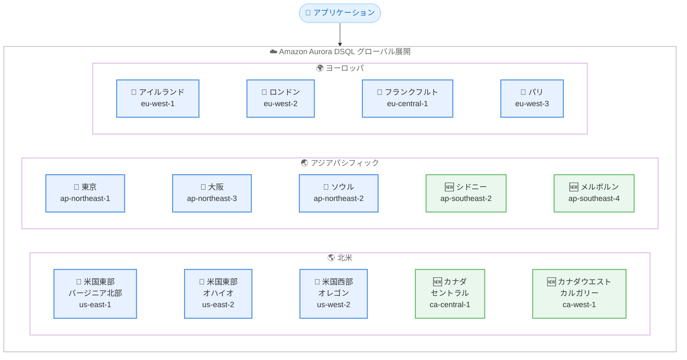

# Amazon Aurora DSQL - 追加 AWS リージョンで利用可能に

**リリース日**: 2026 年 2 月 11 日
**サービス**: Amazon Aurora DSQL
**機能**: シングルリージョンクラスターの追加リージョン展開

[このアップデートのインフォグラフィックを見る](https://takech9203.github.io/awsnews-summary/20260211-amazon-aurora-dsql-additional-aws-regions.html)

## 概要

Amazon Aurora DSQL がシングルリージョンクラスターとして、アジアパシフィック (メルボルン)、アジアパシフィック (シドニー)、カナダ (セントラル)、カナダウエスト (カルガリー) の 4 つの新しい AWS リージョンで利用可能になりました。Aurora DSQL は、常時可用なアプリケーションを構築するための最速のサーバーレス分散 SQL データベースであり、事実上無制限のスケーラビリティ、最高レベルの可用性、ゼロインフラストラクチャ管理を提供します。

今回の拡張により、Aurora DSQL は合計 14 の AWS リージョンで利用可能になりました。これにより、オーストラリアおよびカナダのお客様は、より低レイテンシーで Aurora DSQL を利用でき、データレジデンシー要件への対応も容易になります。

**アップデート前の課題**

- オーストラリアおよびカナダのお客様は、地理的に離れたリージョンの Aurora DSQL クラスターに接続する必要があり、レイテンシーが高かった
- オーストラリアやカナダのデータレジデンシー要件を満たすためのリージョン選択肢が限られていた
- Aurora DSQL を利用可能なリージョンは 10 リージョンに限定されていた

**アップデート後の改善**

- アジアパシフィック (メルボルン、シドニー) およびカナダ (セントラル、カルガリー) で Aurora DSQL のシングルリージョンクラスターが利用可能に
- 合計 14 リージョンに拡大し、グローバルなカバレッジが向上
- オーストラリアおよびカナダのお客様がより低レイテンシーでアクセス可能に

## アーキテクチャ図



このアーキテクチャ図は、Aurora DSQL が利用可能な 14 リージョンの全体像を示しています。緑色のノードが今回新たに追加された 4 リージョンです。

## サービスアップデートの詳細

### 主要機能

1. **4 つの新リージョンでのシングルリージョンクラスター**
   - アジアパシフィック (メルボルン) - ap-southeast-4
   - アジアパシフィック (シドニー) - ap-southeast-2
   - カナダ (セントラル) - ca-central-1
   - カナダウエスト (カルガリー) - ca-west-1

2. **サーバーレス分散 SQL データベース**
   - 最速の分散 SQL 読み取りおよび書き込みを提供
   - 事実上無制限のスケーラビリティ
   - ゼロインフラストラクチャ管理

3. **高可用性アーキテクチャ**
   - シングルリージョンで 99.99% の可用性を設計目標
   - マルチリージョンで 99.999% の可用性を設計目標
   - アクティブ-アクティブ分散アーキテクチャ

## 技術仕様

### Aurora DSQL の主要特性

| 項目 | 詳細 |
|------|------|
| データベースタイプ | サーバーレス分散 SQL |
| PostgreSQL 互換性 | PostgreSQL 16 互換 |
| スケーラビリティ | 読み取り、書き込み、ストレージ、コンピュートが独立してスケール |
| 可用性 SLA | シングルリージョン 99.99%、マルチリージョン 99.999% |
| トランザクション | ACID トランザクション、強整合性、スナップショット分離 |
| 同時実行制御 | 楽観的同時実行制御 (OCC) |
| インフラ管理 | ゼロ (完全マネージド) |
| 料金体系 | 従量課金制 |

### 新規リージョンのエンドポイント

| リージョン名 | リージョンコード | エンドポイント | FIPS エンドポイント |
|-------------|----------------|---------------|-------------------|
| アジアパシフィック (メルボルン) | ap-southeast-4 | dsql.ap-southeast-4.api.aws | - |
| アジアパシフィック (シドニー) | ap-southeast-2 | dsql.ap-southeast-2.api.aws | - |
| カナダ (セントラル) | ca-central-1 | dsql.ca-central-1.api.aws | dsql-fips.ca-central-1.api.aws |
| カナダウエスト (カルガリー) | ca-west-1 | dsql.ca-west-1.api.aws | dsql-fips.ca-west-1.api.aws |

### マルチリージョンクラスターのリージョンセット

マルチリージョンクラスターは、同一のリージョンセット内で作成する必要があります。大陸をまたいだマルチリージョンクラスターはサポートされていません。

| リージョンセット | 含まれるリージョン |
|----------------|------------------|
| 米国 | 米国東部 (バージニア北部)、米国東部 (オハイオ)、米国西部 (オレゴン) |
| アジアパシフィック | アジアパシフィック (大阪)、アジアパシフィック (ソウル)、アジアパシフィック (東京) |
| ヨーロッパ | ヨーロッパ (フランクフルト)、ヨーロッパ (アイルランド)、ヨーロッパ (ロンドン)、ヨーロッパ (パリ) |

## 設定方法

### 前提条件

1. AWS アカウント
2. Aurora DSQL へのアクセス権限
3. 対象リージョンへのアクセス

### 手順

#### ステップ 1: AWS コンソールからクラスターを作成

AWS Management Console にログインし、Aurora DSQL サービスに移動します。対象リージョン (例: ap-southeast-2) を選択し、「Create cluster」をクリックします。

#### ステップ 2: AWS CLI でクラスターを作成

```bash
# シドニーリージョンでシングルリージョンクラスターを作成
aws dsql create-cluster \
  --region ap-southeast-2 \
  --deletion-protection-enabled
```

このコマンドは、シドニーリージョンに Aurora DSQL シングルリージョンクラスターを作成します。

#### ステップ 3: クラスターへの接続

```bash
# クラスターエンドポイントの取得
aws dsql get-cluster \
  --region ap-southeast-2 \
  --identifier <cluster-id> \
  --query 'endpoint'

# psql で接続
psql "host=<cluster-endpoint> dbname=postgres user=admin sslmode=require"
```

クラスター作成後、PostgreSQL 互換クライアント (psql など) でエンドポイントに接続できます。

## メリット

### ビジネス面

- **グローバルカバレッジの拡大**: 14 リージョンに拡大し、オーストラリアおよびカナダのお客様により近い場所でサービスを提供可能
- **データレジデンシー対応**: オーストラリアおよびカナダのデータ保存要件に対応しやすくなった
- **低レイテンシーアクセス**: 地理的に近いリージョンを選択することで、エンドユーザー体験が向上
- **AWS Free Tier 対応**: 新規リージョンでも AWS Free Tier を利用して無料で開始可能

### 技術面

- **FIPS エンドポイント**: カナダ (セントラル) およびカナダウエスト (カルガリー) で FIPS 140-3 準拠エンドポイントを提供
- **PostgreSQL 16 互換**: 既存の PostgreSQL ドライバー、ORM、フレームワークをそのまま使用可能
- **サーバーレスアーキテクチャ**: プロビジョニング、パッチ適用、インフラアップグレードが不要
- **自動スケーリング**: ワークロードに応じてコンピュート、I/O、ストレージが自動的にスケール

## デメリット・制約事項

### 制限事項

- 新規追加リージョン (メルボルン、シドニー) はマルチリージョンクラスターのリージョンセットに含まれていない
- 大陸をまたいだマルチリージョンクラスターはサポートされていない
- PostgreSQL 互換のみ (MySQL 非対応)

### 考慮すべき点

- 分散 SQL データベースの特性として、楽観的同時実行制御 (OCC) の動作を理解した設計が必要
- マルチリージョンクラスターを利用する場合は、同一リージョンセット内のリージョンを選択する必要がある
- 新規リージョンでのサービスクォータや制限値は、既存リージョンと異なる場合がある

## ユースケース

### ユースケース 1: オーストラリア向けサーバーレスアプリケーション

**シナリオ**: オーストラリアのお客様向けに E コマースアプリケーションを提供しており、低レイテンシーのデータベースアクセスとデータレジデンシー要件への対応が必要

**実装例**:
```bash
# シドニーリージョンでクラスターを作成
aws dsql create-cluster \
  --region ap-southeast-2 \
  --deletion-protection-enabled
```

**効果**: シドニーリージョンで Aurora DSQL を利用することで、オーストラリアのエンドユーザーに低レイテンシーのデータベースアクセスを提供し、オーストラリア国内のデータ保存要件を満たすことが可能

### ユースケース 2: カナダの金融サービス

**シナリオ**: カナダの金融機関が FIPS 準拠のデータベースを必要としており、高可用性とスケーラビリティも求められる

**実装例**:
```bash
# カナダ (セントラル) リージョンで FIPS エンドポイントを使用してクラスターを作成
aws dsql create-cluster \
  --region ca-central-1 \
  --deletion-protection-enabled

# FIPS エンドポイント経由で接続
psql "host=<cluster-id>.dsql-fips.ca-central-1.api.aws dbname=postgres user=admin sslmode=require"
```

**効果**: FIPS 140-3 準拠エンドポイントを使用してカナダの規制要件を満たしつつ、サーバーレスで高可用性なデータベースを運用可能

### ユースケース 3: マイクロサービスアーキテクチャのグローバル展開

**シナリオ**: グローバルに展開するマイクロサービスアプリケーションで、各リージョンに独立したデータベースを配置してレイテンシーを最適化したい

**効果**: 14 リージョンから最適なリージョンを選択し、各マイクロサービスに専用の Aurora DSQL クラスターを配置することで、エンドユーザーに最も近いリージョンから低レイテンシーでサービスを提供可能

## 料金

Aurora DSQL は従量課金制で、以下の要素に基づいて課金されます。

| 項目 | 説明 |
|------|------|
| DPU (Distributed Processing Unit) | リクエストベースのアクティビティ |
| ストレージ | データベースサイズ (GB-月) |

AWS Free Tier では、毎月最初の 100,000 DPU と 1 GB-月のストレージが無料で利用できます。新規追加リージョンでも Free Tier が適用されます。

詳細な料金については、[Aurora DSQL 料金ページ](https://aws.amazon.com/rds/aurora/dsql/pricing/) をご確認ください。

## 利用可能リージョン

今回のアップデートにより、Aurora DSQL は以下の 14 リージョンで利用可能になりました。

**新規対応リージョン (2026 年 2 月 11 日)**:
- アジアパシフィック (メルボルン) - ap-southeast-4
- アジアパシフィック (シドニー) - ap-southeast-2
- カナダ (セントラル) - ca-central-1
- カナダウエスト (カルガリー) - ca-west-1

**既存対応リージョン**:
- 米国東部 (バージニア北部) - us-east-1
- 米国東部 (オハイオ) - us-east-2
- 米国西部 (オレゴン) - us-west-2
- アジアパシフィック (大阪) - ap-northeast-3
- アジアパシフィック (東京) - ap-northeast-1
- アジアパシフィック (ソウル) - ap-northeast-2
- ヨーロッパ (アイルランド) - eu-west-1
- ヨーロッパ (ロンドン) - eu-west-2
- ヨーロッパ (フランクフルト) - eu-central-1
- ヨーロッパ (パリ) - eu-west-3

## 関連サービス・機能

- **Amazon Aurora DSQL MCP サーバー**: AI 支援開発ツールとの統合
- **AWS コンソール統合クエリエディタ**: ブラウザベースの SQL 実行環境
- **Amazon Aurora**: リレーショナルデータベースサービス
- **Amazon DynamoDB**: NoSQL データベースサービス (グローバルテーブルによるマルチリージョン対応)

## 参考リンク

- [インフォグラフィック](https://takech9203.github.io/awsnews-summary/20260211-amazon-aurora-dsql-additional-aws-regions.html)
- [公式発表 (What's New)](https://aws.amazon.com/about-aws/whats-new/2026/02/amazon-aurora-dsql-additional-aws-regions/)
- [Aurora DSQL ドキュメント](https://docs.aws.amazon.com/aurora-dsql/latest/userguide/what-is-aurora-dsql.html)
- [Aurora DSQL 製品ページ](https://aws.amazon.com/rds/aurora/dsql/)
- [Aurora DSQL 料金ページ](https://aws.amazon.com/rds/aurora/dsql/pricing/)
- [AWS Free Tier](https://aws.amazon.com/free/)

## まとめ

Amazon Aurora DSQL がアジアパシフィック (メルボルン)、アジアパシフィック (シドニー)、カナダ (セントラル)、カナダウエスト (カルガリー) の 4 つの新リージョンで利用可能になり、合計 14 リージョンに拡大しました。これにより、オーストラリアおよびカナダのお客様は、地理的に近いリージョンで最速のサーバーレス分散 SQL データベースを利用でき、低レイテンシーアクセスとデータレジデンシー要件への対応が容易になります。カナダリージョンでは FIPS 準拠エンドポイントも提供されており、規制要件のある金融サービスなどのワークロードにも対応可能です。AWS Free Tier を活用して、新規リージョンで Aurora DSQL を無料で試すことができます。
