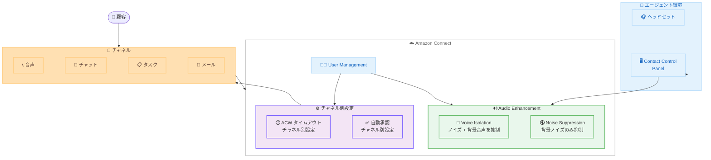

# Amazon Connect - オーディオエンハンスメントとオムニチャネルエージェント設定の強化

**リリース日**: 2026 年 2 月 11 日
**サービス**: Amazon Connect
**機能**: Audio Enhancement、チャネル別 ACW タイムアウト、チャネル別自動承認

📊 [このアップデートのインフォグラフィックを見る](https://takech9203.github.io/aws-news-summary/20260211-amazon-connect-audio-enhancements.html)

## 概要

Amazon Connect は 2026 年 2 月 11 日に 3 つの重要なアップデートを発表しました。騒がしいコンタクトセンター環境での音声品質を向上させるオーディオエンハンスメント機能、チャネル別のアフターコンタクトワーク (ACW) タイムアウト設定、およびタスク・チャット・メールでの自動承認機能です。これらのアップデートにより、エージェントの通話品質改善とオムニチャネル対応の効率化が実現されます。

**アップデート前の課題**

- 騒がしいコンタクトセンター環境では、背景ノイズによりエージェントの音声が顧客に明瞭に伝わらなかった
- ACW タイムアウトはチャネル横断で一律設定であり、チャネルごとの最適化ができなかった
- 自動承認はインバウンド音声通話のみに限定されており、チャット・タスク・メールでは手動承認が必要だった

**アップデート後の改善**

- Voice Isolation と Noise Suppression の 2 つのモードで、エージェント側の背景ノイズを抑制し音声品質を向上
- チャット、タスク、メール、コールバックのチャネルごとに ACW タイムアウトを個別設定可能
- チャット、タスク、メール、コールバックのチャネルごとに自動承認を個別設定可能

## アーキテクチャ図



Audio Enhancement はエージェントの音声をリアルタイムで処理し、チャネル別設定により各チャネルの ACW タイムアウトと自動承認を個別に制御します。

## サービスアップデートの詳細

### 1. Audio Enhancement - 騒がしい環境向けオーディオエンハンスメント

Amazon Connect の Audio Enhancement 機能は、騒がしいコンタクトセンター環境でエージェント側の音声品質と信頼性を向上させます。エージェント側の背景ノイズを抑制し、エージェントの音声を分離することで、顧客がエージェントの声をより明瞭に聞き取れるようになります。

#### 2 つのモード

| モード | 説明 | 推奨ヘッドセット |
|--------|------|-----------------|
| Voice Isolation | 背景ノイズと周囲の音声の両方を抑制し、エージェントの音声を分離 | 有線ヘッドセット必須 |
| Noise Suppression | 背景ノイズのみを抑制 | 有線ヘッドセットでなくても利用可能 |

#### 前提条件

| 項目 | 要件 |
|------|------|
| CPU | 最小 4 コア CPU または仮想マシンの場合は 4 vCPU |
| メモリ | CCP ハードウェア推奨事項に準拠 |
| 電話タイプ | ソフトフォンユーザーのみ |
| インフラストラクチャ | ネイティブ、埋め込み、カスタム、ローカルブラウザアクセス付き VDI をサポート |

#### 管理者による設定

1. Amazon Connect 管理コンソールで **Users** > **User management** を選択
2. **Audio Enhancement** カラムで各エージェントの現在の設定を確認
3. エージェントを選択し **Edit** を選択
4. **Phone type** を **Soft phone** に設定
5. **Audio Enhancement** ドロップダウンでモードを選択。
   - **Isolate Agent's Voice**: Voice Isolation モード
   - **Suppress Background Noise**: Noise Suppression モード
   - **No enhancement**: 無効 (デフォルト)
6. **Save** を選択

設定変更はエージェントの次の通話から有効になります。進行中の通話には影響しません。

#### エージェントによるセルフ設定

管理者がセキュリティプロファイルで **Contact Control Panel (CCP)** > **Audio device settings** 権限を有効化することで、エージェント自身が CCP から Audio Enhancement の設定を変更できるようになります。

#### API による設定

```json
POST /users/InstanceId/UserId/config HTTP/1.1
Content-type: application/json
{
   "VoiceEnhancementConfigs": [
      {
         "Channel": "VOICE",
         "VoiceEnhancementMode": "VOICE_ISOLATION"
      }
   ]
}
```

`VoiceEnhancementMode` の値は `VOICE_ISOLATION`、`NOISE_SUPPRESSION`、`NONE` のいずれかを指定します。

#### カスタム CCP での設定

Amazon Connect Streams API を使用する場合は以下の方法で設定できます。

```javascript
// agent.setVoiceEnhancementMode API を使用
agent.setVoiceEnhancementMode("VOICE_ISOLATION");

// または agent.setConfiguration API を使用
const configuration = agent.getConfiguration();
agent.setConfiguration({
  ...configuration,
  voiceEnhancementMode: "NOISE_SUPPRESSION",
});
```

### 2. チャネル別 ACW タイムアウト設定

Amazon Connect にチャット、タスク、メール、コールバックのチャネルごとにアフターコンタクトワーク (ACW) タイムアウトを設定する機能が追加されました。

#### 主要機能

- チャネル別にエージェントが ACW に費やせる時間を制限
- タイムアウト後、エージェントを自動的に Ready 状態に設定
- チャネルごとに異なるタイムアウト値を設定可能

#### 活用例

- メールの ACW タイムアウトを短く設定し、音声通話の ACW タイムアウトを長く設定することで、通話後のクールダウン期間を確保しつつメール処理の効率を向上
- タスクやチャットの ACW を短縮し、エージェントの稼働率を最適化

### 3. チャネル別自動承認設定

Amazon Connect にチャット、タスク、メール、コールバックのチャネルごとに自動承認 (Auto-Accept) を設定する機能が追加されました。

#### 主要機能

- チャネル別に自動承認の有効/無効を設定可能
- 自動承認が有効なチャネルでは、着信コンタクトが利用可能なエージェントに自動接続
- エージェントが手動で承認/拒否する操作が不要

#### 従来との違い

| 項目 | 従来 | アップデート後 |
|------|------|---------------|
| 対応チャネル | インバウンド音声通話のみ | 音声、チャット、タスク、メール、コールバック |
| 設定粒度 | 一律設定 | チャネルレベルでエージェントごとに設定可能 |

#### 活用例

- タスクの自動承認を有効にしつつ、音声通話では手動承認を維持
- メールの自動承認を有効にし、エージェントの応答時間を短縮

## API 変更履歴

| 日付 | サービス | 変更内容 |
|------|----------|----------|
| 2026/02/10 | [Amazon Connect Service](https://awsapichanges.com/archive/changes/56b6d8-connect.html) | 1 new, 3 updated methods - UpdateUserConfig API でチャネル別自動承認と ACW タイムアウトの設定をサポート |

## 設定方法

### Audio Enhancement の有効化

#### 前提条件

1. Amazon Connect インスタンスが構築済み
2. エージェントのワークステーションが最小 4 コア CPU を搭載
3. エージェントがソフトフォンを使用
4. Voice Isolation を使用する場合は有線ヘッドセットが必要

#### 手順

##### ステップ 1: 管理者による Audio Enhancement の有効化

Amazon Connect 管理コンソールの **Users** > **User management** から対象エージェントを選択し、**Audio Enhancement** ドロップダウンでモードを設定します。

##### ステップ 2: エージェントのセルフ設定を許可

1. **Users** > **Security profiles** からエージェントのセキュリティプロファイルを選択
2. **Contact Control Panel (CCP)** セクションの **Audio device settings** を有効化
3. **Save** を選択

##### ステップ 3: 設定の確認

エージェントが次の通話を開始した際に、Audio Enhancement が適用されていることを確認します。

### チャネル別 ACW タイムアウトと自動承認の設定

管理者は User Management ページから各エージェントのチャネル別設定を行います。API を使用する場合は `UpdateUserConfig` API を通じてプログラム的に設定できます。

## メリット

### ビジネス面

- **通話品質向上**: 騒がしい環境でもエージェントの音声が顧客に明瞭に伝わり、顧客満足度が向上
- **エージェント効率化**: チャネル別 ACW タイムアウトと自動承認により、エージェントの稼働率が最適化
- **柔軟な運用**: チャネルごとに異なる設定を適用でき、業務フローに合わせた最適化が可能

### 技術面

- **リアルタイム音声処理**: Audio Enhancement は通話中にリアルタイムで音声を処理し、背景ノイズを抑制
- **API サポート**: UpdateUserConfig API を通じてプログラム的に設定可能で、自動化やインテグレーションが容易
- **カスタム CCP 対応**: Amazon Connect Streams API や ConnectSDK を通じてカスタム CCP でも Audio Enhancement を制御可能

## デメリット・制約事項

### 制限事項

- Audio Enhancement はソフトフォンユーザーのみ対応で、デスクフォンでは利用不可
- Voice Isolation モードは有線ヘッドセットでのみ使用可能
- VDI 環境では Amazon Connect audio optimization 方式はサポート対象外
- 設定変更は次の通話から有効で、進行中の通話には適用されない

### 考慮すべき点

- Audio Enhancement にはエージェントのワークステーションに最小 4 コア CPU が必要であり、既存環境のハードウェア要件を確認する必要がある
- 管理者とエージェントの両方が設定を変更できる場合、最後に変更された設定が優先される
- ヘッドセットを変更した場合、エージェントが手動で Audio Enhancement モードを更新する必要がある

## ユースケース

### ユースケース 1: オープンフロアのコンタクトセンター

**シナリオ**: 多数のエージェントがオープンフロアで勤務しており、周囲の会話やキーボード音が顧客への通話品質に影響している

**実装例**: 有線ヘッドセットを使用しているエージェントには Voice Isolation モード、ワイヤレスヘッドセットを使用しているエージェントには Noise Suppression モードを設定

**効果**: エージェントの音声が顧客に明瞭に伝わるようになり、「聞こえにくい」という苦情が削減される

### ユースケース 2: オムニチャネルエージェントの効率化

**シナリオ**: エージェントが音声通話、チャット、メール、タスクを同時に処理するオムニチャネル環境

**実装例**:

- 音声通話の ACW タイムアウトを長めに設定 (クールダウン確保)
- メールとタスクの ACW タイムアウトを短めに設定
- チャットとタスクの自動承認を有効化
- 音声通話の自動承認は無効のまま維持

**効果**: チャネルごとに最適化された設定により、エージェントの稼働率が向上し、顧客の待機時間が短縮される

### ユースケース 3: 在宅勤務エージェントの音声品質確保

**シナリオ**: 在宅勤務のエージェントが家庭環境の背景ノイズ (ペット、家族の会話など) に悩んでいる

**実装例**: セキュリティプロファイルで Audio device settings 権限を有効化し、エージェント自身が CCP から状況に応じて Noise Suppression または Voice Isolation を選択できるようにする

**効果**: エージェントが自分の環境に応じて最適なモードを選択でき、在宅勤務でもオフィスと同等の通話品質を実現

## 料金

Audio Enhancement 機能、チャネル別 ACW タイムアウト設定、チャネル別自動承認設定は、Amazon Connect の標準料金に含まれます。追加料金は発生しません。詳細は [Amazon Connect 料金ページ](https://aws.amazon.com/connect/pricing/) を参照してください。

## 利用可能リージョン

これらの機能は、Amazon Connect が提供されているすべての商用 AWS リージョンで利用可能です。

## 関連サービス・機能

- **Amazon Connect Contact Control Panel**: エージェントが顧客対応を行うためのインターフェース
- **Amazon Connect Streams API**: カスタム CCP の構築と Audio Enhancement の制御に使用
- **Amazon Connect Contact Lens**: 通話品質分析とリアルタイムインサイト
- **Amazon Connect User Management**: エージェントの設定と管理

## 参考リンク

- 📊 [インフォグラフィック](https://takech9203.github.io/aws-news-summary/20260211-amazon-connect-audio-enhancements.html)
- [公式発表 - Audio Enhancement (What's New)](https://aws.amazon.com/about-aws/whats-new/2026/02/amazon-connect-audio-enhancements/)
- [公式発表 - ACW タイムアウト (What's New)](https://aws.amazon.com/about-aws/whats-new/2026/02/amazon-connect-omnichannel-acw-timeouts/)
- [公式発表 - 自動承認 (What's New)](https://aws.amazon.com/about-aws/whats-new/2026/02/amazon-connect-omnichannel-auto-accept/)
- [Audio Enhancement 設定ガイド](https://docs.aws.amazon.com/connect/latest/adminguide/audio-enhancement.html)
- [Amazon Connect 管理者ガイド](https://docs.aws.amazon.com/connect/latest/adminguide/what-is-amazon-connect.html)
- [Amazon Connect 料金ページ](https://aws.amazon.com/connect/pricing/)

## まとめ

Amazon Connect の 2026 年 2 月 11 日のアップデートでは、エージェントの業務効率と顧客体験の両方を向上させる 3 つの機能が追加されました。Audio Enhancement は Voice Isolation と Noise Suppression の 2 つのモードを提供し、騒がしいコンタクトセンター環境でもエージェントの音声を顧客に明瞭に届けます。チャネル別 ACW タイムアウトとチャネル別自動承認により、オムニチャネル環境でのエージェント設定がチャネルレベルで最適化できるようになりました。これらの機能は Amazon Connect が提供されているすべての商用リージョンで追加料金なしで利用可能です。特にオープンフロアやリモート環境で通話品質の課題を抱えるコンタクトセンターには、Audio Enhancement の導入を推奨します。
