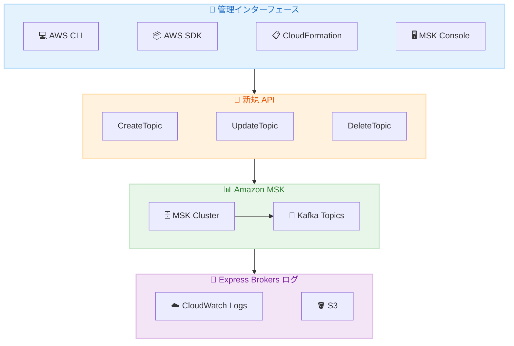

# Amazon MSK - Kafka トピック管理 API と Express Brokers ログサポート

**リリース日**: 2026 年 2 月 11 日
**サービス**: Amazon Managed Streaming for Apache Kafka (MSK)
**機能**: CreateTopic/UpdateTopic/DeleteTopic API、Express Brokers ブローカーログ

📊 [このアップデートのインフォグラフィックを見る](https://takech9203.github.io/aws-news-summary/20260211-amazon-msk-kafka-topics-public-apis.html)

## 概要

Amazon MSK に 2 つの重要なアップデートが発表されました。まず、Kafka トピック管理のための 3 つの新しい API (CreateTopic、UpdateTopic、DeleteTopic) が追加され、Kafka 管理クライアントをセットアップすることなくトピックを管理できるようになりました。次に、Express Brokers でブローカーログがサポートされ、追加コストなしでクライアント接続やブローカー動作のトラブルシューティングが可能になりました。

これらのアップデートにより、MSK クラスターの運用が大幅に簡素化され、AWS CLI、SDK、CloudFormation を使用した一貫したインフラストラクチャ管理が実現します。

**アップデート前の課題**

- Kafka トピックの管理には専用の Kafka 管理クライアントのセットアップが必要だった
- Express Brokers ではブローカーログにアクセスできず、トラブルシューティングが困難だった
- トピック操作を CloudFormation や Terraform で管理することが困難だった

**アップデート後の改善**

- AWS CLI、SDK、CloudFormation で Kafka トピックを直接管理可能
- Express Brokers でブローカーログが追加コストなしで利用可能
- コンソールからトピックの作成・更新・削除をワンクリックで実行可能

## アーキテクチャ図



AWS の標準的な管理インターフェースから新しい API を通じて MSK トピックを管理し、Express Brokers のログを CloudWatch や S3 に配信できます。

## サービスアップデートの詳細

### 主要機能

1. **Kafka トピック管理 API**
   - **CreateTopic**: 新しい Kafka トピックの作成
   - **UpdateTopic**: 既存トピックの設定変更
   - **DeleteTopic**: トピックの削除
   - 既存の ListTopics、DescribeTopic API との統合

2. **Express Brokers ブローカーログ**
   - クライアント接続と可用性問題のトラブルシューティング
   - リバランスやフェイルオーバー時のブローカー動作の把握
   - CloudWatch Logs と S3 への配信サポート

3. **コンソール統合**
   - トピック操作をワンクリックで実行
   - ガイド付きデフォルト値でトピック作成
   - パーティション情報とメトリクスの包括的な可視化

### トピック API で設定可能な項目

| プロパティ | 説明 |
|-----------|------|
| replication-factor | レプリケーションファクター |
| partition-count | パーティション数 |
| retention.ms | メッセージ保持期間 |
| cleanup.policy | クリーンアップポリシー (delete/compact) |
| その他の設定 | Kafka 標準のトピック設定 |

## 技術仕様

### API 変更履歴

| 日付 | サービス | 変更内容 |
|------|----------|----------|
| 2026/02/11 | [Managed Streaming for Kafka](https://awsapichanges.com/archive/changes/56b6d8-kafka.html) | 3 new methods - CreateTopic, UpdateTopic, DeleteTopic |

### 要件

| 項目 | 要件 |
|------|------|
| Kafka バージョン | 3.6 以上 |
| クラスタータイプ | MSK Provisioned クラスター |
| IAM 権限 | kafka:CreateTopic, kafka:UpdateTopic, kafka:DeleteTopic |

### Express Brokers ログ配信先

| 配信先 | 説明 |
|--------|------|
| Amazon CloudWatch Logs | リアルタイムログ分析と監視 |
| Amazon S3 | 長期保存とアーカイブ |

## 設定方法

### 前提条件

1. Kafka 3.6 以上を使用する MSK Provisioned クラスター
2. 適切な IAM 権限
3. Express Brokers (ブローカーログの場合)

### 手順

#### ステップ 1: トピックの作成 (AWS CLI)

```bash
aws kafka create-topic \
  --cluster-arn arn:aws:kafka:ap-northeast-1:123456789012:cluster/my-cluster/abc123 \
  --topic-name my-topic \
  --partitions 6 \
  --replication-factor 3 \
  --topic-config "retention.ms=604800000,cleanup.policy=delete"
```

このコマンドは 6 パーティション、レプリケーションファクター 3 で 7 日間の保持期間を持つトピックを作成します。

#### ステップ 2: トピックの更新

```bash
aws kafka update-topic \
  --cluster-arn arn:aws:kafka:ap-northeast-1:123456789012:cluster/my-cluster/abc123 \
  --topic-name my-topic \
  --partitions 12 \
  --topic-config "retention.ms=1209600000"
```

このコマンドはパーティション数を 12 に増やし、保持期間を 14 日に変更します。

#### ステップ 3: Express Brokers ログの有効化

```bash
aws kafka update-cluster-configuration \
  --cluster-arn arn:aws:kafka:ap-northeast-1:123456789012:cluster/my-express-cluster/xyz789 \
  --current-version K12ABCDEF \
  --configuration-info file://broker-logging-config.json
```

Express Brokers のブローカーログを有効化して CloudWatch Logs に配信します。

#### ステップ 4: CloudFormation でのトピック管理

```yaml
Resources:
  MyKafkaTopic:
    Type: AWS::MSK::Topic
    Properties:
      ClusterArn: !Ref MyMSKCluster
      TopicName: my-cfn-topic
      NumberOfPartitions: 6
      ReplicationFactor: 3
      TopicConfiguration:
        retention.ms: "604800000"
        cleanup.policy: delete
```

CloudFormation テンプレートでトピックをインフラストラクチャコードとして管理できます。

## メリット

### ビジネス面

- **運用コスト削減**: Kafka 管理クライアントの構築・保守が不要
- **一貫した管理**: AWS の他のリソースと同様にトピックを管理
- **迅速なトラブルシューティング**: Express Brokers のログで問題を早期発見

### 技術面

- **Infrastructure as Code**: CloudFormation、Terraform でトピックを宣言的に管理
- **IAM 統合**: 既存の IAM ポリシーでアクセス制御
- **追加コストなし**: 新しい API と Express Brokers ログは追加料金なし

## デメリット・制約事項

### 制限事項

- Kafka 3.6 以上が必要 (古いバージョンは非対応)
- MSK Provisioned クラスターのみ対応 (Serverless は対象外)
- Express Brokers ログは Express Brokers タイプのみ

### 考慮すべき点

- 適切な IAM 権限の設定が必要
- 既存の Kafka 管理ツールとの運用手順の統一

## ユースケース

### ユースケース 1: DevOps チームによる自動化されたトピック管理

**シナリオ**: 開発チームが新しいマイクロサービスごとに Kafka トピックを作成

**実装例**:
```yaml
# CI/CD パイプラインでの使用
- name: Create Kafka Topic
  run: |
    aws kafka create-topic \
      --cluster-arn ${{ secrets.MSK_CLUSTER_ARN }} \
      --topic-name ${{ github.event.inputs.service_name }}-events \
      --partitions 6 \
      --replication-factor 3
```

**効果**: 新サービスのプロビジョニング時に自動的にトピックを作成

### ユースケース 2: Express Brokers クラスターの本番運用

**シナリオ**: 高スループットの本番 Kafka クラスターでのトラブルシューティング

**実装例**:
```bash
# ブローカーログを CloudWatch Logs に配信
# CloudWatch Logs Insights でクエリ
fields @timestamp, @message
| filter @message like /connection/
| sort @timestamp desc
| limit 100
```

**効果**: クライアント接続問題を迅速に特定して解決

### ユースケース 3: マルチ環境でのトピック管理

**シナリオ**: 開発・ステージング・本番環境で一貫したトピック設定を維持

**実装例**:
```yaml
# Terraform での環境別トピック管理
resource "aws_msk_topic" "events" {
  for_each = toset(["dev", "staging", "prod"])

  cluster_arn       = var.msk_cluster_arns[each.key]
  topic_name        = "user-events"
  number_of_partitions = each.key == "prod" ? 24 : 6
  replication_factor   = 3
}
```

**効果**: 環境ごとのトピック設定を Infrastructure as Code で一元管理

## 料金

トピック管理 API と Express Brokers ブローカーログは追加料金なしで利用できます。

| 項目 | 料金 |
|------|------|
| CreateTopic/UpdateTopic/DeleteTopic API | 無料 |
| Express Brokers ブローカーログ | 無料 (ログ配信先の料金のみ) |
| CloudWatch Logs | 標準 CloudWatch Logs 料金 |
| S3 | 標準 S3 料金 |

## 利用可能リージョン

Amazon MSK が提供されているすべての AWS リージョンで利用可能です。

## 関連サービス・機能

- **Amazon CloudWatch**: ログ分析とメトリクス監視
- **AWS CloudFormation**: トピックのインフラストラクチャコード管理
- **Amazon S3**: ログの長期保存
- **MSK Connect**: Kafka コネクターによるデータ統合

## 参考リンク

- 📊 [インフォグラフィック](https://takech9203.github.io/aws-news-summary/20260211-amazon-msk-kafka-topics-public-apis.html)
- [公式発表 - トピック管理 API](https://aws.amazon.com/about-aws/whats-new/2026/02/amazon-msk-kafka-topics-public-apis/)
- [公式発表 - Express Brokers ログ](https://aws.amazon.com/about-aws/whats-new/2026/02/aws-msk-express-brokers-support-broker-logs/)
- [Amazon MSK 開発者ガイド](https://docs.aws.amazon.com/msk/latest/developerguide/what-is-msk.html)
- [Amazon MSK ブローカーログ](https://docs.aws.amazon.com/msk/latest/developerguide/msk-logging.html)

## まとめ

Amazon MSK の新しいトピック管理 API により、Kafka トピックの作成・更新・削除を AWS の標準ツールで直接行えるようになりました。Express Brokers のブローカーログサポートと合わせて、MSK クラスターの運用が大幅に簡素化されます。Kafka 3.6 以上を使用している MSK ユーザーは、これらの新機能を活用して運用効率を向上させてください。
