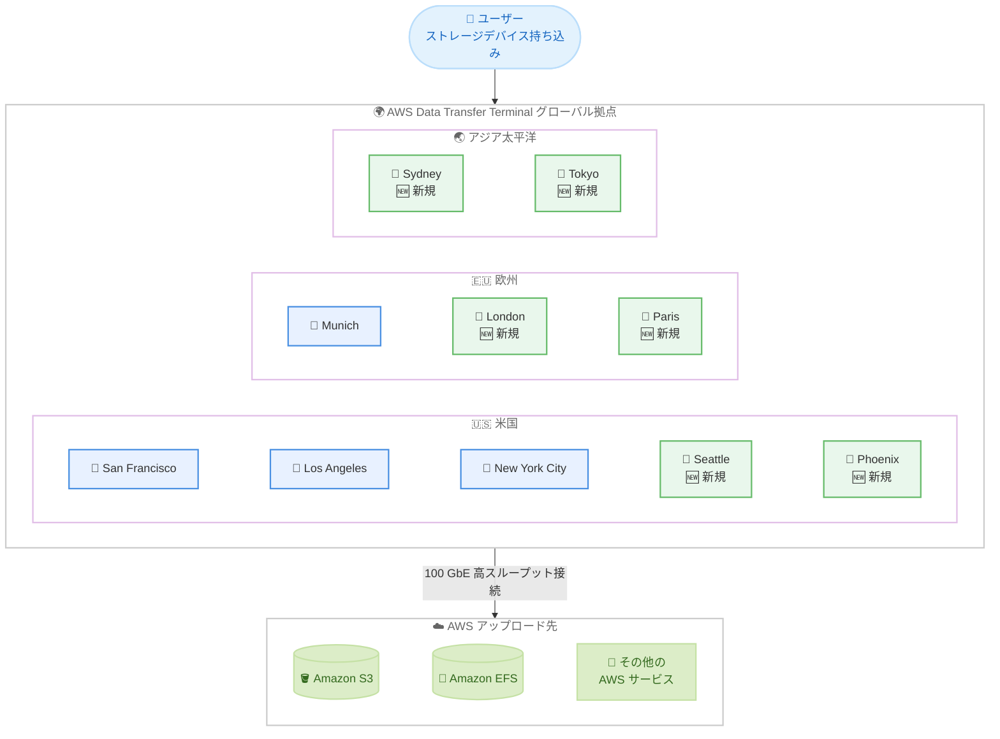

# AWS Data Transfer Terminal - 6 つの新ロケーション追加

**リリース日**: 2026 年 2 月 11 日
**サービス**: AWS Data Transfer Terminal
**機能**: Seattle、Phoenix、London、Paris、Sydney、Tokyo の 6 拠点追加

📊 [このアップデートのインフォグラフィックを見る](https://takech9203.github.io/aws-news-summary/20260211-aws-data-transfer-terminal-6-new-locations.html)

## 概要

AWS Data Transfer Terminal が 6 つの新しいロケーションで利用可能になりました。新たに追加されたのは Seattle と Phoenix (米国)、London (英国)、Paris (フランス)、Sydney (オーストラリア)、そして Tokyo (日本) の 6 拠点です。これにより、既存の San Francisco、Los Angeles、New York City (米国)、Munich (ドイツ) と合わせて、世界 10 拠点での利用が可能になりました。

AWS Data Transfer Terminal は、ストレージデバイスを持ち込んで高スループットのネットワーク接続を使用し、Amazon S3、Amazon EFS などの AWS サービスにデータをアップロードできる、セキュアな物理施設です。100 Gigabit Ethernet (100 GbE) ポートを少なくとも 2 つ備えており、大容量データを従来の方法と比較して大幅に短い時間で転送できます。

**今回のアップデートで Tokyo が追加されたことは、日本のユーザーにとって特に重要なアップデートです。** これまで日本からデータを転送するには、米国またはドイツの拠点を利用するか、他のデータ転送サービスを使用する必要がありましたが、Tokyo ロケーションの追加により、国内でのデータ転送が可能になりました。

**アップデート前の課題**

- 日本やアジア太平洋地域には Data Transfer Terminal の拠点がなく、物理的な距離が障壁となっていた
- 米国とドイツの 4 拠点のみで、グローバルなカバレッジが限定的だった
- アジア太平洋、欧州の多くの顧客にとって、最寄りの拠点まで長距離移動が必要だった

**アップデート後の改善**

- Tokyo を含む 6 つの新拠点が追加され、世界 10 拠点に拡大
- 日本の顧客は国内でデータ転送が可能に
- 米国 5 拠点、欧州 3 拠点、アジア太平洋 2 拠点と、グローバルカバレッジが大幅に向上
- より多くの地域から低レイテンシでのデータアップロードが可能に

## アーキテクチャ図

既存の 4 拠点に加え、6 つの新拠点が追加されたことで、米国、欧州、アジア太平洋の 3 地域をカバーするグローバルなデータ転送インフラストラクチャが構築されています。

## サービスアップデートの詳細

### 新規追加ロケーション

| ロケーション | 地域 | 備考 |
|-------------|------|------|
| Seattle | 米国 | 🆕 新規追加 |
| Phoenix | 米国 | 🆕 新規追加 |
| London | 英国 | 🆕 新規追加 |
| Paris | フランス | 🆕 新規追加 |
| Sydney | オーストラリア | 🆕 新規追加 |
| Tokyo | 日本 | 🆕 新規追加 |

### 既存ロケーション

| ロケーション | 地域 |
|-------------|------|
| San Francisco | 米国 |
| Los Angeles | 米国 |
| New York City | 米国 |
| Munich | ドイツ |

### 主要機能

1. **セキュアな物理施設でのデータ転送**
   - ストレージデバイスを持ち込み、高スループット接続で AWS にデータをアップロード
   - データ転送中もデバイスの管理権限はユーザーが保持
   - 有効な政府発行の写真付き身分証明書による本人確認

2. **高スループットネットワーク接続**
   - 各施設に少なくとも 2 つの 100 Gigabit Ethernet (100 GbE) ポートを装備
   - 100G LR4 QSFP トランシーバータイプをサポート
   - DHCP によるアクティブ IP 自動構成

3. **オンデマンド予約システム**
   - AWS マネジメントコンソールから予約を管理
   - 希望するロケーション、日時、期間を指定して予約
   - 施設へのアクセスを許可する個人を指定可能

4. **多様な AWS サービスへのアップロード**
   - Amazon S3 (オブジェクトストレージ)
   - Amazon EFS (ファイルストレージ)
   - その他の AWS エンドポイント

## 技術仕様

### 接続要件

| 項目 | 詳細 |
|------|------|
| ポートタイプ | 100 Gigabit Ethernet (100 GbE) |
| ポート数 | 施設あたり最低 2 ポート |
| トランシーバー | 100G LR4 QSFP |
| ネットワーク設定 | DHCP によるアクティブ IP 自動構成 |
| 接続メディア | 100G 光ファイバーケーブル |

### 持ち込み可能な機器

- ラップトップコンピューター
- SSD (ソリッドステートドライブ)
- AWS Snowball デバイス
- その他のデータ転送ツール

### 利用条件

- AWS エンタープライズ顧客が対象
- 有効な政府発行の写真付き身分証明書が必要
- 予約確認メールに記載されたアクセス手順に従う必要がある
- 機器の設置、操作、撤去はユーザーの責任

## 設定方法

### 前提条件

1. AWS エンタープライズアカウント
2. AWS マネジメントコンソールへのアクセス権限
3. 100G LR4 QSFP トランシーバーに対応したストレージデバイス
4. DHCP が有効なネットワーク設定

### 手順

#### ステップ 1: AWS コンソールから予約を作成

1. [AWS Data Transfer Terminal コンソール](https://console.aws.amazon.com/datatransferterminal)にサインイン
2. 希望するロケーション (例: Tokyo) を選択
3. 日時と期間を指定
4. 施設にアクセスするチームメンバーの情報を追加
5. 予約を確認

#### ステップ 2: データ転送の準備

1. 予約確認メールに記載された施設の場所とアクセス手順を確認
2. ストレージデバイスが 100G LR4 QSFP トランシーバーに対応していることを確認
3. DHCP が有効であること、ソフトウェアとドライバーが最新であることを確認

#### ステップ 3: 施設でのデータ転送

1. 施設到着後、政府発行の写真付き身分証明書を提示
2. ストレージデバイスを 100 GbE ポートに接続
3. AWS サービス (Amazon S3、Amazon EFS など) にデータをアップロード
4. アップロード完了後、すべての機器と私物を持ち帰る

## メリット

### ビジネス面

- **日本からの高速データ転送**: Tokyo ロケーションの追加により、日本国内でのデータ転送が可能になり、物理的なデバイスの海外輸送が不要
- **データ処理時間の大幅短縮**: 従来のデバイス配送方法では数週間かかっていた処理を数分に短縮
- **グローバル展開の促進**: 世界 10 拠点のカバレッジにより、多国籍企業のデータ転送ニーズに対応
- **セキュリティの確保**: デバイスの管理権限をユーザーが保持し、データの安全性を維持

### 技術面

- **100 GbE の高スループット**: 大容量データを短時間で転送可能
- **即座のデータ活用**: アップロード完了後、Amazon Athena での分析、Amazon SageMaker での機械学習、Amazon EC2 でのアプリケーション開発をすぐに開始可能
- **オンデマンド利用**: 常設の専用線を引く必要がなく、必要な時にだけ利用可能
- **多様な AWS サービスとの連携**: S3、EFS をはじめとする複数の AWS サービスにデータをアップロード可能

## デメリット・制約事項

### 制限事項

- AWS エンタープライズ顧客のみが対象
- ストレージデバイスの物理的な持ち込みが必要 (リモートアクセスは不可)
- 予約制のため、即座の利用は不可
- 100G LR4 QSFP トランシーバーに対応した機器が必要

### 考慮すべき点

- Tokyo ロケーションの具体的な施設場所は予約確認後に通知される
- 機器の設置・操作・撤去はすべてユーザーの責任
- 施設に残された機器について AWS は責任を負わない
- 継続的なデータ転送が必要な場合は、AWS Direct Connect の検討も推奨

### 類似サービスとの比較

| サービス | 特徴 | 最適なユースケース |
|---------|------|------------------|
| Data Transfer Terminal | 物理施設に持ち込み、高速接続でアップロード | 大容量データの一括転送 |
| AWS Direct Connect | オンプレミスと AWS 間の専用ネットワーク接続 | 継続的な高帯域幅・低レイテンシ接続 |
| AWS Snowball | ポータブルデバイスを配送してデータをロード | 接続環境が限られた場所での定期的なデータ転送 |

## ユースケース

### ユースケース 1: メディア・エンターテインメント業界 - 映像制作データの転送

**シナリオ**: 日本国内で撮影された高解像度映像データを、ポストプロダクションのために AWS にアップロードする必要がある。

**従来の課題**: 数十 TB 規模の映像データを海外の Data Transfer Terminal まで輸送するか、低速なインターネット接続でアップロードする必要があり、数日から数週間を要していた。

**効果**: Tokyo ロケーションにストレージデバイスを持ち込み、100 GbE 接続で数分から数時間でアップロードが完了。Amazon S3 に保存後、すぐにクラウドベースのポストプロダクションワークフローを開始できる。

### ユースケース 2: 自動車業界 - ADAS トレーニングデータの転送

**シナリオ**: 日本の自動車メーカーがテスト車両から収集した Advanced Driver Assistance Systems (ADAS) のセンサーデータを AWS にアップロードし、機械学習モデルのトレーニングに使用したい。

**従来の課題**: テスト走行で収集される大量のセンサーデータ (カメラ、LiDAR、レーダーなど) をクラウドに転送するのに時間がかかり、AI モデルの開発サイクルが遅延していた。

**効果**: Tokyo ロケーションを利用して大容量のセンサーデータを高速アップロードし、Amazon SageMaker で迅速に機械学習モデルをトレーニング。開発サイクルの大幅な短縮を実現。

### ユースケース 3: 金融業界 - レガシーデータのマイグレーション

**シナリオ**: 日本の金融機関がオンプレミスに保管されたレガシーデータを AWS に移行し、コンプライアンス対応とデータ管理の効率化を図りたい。

**従来の課題**: セキュリティ要件が厳しく、大量の金融データを安全にクラウドに移行する手段が限られていた。

**効果**: デバイスの管理権限を保持したままセキュアな施設でデータを転送。転送後、Amazon Athena で即座にデータ分析を開始でき、コンプライアンス要件を満たしながら効率的なデータ管理を実現。

### ユースケース 4: 産業・農業分野 - 機器センサーデータのアップロード

**シナリオ**: 日本各地に分散する工場や農場で収集された IoT 機器のセンサーデータを AWS にアップロードし、分析に活用したい。

**従来の課題**: リモートロケーションで収集された大量のセンサーデータを効率的にクラウドに転送する方法が限られていた。

**効果**: 収集したセンサーデータを Tokyo ロケーションに持ち込み、高速アップロード。Amazon EC2 でのアプリケーション開発やデータ分析を迅速に開始できる。

## 料金

AWS Data Transfer Terminal はポート時間単位の課金モデルです。転送されるデータ量に基づく追加料金は発生しません。

### ポート時間料金

| 転送元と転送先の地域 | ポート時間あたりの料金 |
|---------------------|---------------------|
| 北米 (NA) から北米 (NA) | $300 |
| 北米 (NA) から欧州 (EU) | $500 |
| 北米 (NA) からその他の地域 | 要問い合わせ |

### 料金の計算方法

料金は以下の 3 つの要素で決定されます。

1. **ポート時間**: 予約した時間数 (最低 1 ポート時間)
2. **使用ポート数**: 予約中に使用したポート数
3. **拠点とエンドポイントの場所**: Data Transfer Terminal の場所と AWS エンドポイントの場所の組み合わせ。同一大陸内は低料金、大陸間は高料金

### 料金例

| シナリオ | ポート数 | 時間 | 転送元 | 転送先 | 合計料金 |
|---------|---------|------|--------|-------|---------|
| 40 TB を S3 に転送 | 1 | 1 時間 | Los Angeles (NA) | US East (NA) | $300 |
| 150 TB を S3 に転送 | 2 | 2 時間 | Santa Clara (NA) | Europe Frankfurt (EU) | $2,000 |

注: Tokyo ロケーションの料金については、[AWS Data Transfer Terminal 料金ページ](https://aws.amazon.com/data-transfer-terminal/pricing/)で最新情報を確認してください。

## 利用可能リージョン

AWS Data Transfer Terminal は以下の 10 拠点で利用可能です。

| 地域 | ロケーション | ステータス |
|------|------------|-----------|
| 米国 | San Francisco | 既存 |
| 米国 | Los Angeles | 既存 |
| 米国 | New York City | 既存 |
| 米国 | Seattle | 🆕 新規 |
| 米国 | Phoenix | 🆕 新規 |
| ドイツ | Munich | 既存 |
| 英国 | London | 🆕 新規 |
| フランス | Paris | 🆕 新規 |
| オーストラリア | Sydney | 🆕 新規 |
| 日本 | Tokyo | 🆕 新規 |

## 関連サービス・機能

- **[AWS Direct Connect](https://aws.amazon.com/directconnect/)**: オンプレミスと AWS 間の専用ネットワーク接続
- **[AWS Snowball](https://aws.amazon.com/snowball/)**: ポータブルデバイスによるデータ転送サービス
- **[Amazon S3](https://aws.amazon.com/s3/)**: スケーラブルなオブジェクトストレージ
- **[Amazon EFS](https://aws.amazon.com/efs/)**: マネージド型ファイルストレージ
- **[Amazon Athena](https://aws.amazon.com/athena/)**: S3 データのインタラクティブクエリ分析
- **[Amazon SageMaker](https://aws.amazon.com/sagemaker/)**: 機械学習モデルの構築・トレーニング・デプロイ

## 参考リンク

- 📊 [インフォグラフィック](https://takech9203.github.io/aws-news-summary/20260211-aws-data-transfer-terminal-6-new-locations.html)
- [公式発表 (What's New)](https://aws.amazon.com/about-aws/whats-new/2026/02/aws-data-transfer-terminal-6-new-locations/)
- [Data Transfer Terminal 製品ページ](https://aws.amazon.com/data-transfer-terminal/)
- [Data Transfer Terminal ドキュメント](https://docs.aws.amazon.com/datatransferterminal/latest/userguide/what-is-dtt.html)
- [Data Transfer Terminal 料金ページ](https://aws.amazon.com/data-transfer-terminal/pricing/)
- [Data Transfer Terminal FAQ](https://aws.amazon.com/data-transfer-terminal/faqs/)

## まとめ

AWS Data Transfer Terminal が 6 つの新ロケーション (Seattle、Phoenix、London、Paris、Sydney、Tokyo) を追加し、世界 10 拠点に拡大しました。特に日本のユーザーにとっては、Tokyo ロケーションの追加により、国内でのセキュアかつ高速なデータ転送が可能になった点が大きな意義を持ちます。メディア・エンターテインメント、自動車、金融、産業・農業など幅広い業界で、大容量データの AWS への転送を数週間から数分に短縮できるこのサービスの活用を推奨します。大容量データの一括転送ニーズがある場合は、最寄りの Data Transfer Terminal の予約を検討してください。
