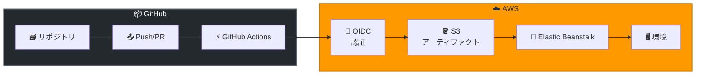

# AWS Elastic Beanstalk - GitHub Actions による自動デプロイメント

**リリース日**: 2026 年 2 月 11 日
**サービス**: AWS Elastic Beanstalk
**機能**: GitHub Actions 統合

📊 [このアップデートのインフォグラフィックを見る](https://takech9203.github.io/awsnews-summary/20260211-aws-elastic-beanstalk-github-action.html)

## 概要

AWS Elastic Beanstalk が GitHub Actions をサポートし、GitHub リポジトリにコードや設定変更をプッシュすると自動的に Web アプリケーションをデプロイできるようになりました。これにより、スケーラブルな Web アプリケーションの CI/CD パイプラインが大幅に効率化されます。

新しい GitHub Action `aws-elasticbeanstalk-deploy` は、デプロイパッケージの作成、S3 アップロード、バージョン管理、環境モニタリングを包括的に自動化します。OIDC 認証による IAM 統合や、インテリジェントなリトライロジックも組み込まれています。

**アップデート前の課題**

- Elastic Beanstalk へのデプロイに複数のステップと手動介入が必要だった
- カスタムスクリプトやツールの組み合わせでデプロイパイプラインを構築する必要があった
- S3 バケット管理、バージョン管理、環境ヘルスチェックを個別に設定する必要があった

**アップデート後の改善**

- 宣言的な設定ファイルで Elastic Beanstalk へのデプロイを完全自動化
- アプリケーションと環境の自動作成、デプロイパッケージの管理を一元化
- OIDC 認証による安全な IAM 統合とインテリジェントなリトライロジック

## アーキテクチャ図



GitHub へのコードプッシュをトリガーに、GitHub Actions が OIDC 認証で AWS に接続し、S3 経由で Elastic Beanstalk にデプロイします。

## サービスアップデートの詳細

### 主要機能

1. **包括的なデプロイ自動化**
   - デプロイパッケージの自動作成
   - S3 へのアップロードとアーティファクト管理
   - Elastic Beanstalk バージョン管理

2. **自動リソース作成**
   - 必要に応じてアプリケーションと環境を自動作成
   - 設定可能な除外ファイル設定
   - プラットフォームバージョンの指定

3. **セキュアな認証**
   - OpenID Connect (OIDC) による IAM 統合
   - 長期クレデンシャル不要
   - 最小権限の原則に準拠

4. **信頼性の高いデプロイ**
   - インテリジェントなリトライロジック
   - オプションのヘルスモニタリング
   - デプロイ検証機能

## 技術仕様

### GitHub Action の設定項目

| パラメータ | 説明 | 必須 |
|-----------|------|------|
| `application-name` | Elastic Beanstalk アプリケーション名 | はい |
| `environment-name` | 環境名 | はい |
| `version-label` | バージョンラベル | いいえ |
| `region` | AWS リージョン | はい |
| `deployment-package` | デプロイパッケージのパス | いいえ |

### サポートされる機能

| 機能 | 説明 |
|------|------|
| 環境設定 | 環境変数、プラットフォーム設定 |
| ヘルスモニタリング | デプロイ後の環境ヘルスチェック |
| デプロイ検証 | デプロイ成功の確認 |
| S3 バケット管理 | アーティファクト保存用バケットの自動管理 |

## 設定方法

### 前提条件

1. GitHub リポジトリ
2. AWS アカウントと Elastic Beanstalk アプリケーション
3. OIDC プロバイダーの設定 (推奨)

### 手順

#### ステップ 1: OIDC プロバイダーの設定

AWS IAM で GitHub 用の OIDC プロバイダーを作成します。

```bash
aws iam create-open-id-connect-provider \
  --url https://token.actions.githubusercontent.com \
  --client-id-list sts.amazonaws.com \
  --thumbprint-list 6938fd4d98bab03faadb97b34396831e3780aea1
```

このコマンドは GitHub Actions 用の OIDC プロバイダーを IAM に登録します。

#### ステップ 2: IAM ロールの作成

GitHub Actions が assume できる IAM ロールを作成します。

```json
{
  "Version": "2012-10-17",
  "Statement": [
    {
      "Effect": "Allow",
      "Principal": {
        "Federated": "arn:aws:iam::123456789012:oidc-provider/token.actions.githubusercontent.com"
      },
      "Action": "sts:AssumeRoleWithWebIdentity",
      "Condition": {
        "StringEquals": {
          "token.actions.githubusercontent.com:aud": "sts.amazonaws.com"
        },
        "StringLike": {
          "token.actions.githubusercontent.com:sub": "repo:your-org/your-repo:*"
        }
      }
    }
  ]
}
```

#### ステップ 3: GitHub Actions ワークフローの作成

`.github/workflows/deploy.yml` ファイルを作成します。

```yaml
name: Deploy to Elastic Beanstalk

on:
  push:
    branches: [main]

permissions:
  id-token: write
  contents: read

jobs:
  deploy:
    runs-on: ubuntu-latest
    steps:
      - uses: actions/checkout@v4

      - name: Configure AWS credentials
        uses: aws-actions/configure-aws-credentials@v4
        with:
          role-to-assume: arn:aws:iam::123456789012:role/github-actions-role
          aws-region: ap-northeast-1

      - name: Deploy to Elastic Beanstalk
        uses: aws-actions/aws-elasticbeanstalk-deploy@v1
        with:
          application-name: my-app
          environment-name: my-app-prod
          region: ap-northeast-1
```

このワークフローは main ブランチへのプッシュ時に Elastic Beanstalk へ自動デプロイを実行します。

## メリット

### ビジネス面

- **デプロイ時間の短縮**: 手動プロセスを自動化し、リリースサイクルを高速化
- **ヒューマンエラーの削減**: 宣言的設定により一貫したデプロイを実現
- **開発者体験の向上**: Git プッシュだけでデプロイが完了

### 技術面

- **セキュリティ強化**: OIDC 認証により長期クレデンシャルが不要
- **可観測性**: デプロイ状況とヘルスステータスの自動モニタリング
- **信頼性**: インテリジェントリトライによる確実なデプロイ

## デメリット・制約事項

### 制限事項

- Elastic Beanstalk がサポートするプラットフォームに限定
- 複雑なマルチステージデプロイには追加設定が必要
- GitHub Actions の実行時間制限あり

### 考慮すべき点

- OIDC 設定には IAM 管理権限が必要
- 既存の CI/CD パイプラインからの移行計画が必要

## ユースケース

### ユースケース 1: Web アプリケーションの継続的デプロイ

**シナリオ**: スタートアップが Node.js アプリケーションを頻繁に更新

**実装例**:
```yaml
- name: Deploy to Elastic Beanstalk
  uses: aws-actions/aws-elasticbeanstalk-deploy@v1
  with:
    application-name: startup-app
    environment-name: startup-app-prod
    region: ap-northeast-1
    wait-for-environment-recovery: 300
```

**効果**: コードプッシュから数分で本番環境に反映

### ユースケース 2: ステージング環境への自動デプロイ

**シナリオ**: 開発チームが feature ブランチをステージング環境でテスト

**実装例**:
```yaml
on:
  push:
    branches: [develop, 'feature/**']

jobs:
  deploy-staging:
    runs-on: ubuntu-latest
    steps:
      - uses: aws-actions/aws-elasticbeanstalk-deploy@v1
        with:
          application-name: my-app
          environment-name: my-app-staging
          region: ap-northeast-1
```

**効果**: feature ブランチの変更を自動的にステージング環境で検証

### ユースケース 3: Blue/Green デプロイメント

**シナリオ**: 大規模サービスでダウンタイムなしのデプロイが必要

**実装例**:
```yaml
- name: Deploy to Blue Environment
  uses: aws-actions/aws-elasticbeanstalk-deploy@v1
  with:
    application-name: production-app
    environment-name: production-app-blue
    region: ap-northeast-1

- name: Swap Environment URLs
  run: |
    aws elasticbeanstalk swap-environment-cnames \
      --source-environment-name production-app-blue \
      --destination-environment-name production-app-green
```

**効果**: ゼロダウンタイムでの本番デプロイを実現

## 料金

GitHub Actions の使用料金は GitHub の料金体系に従います。AWS Elastic Beanstalk 自体には追加料金はなく、使用する AWS リソース (EC2、ELB、S3 など) の料金のみ発生します。

| 項目 | 料金 |
|------|------|
| GitHub Actions (パブリックリポジトリ) | 無料 |
| GitHub Actions (プライベートリポジトリ) | 月間 2,000 分無料、以降有料 |
| Elastic Beanstalk | 無料 (基盤リソースのみ課金) |

## 利用可能リージョン

Elastic Beanstalk が利用可能なすべての商用 AWS リージョンで使用できます。

## 関連サービス・機能

- **AWS CodePipeline**: より複雑な CI/CD パイプラインが必要な場合
- **AWS CodeBuild**: カスタムビルドプロセスの追加
- **Amazon S3**: デプロイアーティファクトの保存

## 参考リンク

- 📊 [インフォグラフィック](https://takech9203.github.io/awsnews-summary/20260211-aws-elastic-beanstalk-github-action.html)
- [公式発表 (What's New)](https://aws.amazon.com/about-aws/whats-new/2026/02/aws-elastic-beanstalk-github-action/)
- [GitHub Action README](https://github.com/aws-actions/aws-elasticbeanstalk-deploy/blob/main/README.md)
- [AWS Elastic Beanstalk](https://aws.amazon.com/elasticbeanstalk)

## まとめ

AWS Elastic Beanstalk の GitHub Actions サポートにより、Web アプリケーションの CI/CD パイプラインが大幅に簡素化されました。OIDC 認証による安全な IAM 統合、自動リソース作成、インテリジェントリトライなどの機能により、開発チームはコードの開発に集中できます。GitHub を使用しているチームは、この新機能を活用してデプロイプロセスを効率化することを検討してください。
