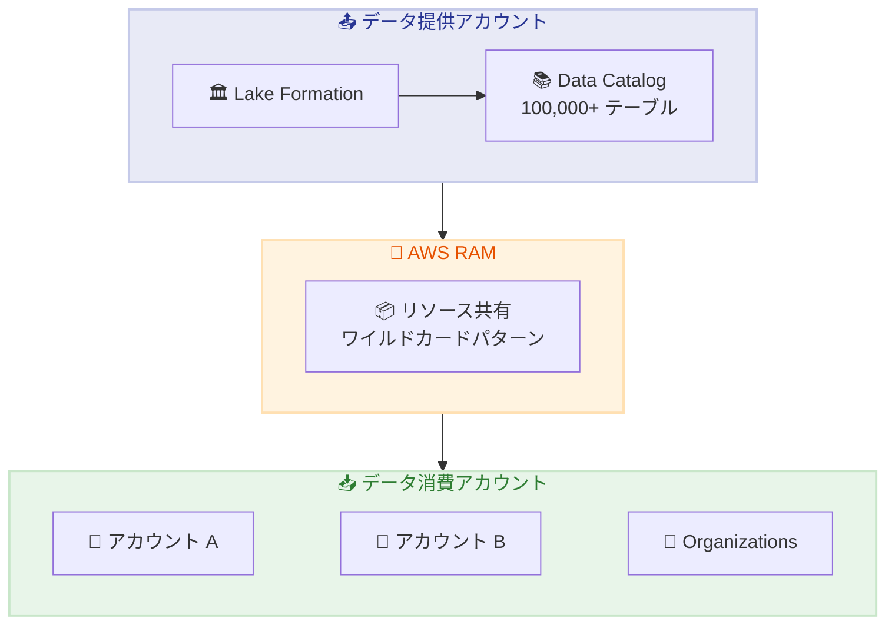

# AWS Lake Formation - クロスアカウント共有の強化

**リリース日**: 2026 年 2 月 11 日
**サービス**: AWS Lake Formation
**機能**: 数十万テーブルのクロスアカウント共有

📊 [このアップデートのインフォグラフィックを見る](https://takech9203.github.io/awsnews-summary/20260211-aws-lake-formation-cross-account-sharing.html)

## 概要

AWS Lake Formation のクロスアカウント共有機能が強化され、数十万のテーブルをアカウント間で共有できるようになりました。カタログ、データベース、テーブルなどのリソースに対する権限を Lake Formation で一元管理し、大規模なマルチアカウント分析環境できめ細かなアクセス制御を実現できます。

今回のアップデートでは、クロスアカウントバージョン 5 へのアップグレードにより、AWS Resource Access Manager (RAM) のリソース共有で個別のリソース関連付けではなくワイルドカードパターンを使用するようになり、以前のリソースタイプごとの関連付け制限が解消されました。

**アップデート前の課題**

- リソースタイプごとにリソース関連付け数の制限があった
- 大規模な Data Catalog の共有が困難だった
- 数万テーブルの共有には回避策が必要だった

**アップデート後の改善**

- 無制限のテーブル数を単一の RAM リソース共有で共有可能
- ワイルドカードパターンによる効率的なリソース関連付け
- 既存の共有と API の完全な後方互換性

## アーキテクチャ図



Lake Formation からのリソースが AWS RAM を通じてワイルドカードパターンで効率的に共有され、複数のアカウントや Organizations に配信されます。

## サービスアップデートの詳細

### 主要機能

1. **大規模テーブル共有**
   - 数十万のテーブルを単一のリソース共有で配信
   - リソースタイプごとの制限を解消
   - ワイルドカードパターンによる効率的な管理

2. **柔軟な共有先**
   - 外部 IAM プリンシパル
   - AWS アカウント
   - AWS Organizations
   - 組織単位 (OU)

3. **完全な後方互換性**
   - 既存のクロスアカウント共有は継続動作
   - Lake Formation API は変更なし
   - アップグレードはオプション

## 技術仕様

### クロスアカウントバージョンの比較

| 機能 | バージョン 4 以前 | バージョン 5 |
|------|------------------|-------------|
| テーブル数制限 | リソースタイプごとに制限あり | 無制限 |
| RAM 関連付け | 個別リソース | ワイルドカードパターン |
| スケーラビリティ | 中規模 | 大規模 |

### 共有可能なリソース

| リソースタイプ | 説明 |
|---------------|------|
| カタログ | Data Catalog 全体 |
| データベース | 特定のデータベース |
| テーブル | 個別テーブル |
| カラム | カラムレベルのアクセス制御 |

## 設定方法

### 前提条件

1. Lake Formation が設定された AWS アカウント
2. AWS RAM の有効化
3. 適切な IAM 権限

### 手順

#### ステップ 1: クロスアカウントバージョン 5 へのアップグレード

```bash
aws lakeformation put-data-lake-settings \
  --data-lake-settings '{
    "DataLakeAdmins": [{"DataLakePrincipalIdentifier": "arn:aws:iam::123456789012:role/LakeFormationAdmin"}],
    "CrossAccountVersion": "5"
  }'
```

Lake Formation の設定でクロスアカウントバージョンを 5 にアップグレードします。

#### ステップ 2: テーブルへの権限付与

```bash
aws lakeformation grant-permissions \
  --principal DataLakePrincipalIdentifier="123456789013" \
  --resource '{"Table": {"DatabaseName": "analytics_db", "TableWildcard": {}}}' \
  --permissions SELECT DESCRIBE
```

ターゲットアカウントにデータベース内の全テーブルへの SELECT 権限を付与します。

#### ステップ 3: AWS Console での確認

1. Lake Formation コンソールを開く
2. 「データカタログ」→「テーブル」を選択
3. 「アクション」→「権限の付与」をクリック
4. 外部アカウントまたは Organizations を選択

## メリット

### ビジネス面

- **スケーラビリティ**: 数十万テーブルの Data Catalog を効率的に共有
- **ガバナンス強化**: 一元化された権限管理でコンプライアンス対応
- **コスト効率**: 複雑なデータ共有アーキテクチャの簡素化

### 技術面

- **制限の解消**: リソースタイプごとの関連付け制限を克服
- **シンプルな管理**: ワイルドカードパターンで効率的にリソースを管理
- **後方互換性**: 既存の設定を変更せずにアップグレード可能

## デメリット・制約事項

### 制限事項

- クロスアカウントバージョン 5 へのアップグレードは一方向
- アップグレード後は以前のバージョンに戻せない

### 考慮すべき点

- アップグレード前に既存の共有設定をテスト
- Organizations 全体への共有は慎重に計画

## ユースケース

### ユースケース 1: エンタープライズデータメッシュ

**シナリオ**: 大企業が各部門のデータを中央 Data Catalog で管理し、必要な部門に共有

**実装例**:
```bash
# 財務部門のアカウントに全テーブルへのアクセス権限を付与
aws lakeformation grant-permissions \
  --principal DataLakePrincipalIdentifier="arn:aws:iam::999888777666:root" \
  --resource '{"Database": {"Name": "finance_data"}}' \
  --permissions ALL
```

**効果**: 10 万以上のテーブルを持つ Data Catalog を効率的に共有

### ユースケース 2: マルチテナント SaaS プラットフォーム

**シナリオ**: SaaS プロバイダーが顧客ごとのアカウントにデータを共有

**実装例**:
```bash
# 顧客アカウントに特定のテーブルのみ共有
aws lakeformation grant-permissions \
  --principal DataLakePrincipalIdentifier="$CUSTOMER_ACCOUNT_ID" \
  --resource '{"Table": {"DatabaseName": "customer_data", "Name": "customer_${CUSTOMER_ID}_*"}}' \
  --permissions SELECT
```

**効果**: 顧客ごとのきめ細かなアクセス制御を実現

### ユースケース 3: 規制産業でのデータガバナンス

**シナリオ**: 金融機関が監査用に特定のテーブルを監査法人のアカウントに共有

**実装例**:
```bash
# 外部監査法人に読み取り専用アクセスを付与
aws lakeformation grant-permissions \
  --principal DataLakePrincipalIdentifier="$AUDITOR_ACCOUNT_ID" \
  --resource '{"Table": {"DatabaseName": "audit_data", "TableWildcard": {}}}' \
  --permissions SELECT DESCRIBE \
  --permissions-with-grant-option []
```

**効果**: コンプライアンス要件を満たしながら安全にデータを共有

## 料金

Lake Formation のクロスアカウント共有機能自体に追加料金はありません。標準の Lake Formation 料金と RAM 料金が適用されます。

| 項目 | 料金 |
|------|------|
| クロスアカウント共有 | 無料 |
| Lake Formation | データアクセス量に応じた料金 |
| AWS RAM | 無料 |

## 利用可能リージョン

AWS Lake Formation が提供されているすべてのリージョンで利用可能です。

## 関連サービス・機能

- **AWS Glue Data Catalog**: Lake Formation で管理されるメタデータストア
- **AWS RAM**: クロスアカウントリソース共有
- **Amazon Athena**: 共有されたテーブルへのクエリ
- **Amazon Redshift Spectrum**: 共有データへのアクセス

## 参考リンク

- 📊 [インフォグラフィック](https://takech9203.github.io/awsnews-summary/20260211-aws-lake-formation-cross-account-sharing.html)
- [公式発表 (What's New)](https://aws.amazon.com/about-aws/whats-new/2026/02/aws-lake-formation-cross-account-sharing/)
- [AWS Lake Formation](https://aws.amazon.com/lake-formation/)
- [クロスアカウント権限ドキュメント](https://docs.aws.amazon.com/lake-formation/latest/dg/cross-account-permissions.html)

## まとめ

AWS Lake Formation のクロスアカウント共有強化により、大規模な Data Catalog を効率的に共有できるようになりました。数十万のテーブルを持つエンタープライズ環境でも、ワイルドカードパターンを使用した単一のリソース共有で管理できます。大規模なマルチアカウント分析環境を運用している場合は、クロスアカウントバージョン 5 へのアップグレードを検討してください。
