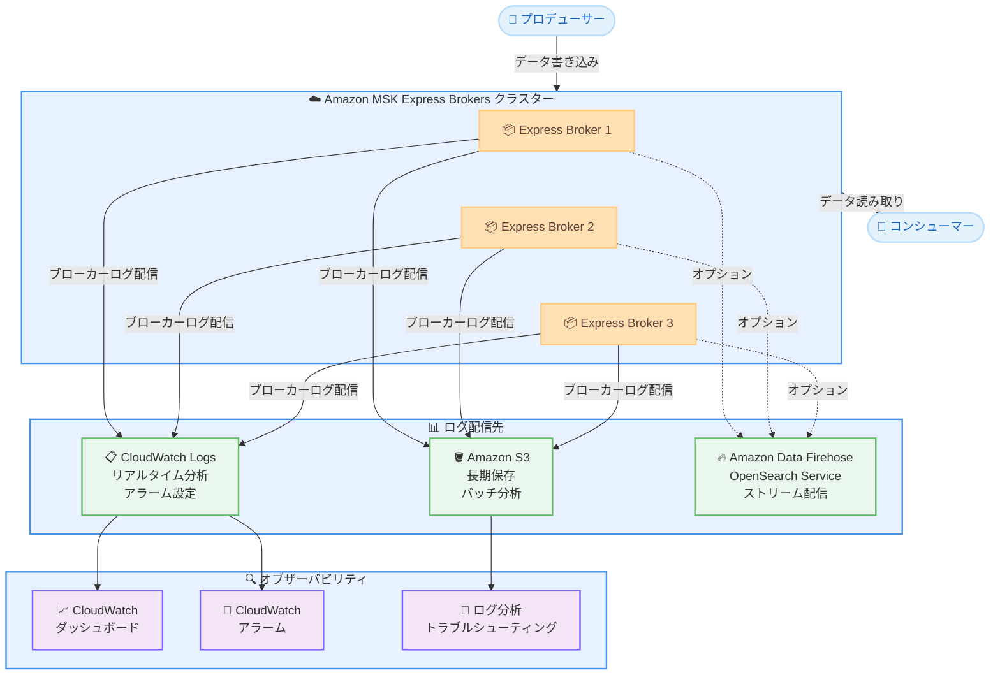

# Amazon MSK Express Brokers - ブローカーログのサポート

**リリース日**: 2026 年 2 月 11 日
**サービス**: Amazon Managed Streaming for Apache Kafka (MSK)
**機能**: Express Brokers でのブローカーログサポート

📊 [このアップデートのインフォグラフィックを見る](https://takech9203.github.io/aws-news-summary/20260211-aws-msk-express-brokers-support-broker-logs.html)

## 概要

Amazon Managed Streaming for Apache Kafka (MSK) が、Express Brokers でブローカーログをサポートしました。この機能は追加料金なしで利用でき、クライアント接続や可用性の問題のトラブルシューティング、リバランスやフェイルオーバー時のブローカー動作に関するインサイトの取得が可能になります。Amazon CloudWatch Logs および Amazon S3 との事前構築済みの統合により、Kafka の運用テレメトリを既存のオブザーバビリティパイプラインに容易に統合できます。

ブローカーログは新規および既存の Express Brokers の両方で利用でき、Amazon MSK Console または AWS CLI から有効化できます。

**アップデート前の課題**

- Express Brokers ではブローカーログが利用できず、クライアント接続の問題やブローカー動作の診断が困難だった
- リバランスやフェイルオーバー時のブローカー挙動を詳細に分析する手段が限られていた
- Kafka の運用テレメトリを既存のオブザーバビリティパイプラインに統合する方法が不足していた

**アップデート後の改善**

- Express Brokers でブローカーログが追加料金なしで利用可能に
- クライアント接続や可用性の問題を効率的にトラブルシューティング可能に
- CloudWatch Logs や S3 との事前構築済み統合で、既存の監視体制にシームレスに組み込み可能に

## アーキテクチャ図



Express Brokers からブローカーログを CloudWatch Logs、S3、Data Firehose に配信し、オブザーバビリティパイプラインに統合する構成を示しています。

## サービスアップデートの詳細

### 主要機能

1. **Express Brokers でのブローカーログ**
   - INFO レベルのブローカーログを配信先に出力
   - クライアント接続や可用性の問題をトラブルシューティング
   - リバランスやフェイルオーバー時のブローカー動作を詳細に把握

2. **事前構築済みの統合**
   - Amazon CloudWatch Logs: リアルタイムのログ分析とアラーム設定
   - Amazon S3: ログの長期保存とバッチ分析
   - Amazon Data Firehose: OpenSearch Service などへのストリーム配信

3. **追加料金なし**
   - ブローカーログ機能自体に追加コストは不要
   - 新規および既存の Express Brokers の両方で利用可能
   - MSK Console または AWS CLI から有効化

## 技術仕様

### ブローカーログの配信先

| 配信先 | 用途 | 特徴 |
|--------|------|------|
| CloudWatch Logs | リアルタイム分析 | アラーム設定、ダッシュボード表示、Logs Insights によるクエリ |
| Amazon S3 | 長期保存・バッチ分析 | コスト効率の高い保存、Athena による分析 |
| Amazon Data Firehose | ストリーム配信 | OpenSearch Service への配信、リアルタイムダッシュボード |

### Express Brokers の特徴

| 項目 | 詳細 |
|------|------|
| スループット | Standard Brokers の最大 3 倍 |
| スケールアップ速度 | 最大 20 倍高速 |
| リカバリ時間 | 90% 短縮 |
| ストレージ | フルマネージド、事前プロビジョニング不要 |
| 対応 Kafka バージョン | 3.6、3.8、3.9 |

### ログレベル

| ログレベル | 説明 |
|------------|------|
| INFO (デフォルト) | 標準的なブローカー動作のログ |

## 設定方法

### 前提条件

1. AWS アカウントへのアクセス権限
2. Amazon MSK へのアクセス権限 (AmazonMSKFullAccess ポリシーを推奨)
3. ログ配信先リソース (CloudWatch ロググループ、S3 バケットなど) の事前作成
4. S3 に配信する場合は `s3:PutBucketPolicy` 権限が必要

### 手順

#### ステップ 1: ログ配信先リソースの準備

```bash
# CloudWatch Logs のロググループを作成
aws logs create-log-group \
  --log-group-name /aws/msk/express-broker-logs

# S3 バケットを作成
aws s3 mb s3://my-msk-broker-logs-bucket
```

ブローカーログの配信先となるリソースを事前に作成します。

#### ステップ 2: 既存クラスターでブローカーログを有効化

```bash
aws kafka update-monitoring \
  --cluster-arn <cluster-arn> \
  --current-version <cluster-version> \
  --logging-info '{
    "BrokerLogs": {
      "CloudWatchLogs": {
        "Enabled": true,
        "LogGroup": "/aws/msk/express-broker-logs"
      },
      "S3": {
        "Enabled": true,
        "Bucket": "my-msk-broker-logs-bucket",
        "Prefix": "broker-logs"
      }
    }
  }'
```

既存の Express Brokers クラスターに対してブローカーログの配信を有効化します。CloudWatch Logs と S3 の両方に配信する設定例です。

#### ステップ 3: 新規クラスター作成時にブローカーログを有効化

```bash
aws kafka create-cluster-v2 \
  --cluster-name my-express-cluster \
  --provisioned '{
    "brokerNodeGroupInfo": {
      "instanceType": "kafka.m7g.large",
      "clientSubnets": ["subnet-xxx", "subnet-yyy", "subnet-zzz"],
      "securityGroups": ["sg-xxx"]
    },
    "kafkaVersion": "3.9.0",
    "numberOfBrokerNodes": 3,
    "clusterType": "EXPRESS",
    "loggingInfo": {
      "brokerLogs": {
        "cloudWatchLogs": {
          "enabled": true,
          "logGroup": "/aws/msk/express-broker-logs"
        },
        "s3": {
          "enabled": true,
          "bucket": "my-msk-broker-logs-bucket",
          "prefix": "broker-logs"
        }
      }
    }
  }'
```

新規 Express Brokers クラスター作成時にブローカーログを有効化します。

#### ステップ 4: ログの確認

```bash
# CloudWatch Logs Insights でブローカーログをクエリ
aws logs start-query \
  --log-group-name /aws/msk/express-broker-logs \
  --start-time $(date -d '1 hour ago' +%s) \
  --end-time $(date +%s) \
  --query-string 'fields @timestamp, @message | filter @message like /ERROR|WARN/ | sort @timestamp desc | limit 50'
```

CloudWatch Logs Insights を使用して、ブローカーログからエラーや警告メッセージをクエリします。

## メリット

### ビジネス面

- **トラブルシューティングの迅速化**: クライアント接続の問題やブローカーの挙動を詳細に分析し、問題解決までの時間を短縮
- **追加コストなし**: ブローカーログ機能自体に追加料金が不要で、運用コストを抑制
- **既存環境への即時適用**: 新規・既存の Express Brokers の両方で利用可能で、迅速に導入可能

### 技術面

- **オブザーバビリティの向上**: リバランスやフェイルオーバー時のブローカー動作を詳細に把握可能
- **既存パイプラインとの統合**: CloudWatch Logs、S3、Data Firehose との事前構築済み統合で既存の監視体制に容易に組み込み可能
- **運用効率の改善**: MSK Console または AWS CLI から簡単に有効化でき、運用負荷を最小限に抑制

## デメリット・制約事項

### 制限事項

- ブローカーログはデフォルトで INFO レベルのみを配信
- ログ配信先リソース (CloudWatch ロググループ、S3 バケットなど) は事前に作成する必要がある
- S3 バケットで SSE-KMS を使用する場合は、KMS キーポリシーに追加設定が必要

### 考慮すべき点

- ログ配信先のストレージコスト (CloudWatch Logs のデータ取り込み料金、S3 のストレージ料金) は別途発生
- 大量のログが生成される場合、S3 または Data Firehose をログ配信先として使用することを推奨
- CloudWatch Logs をログ配信先とする場合、DEBUG や TRACE レベルのログはブローカーのパフォーマンスに影響を与える可能性がある

## ユースケース

### ユースケース 1: クライアント接続の問題調査

**シナリオ**: プロデューサーまたはコンシューマーアプリケーションが断続的に接続エラーを報告している

**実装例**:
```bash
# CloudWatch Logs Insights で接続関連のログを検索
aws logs start-query \
  --log-group-name /aws/msk/express-broker-logs \
  --start-time $(date -d '24 hours ago' +%s) \
  --end-time $(date +%s) \
  --query-string 'fields @timestamp, @message | filter @message like /connection|disconnect|authentication/ | sort @timestamp desc | limit 100'
```

**効果**: ブローカーログから接続エラーの原因 (認証失敗、ネットワークタイムアウトなど) を特定し、迅速に問題を解決

### ユースケース 2: リバランス時のブローカー動作の監視

**シナリオ**: Express Brokers クラスターのスケールアウト時に、パーティションリバランスの進行状況を把握したい

**実装例**:
```bash
# CloudWatch アラームを設定してリバランスイベントを通知
aws cloudwatch put-metric-alarm \
  --alarm-name msk-rebalance-monitor \
  --metric-name ActiveControllerCount \
  --namespace AWS/Kafka \
  --statistic Average \
  --period 60 \
  --threshold 1 \
  --comparison-operator LessThanThreshold \
  --evaluation-periods 3 \
  --alarm-actions arn:aws:sns:ap-northeast-1:123456789012:msk-alerts
```

**効果**: リバランスの開始・完了タイミングをログから追跡し、アプリケーションへの影響を最小限に抑えるための知見を得る

### ユースケース 3: フェイルオーバー後の事後分析

**シナリオ**: ブローカー障害後のフェイルオーバーが発生し、原因分析と再発防止策の策定が必要

**実装例**:
```bash
# S3 に保存されたログを Athena で分析
# Athena テーブルを作成してログを分析可能な状態にする
aws athena start-query-execution \
  --query-string "
    SELECT *
    FROM msk_broker_logs
    WHERE timestamp BETWEEN '2026-02-11T00:00:00Z' AND '2026-02-11T23:59:59Z'
    AND message LIKE '%fail%'
    ORDER BY timestamp DESC
  " \
  --result-configuration OutputLocation=s3://my-athena-results/
```

**効果**: S3 に長期保存されたブローカーログを Athena で分析し、フェイルオーバーの根本原因を特定して再発防止策を策定

## 料金

ブローカーログ機能自体に追加料金はありません。ただし、ログ配信先のサービスに対する標準料金が適用されます。

| 項目 | 料金 |
|------|------|
| ブローカーログ機能 | 無料 |
| CloudWatch Logs データ取り込み | $0.76/GB (東京リージョン) |
| CloudWatch Logs データ保存 | $0.033/GB/月 (東京リージョン) |
| S3 ストレージ | $0.025/GB/月 (東京リージョン、S3 Standard) |

## 利用可能リージョン

Express Brokers がサポートされているすべての AWS リージョンでブローカーログが利用可能です。

## 関連サービス・機能

- **Amazon CloudWatch Logs**: ブローカーログのリアルタイム分析とアラーム設定
- **Amazon S3**: ブローカーログの長期保存とバッチ分析
- **Amazon Data Firehose**: ブローカーログの OpenSearch Service などへのストリーム配信
- **Amazon MSK Connect**: Kafka Connect のマネージドサービス
- **Amazon CloudWatch**: MSK クラスターのメトリクス監視

## 参考リンク

- 📊 [インフォグラフィック](https://takech9203.github.io/aws-news-summary/20260211-aws-msk-express-brokers-support-broker-logs.html)
- [公式発表 (What's New)](https://aws.amazon.com/about-aws/whats-new/2026/02/aws-msk-express-brokers-support-broker-logs/)
- [Amazon MSK ブローカーログドキュメント](https://docs.aws.amazon.com/msk/latest/developerguide/msk-logging.html)
- [Express Brokers 製品ページ](https://aws.amazon.com/msk/features/express-brokers-for-amazon-msk/)
- [Amazon MSK 開発者ガイド](https://docs.aws.amazon.com/msk/latest/developerguide/what-is-msk.html)

## まとめ

Amazon MSK Express Brokers でブローカーログがサポートされたことにより、Express Brokers のオブザーバビリティが大幅に向上しました。クライアント接続や可用性の問題のトラブルシューティング、リバランスやフェイルオーバー時のブローカー動作の分析が容易になります。CloudWatch Logs や S3 との事前構築済み統合を活用することで、既存の監視体制にシームレスに組み込むことが可能です。追加料金なしで新規・既存の Express Brokers の両方で利用できるため、すべての Express Brokers ユーザーにブローカーログの有効化を推奨します。
