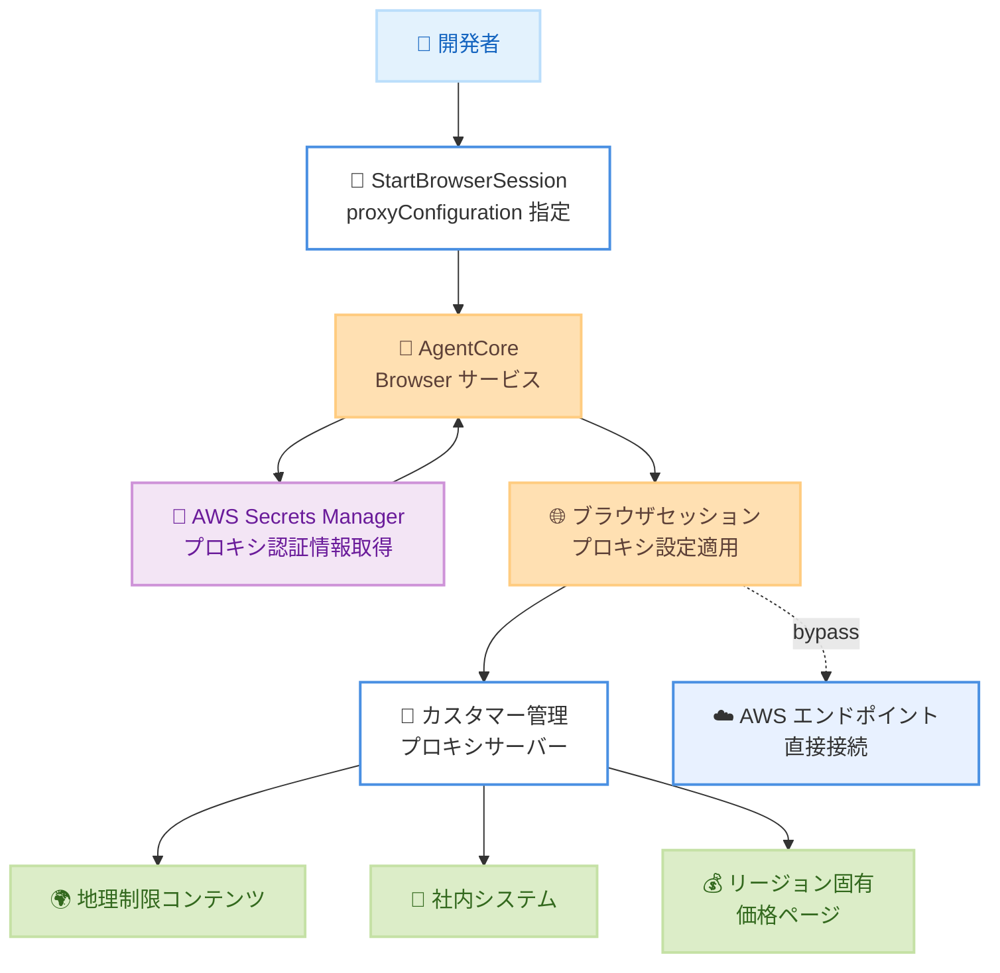

# Amazon Bedrock AgentCore Browser - プロキシ設定サポート

**リリース日**: 2026 年 2 月 11 日
**サービス**: Amazon Bedrock AgentCore
**機能**: Browser Proxy Configuration (ブラウザプロキシ設定)

📊 [このアップデートのインフォグラフィックを見る](https://takech9203.github.io/awsnews-summary/20260211-bedrock-agentcore-browser-proxy.html)

## 概要

Amazon Bedrock AgentCore Browser がカスタマー提供のプロキシ設定をサポートしました。この機能により、ブラウザセッションのトラフィックを自社のプロキシインフラストラクチャ経由でルーティングでき、ジオターゲティング、リージョン固有のコンテンツアクセス、コンプライアンス要件への対応が可能になります。

ブラウザプロキシは、AWS の IP アドレスローテーションによる再認証サイクルを排除し、IP 許可リスト要件に対応する安定した制御可能なエグレスアドレスを提供します。HTTP および HTTPS プロトコルをサポートし、AWS Secrets Manager を通じたセキュアな認証情報管理を実現します。

**アップデート前の課題**

- ブラウザセッションのトラフィックは AWS のネットワーク経由で直接ルーティングされ、自社のプロキシインフラストラクチャを経由できなかった
- AWS の IP アドレスがローテーションされるため、IP ベースのセッション検証を行うポータルで頻繁な再認証が発生していた
- 厳格な IP 許可リストポリシーを持つ医療機関や金融サービス企業では、エグレスアドレスを制御できなかった
- 地理的に制限されたコンテンツへのアクセスや、リージョン固有の価格検証ができなかった

**アップデート後の改善**

- 自社プロキシインフラストラクチャ経由でブラウザトラフィックをルーティング可能に
- 安定したエグレス IP により再認証サイクルを排除
- ドメインベースのルーティングで特定ドメインを指定プロキシ経由で接続
- AWS Secrets Manager による認証情報の安全な管理

## アーキテクチャ図



ブラウザセッション作成時にプロキシ設定を指定し、トラフィックをカスタマー管理のプロキシサーバー経由でルーティングする流れを示しています。バイパス設定により、AWS エンドポイントへの直接接続も可能です。

## サービスアップデートの詳細

### 主要機能

1. **プロキシ経由のトラフィックルーティング**
   - ブラウザセッション作成時に `proxyConfiguration` パラメータでプロキシサーバーを指定
   - HTTP および HTTPS プロトコルをサポート
   - Chromium の `--proxy-server` フラグを使用してブラウザレベルでトラフィックをルーティング

2. **ドメインベースルーティング**
   - `domainPatterns` で特定ドメインを指定プロキシ経由でルーティング
   - 複数のプロキシサーバーを設定し、ドメインごとに異なるプロキシを使用可能
   - `bypass.domainPatterns` でプロキシを経由せず直接接続するドメインを指定

3. **セキュアな認証情報管理**
   - AWS Secrets Manager にプロキシの認証情報を保存
   - HTTP Basic 認証または IP 許可リスト方式をサポート
   - 認証情報は API レスポンスに含まれず、ログにも記録されない

4. **ルーティング優先順位**
   - バイパスドメイン (最優先): 直接接続
   - プロキシドメインパターン: パターンに一致するドメインは指定プロキシ経由
   - デフォルトプロキシ: 一致しないドメインは `domainPatterns` なしのプロキシ経由

## 技術仕様

### API 変更履歴

| 日付 | サービス | 変更内容 |
|------|----------|----------|
| 2026/02/10 | [Amazon Bedrock AgentCore](https://awsapichanges.com/archive/changes/56b6d8-bedrock-agentcore.html) | 2 updated methods - プロキシ設定サポートを追加 |

### 制約事項

| 項目 | 制限値 | 調整可否 |
|------|--------|----------|
| セッションあたりの最大プロキシ数 | 5 | 可能 |
| プロキシあたりの最大ドメインパターン数 | 100 | 可能 |
| バイパスドメインパターンの最大数 | 100 | 可能 |
| サーバーホスト名の最大長 | 253 文字 | 不可 |
| ドメインパターンの最大長 | 253 文字 | 不可 |
| ポート範囲 | 1 - 65535 | 不可 |

### 制限事項

| 項目 | 詳細 |
|------|------|
| トラフィックルーティング | ブラウザレベルの設定であり、ネットワークレベルの制御ではない。ネットワーク層の制御には VPC 設定を使用 |
| 対応プロトコル | HTTP および HTTPS のみ。SOCKS4 および SOCKS5 は非対応 |
| 認証方式 | HTTP Basic 認証または認証なし (IP 許可リスト)。NTLM、Kerberos、証明書ベース認証は非対応 |
| プロキシ変更 | セッション作成時に一度だけ設定。実行中の変更は不可 |
| プロキシローテーション | 自動ローテーション非対応。プロキシ切り替えには新規セッション作成が必要 |
| 接続検証 | セッション作成時にプロキシ接続性は検証されない。エラーはランタイム時に発生 |

### ドメインパターンの記法

| パターン | 一致する対象 | 一致しない対象 |
|----------|-------------|---------------|
| `.example.com` | `www.example.com`、`api.example.com` | `example.com` |
| `example.com` | `example.com` (完全一致のみ) | `www.example.com` |

サブドメインを含める場合は、先頭にドット (`.example.com`) を使用します。`*.example.com` は使用しません。

### IAM 権限設定

プロキシ認証情報を使用する場合、`StartBrowserSession` を呼び出す IAM ID に以下の権限が必要です。

```json
{
    "Version": "2012-10-17",
    "Statement": [
        {
            "Effect": "Allow",
            "Action": "secretsmanager:GetSecretValue",
            "Resource": "arn:aws:secretsmanager:<region>:<account-id>:secret:<secret-name>*"
        }
    ]
}
```

### 認証情報のフォーマット

Secrets Manager に保存する認証情報は、以下の JSON 形式で設定します。

```json
{
    "username": "<your-username>",
    "password": "<your-password>"
}
```

| フィールド | 使用可能な文字 |
|-----------|---------------|
| `username` | 英数字および `@ . _ + = -` |
| `password` | 英数字および `@ . _ + = - ! # $ % & *` |

コロン (`:`)、改行、スペース、引用符は使用できません。

## 設定方法

### 前提条件

1. Amazon Bedrock AgentCore Browser の一般的な前提条件を満たしていること
2. パブリックインターネットからアクセス可能な HTTP/HTTPS プロキシサーバー (VPC 使用時は VPC 内から到達可能であること)
3. プロキシが HTTPS トラフィックトンネリング用の HTTP CONNECT メソッドをサポートしていること
4. 認証を使用する場合、AWS Secrets Manager にプロキシ認証情報を格納するシークレットが必要

### 手順

#### ステップ 1: 認証情報シークレットの作成 (認証を使用する場合)

```bash
aws secretsmanager create-secret \
  --name "my-proxy-credentials" \
  --secret-string '{"username":"<your-username>","password":"<your-password>"}'
```

#### ステップ 2: IAM 権限の追加

`StartBrowserSession` を呼び出す IAM ID に `secretsmanager:GetSecretValue` 権限を追加します。

#### ステップ 3: プロキシ付きブラウザセッションの作成

AWS CLI を使用する例:

```bash
aws bedrock-agentcore start-browser-session \
  --browser-identifier "aws.browser.v1" \
  --name "my-proxy-session" \
  --proxy-configuration '{
    "proxies": [{
      "externalProxy": {
        "server": "<your-proxy-hostname>",
        "port": 8080,
        "credentials": {
          "basicAuth": {
            "secretArn": "arn:aws:secretsmanager:<region>:<account-id>:secret:<secret-name>"
          }
        }
      }
    }]
  }'
```

IP 許可リスト方式 (認証情報なし) の場合:

```bash
aws bedrock-agentcore start-browser-session \
  --browser-identifier "aws.browser.v1" \
  --name "my-proxy-session" \
  --proxy-configuration '{
    "proxies": [{
      "externalProxy": {
        "server": "<your-proxy-hostname>",
        "port": 8080
      }
    }]
  }'
```

Boto3 (Python SDK) を使用する例:

```python
import boto3

client = boto3.client('bedrock-agentcore-runtime', region_name='<region>')

response = client.start_browser_session(
    browserIdentifier="aws.browser.v1",
    name="my-proxy-session",
    proxyConfiguration={
        "proxies": [{
            "externalProxy": {
                "server": "<your-proxy-hostname>",
                "port": 8080,
                "credentials": {
                    "basicAuth": {
                        "secretArn": "arn:aws:secretsmanager:<region>:<account-id>:secret:<secret-name>"
                    }
                }
            }
        }]
    }
)
print(f"Session ID: {response['sessionId']}")
```

#### ステップ 4: ドメインベースルーティングの設定 (オプション)

特定ドメインを異なるプロキシ経由でルーティングする場合:

```python
response = client.start_browser_session(
    browserIdentifier="aws.browser.v1",
    name="domain-routing-session",
    proxyConfiguration={
        "proxies": [
            {
                "externalProxy": {
                    "server": "corp-proxy.example.com",
                    "port": 8080,
                    "domainPatterns": [".company.com", ".internal.corp"]
                }
            },
            {
                "externalProxy": {
                    "server": "general-proxy.example.com",
                    "port": 8080
                }
            }
        ],
        "bypass": {
            "domainPatterns": [".amazonaws.com"]
        }
    }
)
```

この設定では、`*.company.com` と `*.internal.corp` は企業プロキシ経由、その他のリクエストは汎用プロキシ経由、`.amazonaws.com` は直接接続となります。

## メリット

### ビジネス面

- **コンプライアンス対応**: 規制産業のお客様が、既存のセキュリティポリシーに準拠した形でブラウザ自動化を実行可能
- **再認証の排除**: 安定したエグレス IP により、IP ベースのセッション検証を行うポータルでの再認証サイクルを排除
- **地理的コンテンツアクセス**: リージョン固有の価格検証やローカライズされたアプリケーション動作の検証が可能
- **既存インフラの活用**: 既存の企業プロキシインフラストラクチャをそのまま AgentCore Browser セッションに適用

### 技術面

- **柔軟なルーティング制御**: ドメインベースルーティングでトラフィックをきめ細かく制御
- **セキュアな認証情報管理**: AWS Secrets Manager による認証情報の一元管理、クロスアカウントアクセスにも対応
- **バイパス設定**: AWS エンドポイントなどを直接接続に設定し、レイテンシを最適化
- **監査とセキュリティポリシー**: 企業プロキシを経由することで、トラフィックの監査とセキュリティポリシーの適用が可能

## デメリット・制約事項

### 制限事項

- ブラウザレベルの設定であり、ネットワークレベルの制御は保証されない。ネットワーク層での制御が必要な場合は VPC 設定を使用する必要がある
- SOCKS4 および SOCKS5 プロトコルは非対応
- NTLM、Kerberos、証明書ベースの認証は非対応
- セッション作成後のプロキシ設定変更は不可。変更するには新規セッションの作成が必要
- 自動プロキシローテーション (IP サイクリングやロードバランシング) は非対応

### 考慮すべき点

- プロキシサーバーの可用性とキャパシティを確保する必要がある
- セッション作成時にプロキシ接続性は検証されないため、接続エラーはランタイム時に発生する
- プロキシサーバーの地理的な近接性がパフォーマンスに影響するため、AWS リージョンに近いプロキシを使用することが推奨される
- カスタマーが管理するプロキシサーバーのセキュリティと運用はカスタマーの責任

## ユースケース

### ユースケース 1: 医療機関ポータルの IP 許可リスト対応

**シナリオ**: 厳格な IP 許可リストポリシーを持つ医療ポータルに、AI エージェントがアクセスしてデータを取得する必要がある。AWS の IP アドレスはローテーションされるため、許可リストに登録できない。

**実装例**:
固定 IP を持つプロキシサーバーを通じてトラフィックをルーティングし、医療ポータルの IP 許可リストにプロキシの IP を登録します。

```python
response = client.start_browser_session(
    browserIdentifier="aws.browser.v1",
    name="healthcare-portal-session",
    proxyConfiguration={
        "proxies": [{
            "externalProxy": {
                "server": "healthcare-proxy.company.com",
                "port": 8443,
                "domainPatterns": [".healthcare-portal.com"],
                "credentials": {
                    "basicAuth": {
                        "secretArn": "arn:aws:secretsmanager:us-east-1:123456789012:secret:healthcare-proxy-creds"
                    }
                }
            }
        }],
        "bypass": {
            "domainPatterns": [".amazonaws.com"]
        }
    }
)
```

**効果**: 安定したエグレス IP により IP 許可リスト要件を満たし、再認証なしで医療ポータルへの継続的なアクセスを実現。

### ユースケース 2: 金融サービスのエグレスポリシー準拠

**シナリオ**: 金融サービス企業がすべてのインターネットトラフィックを企業プロキシ経由でルーティングするセキュリティポリシーを持っている。AgentCore Browser のセッションもこのポリシーに準拠する必要がある。

**実装例**:
企業プロキシを通じてすべてのトラフィックをルーティングし、監査ログとセキュリティポリシーの適用を確保します。

```python
response = client.start_browser_session(
    browserIdentifier="aws.browser.v1",
    name="financial-compliance-session",
    proxyConfiguration={
        "proxies": [{
            "externalProxy": {
                "server": "corp-egress-proxy.financial.com",
                "port": 3128,
                "credentials": {
                    "basicAuth": {
                        "secretArn": "arn:aws:secretsmanager:us-east-1:123456789012:secret:corp-proxy-creds"
                    }
                }
            }
        }]
    }
)
```

**効果**: 既存のセキュリティインフラストラクチャを活用し、コンプライアンス要件を満たしながらブラウザ自動化を実行。

### ユースケース 3: リージョン固有の価格・コンテンツ検証

**シナリオ**: EC サイトがグローバル展開しており、各地域のローカライズされた価格表示やコンテンツが正しく表示されているか検証したい。

**実装例**:
各地域のプロキシを使用してリージョン固有のコンテンツにアクセスし、価格やローカライズの検証を自動化します。

```python
regions_proxies = {
    "us": {"server": "us-proxy.company.com", "port": 8080},
    "eu": {"server": "eu-proxy.company.com", "port": 8080},
    "apac": {"server": "apac-proxy.company.com", "port": 8080}
}

for region, proxy_config in regions_proxies.items():
    response = client.start_browser_session(
        browserIdentifier="aws.browser.v1",
        name=f"geo-validation-{region}",
        proxyConfiguration={
            "proxies": [{
                "externalProxy": proxy_config
            }]
        }
    )
    print(f"{region} session: {response['sessionId']}")
```

**効果**: 各リージョンのプロキシを通じて地理的に制限されたコンテンツにアクセスし、リージョン固有の価格やローカライズの正確性を自動検証。

## 料金

Amazon Bedrock AgentCore Browser の料金は、ブラウザセッションの使用時間に基づいて課金されます。プロキシ設定機能の使用に対する追加料金はかかりません。

ただし、以下の関連コストが発生する場合があります。

| 項目 | 説明 |
|------|------|
| AWS Secrets Manager | プロキシ認証情報の保存と取得に対する料金 |
| プロキシサーバー | カスタマーが管理するプロキシインフラストラクチャの運用コスト |

詳細は [Amazon Bedrock AgentCore 料金ページ](https://aws.amazon.com/bedrock-agentcore/pricing/) を参照してください。

## 利用可能リージョン

この機能は、Amazon Bedrock AgentCore Browser が利用可能な 14 の AWS リージョンで利用できます。

- 米国東部 (バージニア北部、オハイオ)
- 米国西部 (オレゴン)
- アジアパシフィック (東京、ムンバイ、シンガポール、シドニー、ソウル)
- 欧州 (フランクフルト、アイルランド、ロンドン、パリ、ストックホルム)
- カナダ (中部)

## 関連サービス・機能

- **AWS Secrets Manager**: プロキシ認証情報のセキュアな保存と管理
- **AWS IAM**: プロキシ認証情報へのアクセス制御
- **Amazon Bedrock AgentCore Browser Profiles**: 認証状態の永続化との組み合わせで、プロキシ経由の認証済みセッションを効率化
- **Amazon VPC**: ネットワーク層でのトラフィック制御が必要な場合の VPC 設定

## 参考リンク

- 📊 [インフォグラフィック](https://takech9203.github.io/awsnews-summary/20260211-bedrock-agentcore-browser-proxy.html)
- [公式発表 (What's New)](https://aws.amazon.com/about-aws/whats-new/2026/02/bedrock-agentcore-browser-proxy/)
- [Browser Proxies ドキュメント](https://docs.aws.amazon.com/bedrock-agentcore/latest/devguide/browser-proxies.html)
- [AgentCore Browser ドキュメント](https://docs.aws.amazon.com/bedrock-agentcore/latest/devguide/browser-tool.html)
- [AgentCore リージョン](https://docs.aws.amazon.com/bedrock-agentcore/latest/devguide/agentcore-regions.html)

## まとめ

Amazon Bedrock AgentCore Browser のプロキシ設定サポートにより、ブラウザセッションのトラフィックを自社のプロキシインフラストラクチャ経由でルーティングできるようになりました。IP 許可リスト要件への対応、企業プロキシインフラストラクチャの活用、地理的コンテンツアクセスなど、規制産業やエンタープライズのお客様にとって重要なユースケースに対応します。特に、厳格な IP 許可リストを持つ医療機関、エグレスポリシーを持つ金融サービス、企業プロキシインフラストラクチャを利用するエンタープライズのお客様は、この機能の導入を検討してください。
