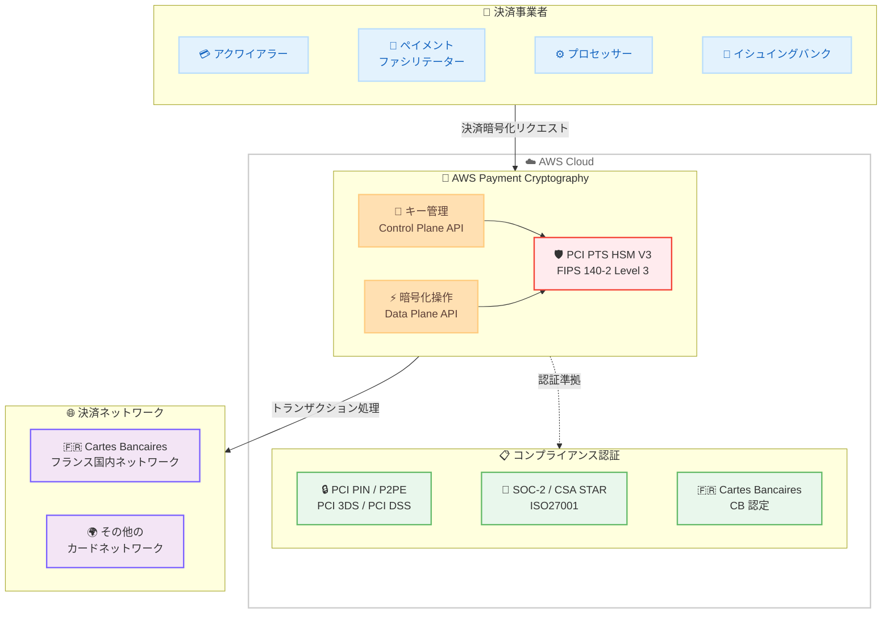

# AWS Payment Cryptography - Cartes Bancaires (CB) 認定を取得

**リリース日**: 2026 年 2 月 11 日
**サービス**: AWS Payment Cryptography
**機能**: Cartes Bancaires (CB) 認定の取得

📊 [このアップデートのインフォグラフィックを見る](https://takech9203.github.io/awsnews-summary/20260211-payment-cryptography-cartes-bancaires.html)

## 概要

AWS Payment Cryptography が、フランスの国内カード決済ネットワークである Groupement des Cartes Bancaires (CB) の認定を取得しました。クラウドベースの決済暗号化サービスとして CB 認定を取得した最初のサービスの 1 つとなります。この CB 認定は、既存のコンプライアンス認証 (PCI PIN、PCI P2PE、PCI 3DS、PCI DSS、SOC-2、CSA STAR、ISO27001) と組み合わせることで、CB コンプライアンスを維持しながら AWS 上で決済ワークロードを実行できるようになります。

**アップデート前の課題**

- フランスの CB ネットワークで決済処理を行う組織は、CB 認定を受けたスタンドアロンの決済 HSM を自社で調達・管理する必要があった
- 専用の決済 HSM の調達、キーマテリアルの安全な管理、緊急バックアップの維持など運用負担が大きかった
- クラウドベースの決済暗号化サービスで CB 認定を取得したものがなく、クラウド移行の障壁となっていた

**アップデート後の改善**

- AWS Payment Cryptography が CB 認定を取得し、クラウド上で CB コンプライアンスに準拠した決済処理が可能に
- スタンドアロンの決済 HSM の調達・管理が不要になり、運用負担を大幅に削減
- 既存の PCI PIN、PCI P2PE、PCI 3DS、PCI DSS、SOC-2、CSA STAR、ISO27001 認証に CB 認定が追加され、包括的なコンプライアンスフレームワークを提供

## アーキテクチャ図



決済事業者が AWS Payment Cryptography を通じて CB 認定に準拠した決済暗号化処理を実行し、フランスの Cartes Bancaires ネットワークやその他のカードネットワークとトランザクションを処理する構成を示しています。

## サービスアップデートの詳細

### 主要機能

1. **Cartes Bancaires (CB) 認定の取得**
   - クラウドベースの決済暗号化サービスとして CB 認定を取得した最初のサービスの 1 つ
   - フランスの国内カード決済ネットワークである CB のコンプライアンス要件に準拠
   - 既存のコンプライアンス認証と組み合わせた包括的なフレームワークを提供

2. **スタンドアロン決済 HSM の代替**
   - 専用の決済 HSM を調達・管理する運用負担を排除
   - エラスティックでスケーラブルなサービスとして同等の暗号化機能を提供
   - PCI PTS HSM V3 および FIPS 140-2 Level 3 認定のハードウェアを使用

3. **包括的なコンプライアンス認証**
   - PCI PIN: PIN 処理のセキュリティ基準
   - PCI P2PE: ポイントツーポイント暗号化
   - PCI 3DS: 3D セキュア認証
   - PCI DSS: データセキュリティ基準
   - SOC-2: サービス組織の統制基準
   - CSA STAR: クラウドセキュリティの認証
   - ISO27001: 情報セキュリティマネジメント
   - CB: フランス国内カード決済ネットワーク認定 (新規追加)

4. **共有責任モデル**
   - サービスのコンプライアンス認証をお客様のフレームワークの一部として活用可能
   - 暗号化キー管理とトランザクション処理のセキュリティを AWS が担保
   - お客様はアプリケーションロジックとビジネスプロセスに集中可能

## 技術仕様

### AWS Payment Cryptography の概要

| 項目 | 詳細 |
|------|------|
| サービスタイプ | フルマネージド決済暗号化サービス |
| HSM 認定 | PCI PTS HSM V3、FIPS 140-2 Level 3 |
| API | Control Plane API (キー管理)、Data Plane API (暗号化操作) |
| 対応キータイプ | TDES、AES、RSA (対称鍵・非対称鍵) |
| キーインポート/エクスポート | TR-31 (対称鍵)、TR-34 (非対称鍵による対称鍵配布) |
| スケーリング | フルエラスティック (自動スケーリング) |

### コンプライアンス認証一覧

| 認証 | 概要 | 対象領域 |
|------|------|----------|
| PCI PIN | PIN 処理セキュリティ | PIN の暗号化・復号・変換 |
| PCI P2PE | ポイントツーポイント暗号化 | 決済端末からの暗号化データ保護 |
| PCI 3DS | 3D セキュア認証 | オンライン決済の認証 |
| PCI DSS | データセキュリティ基準 | カード会員データの保護 |
| SOC-2 | サービス統制基準 | セキュリティ、可用性、処理の整合性 |
| CSA STAR | クラウドセキュリティ認証 | クラウドサービスのセキュリティ |
| ISO27001 | 情報セキュリティマネジメント | 情報セキュリティ管理体制 |
| CB | Cartes Bancaires 認定 | フランス国内カード決済ネットワーク |

### 主要な暗号化操作

| 操作 | 説明 |
|------|------|
| 暗号化/復号 | 対称鍵・非対称鍵によるデータの暗号化・復号 |
| PIN 変換 | クリアテキストを公開せずに暗号化キー間で PIN を安全に変換 |
| CVV/CVV2 生成・検証 | カード検証値の生成と検証 |
| ARQC 検証 | EMV トランザクションの暗号文検証 |
| MAC 署名 | メッセージ認証コードの生成と検証 |

## 設定方法

### 前提条件

1. AWS アカウントへのアクセス権限
2. AWS Payment Cryptography へのアクセス権限
3. 最新の AWS CLI/SDK のインストール
4. 適切な IAM ポリシーの設定

### 手順

#### ステップ 1: AWS CLI/SDK の更新

最新の AWS CLI または SDK をダウンロードして、AWS Payment Cryptography の最新機能にアクセスできるようにします。

```bash
# AWS CLI の更新
pip install --upgrade awscli

# または AWS CLI v2 の更新
curl "https://awscli.amazonaws.com/awscli-exe-linux-x86_64.zip" -o "awscliv2.zip"
unzip awscliv2.zip
sudo ./aws/install --update
```

#### ステップ 2: 暗号化キーの作成

AWS Payment Cryptography Control Plane API を使用して暗号化キーを作成します。

```bash
# AES 256 ビットキーの作成例
aws payment-cryptography create-key \
  --exportable \
  --key-attributes '{
    "KeyAlgorithm": "AES_256",
    "KeyClass": "SYMMETRIC_KEY",
    "KeyModesOfUse": {
      "Encrypt": true,
      "Decrypt": true
    },
    "KeyUsage": "TR31_D0_SYMMETRIC_DATA_ENCRYPTION_KEY"
  }'
```

キーの作成時に用途やアルゴリズムを指定し、PCI 基準に準拠した安全なキー管理を実現します。

#### ステップ 3: 暗号化操作の実行

AWS Payment Cryptography Data Plane API を使用して決済関連の暗号化操作を実行します。

```bash
# PIN の暗号化変換の例
aws payment-cryptography-data translate-pin-data \
  --encrypted-pin-block "ENCRYPTED_PIN_BLOCK" \
  --incoming-key-identifier "arn:aws:payment-cryptography:eu-west-1:123456789012:key/incoming-key-id" \
  --outgoing-key-identifier "arn:aws:payment-cryptography:eu-west-1:123456789012:key/outgoing-key-id" \
  --incoming-translation-attributes '{"IsoFormat0": {"PrimaryAccountNumber": "1234567890123456"}}' \
  --outgoing-translation-attributes '{"IsoFormat0": {"PrimaryAccountNumber": "1234567890123456"}}'
```

CB ネットワーク向けの決済処理に必要な暗号化操作を、API 経由で安全に実行します。

#### ステップ 4: コンプライアンスの確認

AWS Payment Cryptography のコンプライアンス認証 (CB 認定を含む) を確認し、組織のコンプライアンスフレームワークに統合します。

## メリット

### ビジネス面

- **CB コンプライアンスの簡素化**: AWS Payment Cryptography の CB 認定を活用し、フランス市場での決済コンプライアンス対応を効率化
- **運用コストの削減**: スタンドアロンの決済 HSM の調達・管理・保守コストを排除
- **市場参入の加速**: クラウドベースのサービスにより、フランスの CB ネットワークへの接続を迅速に実現

### 技術面

- **エラスティックなスケーリング**: ビジネスの成長に合わせて暗号化処理能力が自動的にスケール
- **高スループット・低レイテンシ**: 決済処理に求められるパフォーマンス要件を満たす
- **包括的な API**: Control Plane API と Data Plane API で暗号化キーの管理とトランザクション処理を統合

### 運用面

- **HSM 運用の排除**: ハードウェアプロビジョニング、キーマテリアル管理、緊急バックアップの維持が不要
- **共有責任モデル**: セキュリティとコンプライアンスの責任を AWS と共有し、運用負荷を軽減
- **電子的なキー共有**: パートナーとの暗号化キー共有をペーパーレスで安全に実施

## デメリット・制約事項

### 制限事項

- CB 認定はフランスの Cartes Bancaires ネットワークに特化した認定であり、他の国固有の決済ネットワーク認定は別途確認が必要
- サービスの利用可能リージョンは限定されており、すべての AWS リージョンでは利用できない

### 考慮すべき点

- 既存のオンプレミス決済 HSM からの移行には、キーマテリアルの安全な移行計画が必要
- CB コンプライアンスの維持には、AWS Payment Cryptography の利用に加えて組織側の運用プロセスも適切に管理する必要がある
- 決済アプリケーションのアーキテクチャ変更が伴う場合がある

## ユースケース

### ユースケース 1: フランス市場向け決済プロセッサーのクラウド移行

**シナリオ**: フランスの CB ネットワークで決済処理を行うプロセッサーが、オンプレミスの決済 HSM からクラウドへの移行を検討している。

**実装**: AWS Payment Cryptography を利用して、CB 認定に準拠した暗号化操作をクラウド上で実行。TR-31/TR-34 を使用して既存のキーマテリアルを安全に移行。

**効果**: スタンドアロン HSM の運用負担を排除し、エラスティックなスケーリングでトランザクション量の変動に対応。CB コンプライアンスを維持しながらクラウドの利点を活用。

### ユースケース 2: グローバル決済ファシリテーターの CB 対応

**シナリオ**: 複数の国でサービスを展開するペイメントファシリテーターが、フランス市場への参入に際して CB コンプライアンスに対応する必要がある。

**実装**: ヨーロッパリージョン (パリ) で AWS Payment Cryptography を利用し、CB 認定を含む包括的なコンプライアンスフレームワークを構築。

**効果**: 新たに専用の決済 HSM を調達することなく、既存の AWS インフラストラクチャ上で CB 対応を迅速に実現し、フランス市場への参入を加速。

### ユースケース 3: イシュイングバンクの EMV カード発行

**シナリオ**: フランスの銀行が CB ネットワーク向けの EMV カード発行処理で、PIN 管理や暗号文検証をクラウドで実行したい。

**実装**: AWS Payment Cryptography の EMV PIN 変更、カードホルダー選択可能 PIN、PIN リビール機能を活用し、CB 認定に準拠したカード発行処理を実装。

**効果**: PCI 準拠のチャネルを通じて安全に PIN を管理し、オフライン PIN 検証が一般的なフランス市場の要件に対応。HSM の運用管理を AWS に委任し、銀行はコアビジネスに集中可能。

## 料金

AWS Payment Cryptography の料金は、暗号化キーの管理数と API リクエスト数に基づいて課金されます。CB 認定の取得に伴う追加料金はありません。

詳細な料金情報は [AWS Payment Cryptography 料金ページ](https://aws.amazon.com/payment-cryptography/pricing/) を参照してください。

## 利用可能リージョン

AWS Payment Cryptography は以下の AWS リージョンで利用可能です。

- カナダ (モントリオール)
- 米国東部 (オハイオ、バージニア北部)
- 米国西部 (オレゴン)
- ヨーロッパ (アイルランド、フランクフルト、ロンドン、パリ)
- アフリカ (ケープタウン)
- アジアパシフィック (シンガポール、東京、大阪、ムンバイ、ハイデラバード、シドニー)

## 関連サービス・機能

- **AWS Key Management Service (KMS)**: 汎用暗号化キー管理
- **AWS CloudHSM**: 専用 HSM クラスター
- **AWS Secrets Manager**: シークレット管理
- **AWS Artifact**: コンプライアンスレポートへのアクセス

## 参考リンク

- 📊 [インフォグラフィック](https://takech9203.github.io/awsnews-summary/20260211-payment-cryptography-cartes-bancaires.html)
- [公式発表 (What's New)](https://aws.amazon.com/about-aws/whats-new/2026/02/payment-cryptography-cartes-bancaires/)
- [AWS Payment Cryptography ユーザーガイド](https://docs.aws.amazon.com/payment-cryptography/latest/userguide/what-is.html)
- [AWS Payment Cryptography 製品ページ](https://aws.amazon.com/payment-cryptography/)
- [AWS Payment Cryptography 料金ページ](https://aws.amazon.com/payment-cryptography/pricing/)
- [Cartes Bancaires 公式サイト](https://www.cartes-bancaires.com/)

## まとめ

AWS Payment Cryptography が Cartes Bancaires (CB) 認定を取得したことにより、フランスの国内カード決済ネットワークに対応する決済ワークロードをクラウド上で CB コンプライアンスに準拠して実行できるようになりました。この認定は、既存の PCI PIN、PCI P2PE、PCI 3DS、PCI DSS、SOC-2、CSA STAR、ISO27001 認証と組み合わせることで、包括的なコンプライアンスフレームワークを提供します。アクワイアラー、ペイメントファシリテーター、ネットワーク、スイッチ、プロセッサー、イシュイングバンクなどの決済事業者は、スタンドアロンの決済 HSM の調達・管理に伴う運用負担を排除しながら、エラスティックでスケーラブルな決済暗号化サービスを利用できます。
