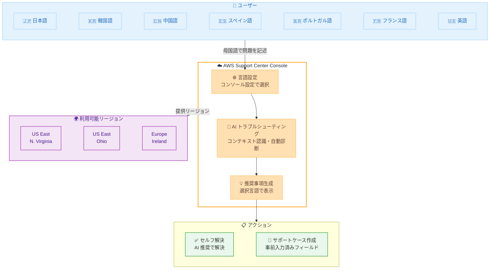

# AWS Support Center Console の AI トラブルシューティングが 7 言語追加対応

**リリース日**: 2026 年 2 月 12 日
**サービス**: AWS Support
**機能**: AI トラブルシューティングの多言語サポート

📊 [このアップデートのインフォグラフィックを見る](https://takech9203.github.io/aws-news-summary/20260212-ai-troubleshooting-in-aws-support-center.html)

## 概要

AWS Support Center Console の AI トラブルシューティング機能が、英語に加えて**日本語を含む 7 つの言語**に対応しました。新たにサポートされた言語は、日本語、韓国語、中国語 (簡体字)、中国語 (繁体字)、スペイン語、ポルトガル語、フランス語です。これまで英語のみで提供されていた AI トラブルシューティング機能が多言語化されたことで、母国語で AWS の問題解決支援を受けられるようになりました。

**日本のユーザーにとって特に重要なアップデート**です。日本語がサポートされたことで、日本の開発者やエンジニアは、サポートケース作成時に AI が生成するインサイトや解決策を日本語で受け取ることができ、問題の理解と修正にかかる時間を大幅に短縮できます。

**アップデート前の課題**

- AI トラブルシューティング機能は英語のみで提供されており、英語以外の言語を使用するユーザーにとって利用のハードルが高かった
- 日本語環境で作業するエンジニアは、AI の推奨事項を英語で読み解く必要があり、問題解決に余分な時間がかかっていた
- 言語の壁がセルフサービスサポートの活用を妨げていた

**アップデート後の改善**

- 日本語を含む 7 つの言語で AI トラブルシューティングが利用可能に
- コンソール設定で対応言語を選択するだけで、母国語での AI 支援を受けられる
- サポートプランに関係なく、すべてのユーザーが利用可能

## アーキテクチャ図

ユーザーがコンソール設定で言語を選択すると、AI トラブルシューティングが選択された言語でインサイトと推奨事項を提供します。

## サービスアップデートの詳細

### 主要機能

1. **7 言語の追加サポート**
   - 日本語、韓国語、中国語 (簡体字)、中国語 (繁体字)、スペイン語、ポルトガル語、フランス語
   - 既存の英語サポートに加えて、合計 8 言語で利用可能

2. **AI トラブルシューティングの機能**
   - サポートケース作成時に即座にコンテキストに基づいた推奨事項を提供
   - 自然言語で問題を記述し、AI が自動的に診断とソリューションを提示
   - Amazon Q との会話をインポートしてトラブルシューティングのコンテキストを維持

3. **すべてのサポートプランで利用可能**
   - Basic、Developer、Business、Enterprise、Unified Operations のすべてのプランで利用可能
   - Business Support 以上のプランでは技術的な問題のトラブルシューティングにも対応
   - Basic プランでは一般的な質問やアカウント・請求関連の問題に対応

### 日本語サポートの詳細

日本語が AI トラブルシューティングでサポートされたことにより、以下の体験が可能になります。

- **問題の記述**: 日本語で自然な文章で問題を説明
- **AI 診断**: 日本語で AI が生成するインサイトと潜在的な解決策を受信
- **推奨事項の理解**: 技術的な推奨事項を日本語で確認し、実装にかかる時間を短縮
- **サポートケース作成**: AI が事前入力したフィールドを日本語で確認・編集

## 技術仕様

### 対応言語一覧

| 言語 | コード | 新規/既存 |
|------|--------|-----------|
| English | en | 既存 |
| 日本語 | ja | **新規** |
| 韓国語 | ko | **新規** |
| 中国語 (簡体字) | zh-CN | **新規** |
| 中国語 (繁体字) | zh-TW | **新規** |
| スペイン語 | es | **新規** |
| ポルトガル語 | pt | **新規** |
| フランス語 | fr | **新規** |

### AI トラブルシューティングの主要機能

| 機能 | 説明 |
|------|------|
| 即時応答 | 問題の記述後、即座に関連する解決策を提供 |
| コンテキスト保持 | Amazon Q との会話履歴をインポートしてコンテキストを維持 |
| 自然言語入力 | フォームフィールドではなく、自然言語で問題を記述 |
| インテリジェントフォローアップ | AWS 環境に基づいた関連するフォローアップ質問を生成 |
| ケース自動入力 | AI がサポートケースのフィールドを自動入力 |

### サポートプランごとの利用範囲

| サポートプラン | 技術的な問題 | アカウント・請求の問題 | 一般的な質問 |
|----------------|--------------|------------------------|--------------|
| Basic | - | 対応 | 対応 |
| Developer | - | 対応 | 対応 |
| Business | 対応 | 対応 | 対応 |
| Enterprise | 対応 | 対応 | 対応 |
| Unified Operations | 対応 | 対応 | 対応 |

## 設定方法

### 前提条件

1. AWS アカウントへのアクセス権限
2. AWS Support Center Console へのアクセス権限
3. AI トラブルシューティングに必要な IAM 権限の設定

### 手順

#### ステップ 1: コンソールの言語設定を変更

1. AWS マネジメントコンソールにログイン
2. 画面左下の**言語設定** (歯車アイコン) をクリック
3. **サポートされている言語**から「日本語」を選択
4. 設定を保存

#### ステップ 2: AI トラブルシューティングへのアクセス

1. [AWS Support Center Console](https://console.aws.amazon.com/support/) にアクセス
2. ページ上部に表示される **"Try it now"** バナーをクリック
3. AI トラブルシューティング機能が日本語で起動

#### ステップ 3: AI トラブルシューティングの使用

1. 発生している問題を日本語で自然な文章で入力
2. AI が問題を分析し、日本語でインサイトと解決策を提示
3. 推奨事項に従って問題を解決、または必要に応じてサポートケースを作成

### IAM 権限の設定

AI トラブルシューティングを使用するには、適切な IAM 権限が必要です。AWS Support の IAM ポリシーについては、[IAM 権限の設定ドキュメント](https://docs.aws.amazon.com/awssupport/latest/user/support-interaction-perm.html)を参照してください。

## メリット

### ビジネス面

- **問題解決時間の短縮**: 母国語で AI の推奨事項を理解できるため、問題解決にかかる時間を大幅に削減
- **セルフサービスの促進**: 言語の壁がなくなることで、より多くのユーザーがセルフサービスで問題を解決可能に
- **追加コストなし**: すべてのサポートプランで利用可能であり、追加料金は不要
- **グローバルチームの生産性向上**: 多国籍チームの各メンバーが母国語でサポートを受けられる

### 技術面

- **コンテキスト認識型の診断**: AWS 環境の情報に基づいたパーソナライズされた解決策を提供
- **Amazon Q との統合**: 既存の Amazon Q 会話をインポートしてトラブルシューティングのコンテキストを維持
- **サポートケースの効率化**: AI が事前入力したフィールドにより、ケース作成の手間を削減
- **シームレスな体験**: サポート体験に統合されており、追加のツール設定が不要

## デメリット・制約事項

### 制限事項

- 利用可能なリージョンが US East (N. Virginia)、US East (Ohio)、Europe (Ireland) の 3 リージョンに限定
- 東京リージョン (ap-northeast-1) では提供されていないため、日本語を使用する場合でも対応リージョンへのアクセスが必要
- Basic プランでは技術的な問題のトラブルシューティングは利用できない

### 考慮すべき点

- AI が生成する推奨事項は参考情報であり、必ずしもすべてのケースで正確な解決策を提供するとは限らない
- 複雑な技術的問題の場合は、AI の推奨事項を参考にしつつ、サポートケースを作成して専門家に相談することを推奨
- 対応言語は 8 言語であり、その他の言語は現時点で未対応

## ユースケース

### ユースケース 1: 日本語環境での EC2 接続問題のトラブルシューティング

**シナリオ**: 日本の開発者が EC2 インスタンスへの接続問題を調査している

**手順**:
1. コンソール言語を日本語に設定
2. AWS Support Center Console の AI トラブルシューティングにアクセス
3. 「EC2 インスタンスに SSH 接続できません。セキュリティグループとネットワーク ACL は確認済みです。」と入力
4. AI が日本語でセキュリティグループの設定確認、ネットワーク経路の診断、インスタンスの状態確認などの推奨事項を提示

**効果**: 英語の技術文書を読み解く手間が省け、問題の原因特定と解決までの時間を短縮

### ユースケース 2: 多国籍チームでのサポート体験の統一

**シナリオ**: 日本、韓国、フランスにオフィスを持つグローバル企業が、各拠点のエンジニアに統一されたサポート体験を提供したい

**手順**:
1. 各拠点のエンジニアがそれぞれの言語でコンソールを設定
2. AI トラブルシューティングが各言語で問題解決を支援
3. 必要に応じて、各言語でサポートケースを作成

**効果**: 言語の壁がなくなり、各拠点のエンジニアが同等の品質でセルフサービスサポートを利用可能

### ユースケース 3: Basic プランユーザーのアカウント・請求問題の解決

**シナリオ**: AWS を利用開始したばかりの日本のスタートアップが、請求に関する疑問を解決したい

**手順**:
1. コンソール言語を日本語に設定
2. AI トラブルシューティングにアクセス
3. 「先月の請求額が予想より高いです。原因を調べたいです。」と入力
4. AI が日本語でコスト分析の方法、AWS Cost Explorer の使い方、予算アラートの設定方法などを推奨

**効果**: Basic プランでも日本語で AI 支援を受けられ、初期段階のユーザーでもスムーズに問題を解決

## 料金

AI トラブルシューティング機能に追加料金はかかりません。すべてのサポートプランのユーザーが無料で利用できます。

## 利用可能リージョン

AI トラブルシューティング機能は、以下の AWS リージョンで利用可能です。

| リージョン | リージョンコード |
|-----------|----------------|
| US East (N. Virginia) | us-east-1 |
| US East (Ohio) | us-east-2 |
| Europe (Ireland) | eu-west-1 |

## 関連サービス・機能

- **AWS Support Center Console**: サポートケースの作成・管理を行う AWS の主要インターフェース
- **Amazon Q**: AWS リソースに関する質問への回答やトラブルシューティングを支援する AI アシスタント
- **AWS Health Dashboard**: AWS サービスの障害やメンテナンス情報を確認するダッシュボード
- **AWS Trusted Advisor**: AWS 環境のベストプラクティスに基づく推奨事項を提供するサービス

## 参考リンク

- 📊 [インフォグラフィック](https://takech9203.github.io/aws-news-summary/20260212-ai-troubleshooting-in-aws-support-center.html)
- [公式発表 (What's New)](https://aws.amazon.com/about-aws/whats-new/2026/02/ai-troubleshooting-in-aws-support-center/)
- [AI トラブルシューティング ユーザーガイド](https://docs.aws.amazon.com/awssupport/latest/user/ai-enhanced-support.html)
- [IAM 権限の設定](https://docs.aws.amazon.com/awssupport/latest/user/support-interaction-perm.html)
- [AWS Support プランの比較](https://aws.amazon.com/premiumsupport/plans/)

## まとめ

AWS Support Center Console の AI トラブルシューティング機能が日本語を含む 7 つの言語に対応したことで、英語以外の言語を使用するユーザーも母国語で AI による問題解決支援を受けられるようになりました。特に日本のユーザーにとっては、日本語で問題を記述し、日本語で AI の推奨事項を受け取れるようになった点が大きな改善です。この機能はすべてのサポートプランで追加料金なしに利用可能であり、コンソール設定で言語を選択するだけで利用を開始できます。US East (N. Virginia)、US East (Ohio)、Europe (Ireland) の 3 リージョンで利用可能ですので、これらのリージョンにアクセスして AI トラブルシューティング機能の日本語体験を試すことをお勧めします。
