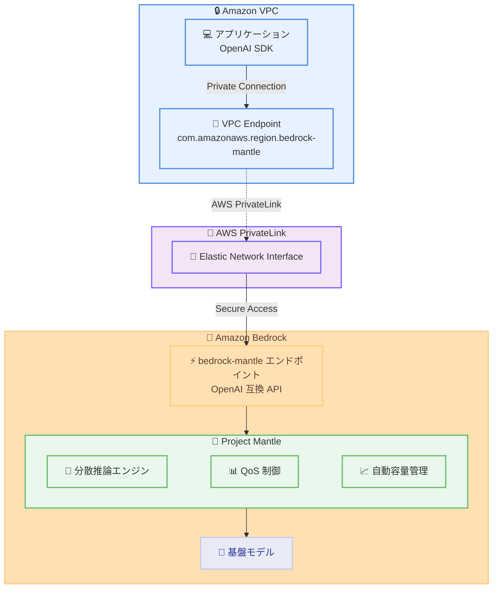

# Amazon Bedrock - AWS PrivateLink サポートの拡大 (OpenAI API 互換エンドポイント)

**リリース日**: 2026年02月12日
**サービス**: Amazon Bedrock
**機能**: bedrock-mantle エンドポイントに対する AWS PrivateLink サポートの追加

📊 [このアップデートのインフォグラフィックを見る](https://takech9203.github.io/20260212-amazon-bedrock-expands-aws-privatelink-support-openai-api-endpoints.html)

## 概要

Amazon Bedrock が AWS PrivateLink のサポートを拡大し、bedrock-mantle エンドポイントに対応しました。bedrock-mantle エンドポイントは、Amazon Bedrock 上の大規模機械学習モデルサービングのための新しい分散推論エンジンである Project Mantle によって駆動されています。これにより、OpenAI API 互換エンドポイントへのプライベートアクセスが可能になりました。

Amazon Bedrock はこれまで bedrock-runtime エンドポイントに対する PrivateLink をサポートしていましたが、今回のアップデートにより bedrock-mantle エンドポイントにも対応しました。Project Mantle は、新しいモデルのオンボーディングの簡素化、高性能で信頼性の高いサーバーレス推論、高度な QoS (Quality of Service) 制御、自動容量管理、OpenAI API 仕様との互換性を提供します。

**アップデート前の課題**

- bedrock-mantle エンドポイントへのアクセスはパブリックインターネット経由のみで、VPC からのプライベート接続ができなかった
- OpenAI API 互換エンドポイントを使用する際に、厳格なセキュリティ要件を持つ組織ではネットワーク分離の実現が困難だった
- bedrock-runtime エンドポイントでは PrivateLink が利用可能だったが、bedrock-mantle エンドポイントでは対応していなかった

**アップデート後の改善**

- bedrock-mantle エンドポイントに対して VPC エンドポイント (インターフェースエンドポイント) を作成し、プライベート接続が可能になった
- OpenAI API 互換エンドポイントへのトラフィックが AWS ネットワーク内に留まり、パブリックインターネットへの露出を回避できるようになった
- bedrock、bedrock-runtime、bedrock-mantle、bedrock-agent、bedrock-agent-runtime の全エンドポイントで PrivateLink が利用可能になった

## アーキテクチャ図



VPC 内のアプリケーションから AWS PrivateLink を経由して bedrock-mantle エンドポイントにプライベートに接続し、Project Mantle が駆動する OpenAI API 互換の推論サービスを利用する構成を示しています。

## サービスアップデートの詳細

### 主要機能

1. **bedrock-mantle エンドポイントの PrivateLink 対応**
   - VPC エンドポイント (インターフェースエンドポイント) を作成し、bedrock-mantle エンドポイントにプライベート接続が可能
   - サービス名: `com.amazonaws.region.bedrock-mantle`
   - プライベート DNS を有効にすると、デフォルトのリージョナル DNS 名 `bedrock-mantle.region.api.aws` で API リクエストが可能

2. **Project Mantle による分散推論エンジン**
   - 新しいモデルのオンボーディングを簡素化し迅速化
   - 高性能で信頼性の高いサーバーレス推論を提供
   - 高度な QoS 制御と自動容量管理を実現
   - 統合プールによるリソース効率の最適化

3. **OpenAI API 互換性**
   - Responses API と Chat Completions API をサポート
   - 既存の OpenAI SDK およびツールとの互換性
   - ベース URL と API キーの変更のみで既存アプリケーションを移行可能
   - サーバーサイドおよびクライアントサイドのツール使用をサポート

## 技術仕様

### Amazon Bedrock エンドポイント一覧

| エンドポイント | 用途 | PrivateLink サービス名 |
|--------------|------|----------------------|
| bedrock | コントロールプレーン操作 | `com.amazonaws.region.bedrock` |
| bedrock-runtime | ネイティブ API 推論 | `com.amazonaws.region.bedrock-runtime` |
| bedrock-mantle | OpenAI 互換 API 推論 | `com.amazonaws.region.bedrock-mantle` |
| bedrock-agent | エージェントビルドタイム | `com.amazonaws.region.bedrock-agent` |
| bedrock-agent-runtime | エージェントランタイム | `com.amazonaws.region.bedrock-agent-runtime` |

### bedrock-mantle と bedrock-runtime の比較

| 項目 | bedrock-mantle | bedrock-runtime |
|------|---------------|-----------------|
| サポート API | Responses API、Chat Completions API | InvokeModel、Converse、Chat Completions API |
| API 互換性 | OpenAI API 互換 | Amazon Bedrock ネイティブ API |
| ツール使用 | クライアントサイド + サーバーサイド | クライアントサイドのみ |
| 推奨対象 | Amazon Bedrock の新規ユーザー、OpenAI からの移行 | 全モデルの利用、詳細な制御が必要な場合 |

### VPC エンドポイントポリシー例

bedrock-mantle エンドポイントに対するカスタムエンドポイントポリシーの例です。

```json
{
   "Version": "2012-10-17",
   "Statement": [
      {
         "Principal": "*",
         "Effect": "Allow",
         "Action": [
            "bedrock-mantle:CreateInference"
         ],
         "Resource": "*"
      }
   ]
}
```

## 設定方法

### 前提条件

1. AWS アカウントと適切な IAM 権限
2. Amazon VPC の作成と設定
3. Amazon Bedrock の API キーの取得
4. OpenAI SDK のインストール (SDK 経由で利用する場合)

### 手順

#### ステップ 1: VPC エンドポイントの作成

```bash
aws ec2 create-vpc-endpoint \
  --vpc-id vpc-xxxxxxxxx \
  --vpc-endpoint-type Interface \
  --service-name com.amazonaws.ap-northeast-1.bedrock-mantle \
  --subnet-ids subnet-xxxxxxxxx \
  --security-group-ids sg-xxxxxxxxx
```

bedrock-mantle エンドポイントへのインターフェース VPC エンドポイントを作成します。リージョンは利用するリージョンに置き換えてください。

#### ステップ 2: プライベート DNS の有効化

VPC エンドポイントの作成時に「Enable Private DNS Name」を有効にすることで、デフォルトのリージョナル DNS 名 `bedrock-mantle.region.api.aws` を使用して API リクエストを送信できます。

#### ステップ 3: 環境変数の設定と接続テスト

```bash
# 環境変数を設定
export OPENAI_API_KEY="your-bedrock-api-key"
export OPENAI_BASE_URL="https://bedrock-mantle.ap-northeast-1.api.aws/v1"
```

環境変数を設定し、VPC 内のインスタンスから bedrock-mantle エンドポイントにプライベートに接続します。

#### ステップ 4: OpenAI SDK を使用した接続確認

```python
from openai import OpenAI

client = OpenAI()

# 利用可能なモデルを一覧表示
models = client.models.list()
for model in models.data:
    print(model.id)

# Chat Completions API を使用して推論を実行
completion = client.chat.completions.create(
    model="openai.gpt-oss-120b",
    messages=[
        {"role": "system", "content": "You are a helpful assistant."},
        {"role": "user", "content": "Hello!"}
    ]
)
print(completion.choices[0].message)
```

OpenAI SDK を使用して bedrock-mantle エンドポイントに接続し、モデルの一覧表示と推論を実行します。

## メリット

### ビジネス面

- **セキュリティコンプライアンスの強化**: トラフィックがパブリックインターネットを経由しないため、厳格なセキュリティ要件を満たしやすい
- **移行コストの削減**: OpenAI API 互換性により、既存アプリケーションのベース URL と API キーの変更のみで移行が可能
- **運用効率の向上**: Project Mantle の自動容量管理と QoS 制御により、インフラストラクチャ管理の負担を軽減

### 技術面

- **ネットワーク分離**: VPC 内からのプライベート接続により、データの安全性を確保
- **柔軟な推論オプション**: 同期/非同期推論、ストリーミング/非ストリーミングレスポンスをサポート
- **ステートフル会話管理**: Responses API により、会話履歴を手動で渡すことなくコンテキストを自動再構築
- **エンドポイントポリシーによるアクセス制御**: IAM ベースのきめ細かなアクセス制御が可能

## デメリット・制約事項

### 制限事項

- PrivateLink を使用する場合、VPC エンドポイントの追加料金が発生する
- bedrock-mantle エンドポイントで利用可能なモデルは、bedrock-runtime エンドポイントと異なる場合がある
- bedrock-mantle エンドポイントでは使用量とコストのトラッキング機能が bedrock-runtime と異なる場合がある

### 考慮すべき点

- VPC エンドポイントのセキュリティグループとネットワーク ACL を適切に設定する必要がある
- プライベート DNS を有効にする場合、VPC の DNS 設定が正しく構成されている必要がある
- OpenAI SDK のバージョンによっては、一部の機能がサポートされない場合がある

## ユースケース

### ユースケース 1: OpenAI API からの安全な移行

**シナリオ**: 金融機関が既存の OpenAI API ベースのアプリケーションを、セキュリティ要件を満たしながら Amazon Bedrock に移行する。

**実装例**:
```python
from openai import OpenAI

# ベース URL を Amazon Bedrock に変更するだけで移行可能
client = OpenAI(
    api_key="your-bedrock-api-key",
    base_url="https://bedrock-mantle.ap-northeast-1.api.aws/v1"
)

response = client.chat.completions.create(
    model="openai.gpt-oss-120b",
    messages=[{"role": "user", "content": "分析レポートを作成してください"}]
)
```

**効果**: VPC 内からの PrivateLink 接続により、トラフィックがパブリックインターネットを経由せず、金融機関のセキュリティ要件を満たしながら、最小限のコード変更で移行を実現。

### ユースケース 2: エージェントワークフローのプライベート実行

**シナリオ**: 企業がサーバーサイドツール使用を含むエージェントワークフローを、VPC 内でプライベートに実行する。

**実装例**:
```python
from openai import OpenAI

client = OpenAI()

# Responses API を使用したステートフル会話
response = client.responses.create(
    model="openai.gpt-oss-120b",
    input=[
        {"role": "user", "content": "前回の分析結果に基づいてレポートを更新してください"}
    ]
)
```

**効果**: PrivateLink を使用することで、エージェントワークフローのトラフィックが AWS ネットワーク内に留まり、機密データの安全性を確保しながらステートフルな会話管理を実現。

### ユースケース 3: 日本リージョンでの低レイテンシ AI アプリケーション

**シナリオ**: 日本企業が東京リージョンで PrivateLink を使用し、低レイテンシで AI アプリケーションを運用する。

**実装例**:
```bash
# 東京リージョンに VPC エンドポイントを作成
aws ec2 create-vpc-endpoint \
  --vpc-id vpc-xxxxxxxxx \
  --vpc-endpoint-type Interface \
  --service-name com.amazonaws.ap-northeast-1.bedrock-mantle \
  --subnet-ids subnet-xxxxxxxxx \
  --security-group-ids sg-xxxxxxxxx
```

**効果**: 東京リージョンでの PrivateLink 接続により、低レイテンシでの推論アクセスとデータの国内保持を実現。

## 料金

AWS PrivateLink の料金は、VPC エンドポイントの使用に対して課金されます。bedrock-mantle エンドポイント自体の推論料金は、使用するモデルとリクエスト量に基づきます。

### 料金例

| 項目 | 料金 (概算) |
|------|-------------|
| VPC エンドポイント (時間あたり) | $0.01 USD/時間 |
| データ処理 (GB あたり) | $0.01 USD/GB |
| 推論料金 | モデルおよびリクエスト量に依存 |

詳細な料金については [Amazon Bedrock 料金ページ](https://aws.amazon.com/bedrock/pricing/) および [AWS PrivateLink 料金ページ](https://aws.amazon.com/privatelink/pricing/) を参照してください。

## 利用可能リージョン

bedrock-mantle エンドポイントの AWS PrivateLink サポートは、以下のリージョンで利用可能です。

| リージョン名 | リージョンコード | エンドポイント |
|-------------|----------------|--------------|
| 米国東部 (バージニア北部) | us-east-1 | bedrock-mantle.us-east-1.api.aws |
| 米国東部 (オハイオ) | us-east-2 | bedrock-mantle.us-east-2.api.aws |
| 米国西部 (オレゴン) | us-west-2 | bedrock-mantle.us-west-2.api.aws |
| アジアパシフィック (ジャカルタ) | ap-southeast-3 | bedrock-mantle.ap-southeast-3.api.aws |
| アジアパシフィック (東京) | ap-northeast-1 | bedrock-mantle.ap-northeast-1.api.aws |
| アジアパシフィック (ムンバイ) | ap-south-1 | bedrock-mantle.ap-south-1.api.aws |
| アジアパシフィック (シドニー) | ap-southeast-2 | bedrock-mantle.ap-southeast-2.api.aws |
| 南米 (サンパウロ) | sa-east-1 | bedrock-mantle.sa-east-1.api.aws |
| ヨーロッパ (フランクフルト) | eu-central-1 | bedrock-mantle.eu-central-1.api.aws |
| ヨーロッパ (アイルランド) | eu-west-1 | bedrock-mantle.eu-west-1.api.aws |
| ヨーロッパ (ロンドン) | eu-west-2 | bedrock-mantle.eu-west-2.api.aws |
| ヨーロッパ (ミラノ) | eu-south-1 | bedrock-mantle.eu-south-1.api.aws |
| ヨーロッパ (ストックホルム) | eu-north-1 | bedrock-mantle.eu-north-1.api.aws |

東京リージョン (ap-northeast-1) が含まれています。

## 関連サービス・機能

- **AWS PrivateLink**: VPC から AWS サービスへのプライベート接続を提供
- **Amazon VPC**: 仮想ネットワーク環境を提供し、ネットワーク分離を実現
- **Amazon Bedrock Runtime**: ネイティブ API (InvokeModel、Converse) による推論エンドポイント
- **Amazon Bedrock Agents**: エージェントワークフローの構築と実行
- **AWS IAM**: API キーと IAM ポリシーによるアクセス制御

## 参考リンク

- 📊 [インフォグラフィック](https://takech9203.github.io/20260212-amazon-bedrock-expands-aws-privatelink-support-openai-api-endpoints.html)
- [公式発表 (What's New)](https://aws.amazon.com/about-aws/whats-new/2026/02/amazon-bedrock-expands-aws-privatelink-support-openai-api-endpoints/)
- [ドキュメント: VPC エンドポイントの使用](https://docs.aws.amazon.com/bedrock/latest/userguide/vpc-interface-endpoints.html)
- [ドキュメント: OpenAI API 互換エンドポイント](https://docs.aws.amazon.com/bedrock/latest/userguide/bedrock-mantle.html)
- [ドキュメント: Amazon Bedrock エンドポイント](https://docs.aws.amazon.com/bedrock/latest/userguide/endpoints.html)
- [Amazon Bedrock 料金ページ](https://aws.amazon.com/bedrock/pricing/)

## まとめ

Amazon Bedrock の AWS PrivateLink サポート拡大により、bedrock-mantle エンドポイント (OpenAI API 互換) へのプライベートアクセスが可能になりました。Project Mantle が提供する分散推論エンジンの高性能なサーバーレス推論を、VPC 内からセキュアに利用できます。東京リージョンを含む 13 リージョンで利用可能であり、既存の OpenAI API ベースのアプリケーションを最小限のコード変更で安全に移行したい組織にとって、重要なアップデートです。
