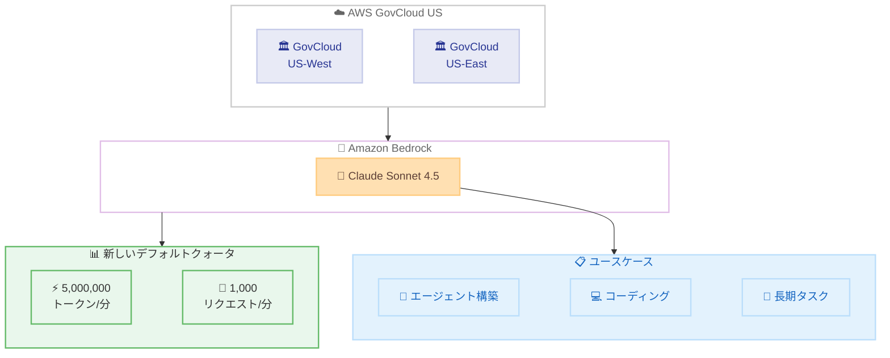

# Amazon Bedrock - Claude Sonnet 4.5 のデフォルトクォータが AWS GovCloud (US) で 25 倍に増加

**リリース日**: 2026 年 2 月 12 日
**サービス**: Amazon Bedrock
**機能**: Claude Sonnet 4.5 の AWS GovCloud (US) デフォルトクォータ増加

📊 [このアップデートのインフォグラフィックを見る](https://takech9203.github.io/aws-news-summary/20260212-amazon-bedrock-s4.5-quota-aws-govcloud-us.html)

## 概要

Amazon Bedrock が、AWS GovCloud (US-West) および AWS GovCloud (US-East) における Anthropic Claude Sonnet 4.5 のデフォルトクォータを **25 倍**に引き上げました。新しいクォータは、**毎分 5,000,000 トークン** (TPM) および**毎分 1,000 リクエスト** (RPM) となり、商用 AWS リージョンと同等の水準に統一されました。

Claude Sonnet 4.5 は Anthropic の最新 Sonnet モデルであり、複雑なエージェントの構築、コーディング、長期的なタスクの処理に優れ、大量のユースケースに対して最適な速度とコスト効率を提供します。

**アップデート前の課題**

- AWS GovCloud (US) リージョンのデフォルトクォータが商用リージョンより大幅に低く、規制環境での AI ワークロードのスケーリングに制約があった
- 大規模なエージェントワークフローやバッチ処理を実行する際に、クォータ上限に達しやすくスループットが制限されていた
- クォータ引き上げリクエストを個別に申請する必要があり、迅速なスケーリングが困難だった

**アップデート後の改善**

- デフォルトクォータが 25 倍に増加し、毎分 5,000,000 トークン、毎分 1,000 リクエストが利用可能
- 商用 AWS リージョンと同等のクォータとなり、GovCloud でも大規模な AI ワークロードを効率的にスケーリング可能
- クォータ引き上げリクエストなしで、より多くのワークロードに対応可能

## アーキテクチャ図



AWS GovCloud (US) の両リージョンで Claude Sonnet 4.5 のデフォルトクォータが商用リージョンと同等に引き上げられ、規制環境での大規模 AI ワークロードの実行が可能になりました。

## サービスアップデートの詳細

### 主要機能

1. **デフォルトクォータの 25 倍増加**
   - 毎分トークン数 (TPM) が 5,000,000 に増加
   - 毎分リクエスト数 (RPM) が 1,000 に増加
   - クォータ引き上げリクエストなしでデフォルトで利用可能

2. **商用リージョンとの統一**
   - AWS GovCloud (US-West) と AWS GovCloud (US-East) の両方で適用
   - 商用 AWS リージョンと同じクォータ水準に統一
   - GovCloud 環境での AI ワークロードのスケーラビリティを大幅に向上

3. **Claude Sonnet 4.5 の特長**
   - 複雑なエージェントの構築に最適化
   - コーディングタスクにおいて高い性能を発揮
   - 長期的なタスクの処理に優れた持続性
   - 大量のユースケースに対して最適な速度とコスト効率を提供

## 技術仕様

### クォータ比較

| 項目 | アップデート前 | アップデート後 | 増加倍率 |
|------|--------------|--------------|----------|
| トークン/分 (TPM) | 200,000 | 5,000,000 | 25 倍 |
| リクエスト/分 (RPM) | 40 | 1,000 | 25 倍 |

### 対象リージョン

| リージョン | リージョンコード |
|-----------|----------------|
| AWS GovCloud (US-West) | us-gov-west-1 |
| AWS GovCloud (US-East) | us-gov-east-1 |

## 設定方法

### 前提条件

1. AWS GovCloud (US) アカウントを保有していること
2. Amazon Bedrock へのアクセス権限があること
3. Claude Sonnet 4.5 のモデルアクセスが有効化されていること

### 手順

このアップデートはデフォルトクォータの引き上げであるため、ユーザー側の設定変更は不要です。クォータは自動的に適用されます。

#### ステップ 1: 現在のクォータの確認

AWS Service Quotas コンソールまたは AWS CLI を使用して、現在のクォータを確認できます。

```bash
aws service-quotas get-service-quota \
  --service-code bedrock \
  --quota-code <quota-code> \
  --region us-gov-west-1
```

#### ステップ 2: Claude Sonnet 4.5 の呼び出し

新しいクォータの範囲内で、Claude Sonnet 4.5 を呼び出します。

```python
import boto3
import json

bedrock_runtime = boto3.client('bedrock-runtime', region_name='us-gov-west-1')

response = bedrock_runtime.invoke_model(
    modelId='anthropic.claude-sonnet-4-5-v1:0',
    body=json.dumps({
        "anthropic_version": "bedrock-2023-05-31",
        "max_tokens": 1024,
        "messages": [
            {
                "role": "user",
                "content": "Hello, Claude!"
            }
        ]
    })
)

result = json.loads(response['body'].read())
print(result['content'][0]['text'])
```

#### ステップ 3: トークン使用量のモニタリング

Amazon CloudWatch を使用して、トークン使用量とリクエスト数をモニタリングし、クォータの利用状況を把握します。

## メリット

### ビジネス面

- **スケーラビリティの向上**: 規制環境においても商用リージョンと同等の規模で AI ワークロードを実行可能
- **迅速な展開**: クォータ引き上げリクエストの待ち時間なしで、大規模なワークロードをすぐに開始可能
- **コンプライアンスの維持**: GovCloud 環境のセキュリティとコンプライアンス要件を満たしながら、AI の活用を拡大可能

### 技術面

- **スループットの改善**: 毎分 5,000,000 トークンにより、大量の推論リクエストを処理可能
- **並行処理の強化**: 毎分 1,000 リクエストにより、多数の同時リクエストを効率的に処理
- **商用リージョンとの一貫性**: 商用リージョンと GovCloud 間でアプリケーションの動作を統一しやすくなる

## デメリット・制約事項

### 制限事項

- AWS GovCloud (US) アカウントが必要であり、一般の AWS アカウントからは利用不可
- デフォルトクォータの引き上げは Claude Sonnet 4.5 に対するものであり、他のモデルのクォータは別途確認が必要
- さらに高いクォータが必要な場合は、AWS Service Quotas を通じて個別にリクエストする必要がある

### 考慮すべき点

- トークン使用量が増加するとコストも比例して増加するため、CloudWatch でのモニタリングと予算管理が重要
- 出力トークンのバーンダウンレートがモデルによって異なる場合があるため、実効的なクォータを確認すること

## ユースケース

### ユースケース 1: 政府機関のドキュメント処理

**シナリオ**: 政府機関が大量の機密文書の分類、要約、分析を AI で自動化したい

**効果**: 25 倍に引き上げられたクォータにより、毎分 5,000,000 トークンの処理が可能となり、大量のドキュメントを効率的にバッチ処理できる。GovCloud 環境でデータの機密性を保ちながら、大規模な AI ワークロードを実行可能。

### ユースケース 2: 規制環境でのエージェントワークフロー

**シナリオ**: 防衛関連企業が、セキュリティ要件を満たした環境で複雑なマルチステップ AI エージェントを運用したい

**効果**: 毎分 1,000 リクエストのクォータにより、複数のエージェントが同時に動作するワークフローを GovCloud 環境内で安定して実行できる。商用リージョンと同等のパフォーマンスで、規制要件を満たした AI ソリューションを構築可能。

### ユースケース 3: コーディング支援の大規模展開

**シナリオ**: 政府系 IT 組織が、開発者向けの AI コーディング支援ツールを GovCloud 環境で展開したい

**効果**: 引き上げられたクォータにより、多数の開発者が同時に AI コーディング支援を利用しても、レート制限に達することなく安定したサービスを提供できる。

## 料金

クォータの引き上げ自体に追加料金はかかりません。Amazon Bedrock の Claude Sonnet 4.5 の使用料金は、入力トークンと出力トークンの使用量に基づくオンデマンド方式です。

詳細は [Amazon Bedrock 料金ページ](https://aws.amazon.com/bedrock/pricing/) を参照してください。

## 利用可能リージョン

このクォータ引き上げは、以下の AWS GovCloud (US) リージョンで適用されています。

| リージョン | リージョンコード |
|-----------|----------------|
| AWS GovCloud (US-West) | us-gov-west-1 |
| AWS GovCloud (US-East) | us-gov-east-1 |

## 関連サービス・機能

- **Amazon Bedrock Reserved Tier**: GovCloud (US-West) で予測可能なパフォーマンスと保証された容量を提供するサービス Tier
- **AWS Service Quotas**: クォータの確認と引き上げリクエストを管理するサービス
- **Amazon CloudWatch**: トークン使用量やリクエスト数のモニタリングに使用
- **Anthropic Claude Sonnet 4.5**: Amazon Bedrock で利用可能な Anthropic の最新 Sonnet モデル

## 参考リンク

- 📊 [インフォグラフィック](https://takech9203.github.io/aws-news-summary/20260212-amazon-bedrock-s4.5-quota-aws-govcloud-us.html)
- [公式発表 (What's New)](https://aws.amazon.com/about-aws/whats-new/2026/02/amazon-bedrock-s4.5-quota-aws-govcloud-us/)
- [Amazon Bedrock クォータドキュメント](https://docs.aws.amazon.com/bedrock/latest/userguide/quotas.html)
- [Anthropic Claude in Amazon Bedrock](https://aws.amazon.com/bedrock/claude/)
- [Amazon Bedrock 料金ページ](https://aws.amazon.com/bedrock/pricing/)
- [Claude Sonnet 4.5 紹介ブログ](https://aws.amazon.com/blogs/aws/introducing-claude-sonnet-4-5-in-amazon-bedrock-anthropics-most-intelligent-model-best-for-coding-and-complex-agents/)

## まとめ

Amazon Bedrock が AWS GovCloud (US-West) および AWS GovCloud (US-East) における Claude Sonnet 4.5 のデフォルトクォータを 25 倍に引き上げ、毎分 5,000,000 トークンおよび毎分 1,000 リクエストに増加しました。これにより、商用 AWS リージョンと同等のスケーラビリティが GovCloud 環境でも利用可能となり、規制要件を満たしながら大規模な AI ワークロードを効率的に実行できるようになりました。GovCloud で生成 AI アプリケーションを運用している組織は、追加の設定変更なしにこの引き上げの恩恵を受けることができます。
