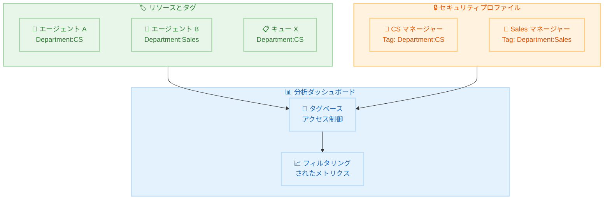

# Amazon Connect - 分析ダッシュボード向けきめ細かなアクセス制御

**リリース日**: 2026 年 2 月 12 日
**サービス**: Amazon Connect
**機能**: 分析ダッシュボード向けタグベースアクセス制御

📊 [このアップデートのインフォグラフィックを見る](https://takech9203.github.io/aws-news-summary/20260212-amazon-connect-launches-granular-access.html)

## 概要

Amazon Connect が分析ダッシュボード向けにきめ細かなアクセス制御機能をリリースしました。リソースタグを使用して、エージェント、キュー、ルーティングプロファイルなどの特定リソースに対するメトリクスの表示権限を制御できるようになります。

この機能により、タグを使用してメトリクスをフィルタリングし、同一タグを持つエージェントやキューの集計メトリクスを表示できます。例えば、エージェントに `Department:Customer Service` タグを付与することで、カスタマーサービスチームのマネージャーのみがそのエージェントのダッシュボードメトリクスを閲覧できるように制限できます。

**アップデート前の課題**

- ダッシュボードのメトリクスに対するアクセス制御が粗く、部門やチーム単位での表示制限が困難だった
- マネージャーが自チームのメトリクスのみを確認するためのフィルタリングオプションが限定的だった
- 組織の階層構造に基づいた柔軟なアクセス制御の実現が難しかった

**アップデート後の改善**

- リソースタグを使用して、ダッシュボード上のメトリクス表示をリソース単位で制御可能
- タグベースのフィルタリングにより、特定の部門やチームに関連するメトリクスのみを表示
- セキュリティプロファイルとタグの組み合わせにより、組織構造に沿ったきめ細かなアクセス管理を実現

## アーキテクチャ図



リソースに付与されたタグとセキュリティプロファイルのアクセス制御タグが照合され、ダッシュボードに表示されるメトリクスがフィルタリングされる仕組みを示しています。

## サービスアップデートの詳細

### 主要機能

1. **リソースタグによるアクセス制御**
   - エージェント、キュー、ルーティングプロファイルにタグを付与
   - フロー、フローモジュール、評価フォーム、テストケースにもタグベースのアクセス制御を適用可能
   - タグに基づいてダッシュボードに表示されるメトリクスを自動的にフィルタリング

2. **タグベースメトリクスフィルタリング**
   - 同一タグを持つリソースの集計メトリクスを表示
   - タグフィルターで「All accessible tags」を選択し、権限範囲内のデータのみを表示
   - セキュリティプロファイルに設定されたタグに基づく自動制御

3. **サポート対象レポート**
   - ダッシュボード: ユーザー、キュー、ルーティングプロファイル、フロー、フローモジュール、評価フォーム、テストケースのアクセス制御
   - リアルタイムメトリクス: ユーザー、キュー、ルーティングプロファイルのアクセス制御
   - 履歴メトリクス: ユーザー、キュー、ルーティングプロファイルのアクセス制御
   - エージェントアクティビティ監査: ユーザーのみのアクセス制御

## 技術仕様

### サポート対象

| レポートタイプ | サポートリソース | 備考 |
|-------------|----------------|------|
| ダッシュボード | ユーザー、キュー、ルーティングプロファイル、フロー、フローモジュール、評価フォーム、テストケース | 全リソースタイプ対応 |
| リアルタイムメトリクス | ユーザー、キュー、ルーティングプロファイル | 最大 500 リソース表示 |
| 履歴メトリクス | ユーザー、キュー、ルーティングプロファイル | - |
| エージェントアクティビティ監査 | ユーザー | ユーザーのみ |

### 非サポート

| 項目 | 説明 |
|------|------|
| Agent Queues | アクセス制御非対応 |
| ログイン/ログアウトレポート | 非サポート |
| スケジュールレポート | 非サポート |

### セキュリティプロファイル権限

タグベースアクセス制御を有効にするには、以下の権限が必要です。

| 権限カテゴリ | 必要な権限 |
|------------|-----------|
| アクセスメトリクス | Access metrics - Access、または Dashboard - Access、Real-time metrics - Access、Historical metrics - Access のいずれか |
| リソースビュー | Routing profiles - View、Queues - View、Users - View、Flows - View、Flow modules - View など |

### データ保持に関する注意事項

2026 年 1 月 15 日以降、タグベースアクセス制御が有効なダッシュボードの履歴データは 2 か月間分から開始し、1 日ずつ増加して 2026 年 2 月 15 日に 3 か月分に達します。

## 設定方法

### 前提条件

1. Amazon Connect インスタンスが構成済みであること
2. 制御対象のリソース (エージェント、キュー、ルーティングプロファイル) が作成済みであること
3. セキュリティプロファイルの編集権限を持つ管理者アカウント

### 手順

#### ステップ 1: リソースにタグを付与

制御対象のリソースにタグを付与します。

1. Amazon Connect 管理コンソールにサインイン
2. 対象リソース (ユーザー、キュー、ルーティングプロファイルなど) の設定画面を開く
3. タグセクションで、アクセス制御に使用するタグを追加 (例: `Department:CustomerService`)

API を使用してタグを付与することも可能です。

```bash
aws connect tag-resource \
  --resource-arn "arn:aws:connect:us-east-1:123456789012:instance/instance-id/agent/agent-id" \
  --tags '{"Department": "CustomerService"}'
```

リソースに部門タグを付与し、アクセス制御の基盤を構築します。

#### ステップ 2: セキュリティプロファイルにアクセス制御タグを設定

1. Amazon Connect 管理コンソールで「セキュリティプロファイル」を開く
2. 対象のセキュリティプロファイルを選択
3. **Show advanced** オプションを展開
4. アクセス制御タグとして、ステップ 1 で付与したタグ (例: `Department:CustomerService`) を設定
5. メトリクスアクセス権限 (Access metrics - Access または Dashboard - Access) を付与
6. リソースビュー権限 (Users - View、Queues - View など) を付与

#### ステップ 3: ダッシュボードでの確認

1. タグベースアクセス制御が設定されたユーザーでサインイン
2. ダッシュボードを開くと、セキュリティプロファイルのタグに一致するリソースのメトリクスのみが自動的に表示される
3. タグフィルターで「All accessible tags」を選択して、権限範囲内のデータを確認

## メリット

### ビジネス面

- **データガバナンスの強化**: 部門やチーム単位でメトリクスの可視性を制御し、情報の適切な管理を実現
- **マネージャーの業務効率化**: 自チームに関連するメトリクスのみが表示されるため、必要な情報に素早くアクセス
- **コンプライアンス対応**: データアクセスの粒度を細かく制御することで、規制要件への対応を支援

### 技術面

- **タグベースの柔軟な制御**: 既存の AWS タグ管理体系との統合により、一貫したアクセス制御ポリシーを適用
- **自動フィルタリング**: ダッシュボードとレポートが自動的にタグベースのアクセス制御を適用し、追加の手動設定が不要
- **複数レポートタイプ対応**: ダッシュボード、リアルタイムメトリクス、履歴メトリクスなど幅広いレポートで統一的に適用

## デメリット・制約事項

### 制限事項

- Agent Queues のアクセス制御は非対応
- ログイン/ログアウトレポートとスケジュールレポートは非サポート
- リソースタグの変更は結果整合性であり、反映に短い遅延が発生する可能性がある
- リアルタイムメトリクステーブルでは 1 テーブルあたり最大 500 リソースの表示に制限

### 考慮すべき点

- タグベースアクセス制御の導入前に、組織のタグ付け戦略を策定する必要がある
- 既存のセキュリティプロファイルとの整合性を確認し、意図しないアクセス制限が発生しないよう注意が必要
- 2026 年 1 月 15 日以前にタグベースアクセス制御を有効化していた環境では、新しい拡張体験への移行にサービスチームへの連絡が必要な場合がある

## ユースケース

### ユースケース 1: 部門別メトリクス管理

**シナリオ**: カスタマーサービス部門のマネージャーが自チームのエージェントパフォーマンスのみを確認したい

**実装例**:
```bash
# エージェントにタグを付与
aws connect tag-resource \
  --resource-arn "arn:aws:connect:us-east-1:123456789012:instance/inst-id/agent/agent-id" \
  --tags '{"Department": "CustomerService"}'

# キューにタグを付与
aws connect tag-resource \
  --resource-arn "arn:aws:connect:us-east-1:123456789012:instance/inst-id/queue/queue-id" \
  --tags '{"Department": "CustomerService"}'
```

**効果**: CS マネージャーは `Department:CustomerService` タグが付与されたエージェントとキューのメトリクスのみを閲覧可能

### ユースケース 2: 拠点別アクセス制御

**シナリオ**: 複数拠点のコンタクトセンターで、各拠点のスーパーバイザーが自拠点のメトリクスのみを確認する

**実装例**:
```bash
# 東京拠点のエージェントにタグを付与
aws connect tag-resource \
  --resource-arn "arn:aws:connect:ap-northeast-1:123456789012:instance/inst-id/agent/agent-id" \
  --tags '{"Location": "Tokyo"}'

# 大阪拠点のエージェントにタグを付与
aws connect tag-resource \
  --resource-arn "arn:aws:connect:ap-northeast-1:123456789012:instance/inst-id/agent/agent-id-2" \
  --tags '{"Location": "Osaka"}'
```

**効果**: 各拠点のスーパーバイザーが自拠点のパフォーマンスデータのみにアクセスし、拠点間のデータ隔離を実現

### ユースケース 3: レポート共有時のアクセス制御

**シナリオ**: 異なるセキュリティプロファイルを持つユーザー間でダッシュボードレポートを共有する

**実装例**:

1. ダッシュボードのタグフィルターで「All accessible tags」を選択
2. レポートを保存して共有

**効果**: レポートを受け取ったユーザーは、自身のセキュリティプロファイルのタグに基づいてフィルタリングされたデータのみを閲覧。同一レポートでも閲覧者ごとに適切なデータのみが表示される

## 料金

タグベースアクセス制御機能の利用に追加料金は発生しません。Amazon Connect の標準料金が適用されます。詳細は [Amazon Connect 料金ページ](https://aws.amazon.com/connect/pricing/) を参照してください。

## 利用可能リージョン

Amazon Connect が提供されているすべての AWS 商用リージョンおよび AWS GovCloud (US-West) リージョンで利用可能です。

## 関連サービス・機能

- **Amazon Connect Contact Lens**: 会話分析ダッシュボードでもタグベースアクセス制御をサポート
- **Amazon Connect セキュリティプロファイル**: タグベースアクセス制御の権限設定基盤
- **AWS Resource Groups & Tag Editor**: リソースタグの一括管理
- **Amazon Connect Cases**: ケースに対するタグベースアクセス制御もサポート

## 参考リンク

- 📊 [インフォグラフィック](https://takech9203.github.io/aws-news-summary/20260212-amazon-connect-launches-granular-access.html)
- [公式発表 (What's New)](https://aws.amazon.com/about-aws/whats-new/2026/02/amazon-connect-launches-granular-access/)
- [ドキュメント - ダッシュボードのタグベースアクセス制御](https://docs.aws.amazon.com/connect/latest/adminguide/dashboard-tag-based-access-control.html)
- [ドキュメント - ダッシュボード](https://docs.aws.amazon.com/connect/latest/adminguide/dashboards.html)
- [料金ページ](https://aws.amazon.com/connect/pricing/)

## まとめ

Amazon Connect の分析ダッシュボード向けきめ細かなアクセス制御は、コンタクトセンターのデータガバナンスを大幅に強化するアップデートです。リソースタグを活用したメトリクスの可視性制御により、部門やチーム単位での適切な情報管理が実現します。すべての AWS 商用リージョンと GovCloud (US-West) で利用可能であり、組織のセキュリティ要件に合わせたタグ付け戦略の策定と合わせて導入を推奨します。
