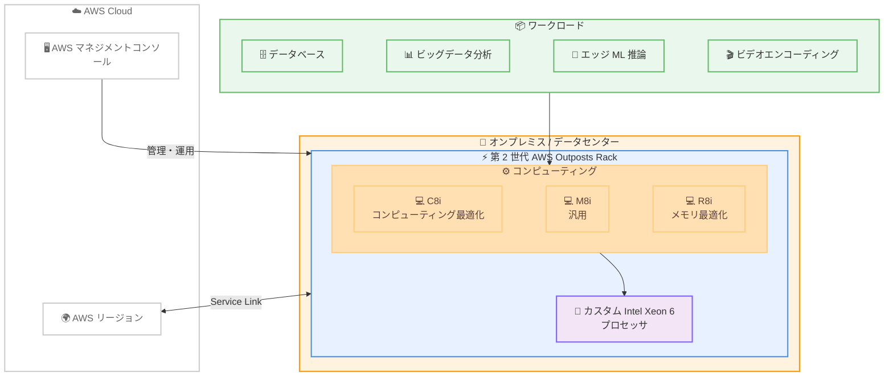

# Amazon EC2 C8i, M8i, R8i インスタンス - 第 2 世代 AWS Outposts racks 対応

**リリース日**: 2026年02月12日
**サービス**: Amazon EC2 on AWS Outposts
**機能**: 第 2 世代 AWS Outposts racks での C8i、M8i、R8i インスタンスのサポート

📊 [このアップデートのインフォグラフィックを見る](https://takech9203.github.io/20260212-amazon-ec2-c8i-m8i-and-r8i-instances-on-aws-outposts.html)

## 概要

Amazon EC2 C8i (コンピューティング最適化)、M8i (汎用)、R8i (メモリ最適化) インスタンスが、第 2 世代 AWS Outposts racks で利用可能になりました。これらのインスタンスは AWS 専用のカスタム Intel Xeon 6 プロセッサを搭載しており、第 2 世代 Outposts racks 上の C7i、M7i、R7i インスタンスと比較して 20% 優れたパフォーマンスと 2.5 倍のメモリ帯域幅を提供します。

さらに、同じラックスペースと電力消費で 20% 多いコンピューティング容量を提供するため、オンプレミスワークロードのスペースとエネルギー効率が向上します。データベース、メモリ集約型アプリケーション、リアルタイムビッグデータ分析、ビデオエンコーディング、エッジ ML 推論など、幅広いオンプレミスワークロードに適しています。

**アップデート前の課題**

- 第 2 世代 Outposts racks では C7i、M7i、R7i インスタンスが最新であり、より高いパフォーマンスが必要なワークロードへの対応が限定されていた
- メモリ帯域幅が制約となり、メモリ集約型のワークロードでボトルネックが生じる場合があった
- 同じラックスペースでのコンピューティング密度を向上させる選択肢がなかった

**アップデート後の改善**

- C8i、M8i、R8i インスタンスにより 20% 優れたパフォーマンスを実現
- 2.5 倍のメモリ帯域幅により、メモリ集約型ワークロードのパフォーマンスが大幅に向上
- 同じラックスペースと電力消費で 20% 多いコンピューティング容量を提供し、スペースとエネルギー効率が改善

## アーキテクチャ図



第 2 世代 AWS Outposts racks 上で C8i、M8i、R8i インスタンスが稼働し、カスタム Intel Xeon 6 プロセッサによる高性能なオンプレミスコンピューティングを提供する構成を示しています。

## サービスアップデートの詳細

### 主要機能

1. **C8i インスタンス (コンピューティング最適化)**
   - コンピューティング集約型ワークロードに最適
   - 高性能ウェブサーバー、バッチ処理、分散分析、ビデオエンコーディング、ゲームサーバーに適用
   - C7i と比較して 20% のパフォーマンス向上

2. **M8i インスタンス (汎用)**
   - バランスの取れたコンピューティング、メモリ、ネットワーキングリソースを提供
   - アプリケーションサーバー、マイクロサービス、エンタープライズアプリケーション、中規模データベースに適用
   - M7i と比較して 20% のパフォーマンス向上

3. **R8i インスタンス (メモリ最適化)**
   - メモリ集約型ワークロードに最適
   - インメモリデータベース、リアルタイムビッグデータ分析、大規模インメモリキャッシュに適用
   - R7i と比較して 20% のパフォーマンス向上と 2.5 倍のメモリ帯域幅

4. **カスタム Intel Xeon 6 プロセッサ**
   - AWS 専用に設計されたカスタムプロセッサ
   - 同じラックスペースと電力消費で 20% 多いコンピューティング容量を実現
   - スペースとエネルギー効率の向上

## 技術仕様

### インスタンスファミリー比較

| 項目 | C7i / M7i / R7i | C8i / M8i / R8i |
|------|-----------------|-----------------|
| プロセッサ | Intel Xeon Scalable | カスタム Intel Xeon 6 (AWS 専用) |
| パフォーマンス | ベースライン | 20% 向上 |
| メモリ帯域幅 | ベースライン | 2.5 倍 |
| コンピューティング密度 | ベースライン | 同じラックスペースで 20% 向上 |

### インスタンスタイプ別の推奨ワークロード

| インスタンスタイプ | カテゴリ | 推奨ワークロード |
|------------------|---------|----------------|
| C8i | コンピューティング最適化 | 高性能ウェブサーバー、バッチ処理、分散分析、ビデオエンコーディング |
| M8i | 汎用 | アプリケーションサーバー、マイクロサービス、エンタープライズアプリ、中規模 DB |
| R8i | メモリ最適化 | インメモリ DB、リアルタイムビッグデータ分析、大規模キャッシュ、エッジ ML 推論 |

### API 変更履歴

| 日付 | サービス | 変更内容 |
|------|----------|----------|
| 2026/02/12 | [Amazon Elastic Compute Cloud](https://awsapichanges.com/archive/changes/504b9a-ec2.html) | 8 updated api methods - ネステッド仮想化の起動 |

## 設定方法

### 前提条件

1. 第 2 世代 AWS Outposts racks がデプロイされていること
2. AWS アカウントに EC2 インスタンスの起動権限があること
3. Outposts racks で C8i、M8i、R8i インスタンスタイプが利用可能であること

### 手順

#### ステップ 1: 利用可能なインスタンスタイプの確認

```bash
# Outposts で利用可能なインスタンスタイプを確認
aws ec2 describe-instance-type-offerings \
    --location-type outpost \
    --filters Name=instance-type,Values=c8i.*,m8i.*,r8i.* \
    --region us-east-1
```

Outposts で利用可能な C8i、M8i、R8i インスタンスタイプの一覧を確認します。

#### ステップ 2: インスタンスの起動

```bash
# C8i インスタンスを Outposts 上で起動
aws ec2 run-instances \
    --image-id ami-0abcdef1234567890 \
    --instance-type c8i.4xlarge \
    --subnet-id subnet-outposts-xxxxxxxxx \
    --placement "GroupName=outpost-placement-group" \
    --count 1
```

Outposts に関連付けられたサブネットを指定して、C8i インスタンスを起動します。M8i や R8i の場合は `--instance-type` を変更してください。

#### ステップ 3: インスタンスの確認

```bash
# 起動したインスタンスの詳細を確認
aws ec2 describe-instances \
    --filters Name=instance-type,Values=c8i.4xlarge \
    --query "Reservations[*].Instances[*].[InstanceId,InstanceType,State.Name,Placement]" \
    --output table
```

インスタンスが正常に起動され、Outposts 上で実行されていることを確認します。

## メリット

### ビジネス面

- **コスト効率の向上**: 同じラックスペースと電力消費で 20% 多いコンピューティング容量を提供し、TCO を削減
- **パフォーマンスの向上**: 20% のパフォーマンス向上により、処理速度が改善しビジネスの俊敏性が向上
- **データレジデンシー要件の順守**: オンプレミスでの高性能コンピューティングにより、データ主権要件を満たしながら最新のインスタンスを利用可能

### 技術面

- **2.5 倍のメモリ帯域幅**: メモリ集約型ワークロードでのボトルネックを大幅に解消
- **エネルギー効率の改善**: 同じ電力消費でより多くのコンピューティング容量を提供
- **ネステッド仮想化のサポート**: API 変更によりネステッド仮想化が利用可能になり、仮想化ワークロードの柔軟性が向上
- **一貫したハイブリッド体験**: AWS クラウドと同じ API、管理コンソール、ガバナンスポリシーを使用可能

## デメリット・制約事項

### 制限事項

- 第 2 世代 Outposts racks でのみ利用可能で、第 1 世代 Outposts racks では使用できない
- 利用可能なインスタンスサイズは Outposts racks の構成に依存する
- Outposts racks が利用可能な国と地域に限定される

### 考慮すべき点

- 第 2 世代 Outposts racks のハードウェア更新が必要な場合がある
- C7i、M7i、R7i からの移行時に、アプリケーションの互換性テストを実施することを推奨
- Outposts racks のキャパシティプランニングを事前に行う必要がある

## ユースケース

### ユースケース 1: オンプレミスデータベースの高速化

**シナリオ**: 大規模なデータベースをオンプレミスで運用する企業が、R8i インスタンスの 2.5 倍のメモリ帯域幅を活用してデータベースパフォーマンスを向上させる。

**実装例**:
```bash
# R8i インスタンスでデータベースサーバーを起動
aws ec2 run-instances \
    --image-id ami-0abcdef1234567890 \
    --instance-type r8i.8xlarge \
    --subnet-id subnet-outposts-xxxxxxxxx \
    --count 1
```

**効果**: R7i と比較して 20% のパフォーマンス向上と 2.5 倍のメモリ帯域幅により、データベースクエリの応答時間を大幅に短縮。

### ユースケース 2: エッジ ML 推論の高度化

**シナリオ**: 製造業が工場のエッジ環境で、より高度な機械学習モデルを使用したリアルタイム品質検査を実施する。

**実装例**:
```bash
# C8i インスタンスで ML 推論ワークロードを起動
aws ec2 run-instances \
    --image-id ami-ml-inference-optimized \
    --instance-type c8i.4xlarge \
    --subnet-id subnet-outposts-xxxxxxxxx \
    --count 2
```

**効果**: C8i インスタンスの 20% のパフォーマンス向上により、より高度な ML モデルを低レイテンシで実行し、リアルタイム品質検査の精度を向上。

### ユースケース 3: リアルタイムビッグデータ分析

**シナリオ**: 小売業がオンプレミスの店舗データをリアルタイムで分析し、在庫管理と需要予測を最適化する。

**実装例**:
```bash
# M8i インスタンスでバランスの取れた分析ワークロードを起動
aws ec2 run-instances \
    --image-id ami-analytics-optimized \
    --instance-type m8i.4xlarge \
    --subnet-id subnet-outposts-xxxxxxxxx \
    --count 3
```

**効果**: M8i インスタンスのバランスの取れたリソースと向上したパフォーマンスにより、リアルタイムのデータ分析と意思決定を加速。

## 料金

C8i、M8i、R8i インスタンスの料金は、Outposts racks のサブスクリプションに含まれます。Outposts racks の料金は、選択したハードウェア構成とサブスクリプション期間に基づきます。

### 料金例

| 項目 | 詳細 |
|------|------|
| Outposts racks サブスクリプション | ハードウェア構成と期間に依存 |
| EC2 インスタンス | Outposts サブスクリプションに含まれる |
| データ転送 | AWS リージョンへの転送料金が別途発生 |

詳細な料金情報は [AWS Outposts 料金ページ](https://aws.amazon.com/outposts/pricing/) を参照してください。

## 利用可能リージョン

C8i、M8i、R8i インスタンスは、第 2 世代 Outposts racks がサポートされているすべての AWS リージョンおよび国/地域で利用可能です。サポートされている国と地域の最新リストは、[Outposts racks 製品ページ](https://aws.amazon.com/outposts/rack/) および [Outposts racks FAQ ページ](https://aws.amazon.com/outposts/rack/faqs/) を参照してください。

## 関連サービス・機能

- **AWS Outposts racks**: AWS インフラストラクチャをオンプレミスに拡張する完全マネージド型サービス
- **Amazon EC2**: クラウドおよびオンプレミスで利用可能なコンピューティングサービス
- **Amazon EBS**: Outposts racks 上の EC2 インスタンス向けブロックストレージ
- **Amazon S3 on Outposts**: Outposts racks 上のオブジェクトストレージ
- **AWS Local Gateway**: オンプレミスネットワークと Outposts racks 間の接続

## 参考リンク

- 📊 [インフォグラフィック](https://takech9203.github.io/20260212-amazon-ec2-c8i-m8i-and-r8i-instances-on-aws-outposts.html)
- [公式発表 (What's New)](https://aws.amazon.com/about-aws/whats-new/2026/02/amazon-ec2-c8i-m8i-and-r8i-instances-on-aws-outposts/)
- [AWS Outposts rack 製品ページ](https://aws.amazon.com/outposts/rack/)
- [ドキュメント: AWS Outposts](https://docs.aws.amazon.com/outposts/latest/network-userguide/what-is-outposts.html)
- [API 変更履歴: Amazon EC2](https://awsapichanges.com/archive/changes/504b9a-ec2.html)
- [AWS Outposts 料金ページ](https://aws.amazon.com/outposts/pricing/)

## まとめ

第 2 世代 AWS Outposts racks での Amazon EC2 C8i、M8i、R8i インスタンスの提供開始により、オンプレミス環境でのコンピューティングパフォーマンスが大幅に向上しました。カスタム Intel Xeon 6 プロセッサによる 20% のパフォーマンス向上、2.5 倍のメモリ帯域幅、同じラックスペースでの 20% のコンピューティング容量増加は、データベース、ビッグデータ分析、エッジ ML 推論など、高性能を必要とするオンプレミスワークロードにとって重要なアップデートです。第 2 世代 Outposts racks を利用している組織は、既存のワークロードを C8i、M8i、R8i インスタンスに移行することで、パフォーマンスとコスト効率の向上を検討してください。
