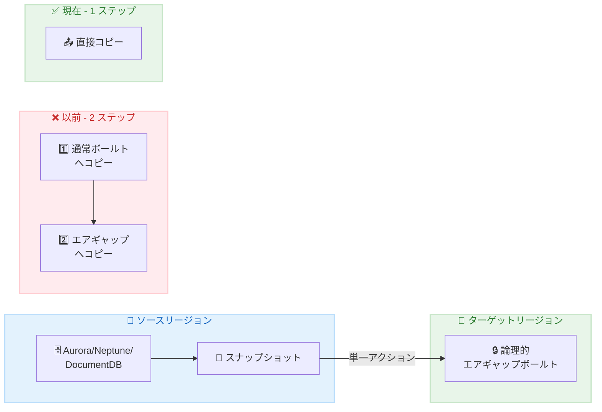

# AWS Backup - クロスリージョンデータベーススナップショットの論理的エアギャップボールトへの直接コピー

**リリース日**: 2026 年 2 月 12 日
**サービス**: AWS Backup
**機能**: クロスリージョン論理的エアギャップボールトへの単一アクションコピー

📊 [このアップデートのインフォグラフィックを見る](https://takech9203.github.io/awsnews-summary/20260212-aws-backup-adds-cross-region-database-snapshot-logically-air-gapped-vaults.html)

## 概要

AWS Backup が AWS リージョン間で論理的エアギャップボールトへのデータベーススナップショットの単一アクションコピーをサポートしました。Amazon Aurora、Amazon Neptune、Amazon DocumentDB のスナップショットを対象とし、ターゲットリージョンでの中間コピー手順が不要になりました。

この機能により、ランサムウェア攻撃やリージョン障害からの保護のためのクロスリージョン・クロスアカウントスナップショットコピーがワンステップで完了し、より高速な RPO (Recovery Point Objective) を達成しながら、中間コピーに関連するコストを削減できます。

**アップデート前の課題**

- 論理的エアギャップボールトへのクロスリージョンコピーには 2 ステップのプロセスが必要だった
- まずターゲットリージョンの通常ボールトにコピーし、その後エアギャップボールトにコピーする必要があった
- 中間コピーのステータス監視のためにカスタムスクリプトや Lambda 関数が必要だった

**アップデート後の改善**

- 1 回のアクションでクロスリージョンエアギャップボールトへ直接コピー可能
- 中間コピーのコストと管理オーバーヘッドを排除
- より高速な RPO を実現

## アーキテクチャ図



以前は 2 ステップ必要だったクロスリージョンエアギャップコピーが、単一アクションで完了するようになりました。

## サービスアップデートの詳細

### 主要機能

1. **単一アクションコピー**
   - ソースリージョンから直接ターゲットリージョンのエアギャップボールトへコピー
   - 中間ボールトへの一時コピーが不要
   - 自動化されたワークフローの簡素化

2. **対応データベース**
   - Amazon Aurora (MySQL、PostgreSQL 互換)
   - Amazon Neptune
   - Amazon DocumentDB

3. **セキュリティ強化**
   - 論理的エアギャップボールトによる隔離
   - クロスアカウントコピーのサポート
   - ランサムウェア対策の強化

## 技術仕様

### サポートされるデータベース

| データベース | サポート状況 |
|-------------|-------------|
| Amazon Aurora (MySQL) | ✅ |
| Amazon Aurora (PostgreSQL) | ✅ |
| Amazon Neptune | ✅ |
| Amazon DocumentDB | ✅ |

### コピー機能の比較

| 機能 | 以前 | 現在 |
|------|------|------|
| 必要なステップ数 | 2 | 1 |
| 中間コピーのコスト | 発生 | なし |
| カスタムスクリプト | 必要 | 不要 |
| RPO | 遅い | 高速 |

## 設定方法

### 前提条件

1. AWS Backup が有効なアカウント
2. ソースリージョンにデータベーススナップショット
3. ターゲットリージョンに論理的エアギャップボールト

### 手順

#### ステップ 1: 論理的エアギャップボールトの作成

```bash
aws backup create-logically-air-gapped-backup-vault \
  --backup-vault-name my-air-gapped-vault \
  --min-retention-days 7 \
  --max-retention-days 365 \
  --region eu-west-1
```

ターゲットリージョンに論理的エアギャップボールトを作成します。

#### ステップ 2: クロスリージョンコピーの実行

```bash
aws backup start-copy-job \
  --recovery-point-arn arn:aws:rds:ap-northeast-1:123456789012:snapshot:my-aurora-snapshot \
  --source-backup-vault-name Default \
  --destination-backup-vault-arn arn:aws:backup:eu-west-1:123456789012:backup-vault:my-air-gapped-vault \
  --iam-role-arn arn:aws:iam::123456789012:role/AWSBackupDefaultServiceRole
```

ソースリージョンのスナップショットをターゲットリージョンのエアギャップボールトに直接コピーします。

#### ステップ 3: バックアッププランでの自動化

```json
{
  "BackupPlanName": "CrossRegionAirGapPlan",
  "Rules": [
    {
      "RuleName": "DailyBackupToAirGap",
      "TargetBackupVaultName": "Default",
      "ScheduleExpression": "cron(0 5 ? * * *)",
      "CopyActions": [
        {
          "DestinationBackupVaultArn": "arn:aws:backup:eu-west-1:123456789012:backup-vault:my-air-gapped-vault",
          "Lifecycle": {
            "DeleteAfterDays": 365
          }
        }
      ]
    }
  ]
}
```

バックアッププランで自動的にクロスリージョンエアギャップコピーを設定できます。

## メリット

### ビジネス面

- **コスト削減**: 中間コピーのストレージコストとデータ転送コストを排除
- **RPO 改善**: バックアッププロセスの簡素化により復旧ポイントを高速化
- **運用効率**: カスタムスクリプトの開発・保守が不要

### 技術面

- **シンプルなアーキテクチャ**: 2 ステップから 1 ステップへプロセスを簡素化
- **自動化の容易さ**: AWS Backup プランで直接設定可能
- **セキュリティ強化**: 論理的エアギャップによるランサムウェア対策

## デメリット・制約事項

### 制限事項

- 対応データベースは Aurora、Neptune、DocumentDB に限定
- 論理的エアギャップボールトをサポートするリージョンでのみ利用可能
- ボールトの最小/最大保持期間の設定が必要

### 考慮すべき点

- クロスリージョンデータ転送料金は引き続き発生
- 論理的エアギャップボールトからの復元は通常ボールトより時間がかかる場合がある

## ユースケース

### ユースケース 1: ランサムウェア対策

**シナリオ**: 金融機関が重要なデータベースをランサムウェアから保護

**実装例**:
```bash
# 毎日のバックアップを別リージョンのエアギャップボールトにコピー
aws backup start-copy-job \
  --recovery-point-arn $LATEST_SNAPSHOT_ARN \
  --destination-backup-vault-arn $AIR_GAPPED_VAULT_ARN
```

**効果**: 攻撃者がプライマリ環境を侵害しても、エアギャップボールトのバックアップは保護される

### ユースケース 2: リージョン障害からの災害復旧

**シナリオ**: グローバル企業が東京リージョンの Aurora クラスターをフランクフルトにバックアップ

**実装例**:
```json
{
  "CopyActions": [
    {
      "DestinationBackupVaultArn": "arn:aws:backup:eu-central-1:123456789012:backup-vault:dr-air-gapped-vault"
    }
  ]
}
```

**効果**: リージョン全体の障害時も、エアギャップボールトから迅速に復旧可能

### ユースケース 3: コンプライアンス要件への対応

**シナリオ**: 医療機関がデータ保護規制のためにバックアップを物理的に分離

**実装例**:
```bash
# クロスアカウント・クロスリージョンコピー
aws backup start-copy-job \
  --recovery-point-arn $SNAPSHOT_ARN \
  --destination-backup-vault-arn arn:aws:backup:eu-west-1:999888777666:backup-vault:compliance-vault
```

**効果**: 規制要件に準拠したバックアップ戦略を効率的に実装

## 料金

AWS Backup の料金は以下の要素で構成されます。

| 項目 | 料金 |
|------|------|
| バックアップストレージ | 使用量に応じた料金 |
| クロスリージョンデータ転送 | リージョン間のデータ転送料金 |
| 論理的エアギャップボールト | 追加料金なし |

中間コピーが不要になることで、以前と比較してコスト削減が期待できます。

## 利用可能リージョン

AWS Backup がデータベースと論理的エアギャップボールトをサポートするすべてのリージョンで利用可能です。

## 関連サービス・機能

- **AWS Organizations**: マルチアカウントバックアップ戦略
- **AWS Backup Audit Manager**: コンプライアンスの監視
- **AWS RAM**: クロスアカウントボールト共有

## 参考リンク

- 📊 [インフォグラフィック](https://takech9203.github.io/awsnews-summary/20260212-aws-backup-adds-cross-region-database-snapshot-logically-air-gapped-vaults.html)
- [公式発表 (What's New)](https://aws.amazon.com/about-aws/whats-new/2026/02/aws-backup-adds-cross-region-database-snapshot-logically-air-gapped-vaults/)
- [AWS Backup ドキュメント](https://docs.aws.amazon.com/aws-backup/latest/devguide/backup-feature-availability.html#features-by-resource)

## まとめ

AWS Backup のクロスリージョン論理的エアギャップボールトへの直接コピー機能により、データベースバックアップの災害復旧とランサムウェア対策が大幅に簡素化されました。Aurora、Neptune、DocumentDB を使用している場合は、この新機能を活用してバックアップ戦略を強化し、RPO を改善しながらコストを削減してください。
