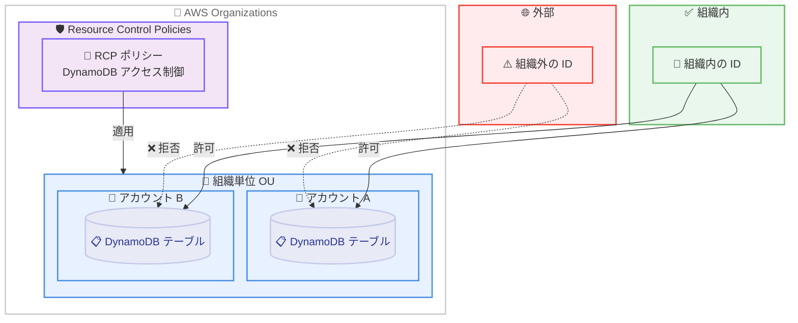

# AWS Resource Control Policies - Amazon DynamoDB のサポート拡大

**リリース日**: 2026年02月12日
**サービス**: AWS Organizations
**機能**: Resource Control Policies (RCP) の Amazon DynamoDB へのサポート拡大

📊 [このアップデートのインフォグラフィックを見る](https://takech9203.github.io/20260212-aws-expands-resource-control-policies-amazon.html)

## 概要

AWS Resource Control Policies (RCP) が、Amazon DynamoDB のサポートを追加しました。RCP は、AWS Organizations で使用できる組織ポリシーの一種であり、組織内のリソースに対する最大利用可能権限を一元的に制御できます。

この拡張により、RCP を使用して DynamoDB リソースに対する権限を管理できるようになりました。たとえば、組織外の ID が DynamoDB テーブルにアクセスできないようにするポリシーを作成し、データペリメーター (data perimeter) を構築して AWS 環境全体でベースラインセキュリティ標準を適用できます。

**アップデート前の課題**

- DynamoDB リソースに対する組織レベルの権限制御を RCP で実施できなかった
- DynamoDB に対するデータペリメーターの構築が不完全で、組織外の ID によるアクセスを一元的に制限する手段が限定されていた
- 各アカウントの IAM ポリシーに依存した個別管理が必要で、組織全体の一貫性を維持するのが困難だった

**アップデート後の改善**

- RCP を使用して DynamoDB リソースへのアクセスを組織レベルで一元管理できるようになった
- 組織外の ID による DynamoDB へのアクセスを防止するポリシーを作成し、データペリメーターを強化できるようになった
- 組織全体でベースラインセキュリティ標準を適用し、コンプライアンス要件を満たしやすくなった

## アーキテクチャ図



AWS Organizations の RCP を使用して DynamoDB リソースへのアクセスを組織レベルで制御する構成を示しています。組織外の ID によるアクセスは RCP により拒否され、データペリメーターが構築されます。

## サービスアップデートの詳細

### 主要機能

1. **Amazon DynamoDB の RCP サポート**
   - DynamoDB テーブル、インデックス、およびその他の DynamoDB リソースに対する RCP 適用が可能
   - 組織外の ID による DynamoDB リソースへのアクセスを防止
   - DynamoDB リソースの権限を組織レベルで一元管理

2. **データペリメーターの構築**
   - 組織外の ID がリソースにアクセスできないようにするポリシーを作成
   - AWS 環境全体でベースラインセキュリティ標準を適用
   - 一元的な権限管理によりセキュリティコンプライアンスを強化

3. **組織レベルの権限制御**
   - 組織内のすべてのアカウントに対して一貫した権限ポリシーを適用
   - 最大利用可能権限を組織レベルで制御
   - 組織ルート、組織単位 (OU)、または個別アカウントに柔軟に適用可能

## 技術仕様

### Resource Control Policies (RCP) の概要

| 項目 | 詳細 |
|------|------|
| ポリシータイプ | 拒否ベースのポリシー (最大権限を制限) |
| 適用範囲 | 組織内のリソースに対する最大利用可能権限を制御 |
| 適用レベル | 組織ルート、組織単位 (OU)、個別アカウント |
| 対象サービス | Amazon DynamoDB (今回追加) およびその他のサポート済みサービス |
| 主なユースケース | データペリメーターの構築、ベースラインセキュリティの適用 |

### ポリシー例

以下は、組織外の ID が DynamoDB リソースにアクセスできないようにする RCP の例です。

```json
{
  "Version": "2012-10-17",
  "Statement": [
    {
      "Effect": "Deny",
      "Principal": "*",
      "Action": "dynamodb:*",
      "Resource": "*",
      "Condition": {
        "StringNotEquals": {
          "aws:PrincipalOrgID": "o-xxxxxxxxxx"
        }
      }
    }
  ]
}
```

## 設定方法

### 前提条件

1. AWS Organizations が有効化されていること
2. 組織の管理アカウントまたは委任管理者アカウントへのアクセス
3. RCP を有効化するための適切な IAM 権限

### 手順

#### ステップ 1: Resource Control Policies の有効化

AWS Organizations コンソールにサインインし、設定から Resource Control Policies を有効化します (まだ有効化されていない場合)。

#### ステップ 2: DynamoDB 向け RCP ポリシーの作成

```json
{
  "Version": "2012-10-17",
  "Statement": [
    {
      "Effect": "Deny",
      "Principal": "*",
      "Action": "dynamodb:*",
      "Resource": "*",
      "Condition": {
        "StringNotEquals": {
          "aws:PrincipalOrgID": "o-xxxxxxxxxx"
        }
      }
    }
  ]
}
```

組織外の ID による DynamoDB リソースへのアクセスを拒否する RCP ポリシーを作成します。`o-xxxxxxxxxx` を実際の組織 ID に置き換えてください。

#### ステップ 3: ポリシーの適用

作成した RCP ポリシーを、組織ルート、OU、または個別アカウントに適用します。

#### ステップ 4: ポリシーの検証

```bash
# DynamoDB テーブルへのアクセスをテスト
aws dynamodb list-tables --region us-east-1
```

テストアカウントで、組織外の ID が DynamoDB リソースにアクセスできないことを確認します。組織内の ID からは正常にアクセスできることも検証してください。

## メリット

### ビジネス面

- **セキュリティコンプライアンスの強化**: DynamoDB に格納された機密データへのアクセスを組織レベルで制御し、コンプライアンス要件を満たす
- **運用効率の向上**: 複数のアカウントにまたがる DynamoDB の権限管理を一元化し、管理負担を軽減
- **リスクの削減**: 組織外の ID による DynamoDB データへの不正アクセスを防止し、データ漏洩リスクを低減

### 技術面

- **一元的な権限管理**: 組織レベルで DynamoDB リソースの権限を制御し、管理を簡素化
- **データペリメーターの完成度向上**: DynamoDB のサポートにより、より包括的なデータペリメーターを構築可能
- **柔軟な適用範囲**: 組織ルート、OU、個別アカウントに対して段階的にポリシーを適用可能

## デメリット・制約事項

### 制限事項

- RCP は拒否ベースのポリシーであり、許可を追加することはできない
- RCP は IAM ポリシーや SCP (Service Control Policies) と組み合わせて評価されるため、ポリシーの相互作用を理解する必要がある
- 過度に制限的な RCP は、正当なアクセスもブロックする可能性がある

### 考慮すべき点

- RCP を適用する前に、影響を受ける DynamoDB リソースとアクセスパターンを十分に把握する必要がある
- テスト環境で RCP を検証してから本番環境に適用することを推奨
- DynamoDB Streams やグローバルテーブルなど、クロスアカウントアクセスが必要な機能への影響を考慮する必要がある

## ユースケース

### ユースケース 1: マルチアカウント環境での DynamoDB データ保護

**シナリオ**: 複数の AWS アカウントで DynamoDB を使用している企業が、組織外の ID によるデータアクセスを防止する。

**実装例**:
```json
{
  "Version": "2012-10-17",
  "Statement": [
    {
      "Effect": "Deny",
      "Principal": "*",
      "Action": "dynamodb:*",
      "Resource": "*",
      "Condition": {
        "StringNotEquals": {
          "aws:PrincipalOrgID": "o-xxxxxxxxxx"
        }
      }
    }
  ]
}
```

**効果**: 組織外の ID による DynamoDB テーブルへのアクセスを一元的に防止し、全アカウントで一貫したセキュリティ標準を適用。

### ユースケース 2: 規制産業のデータペリメーター構築

**シナリオ**: 金融機関や医療機関が、DynamoDB に格納された顧客データや患者データに対して厳格なアクセス制御を実施する。

**実装例**:
- RCP を組織ルートに適用し、すべてのアカウントで DynamoDB へのアクセスを組織内に制限
- 特定の OU に対して、より厳格な条件 (特定の VPC エンドポイントからのアクセスのみ許可) を追加適用

**効果**: 組織全体で一貫したデータペリメーターを構築し、規制要件を満たしながら DynamoDB データを保護。

### ユースケース 3: サードパーティアクセスの制御

**シナリオ**: 外部のサードパーティに DynamoDB リソースへのアクセスを提供する際に、組織のセキュリティポリシーに準拠したアクセス制御を適用する。

**実装例**:
```json
{
  "Version": "2012-10-17",
  "Statement": [
    {
      "Effect": "Deny",
      "Principal": "*",
      "Action": "dynamodb:*",
      "Resource": "*",
      "Condition": {
        "StringNotEquals": {
          "aws:PrincipalOrgID": ["o-xxxxxxxxxx", "o-yyyyyyyyyy"]
        }
      }
    }
  ]
}
```

**効果**: 許可された組織のみが DynamoDB リソースにアクセスできるように制限し、サードパーティアクセスを制御。

## 料金

AWS Resource Control Policies (RCP) の使用に追加料金は発生しません。AWS Organizations の一部として無料で利用できます。DynamoDB 自体の料金は、通常の DynamoDB 料金体系に従います。

## 利用可能リージョン

RCP の DynamoDB サポートは、すべての AWS 商用リージョンおよび AWS GovCloud (US) リージョンで利用可能です。

## 関連サービス・機能

- **AWS Organizations**: 複数の AWS アカウントを一元管理するサービス
- **Service Control Policies (SCP)**: 組織内のアカウントに対する最大権限を制御するポリシー
- **IAM Policies**: 個別のリソースとプリンシパルに対する権限を制御するポリシー
- **Amazon DynamoDB**: フルマネージドの NoSQL データベースサービス
- **AWS CloudTrail**: API コールの監査ログを記録し、RCP の効果を検証

## 参考リンク

- 📊 [インフォグラフィック](https://takech9203.github.io/20260212-aws-expands-resource-control-policies-amazon.html)
- [公式発表 (What's New)](https://aws.amazon.com/about-aws/whats-new/2026/02/aws-expands-resource-control-policies-amazon/)
- [Resource Control Policies ドキュメント](https://docs.aws.amazon.com/organizations/latest/userguide/orgs_manage_policies_rcps.html)
- [Data Perimeters on AWS](https://aws.amazon.com/identity/data-perimeters-on-aws/)
- [Amazon DynamoDB](https://aws.amazon.com/dynamodb/)

## まとめ

AWS Resource Control Policies の Amazon DynamoDB へのサポート拡大により、組織レベルでの DynamoDB データのアクセス制御がさらに強化されました。すべての AWS 商用リージョンおよび GovCloud (US) リージョンで利用可能であり、組織外の ID によるアクセスを防止するデータペリメーターを構築できます。DynamoDB をマルチアカウント環境で利用している組織は、RCP を活用してセキュリティコンプライアンスを強化し、データ保護を一元的に管理することを検討してください。
