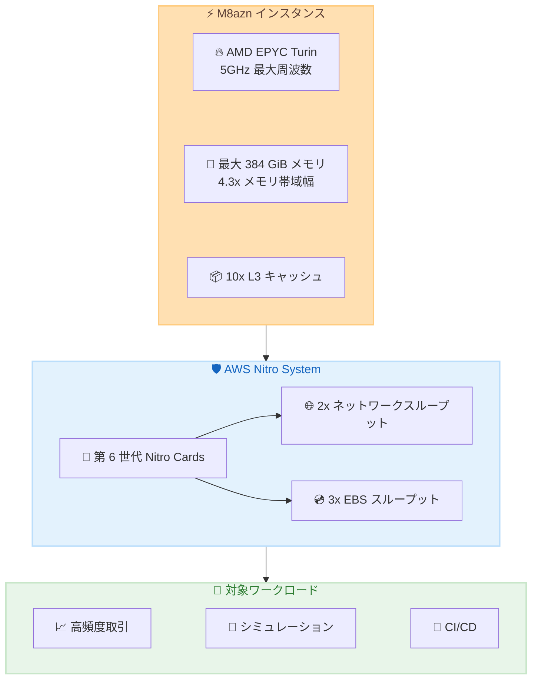

# Amazon EC2 M8azn - 5GHz の最高周波数を持つ汎用インスタンス

**リリース日**: 2026 年 2 月 12 日
**サービス**: Amazon EC2
**機能**: M8azn インスタンス

📊 [このアップデートのインフォグラフィックを見る](https://takech9203.github.io/aws-news-summary/20260212-aws-m8azn-instances-generally-available.html)

## 概要

AWS は、第 5 世代 AMD EPYC プロセッサ (コードネーム Turin) を搭載した新しい Amazon EC2 M8azn インスタンスの一般提供を発表しました。M8azn インスタンスはクラウドで最大 5GHz の CPU 周波数を提供し、前世代の M5zn インスタンスと比較して最大 2 倍のコンピューティング性能を実現します。

このインスタンスは、リアルタイム金融分析、高頻度取引 (HFT)、CI/CD、集中的なゲーミング、自動車・航空宇宙・エネルギー・通信業界向けのシミュレーションモデリングなど、レイテンシに敏感で計算集約型のワークロードに最適化されています。

**アップデート前の課題**

- M5zn インスタンスでは最大 CPU 周波数が限られており、高周波数が必要なワークロードで性能が制限されていた
- メモリ帯域幅やキャッシュサイズの制約により、データ集約型ワークロードでボトルネックが発生
- ネットワークスループットと EBS スループットの制限により、I/O 集約型アプリケーションで性能が制限

**アップデート後の改善**

- クラウドで最大 5GHz の CPU 周波数を実現し、高周波数コンピューティングが必要なワークロードで大幅な性能向上
- M5zn と比較して 4.3 倍のメモリ帯域幅と 10 倍の L3 キャッシュにより、データ集約型ワークロードが高速化
- ネットワークスループットが 2 倍、EBS スループットが 3 倍に向上し、I/O 性能が大幅に改善

## アーキテクチャ図



M8azn インスタンスは第 6 世代 Nitro Cards を搭載した AWS Nitro System 上に構築され、高周波数プロセッサと高帯域幅ネットワーキングを組み合わせています。

## サービスアップデートの詳細

### 主要機能

1. **5GHz 最大 CPU 周波数**
   - クラウドで利用可能な最高の CPU 周波数
   - 第 5 世代 AMD EPYC (Turin) プロセッサを搭載
   - M8a インスタンスと比較して最大 24% 高い性能

2. **大幅に強化されたメモリ性能**
   - M5zn と比較して 4.3 倍のメモリ帯域幅
   - 10 倍の L3 キャッシュサイズ
   - メモリ対 vCPU 比率は 4:1

3. **第 6 世代 Nitro Cards によるネットワーキング**
   - M5zn と比較して 2 倍のネットワークスループット
   - 3 倍の EBS スループット
   - AWS Nitro System による高効率な仮想化

### インスタンスサイズ

| サイズ | vCPU | メモリ (GiB) | 備考 |
|--------|------|--------------|------|
| m8azn.large | 2 | 8 | 最小サイズ |
| m8azn.xlarge | 4 | 16 | - |
| m8azn.2xlarge | 8 | 32 | - |
| m8azn.4xlarge | 16 | 64 | - |
| m8azn.8xlarge | 32 | 128 | - |
| m8azn.12xlarge | 48 | 192 | - |
| m8azn.24xlarge | 96 | 384 | - |
| m8azn.metal | 96 | 384 | ベアメタル |
| m8azn.metal-24xl | 96 | 384 | ベアメタル (24xlarge 相当) |

## 技術仕様

### プロセッサ仕様

| 項目 | 詳細 |
|------|------|
| プロセッサ | 第 5 世代 AMD EPYC (Turin) |
| 最大周波数 | 5GHz |
| vCPU 範囲 | 2〜96 vCPU |
| メモリ範囲 | 8〜384 GiB |
| メモリ対 vCPU 比率 | 4:1 |

### 性能比較 (M5zn 対比)

| 指標 | 改善率 |
|------|--------|
| コンピューティング性能 | 最大 2 倍 |
| メモリ帯域幅 | 4.3 倍 |
| L3 キャッシュ | 10 倍 |
| ネットワークスループット | 2 倍 |
| EBS スループット | 3 倍 |

## 設定方法

### 前提条件

1. 適切な IAM 権限を持つ AWS アカウント
2. 対象リージョンでの EC2 サービスクォータの確認
3. VPC とセキュリティグループの設定

### 手順

#### ステップ 1: AWS Management Console からインスタンスを起動

1. EC2 コンソールにアクセス
2. 「インスタンスを起動」をクリック
3. インスタンスタイプで「m8azn」を検索して選択

#### ステップ 2: AWS CLI でインスタンスを起動

```bash
aws ec2 run-instances \
  --instance-type m8azn.xlarge \
  --image-id ami-xxxxxxxxxxxxxxxxx \
  --key-name my-key-pair \
  --security-group-ids sg-xxxxxxxxxxxxxxxxx \
  --subnet-id subnet-xxxxxxxxxxxxxxxxx
```

このコマンドは指定した AMI、キーペア、セキュリティグループ、サブネットを使用して m8azn.xlarge インスタンスを起動します。

## メリット

### ビジネス面

- **低レイテンシ要件への対応**: 高頻度取引やリアルタイム分析で競争優位性を獲得
- **処理時間の短縮**: シミュレーションや CI/CD パイプラインの実行時間を大幅に削減
- **コスト効率**: 同じワークロードをより少ないインスタンスで処理可能

### 技術面

- **最高の CPU 周波数**: クラウドで 5GHz を実現し、シングルスレッド性能が重要なワークロードに最適
- **大容量キャッシュ**: L3 キャッシュの 10 倍増加により、キャッシュミスによるレイテンシを削減
- **高帯域幅 I/O**: ネットワークと EBS の両方で大幅に向上した帯域幅

## デメリット・制約事項

### 制限事項

- 利用可能リージョンが限定的 (4 リージョン)
- 高周波数プロセッサのため、消費電力が高くなる可能性
- ベアメタルを含む 9 サイズのみ提供

### 考慮すべき点

- M5zn からの移行時は、アプリケーションの互換性テストを推奨
- 高周波数が必要ないワークロードでは、他のインスタンスファミリーの方がコスト効率が高い場合がある

## ユースケース

### ユースケース 1: 高頻度取引 (HFT)

**シナリオ**: 金融機関がマイクロ秒単位のレイテンシが要求される取引システムを運用

**実装例**:
```bash
# 低レイテンシ取引サーバー用に M8azn インスタンスを起動
aws ec2 run-instances \
  --instance-type m8azn.12xlarge \
  --placement AvailabilityZone=us-east-1a \
  --network-interfaces "DeviceIndex=0,SubnetId=subnet-xxx,Groups=sg-xxx"
```

**効果**: 5GHz CPU と低レイテンシネットワーキングにより、取引執行速度を大幅に改善

### ユースケース 2: CI/CD パイプライン

**シナリオ**: 大規模なコードベースのビルドとテストを高速化したい開発チーム

**実装例**:
```yaml
# GitHub Actions での使用例
jobs:
  build:
    runs-on: [self-hosted, m8azn]
    steps:
      - uses: actions/checkout@v4
      - run: make build
      - run: make test
```

**効果**: ビルド時間の大幅な短縮により、開発者の生産性が向上

### ユースケース 3: シミュレーションモデリング

**シナリオ**: 自動車メーカーが衝突シミュレーションや空力解析を実行

**実装例**:
```bash
# 大規模シミュレーション用にベアメタルインスタンスを使用
aws ec2 run-instances \
  --instance-type m8azn.metal \
  --block-device-mappings "DeviceName=/dev/sda1,Ebs={VolumeSize=500,VolumeType=gp3,Iops=16000}"
```

**効果**: 384 GiB メモリと 96 vCPU で大規模シミュレーションを高速実行

## 料金

料金は On-Demand、Savings Plans、Spot インスタンスの 3 種類の購入オプションで利用可能です。具体的な料金は AWS EC2 料金ページを参照してください。

### 購入オプション

| オプション | 特徴 |
|------------|------|
| On-Demand | 長期契約なしで時間単位の料金 |
| Savings Plans | 1 年または 3 年の契約で割引 |
| Spot | 未使用キャパシティを最大 90% 割引で利用 |

## 利用可能リージョン

M8azn インスタンスは以下の AWS リージョンで利用可能です。

- US East (N. Virginia) - us-east-1
- US West (Oregon) - us-west-2
- Asia Pacific (Tokyo) - ap-northeast-1
- Europe (Frankfurt) - eu-central-1

## 関連サービス・機能

- **Amazon EBS**: 高スループット EBS ボリュームとの組み合わせで I/O 性能を最大化
- **AWS Nitro System**: セキュリティと性能を両立する基盤インフラストラクチャ
- **Elastic Load Balancing**: 複数の M8azn インスタンス間でトラフィックを分散

## 参考リンク

- 📊 [インフォグラフィック](https://takech9203.github.io/aws-news-summary/20260212-aws-m8azn-instances-generally-available.html)
- [公式発表 (What's New)](https://aws.amazon.com/about-aws/whats-new/2026/02/aws-m8azn-instances-generally-available/)
- [Amazon EC2 M8azn インスタンスページ](https://aws.amazon.com/ec2/instance-types/m8a)
- [AWS Nitro System](https://aws.amazon.com/ec2/nitro/)

## まとめ

Amazon EC2 M8azn インスタンスは、クラウドで最大 5GHz の CPU 周波数を提供し、高頻度取引、リアルタイム分析、シミュレーションモデリングなどのレイテンシに敏感なワークロードに最適です。東京リージョンでも利用可能なため、日本のお客様は低レイテンシが求められるワークロードの移行を検討してください。
