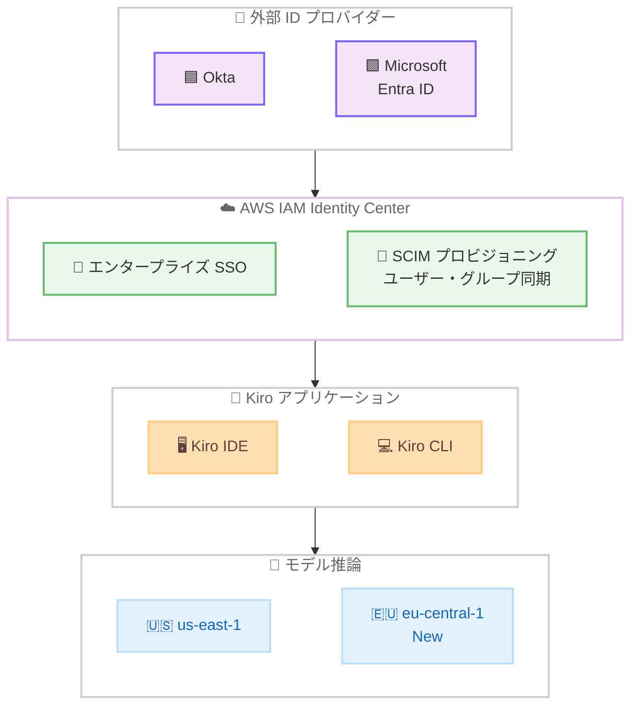

# Kiro - 外部 ID プロバイダーサポートと Claude Opus 4.6 の eu-central-1 対応

**リリース日**: 2026 年 2 月 12 日
**サービス**: Kiro
**機能**: 外部 ID プロバイダー (Okta, Microsoft Entra ID) サポート、Claude Opus 4.6 の eu-central-1 リージョン対応

## 概要

Kiro IDE および CLI で外部 ID プロバイダーによる認証がサポートされました。Okta および Microsoft Entra ID の資格情報を使用して Kiro にサインインできるようになり、エンタープライズ環境での SSO (シングルサインオン) が実現します。AWS IAM Identity Center と連携した Okta および Entra ID によるエンタープライズ SSO に加え、SCIM プロビジョニングによるユーザーおよびグループの同期も可能です。ID プロバイダーの設定は一度行えば、Kiro IDE と CLI の両方で利用できます。

また、2 月 9 日には Claude Opus 4.6 が eu-central-1 (フランクフルト) リージョンで利用可能になりました。IAM Identity Center で認証するユーザーが対象で、Kiro IDE では実験的サポートとして提供されています。

**アップデート前の課題**

- エンタープライズ環境で既存の ID プロバイダー (Okta, Entra ID) を使用した Kiro へのサインインができなかった
- 組織のセキュリティポリシーに準拠した認証フローを Kiro で利用するには追加の設定が必要だった
- SCIM によるユーザー・グループの自動同期がサポートされておらず、ユーザー管理の手動作業が発生していた
- Claude Opus 4.6 のモデル推論は US East (N. Virginia) リージョンのみで、欧州のデータレジデンシー要件に対応できなかった

**アップデート後の改善**

- Okta および Microsoft Entra ID の資格情報で Kiro IDE と CLI にサインイン可能に
- AWS IAM Identity Center との統合によるエンタープライズ SSO が実現
- SCIM プロビジョニングでユーザーとグループの同期が自動化
- Claude Opus 4.6 が eu-central-1 リージョンで利用可能になり、欧州でのデータレジデンシー要件に対応

## アーキテクチャ図



この図は、外部 ID プロバイダーから AWS IAM Identity Center を経由して Kiro IDE および CLI に認証する流れと、モデル推論リージョンの構成を示しています。

## サービスアップデートの詳細

### 主要機能

1. **Kiro IDE の外部 ID プロバイダーサポート (2 月 12 日)**
   - Okta または Microsoft Entra ID の資格情報で Kiro IDE にサインイン
   - AWS IAM Identity Center と連携したエンタープライズ SSO
   - SCIM プロビジョニングによるユーザーおよびグループの同期
   - ID プロバイダーの設定は一度行えば IDE と CLI の両方で利用可能

2. **Kiro CLI の外部 ID プロバイダーサポート (2 月 12 日)**
   - Okta または Microsoft Entra ID の資格情報で Kiro CLI を認証
   - ブラウザベースの OAuth フロー
   - AWS IAM Identity Center と連携したエンタープライズ SSO
   - SCIM プロビジョニングによるユーザーおよびグループの同期

3. **Claude Opus 4.6 の eu-central-1 対応 (2 月 9 日)**
   - IAM Identity Center で認証するユーザーが対象
   - Kiro IDE で実験的サポートとして利用可能
   - 欧州リージョンでのモデル推論が可能に

## 技術仕様

### 対応 ID プロバイダー

| ID プロバイダー | Kiro IDE | Kiro CLI | プロビジョニング |
|-----------------|----------|----------|-----------------|
| Okta | 対応 | 対応 | SCIM |
| Microsoft Entra ID | 対応 | 対応 | SCIM |
| AWS IAM Identity Center | 対応 | 対応 | ネイティブ |

### 認証フロー

| 項目 | 詳細 |
|------|------|
| IDE 認証 | Okta / Entra ID 資格情報による直接サインイン |
| CLI 認証 | ブラウザベース OAuth フロー |
| SSO 連携 | AWS IAM Identity Center 経由 |
| ユーザー同期 | SCIM プロビジョニング |
| 設定の共有 | IdP 設定は IDE と CLI で共通 |

### Claude Opus 4.6 の利用可能リージョン

| リージョン | ステータス | 対象ユーザー |
|-----------|-----------|-------------|
| us-east-1 | 利用可能 | 全認証方式 |
| eu-central-1 | 利用可能 (New) | IAM Identity Center 認証ユーザー |

## 設定方法

### 前提条件

1. Kiro IDE または CLI がインストール済みであること
2. Okta または Microsoft Entra ID の組織アカウント
3. AWS IAM Identity Center が設定済みであること
4. 組織管理者による IdP 連携の事前設定

### 手順

#### ステップ 1: IdP と AWS IAM Identity Center の連携設定

組織管理者が AWS IAM Identity Center で外部 ID プロバイダーを設定します。

1. AWS IAM Identity Center コンソールで外部 ID プロバイダーを追加
2. Okta または Microsoft Entra ID との SAML/OIDC 連携を設定
3. SCIM プロビジョニングエンドポイントを設定してユーザー・グループ同期を有効化

この設定は一度行えば、Kiro IDE と CLI の両方で利用可能になります。

#### ステップ 2: Kiro IDE でのサインイン

1. Kiro IDE を起動
2. サインイン画面で「Sign in with SSO」を選択
3. Okta または Entra ID の資格情報を入力して認証

Kiro IDE がブラウザを開き、IdP の認証画面にリダイレクトされます。

#### ステップ 3: Kiro CLI でのサインイン

```bash
# Kiro CLI で SSO 認証を実行
kiro auth login --sso
```

ブラウザが開き、IdP の認証画面が表示されます。ブラウザベースの OAuth フローにより、CLI での認証が完了します。

## メリット

### ビジネス面

- **セキュリティ強化**: 組織の既存 ID プロバイダーを活用し、一元的な認証管理を実現
- **管理コスト削減**: SCIM プロビジョニングによりユーザー・グループ管理が自動化
- **コンプライアンス対応**: 既存のセキュリティポリシーと整合した認証フローを Kiro で利用可能
- **欧州データレジデンシー**: eu-central-1 での Opus 4.6 推論により欧州のデータ所在地要件に対応

### 技術面

- **SSO 統合**: AWS IAM Identity Center との連携により既存のエンタープライズ SSO 基盤を活用
- **自動プロビジョニング**: SCIM によるユーザー・グループの自動同期で運用負荷を軽減
- **統一設定**: IdP の設定を一度行えば IDE と CLI の両方で利用可能
- **リージョン拡張**: 欧州リージョンでのモデル推論によりレイテンシーの改善が期待

## デメリット・制約事項

### 制限事項

- 外部 IdP サポートは Okta と Microsoft Entra ID に限定 (他の IdP は現時点で非対応)
- eu-central-1 での Claude Opus 4.6 は IAM Identity Center 認証ユーザーのみが対象
- eu-central-1 での Claude Opus 4.6 は実験的サポートの位置付け
- SCIM プロビジョニングの設定には組織管理者権限が必要

### 考慮すべき点

- 外部 IdP 連携には AWS IAM Identity Center の事前設定が必要
- 組織の IdP 設定変更が Kiro のアクセスに影響する可能性がある
- eu-central-1 での利用は実験的サポートのため、今後の仕様変更の可能性がある

## ユースケース

### ユースケース 1: エンタープライズ SSO による開発者オンボーディング

**シナリオ**: 大規模な開発チームで新規メンバーが参加した際に、Kiro へのアクセスを迅速に提供したい

**効果**: 組織の Okta または Entra ID アカウントがあれば、SCIM プロビジョニングにより自動的に Kiro のユーザーアカウントが作成され、個別のアカウント設定作業が不要になる

### ユースケース 2: セキュリティポリシーに準拠した AI ツール導入

**シナリオ**: 企業のセキュリティポリシーで全ツールに対して組織の IdP 経由の認証が義務付けられている

**効果**: Okta や Entra ID を通じた SSO 認証により、企業のセキュリティ基準を満たしつつ Kiro を導入可能。MFA ポリシーや条件付きアクセスなど IdP 側のセキュリティ設定がそのまま適用される

### ユースケース 3: 欧州チームでの AI コーディング支援

**シナリオ**: 欧州に拠点を持つ開発チームが、データレジデンシー要件を満たしながら Claude Opus 4.6 を活用したい

**効果**: IAM Identity Center で認証し、eu-central-1 リージョンで Claude Opus 4.6 のモデル推論を実行することで、欧州内でのデータ処理を実現しつつ最高品質の AI コーディング支援を利用可能

## 料金

Kiro の料金については [Kiro 料金ページ](https://kiro.dev/pricing/) を参照してください。外部 ID プロバイダーサポートは Enterprise プランの機能です。

## 利用可能リージョン

グローバル (Claude Opus 4.6 の推論は us-east-1 および eu-central-1 で利用可能)

## 関連サービス・機能

- **AWS IAM Identity Center**: Kiro の外部 IdP 連携の基盤となるサービス
- **Okta**: Kiro がサポートする外部 ID プロバイダーの 1 つ
- **Microsoft Entra ID**: Kiro がサポートする外部 ID プロバイダーの 1 つ
- **Claude Opus 4.6**: Kiro で利用可能な最も強力な AI モデル

## 参考リンク

- [Kiro Changelog](https://kiro.dev/changelog/)
- [Kiro ドキュメント](https://kiro.dev/docs/)
- [Kiro 公式サイト](https://kiro.dev/)
- [Kiro 料金](https://kiro.dev/pricing/)
- [AWS IAM Identity Center ドキュメント](https://docs.aws.amazon.com/singlesignon/latest/userguide/)

## まとめ

Kiro IDE および CLI で Okta と Microsoft Entra ID による外部 ID プロバイダー認証がサポートされました。AWS IAM Identity Center と連携したエンタープライズ SSO と SCIM プロビジョニングにより、大規模な組織でのユーザー管理が効率化されます。IdP の設定は一度行えば IDE と CLI の両方で利用可能です。また、Claude Opus 4.6 が eu-central-1 リージョンでも利用可能になり、欧州のデータレジデンシー要件への対応が進みました。エンタープライズ環境で Kiro を導入する際は、組織の既存 IdP との連携を活用してセキュリティと利便性の両立を図ることを推奨します。
