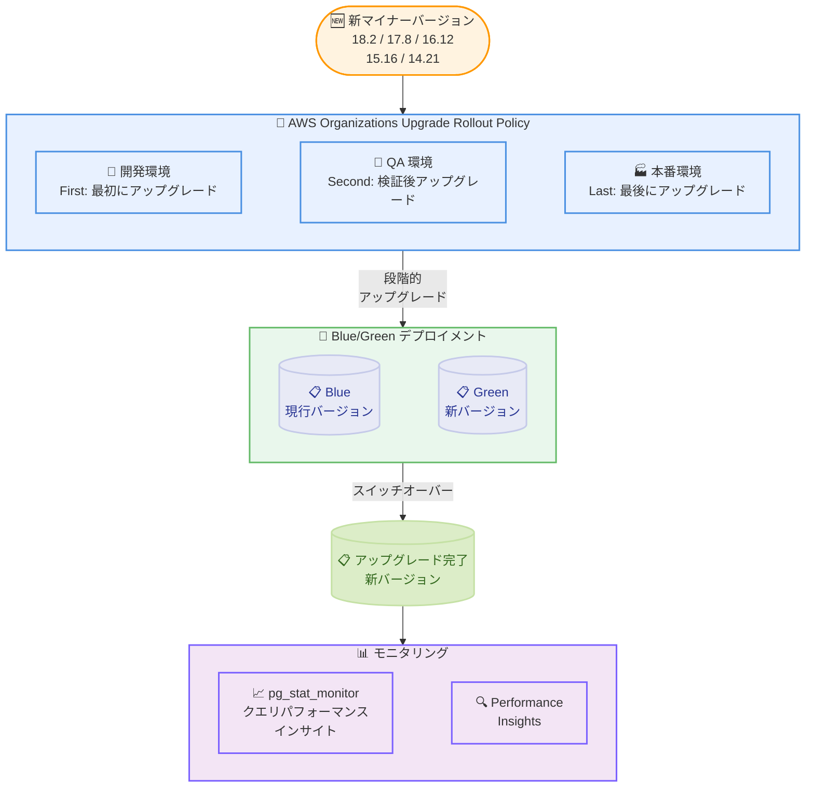

# Amazon RDS for PostgreSQL - マイナーバージョン 18.2, 17.8, 16.12, 15.16, 14.21 サポート

**リリース日**: 2026 年 2 月 12 日
**サービス**: Amazon RDS for PostgreSQL
**機能**: PostgreSQL マイナーバージョンアップデート対応

📊 [このアップデートのインフォグラフィックを見る](https://takech9203.github.io/awsnews-summary/20260212-rds-minor-version-18-2-17-8-16-12-15-16-14-21.html)

## 概要

Amazon RDS for PostgreSQL が、最新マイナーバージョン 18.2、17.8、16.12、15.16、14.21 のサポートを開始しました。これらの新しいバージョンには、PostgreSQL コミュニティによるセキュリティ脆弱性の修正とバグ修正が含まれています。また、新しいエクステンション pg_stat_monitor が追加され、パフォーマンスメトリクスの収集とクエリパフォーマンスインサイトの統合的な評価が可能になりました。

アップグレードは、自動マイナーバージョンアップグレード機能を使用してメンテナンスウィンドウ中に実施できます。大規模な運用では、AWS Organizations Upgrade Rollout Policy を活用して開発環境から本番環境へ段階的にアップグレードを展開できます。さらに、RDS Blue/Green デプロイメントの物理レプリケーションを使用することで、ダウンタイムを最小限に抑えたアップグレードが可能です。

**アップデート前の課題**

- 古いマイナーバージョンに存在する既知のセキュリティ脆弱性への対応が必要だった
- クエリパフォーマンスの包括的なモニタリングには、複数のツールやビューを組み合わせる必要があった
- 大規模な組織で数千のデータベースインスタンスを段階的にアップグレードする仕組みが複雑だった

**アップデート後の改善**

- 最新のセキュリティパッチとバグ修正が適用され、既知の脆弱性に対応可能になった
- pg_stat_monitor エクステンションにより、クエリパフォーマンスメトリクスを統合ビューで確認可能になった
- AWS Organizations Upgrade Rollout Policy で開発環境から本番環境への段階的なアップグレードを自動化できるようになった
- Blue/Green デプロイメントの物理レプリケーションにより、マイナーバージョンアップグレード時のダウンタイムを最小限に抑制可能になった

## アーキテクチャ図



この図は、AWS Organizations Upgrade Rollout Policy による段階的アップグレードと、Blue/Green デプロイメントを使用した安全なバージョンアップグレードのフローを示しています。

## サービスアップデートの詳細

### 主要機能

1. **新しいマイナーバージョンのサポート**
   - PostgreSQL 18.2、17.8、16.12、15.16、14.21 の 5 つのマイナーバージョンに対応
   - セキュリティ脆弱性の修正とバグ修正を含む
   - PostgreSQL コミュニティの最新改善を反映

2. **pg_stat_monitor エクステンションの追加**
   - クエリパフォーマンスメトリクスの収集機能を提供
   - クエリパフォーマンスインサイトを統合ビューで評価可能
   - パフォーマンスボトルネックの特定を支援

3. **AWS Organizations Upgrade Rollout Policy**
   - 数千のデータベースインスタンスを段階的にアップグレード
   - 3 段階のアップグレード順序: First (開発)、Second (QA)、Last (本番)
   - 各段階間に検証期間 (ベイクタイム) を設定可能
   - AWS Health 通知と RDS イベント通知でアップグレードの進捗を監視

4. **Blue/Green デプロイメントの物理レプリケーション**
   - マイナーバージョンアップグレード時のダウンタイムを最小化
   - 物理レプリケーションにより、論理レプリケーションの制限を回避
   - スイッチオーバーを通常数秒で完了

## 技術仕様

### サポートされるマイナーバージョン

| メジャーバージョン | 新しいマイナーバージョン | 主な改善点 |
|-------------------|------------------------|-----------|
| PostgreSQL 18 | 18.2 | pg_stat_monitor 追加、エクステンション更新、安定性向上 |
| PostgreSQL 17 | 17.8 | セキュリティ修正、バグ修正 |
| PostgreSQL 16 | 16.12 | セキュリティ修正、バグ修正 |
| PostgreSQL 15 | 15.16 | セキュリティ修正、バグ修正 |
| PostgreSQL 14 | 14.21 | セキュリティ修正、バグ修正 |

### PostgreSQL 18.2 で更新されたエクステンション

| エクステンション | バージョン | 説明 |
|-----------------|-----------|------|
| pg_stat_monitor | 新規追加 | クエリパフォーマンスモニタリング |
| pgactive | 2.1.7 | アクティブ - アクティブレプリケーション |
| pglogical | 2.4.6 | 論理レプリケーション |
| pg_hint_plan | 1.6.2 | クエリプランヒント |
| orafce | 4.16.3 | Oracle 互換関数 |
| postgis | 3.6.1 | 地理空間データ |
| pgvector | 0.8.1 | ベクトル類似検索 |
| pg_cron | 1.6.7 | ジョブスケジューリング |
| pg_repack | 1.5.3 | テーブル再編成 |

### アップグレード方法の比較

| 方法 | ダウンタイム | 適用範囲 | 推奨シナリオ |
|------|------------|---------|-------------|
| 自動マイナーバージョンアップグレード | メンテナンスウィンドウ中に再起動 | 個別インスタンス | 標準的なアップグレード |
| Upgrade Rollout Policy | メンテナンスウィンドウ中に段階的実施 | 組織全体 | 大規模環境の段階的アップグレード |
| Blue/Green デプロイメント | 最小限 (通常数秒) | 個別インスタンス | ダウンタイムを許容できない環境 |

## 設定方法

### 前提条件

1. AWS アカウントと適切な IAM 権限
2. Amazon RDS コンソールまたは AWS CLI へのアクセス
3. アップグレード前のバックアップ取得

### 手順

#### ステップ 1: 自動マイナーバージョンアップグレードの有効化

```bash
# 既存インスタンスで自動マイナーバージョンアップグレードを有効化
aws rds modify-db-instance \
    --db-instance-identifier my-postgres-instance \
    --auto-minor-version-upgrade \
    --apply-immediately
```

自動マイナーバージョンアップグレードを有効にすると、新しいマイナーバージョンがメンテナンスウィンドウ中に自動的に適用されます。

#### ステップ 2: AWS Organizations Upgrade Rollout Policy によるタグ設定

```bash
# 開発環境のインスタンスに First タグを設定
aws rds add-tags-to-resource \
    --resource-name arn:aws:rds:ap-northeast-1:123456789012:db:dev-postgres \
    --tags Key=rds:upgrade-rollout-order,Value=first

# QA 環境のインスタンスに Second タグを設定
aws rds add-tags-to-resource \
    --resource-name arn:aws:rds:ap-northeast-1:123456789012:db:qa-postgres \
    --tags Key=rds:upgrade-rollout-order,Value=second

# 本番環境のインスタンスに Last タグを設定
aws rds add-tags-to-resource \
    --resource-name arn:aws:rds:ap-northeast-1:123456789012:db:prod-postgres \
    --tags Key=rds:upgrade-rollout-order,Value=last
```

タグを設定することで、開発環境から本番環境へ段階的にアップグレードが適用されます。

#### ステップ 3: Blue/Green デプロイメントによるアップグレード

```bash
# Blue/Green デプロイメントを作成
aws rds create-blue-green-deployment \
    --blue-green-deployment-name my-pg-upgrade \
    --source arn:aws:rds:ap-northeast-1:123456789012:db:my-postgres-instance \
    --target-engine-version 18.2

# Green 環境でテスト後、スイッチオーバーを実行
aws rds switchover-blue-green-deployment \
    --blue-green-deployment-identifier my-pg-upgrade \
    --switchover-timeout 300
```

Blue/Green デプロイメントの物理レプリケーションを使用することで、ダウンタイムを最小限に抑えてマイナーバージョンアップグレードを実行できます。

#### ステップ 4: pg_stat_monitor エクステンションの有効化

```bash
# パラメータグループで shared_preload_libraries に pg_stat_monitor を追加
aws rds modify-db-parameter-group \
    --db-parameter-group-name my-pg-params \
    --parameters "ParameterName=shared_preload_libraries,ParameterValue=pg_stat_monitor,ApplyMethod=pending-reboot"

# インスタンスを再起動して設定を反映
aws rds reboot-db-instance \
    --db-instance-identifier my-postgres-instance
```

再起動後、PostgreSQL に接続してエクステンションを作成します。

```sql
-- pg_stat_monitor エクステンションを作成
CREATE EXTENSION pg_stat_monitor;

-- クエリパフォーマンスメトリクスを確認
SELECT bucket, bucket_start_time, query, calls, mean_time, total_time
FROM pg_stat_monitor
ORDER BY total_time DESC
LIMIT 10;
```

## メリット

### ビジネス面

- **セキュリティ強化**: 既知のセキュリティ脆弱性を修正し、データベースのセキュリティリスクを軽減
- **運用効率の向上**: Upgrade Rollout Policy により、大規模な組織での段階的アップグレードを自動化し、運用負荷を削減
- **ダウンタイムの最小化**: Blue/Green デプロイメントの物理レプリケーションにより、ビジネスへの影響を最小限に抑えてアップグレード可能

### 技術面

- **クエリパフォーマンスの可視化**: pg_stat_monitor により、クエリパフォーマンスメトリクスを統合ビューで把握し、ボトルネックを特定可能
- **段階的なリスク管理**: 開発環境から本番環境への段階的アップグレードにより、問題を早期に検出
- **バグ修正とパフォーマンス改善**: PostgreSQL コミュニティの最新改善を反映し、データベースの安定性とパフォーマンスが向上

## デメリット・制約事項

### 制限事項

- Blue/Green デプロイメントの物理レプリケーション使用時は、Green 環境がリードオンリーであるためスキーマ変更ができない
- Blue/Green デプロイメント中は追加の RDS インスタンスリソースが必要
- Upgrade Rollout Policy の利用には、AWS Organizations でポリシーが有効化されている必要がある
- pg_stat_monitor の利用には shared_preload_libraries への追加とインスタンスの再起動が必要

### 考慮すべき点

- アップグレード前にアプリケーションとエクステンションの互換性を確認
- 本番環境へのアップグレード前にテスト環境で検証を実施
- Blue/Green デプロイメント後は、Performance Insights や CloudTrail などの統合サービスでリソース ID の更新が必要な場合がある
- Upgrade Rollout Policy のタグ変更が反映されるまでに時間がかかる場合がある

## ユースケース

### ユースケース 1: セキュリティパッチの段階的な自動適用

**シナリオ**: 大規模な組織で数百の RDS for PostgreSQL インスタンスを運用しており、セキュリティパッチを開発環境で検証した後に本番環境へ適用したい。

**実装例**:
```bash
# 開発環境のインスタンスに First タグを設定
aws rds add-tags-to-resource \
    --resource-name arn:aws:rds:ap-northeast-1:123456789012:db:dev-db \
    --tags Key=rds:upgrade-rollout-order,Value=first

# 本番環境のインスタンスに Last タグを設定
aws rds add-tags-to-resource \
    --resource-name arn:aws:rds:ap-northeast-1:123456789012:db:prod-db \
    --tags Key=rds:upgrade-rollout-order,Value=last
```

**効果**: 開発環境で問題がないことを確認した後に本番環境がアップグレードされるため、本番環境への影響リスクを最小化できる。

### ユースケース 2: ダウンタイムゼロでのマイナーバージョンアップグレード

**シナリオ**: 24 時間稼働が求められるサービスのデータベースをマイナーバージョンアップグレードしたいが、ダウンタイムは許容できない。

**実装例**:
```bash
# Blue/Green デプロイメントを作成してマイナーバージョンアップグレード
aws rds create-blue-green-deployment \
    --blue-green-deployment-name prod-pg-upgrade \
    --source arn:aws:rds:ap-northeast-1:123456789012:db:prod-instance \
    --target-engine-version 17.8

# Green 環境でテスト完了後にスイッチオーバー
aws rds switchover-blue-green-deployment \
    --blue-green-deployment-identifier prod-pg-upgrade
```

**効果**: 物理レプリケーションを使用した Blue/Green デプロイメントにより、通常数秒のダウンタイムでアップグレードを完了。アプリケーションのエンドポイント変更も不要。

### ユースケース 3: pg_stat_monitor によるクエリパフォーマンスの最適化

**シナリオ**: データベースのスロークエリを特定し、パフォーマンスを改善したい。

**実装例**:
```sql
-- pg_stat_monitor でスロークエリを特定
SELECT query, calls, mean_time, total_time,
       rows, shared_blks_hit, shared_blks_read
FROM pg_stat_monitor
WHERE mean_time > 1000  -- 平均実行時間が 1 秒以上
ORDER BY total_time DESC
LIMIT 20;
```

**効果**: pg_stat_monitor の統合ビューにより、パフォーマンスボトルネックとなっているクエリを効率的に特定し、最適化を実施可能。

## 料金

既存の Amazon RDS for PostgreSQL 料金に変更はありません。マイナーバージョンのアップグレード自体に追加料金は不要です。Blue/Green デプロイメント使用時は、デプロイメント期間中の追加 RDS インスタンス料金が発生します。

詳細は [Amazon RDS for PostgreSQL 料金ページ](https://aws.amazon.com/rds/postgresql/pricing/) を参照してください。

## 利用可能リージョン

Amazon RDS for PostgreSQL をサポートするすべての AWS 商用リージョンおよび AWS GovCloud (US) リージョンで利用可能です。

## 関連サービス・機能

- **Amazon RDS Blue/Green Deployments**: 物理レプリケーションを使用した安全なデータベースアップグレード
- **AWS Organizations Upgrade Rollout Policy**: 段階的なマイナーバージョンアップグレードの自動化
- **Amazon RDS Performance Insights**: データベースパフォーマンスの監視と分析
- **pg_stat_monitor**: クエリパフォーマンスメトリクスの収集と統合的な評価
- **Amazon CloudWatch**: データベースメトリクスの監視とアラーム設定

## 参考リンク

- 📊 [インフォグラフィック](https://takech9203.github.io/awsnews-summary/20260212-rds-minor-version-18-2-17-8-16-12-15-16-14-21.html)
- [公式発表 (What's New)](https://aws.amazon.com/about-aws/whats-new/2026/02/rds-minor-version-18-2-17-8-16-12-15-16-14-21/)
- [RDS for PostgreSQL リリースノート](https://docs.aws.amazon.com/AmazonRDS/latest/PostgreSQLReleaseNotes/postgresql-versions.html)
- [ドキュメント - Blue/Green デプロイメントの物理レプリケーション](https://docs.aws.amazon.com/AmazonRDS/latest/UserGuide/blue-green-deployments-replication-type.html)
- [ドキュメント - Upgrade Rollout Policy](https://docs.aws.amazon.com/AmazonRDS/latest/UserGuide/RDS.Maintenance.AMVU.UpgradeRollout.html)
- [ブログ - Upgrade Rollout Policy の活用](https://aws.amazon.com/blogs/database/aws-organizations-now-supports-upgrade-rollout-policy-for-amazon-aurora-and-amazon-rds-automatic-minor-version-upgrades/)
- [ブログ - Blue/Green デプロイメントの物理レプリケーション](https://aws.amazon.com/blogs/database/understand-the-benefits-of-physical-replication-in-amazon-rds-for-postgresql-blue-green-deployments/)
- [料金ページ](https://aws.amazon.com/rds/postgresql/pricing/)

## まとめ

Amazon RDS for PostgreSQL のマイナーバージョン 18.2、17.8、16.12、15.16、14.21 のサポートにより、セキュリティ脆弱性の修正とバグ修正が利用可能になりました。新しい pg_stat_monitor エクステンションによるクエリパフォーマンスの統合的なモニタリング、AWS Organizations Upgrade Rollout Policy による段階的なアップグレードの自動化、Blue/Green デプロイメントの物理レプリケーションによるダウンタイムの最小化など、アップグレードをより安全かつ効率的に実施するための機能が充実しています。セキュリティ脆弱性への対応として、早期のアップグレードを推奨します。大規模な環境では Upgrade Rollout Policy を活用した段階的なアップグレード、ダウンタイムを許容できない環境では Blue/Green デプロイメントの利用を検討してください。
