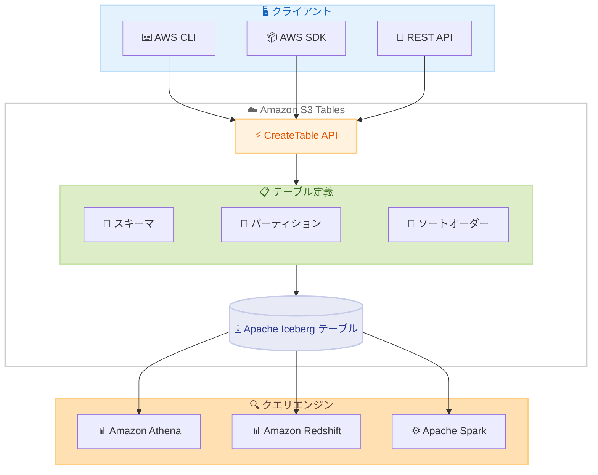

# Amazon S3 Tables - CreateTable API でのパーティションおよびソートオーダー定義

**リリース日**: 2026 年 2 月 12 日
**サービス**: Amazon S3 Tables
**機能**: Partition and Sort Order Definition in CreateTable API

📊 [このアップデートのインフォグラフィックを見る](https://takech9203.github.io/awsnews-summary/20260212-s3-tables-partition-and-sort-order-createtable-api.html)

## 概要

Amazon S3 Tables の CreateTable API でパーティション定義とソートオーダー定義がサポートされました。この機能強化により、テーブル作成時にこれらのプロパティをプログラムで設定することが簡素化され、データの管理と最適化が容易になります。

CreateTable API 呼び出しでパーティショントランスフォームのフィールドとソートオーダーを指定できます。AWS CLI や AWS SDK を使用してテーブルを作成する際にもこれらのプロパティを定義可能です。

**アップデート前の課題**

- CreateTable API ではスキーマ定義のみ指定可能で、パーティションやソートオーダーは別途設定が必要だった
- テーブル作成後にクエリエンジン (Apache Spark など) を使用してパーティションやソートオーダーを変更する必要があった
- プログラムによるテーブルプロビジョニングの自動化が煩雑だった

**アップデート後の改善**

- CreateTable API の 1 回の呼び出しでスキーマ、パーティション、ソートオーダーを同時に定義可能
- AWS CLI や AWS SDK から直接パーティションとソートオーダーを設定できる
- テーブル作成の自動化ワークフローが簡素化される

## アーキテクチャ図



CreateTable API の 1 回の呼び出しで、スキーマ、パーティション仕様、ソートオーダーをすべて定義し、最適化された Apache Iceberg テーブルを作成できます。

## サービスアップデートの詳細

### 主要機能

1. **パーティション仕様の定義**
   - CreateTable API の `metadata.iceberg.partitionSpec` で指定
   - ソースフィールドとトランスフォーム (identity、year、month、day、hour、bucket、truncate) を設定
   - パーティションによりクエリ時のデータスキャン量を削減

2. **ソートオーダーの定義**
   - CreateTable API の `metadata.iceberg.writeOrder` で指定
   - ソースフィールド、ソート方向 (asc/desc)、NULL 値の順序 (nulls-first/nulls-last) を設定
   - ファイル内のデータソートによりクエリパフォーマンスを向上

3. **既存機能との統合**
   - スキーマ定義と組み合わせて 1 回の API 呼び出しで完全なテーブルを作成
   - 暗号化設定、ストレージクラス、タグと併用可能
   - AWS CLI および全 AWS SDK で利用可能

## 技術仕様

### API 変更履歴

| 日付 | サービス | 変更内容 |
|------|----------|----------|
| 2026/02/11 | [Amazon S3 Tables](https://awsapichanges.com/archive/changes/b18289-s3tables.html) | 1 updated method - CreateTable でパーティション仕様とソートオーダーをサポート |

### IcebergMetadata オブジェクト構造

| フィールド | 型 | 必須 | 説明 |
|------------|------|------|------|
| schema | IcebergSchema | はい | テーブルスキーマ定義 |
| partitionSpec | IcebergPartitionSpec | いいえ | パーティション仕様 |
| writeOrder | IcebergSortOrder | いいえ | ソートオーダー |
| properties | Map | いいえ | カスタムプロパティ |

### IcebergPartitionField の構造

| フィールド | 型 | 必須 | 説明 |
|------------|------|------|------|
| name | String | はい | パーティションフィールド名 |
| source-id | Integer | はい | ソーススキーマフィールドの ID |
| transform | String | はい | パーティショントランスフォーム |
| field-id | Integer | いいえ | フィールドの一意識別子 |

### サポートされるパーティショントランスフォーム

| トランスフォーム | 説明 | ユースケース |
|------------------|------|-------------|
| identity | フィールド値をそのまま使用 | カテゴリ、リージョンなど |
| year | タイムスタンプから年を抽出 | 年単位の時系列データ |
| month | タイムスタンプから年月を抽出 | 月単位の時系列データ |
| day | タイムスタンプから日付を抽出 | 日単位の時系列データ |
| hour | タイムスタンプから時間を抽出 | 時間単位の時系列データ |
| bucket | ハッシュバケットに分割 | 高カーディナリティフィールド |
| truncate | 値を切り捨て | 文字列や数値の範囲分割 |

### IcebergSortField の構造

| フィールド | 型 | 必須 | 説明 |
|------------|------|------|------|
| source-id | Integer | はい | ソーススキーマフィールドの ID |
| transform | String | はい | ソート前に適用するトランスフォーム |
| direction | String | はい | ソート方向: asc または desc |
| null-order | String | はい | NULL 値の順序: nulls-first または nulls-last |

## 設定方法

### 前提条件

1. Amazon S3 Tables のテーブルバケットとネームスペースが作成済みであること
2. `s3tables:CreateTable` および `s3tables:PutTableData` の IAM 権限があること
3. 最新バージョンの AWS CLI または AWS SDK がインストールされていること

### 手順

#### ステップ 1: パーティションとソートオーダー付きテーブル定義の作成

以下の JSON ファイル (`mytabledefinition.json`) を作成します。

```json
{
    "tableBucketARN": "arn:aws:s3tables:us-east-1:123456789012:bucket/my-table-bucket",
    "namespace": "my_namespace",
    "name": "sales_data",
    "format": "ICEBERG",
    "metadata": {
        "iceberg": {
            "schema": {
                "fields": [
                    {"name": "order_id", "type": "long", "required": true},
                    {"name": "order_date", "type": "timestamp", "required": true},
                    {"name": "customer_id", "type": "long"},
                    {"name": "region", "type": "string"},
                    {"name": "amount", "type": "double"}
                ]
            },
            "partitionSpec": {
                "fields": [
                    {
                        "name": "order_month",
                        "source-id": 2,
                        "transform": "month"
                    },
                    {
                        "name": "region_part",
                        "source-id": 4,
                        "transform": "identity"
                    }
                ]
            },
            "writeOrder": {
                "order-id": 1,
                "fields": [
                    {
                        "source-id": 2,
                        "transform": "identity",
                        "direction": "desc",
                        "null-order": "nulls-last"
                    },
                    {
                        "source-id": 1,
                        "transform": "identity",
                        "direction": "asc",
                        "null-order": "nulls-last"
                    }
                ]
            }
        }
    }
}
```

スキーマ、パーティション仕様、ソートオーダーを 1 つの JSON ファイルにまとめて定義します。

#### ステップ 2: AWS CLI でテーブルを作成

```bash
aws s3tables create-table \
    --cli-input-json file://mytabledefinition.json
```

このコマンドにより、パーティションとソートオーダーが設定された Apache Iceberg テーブルが作成されます。

#### ステップ 3: テーブルの確認

```bash
aws s3tables get-table \
    --table-bucket-arn arn:aws:s3tables:us-east-1:123456789012:bucket/my-table-bucket \
    --namespace my_namespace \
    --name sales_data
```

作成されたテーブルのメタデータを確認し、パーティション仕様とソートオーダーが正しく設定されていることを検証します。

#### ステップ 4: Python SDK での使用例

```python
import boto3

s3tables = boto3.client('s3tables')

response = s3tables.create_table(
    tableBucketARN='arn:aws:s3tables:us-east-1:123456789012:bucket/my-table-bucket',
    namespace='my_namespace',
    name='event_logs',
    format='ICEBERG',
    metadata={
        'iceberg': {
            'schema': {
                'fields': [
                    {'name': 'event_id', 'type': 'long', 'required': True},
                    {'name': 'event_time', 'type': 'timestamp', 'required': True},
                    {'name': 'event_type', 'type': 'string'},
                    {'name': 'payload', 'type': 'string'}
                ]
            },
            'partitionSpec': {
                'fields': [
                    {
                        'name': 'event_day',
                        'source-id': 2,
                        'transform': 'day'
                    }
                ]
            },
            'writeOrder': {
                'order-id': 1,
                'fields': [
                    {
                        'source-id': 2,
                        'transform': 'identity',
                        'direction': 'desc',
                        'null-order': 'nulls-last'
                    }
                ]
            }
        }
    }
)

print(f"Table ARN: {response['tableARN']}")
```

AWS SDK for Python (boto3) を使用して、パーティションとソートオーダー付きのテーブルを作成します。

## メリット

### ビジネス面

- **運用効率の向上**: テーブル作成と最適化設定を 1 ステップで完了
- **自動化の簡素化**: IaC ツールやプロビジョニングスクリプトでの設定が容易
- **コスト削減**: 適切なパーティションとソートにより、クエリのスキャンデータ量を削減

### 技術面

- **クエリパフォーマンス向上**: パーティションプルーニングとデータスキッピングの最適化
- **一貫性の確保**: テーブル作成時から最適な構成を適用
- **API の統一**: スキーマ、パーティション、ソートオーダーを 1 つの API で管理

## デメリット・制約事項

### 制限事項

- テーブル名とカラム名はすべて小文字である必要がある
- パーティション仕様の定義にはスキーマ定義 (schema) が必須
- テーブル作成後のパーティション仕様変更には別途クエリエンジンでの操作が必要

### 考慮すべき点

- パーティショントランスフォームの選択はクエリパターンに基づいて慎重に行う
- 過度なパーティション分割 (スモールファイル問題) に注意する
- ソートオーダーの設定は書き込みパフォーマンスに影響する可能性がある

## ユースケース

### ユースケース 1: 時系列データの分析基盤

**シナリオ**: IoT デバイスから収集されるセンサーデータを日単位でパーティション化し、タイムスタンプ降順でソートして格納

**実装例**:
```json
{
    "partitionSpec": {
        "fields": [
            {"name": "event_day", "source-id": 2, "transform": "day"}
        ]
    },
    "writeOrder": {
        "order-id": 1,
        "fields": [
            {"source-id": 2, "transform": "identity", "direction": "desc", "null-order": "nulls-last"}
        ]
    }
}
```

**効果**: 日付範囲クエリでのスキャンデータ量が削減され、最新データへのアクセスが高速化

### ユースケース 2: マルチテナント SaaS アプリケーション

**シナリオ**: テナント ID でパーティション化し、作成日時でソートしてテナント間のデータ分離とクエリ効率を両立

**実装例**:
```json
{
    "partitionSpec": {
        "fields": [
            {"name": "tenant_bucket", "source-id": 1, "transform": "bucket[64]"}
        ]
    },
    "writeOrder": {
        "order-id": 1,
        "fields": [
            {"source-id": 3, "transform": "identity", "direction": "asc", "null-order": "nulls-last"}
        ]
    }
}
```

**効果**: テナント固有クエリのパフォーマンスが向上し、自動化されたテーブルプロビジョニングが実現

### ユースケース 3: データパイプラインの自動化

**シナリオ**: ETL パイプラインでテーブルを自動作成し、最適なパーティションとソートオーダーを事前に設定

**実装例**:
```python
# パイプライン内でテーブルを自動作成
for table_config in pipeline_tables:
    s3tables.create_table(
        tableBucketARN=bucket_arn,
        namespace=table_config['namespace'],
        name=table_config['name'],
        format='ICEBERG',
        metadata={
            'iceberg': {
                'schema': table_config['schema'],
                'partitionSpec': table_config['partition_spec'],
                'writeOrder': table_config['sort_order']
            }
        }
    )
```

**効果**: テーブル作成からデータ投入までの自動化が簡素化され、一貫した最適化設定を適用可能

## 料金

CreateTable API でのパーティションおよびソートオーダー定義に追加料金はありません。S3 Tables の標準料金が適用されます。詳細は [Amazon S3 料金ページ](https://aws.amazon.com/s3/pricing/) を参照してください。

## 利用可能リージョン

S3 Tables が利用可能なすべての AWS リージョンで利用できます。詳細は [S3 Tables リージョンとエンドポイント](https://docs.aws.amazon.com/AmazonS3/latest/userguide/s3-tables-regions-quotas.html#s3-tables-regions) を参照してください。

## 関連サービス・機能

- **Amazon S3 Tables**: Apache Iceberg 形式のフルマネージドテーブルストレージ
- **Amazon Athena**: S3 Tables のサーバーレスクエリ
- **Amazon Redshift**: S3 Tables との統合分析
- **AWS Glue Data Catalog**: テーブルメタデータの管理

## 参考リンク

- 📊 [インフォグラフィック](https://takech9203.github.io/awsnews-summary/20260212-s3-tables-partition-and-sort-order-createtable-api.html)
- [公式発表 (What's New)](https://aws.amazon.com/about-aws/whats-new/2026/02/s3-tables-partition-and-sort-order-createtable-api/)
- [S3 Tables 製品ページ](https://aws.amazon.com/s3/features/tables/)
- [S3 Tables ドキュメント](https://docs.aws.amazon.com/AmazonS3/latest/userguide/s3-tables.html)
- [CreateTable API リファレンス](https://docs.aws.amazon.com/AmazonS3/latest/API/API_s3Buckets_CreateTable.html)
- [IcebergPartitionSpec リファレンス](https://docs.aws.amazon.com/AmazonS3/latest/API/API_s3Buckets_IcebergPartitionSpec.html)
- [IcebergSortOrder リファレンス](https://docs.aws.amazon.com/AmazonS3/latest/API/API_s3Buckets_IcebergSortOrder.html)

## まとめ

Amazon S3 Tables の CreateTable API でパーティション仕様とソートオーダーの定義がサポートされたことにより、テーブル作成時に最適なデータ構成をプログラムで設定できるようになりました。テーブルの自動プロビジョニングやデータパイプラインの構築において、この機能を活用してクエリパフォーマンスの最適化とテーブル管理の効率化を実現してください。
