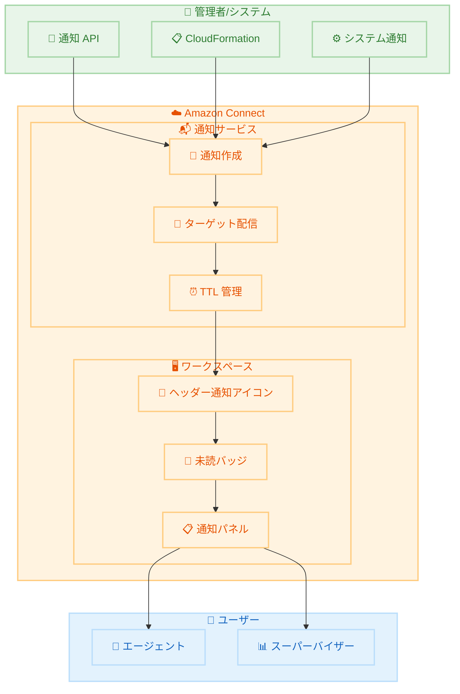

# Amazon Connect - アプリ内通知機能

**リリース日**: 2026 年 2 月 13 日
**サービス**: Amazon Connect
**機能**: ワークスペースヘッダーのアプリ内通知 (In-App Notifications)

📊 [このアップデートのインフォグラフィックを見る](https://takech9203.github.io/awsnews-summary/20260213-amazon-connect-in-app-notifications.html)

## 概要

Amazon Connect がワークスペースヘッダーにアプリ内通知機能をリリースしました。この機能により、ビジネスユーザーに対して重要な運用アラートやシステム更新情報を、業務を中断することなく届けることが可能になります。

通知アイコンはワークスペースのすべてのページのヘッダーに表示され、未読メッセージがある場合はバッジで示されます。ユーザーはアイコンをクリックしてメッセージを確認し、埋め込みリンクから関連リソースにアクセスしたり、既読/未読ステータスを管理したりできます。ページ遷移なしでこれらの操作が完結するため、エージェントや管理者のワークフローを妨げません。

また、新しい通知 API により、組織内の特定のオーディエンスに対してプログラムでターゲットメッセージを送信できます。パブリック API と AWS CloudFormation のサポートにより、通知管理のインフラストラクチャをコードとして管理することも可能です。

**アップデート前の課題**

- コンタクトセンター内の重要な運用情報やポリシー変更を全エージェントに迅速に伝達する標準的な手段がなかった
- システム更新や緊急アナウンスをエージェントに伝えるために、外部ツール (メール、チャットなど) に依存していた
- エージェントが業務中に通知を確認するためにワークスペースを離れる必要があった

**アップデート後の改善**

- ワークスペースヘッダーに常時表示される通知アイコンにより、どのページにいても重要情報を即座に確認可能
- 通知 API を使用して、特定のユーザーグループに対してターゲットメッセージをプログラムで送信可能
- ページ遷移不要で通知の確認、リンクアクセス、既読管理が完結

## アーキテクチャ図



管理者やシステムが通知 API を通じてメッセージを作成し、ターゲットユーザーのワークスペースヘッダーに配信される流れを示しています。

## サービスアップデートの詳細

### 主要機能

1. **ワークスペースヘッダー通知**
   - すべてのワークスペースページのヘッダーに通知アイコンを表示
   - 未読メッセージ数をバッジで表示
   - クリックで通知パネルを開き、メッセージ内容を確認
   - 埋め込みリンクから関連リソースに直接アクセス

2. **通知管理機能**
   - 既読/未読ステータスの管理
   - 優先度インジケーター (緊急メッセージの強調表示)
   - 1 通知あたり最大 500 文字のローカライズ文字列をサポート
   - デフォルト表示期間は 1 週間 (TTL で制御可能)

3. **通知 API によるプログラム配信**
   - 特定のユーザーに対するターゲットメッセージ送信
   - リッチテキストメッセージと埋め込みリンクのサポート
   - 多言語対応 (ユーザーの言語設定に合わせた翻訳)
   - 1 回のリクエストで最大 200 ユーザーに送信、またはインスタンス全体に配信
   - 既存通知の更新と削除

4. **アクセス制御**
   - タグベースアクセス制御 (TBAC): 割り当てられたタグに一致する通知のみ作成・管理可能
   - 階層ベースアクセス制御 (HBAC): 階層レベル配下のユーザーにのみ通知を送信可能
   - パブリック API と CloudFormation サポート

## 技術仕様

### 通知の仕様

| 項目 | 詳細 |
|------|------|
| メッセージ長 | ローカライズ文字列あたり最大 500 文字 |
| 送信先上限 | 1 回のリクエストで最大 200 ユーザー |
| デフォルト TTL | 1 週間 |
| インスタンスあたり上限 | 最大 500 件のアクティブ通知 |
| コンテンツ形式 | リッチテキスト、埋め込みリンク対応 |
| 配信タイミング | 作成時に即時配信 (スケジュール配信は非対応) |
| 更新タイミング | ページ遷移またはブラウザリフレッシュ時 |

### API 変更履歴

| 日付 | サービス | 変更内容 |
|------|----------|----------|
| 2026/02/10 | [Amazon Connect Service](https://awsapichanges.com/archive/changes/56b6d8-connect.html) | 1 new 3 updated api methods - チャネルごとの auto-accept/ACW タイムアウト設定、UpdateUserConfig API の追加 |

### アクセス制御

通知の受信には追加権限は不要ですが、通知の作成・編集・削除には API 権限が必要です。

```json
{
  "Effect": "Allow",
  "Action": [
    "connect:CreateNotification",
    "connect:UpdateNotification",
    "connect:DeleteNotification",
    "connect:ListNotifications"
  ],
  "Resource": "arn:aws:connect:*:*:instance/*/notification/*"
}
```

## 設定方法

### 前提条件

1. Amazon Connect インスタンスが構成済みであること
2. 通知 API を使用するための IAM 権限が設定されていること
3. 最新バージョンの AWS CLI / SDK

### 手順

#### ステップ 1: 通知の作成

通知 API を使用して、ターゲットユーザーにメッセージを送信します。

```bash
aws connect create-notification \
  --instance-id "your-instance-id" \
  --content "システムメンテナンスのお知らせ: 本日 22:00-23:00 に定期メンテナンスを実施します。" \
  --recipients '{"UserIds": ["user-id-1", "user-id-2"]}' \
  --priority "HIGH" \
  --ttl-in-seconds 604800
```

指定したユーザーに対して高優先度の通知を作成し、1 週間表示します。

#### ステップ 2: 通知の確認

送信済み通知の一覧を確認します。

```bash
aws connect list-notifications \
  --instance-id "your-instance-id"
```

インスタンス内のアクティブな通知一覧を取得します。

#### ステップ 3: 通知の更新

既存の通知内容を更新します。

```bash
aws connect update-notification \
  --instance-id "your-instance-id" \
  --notification-id "notification-id" \
  --content "メンテナンス完了: システムは正常に稼働しています。"
```

進行中のイベントについて、ステータス変更を既存の通知に反映します。

## メリット

### ビジネス面

- **運用効率の向上**: 重要な情報をリアルタイムでエージェントに届けることで、対応の遅延を防止
- **コミュニケーションの一元化**: 外部ツールに依存せず、Amazon Connect ワークスペース内で情報伝達が完結
- **ターゲット配信**: 特定のチームや役割に応じた通知配信により、情報の関連性を向上

### 技術面

- **API ベースの自動化**: 通知 API により、監視システムやインシデント管理ツールとの統合が可能
- **CloudFormation サポート**: インフラストラクチャをコードとして管理し、環境間での一貫した通知設定を実現
- **アクセス制御の統合**: 既存の TBAC/HBAC フレームワークとの統合により、セキュアな通知管理

## デメリット・制約事項

### 制限事項

- スケジュール配信は非対応 (通知は作成時に即時配信のみ)
- インスタンスあたり最大 500 件のアクティブ通知
- 通知は TTL 期限切れまたは手動削除まで保存され、長期的なデータ保持には不向き
- 配信確認やリーディングレシートは提供されない
- AWS コンソールには表示されず、Connect ワークスペースのみで確認可能

### 考慮すべき点

- 通知疲れを防ぐため、ターゲットを絞り込み、関連する更新を統合することが推奨される
- 追跡が必要なアクション項目には、通知ではなく Tasks 機能の使用が推奨される
- 個人情報 (PII) を通知に含めないことが推奨される

## ユースケース

### ユースケース 1: システムメンテナンスの事前通知

**シナリオ**: 計画的なシステムメンテナンスについて、影響を受けるエージェント全員に事前通知を送信する必要がある

**実装例**:
```bash
aws connect create-notification \
  --instance-id "instance-id" \
  --content "定期メンテナンス: 2/15 22:00-23:00 に CRM 連携が一時停止します。手動対応の準備をお願いします。" \
  --recipients '{"AllUsers": true}' \
  --priority "HIGH"
```

**効果**: 全エージェントがメンテナンス情報をワークスペース上で即座に確認でき、業務への影響を最小化

### ユースケース 2: チーム別ポリシー変更通知

**シナリオ**: カスタマーサービス部門のみに適用される新しい返品ポリシーを通知する

**実装例**:
```bash
aws connect create-notification \
  --instance-id "instance-id" \
  --content "返品ポリシー更新: 本日より 30 日以内の返品は自動承認となります。詳細はこちら: https://internal-wiki/return-policy" \
  --recipients '{"UserTags": {"Department": "CustomerService"}}'
```

**効果**: 対象チームのみにターゲット配信され、他部門への不要な通知を防止

### ユースケース 3: インシデント管理との統合

**シナリオ**: 監視システムからのアラートに基づき、サービス障害の進捗を自動的にエージェントに通知する

**実装例**:
```bash
# 初回通知
aws connect create-notification \
  --instance-id "instance-id" \
  --content "障害発生: 決済システムに遅延が発生しています。決済関連の問い合わせはエスカレーションしてください。" \
  --recipients '{"AllUsers": true}' \
  --priority "HIGH" \
  --notification-id "incident-20260213"

# 復旧通知 (既存通知を更新)
aws connect update-notification \
  --instance-id "instance-id" \
  --notification-id "incident-20260213" \
  --content "復旧完了: 決済システムは正常に稼働しています。通常対応に戻ってください。"
```

**効果**: インシデントの進捗をリアルタイムで全エージェントに共有し、一貫した顧客対応を実現

## 料金

アプリ内通知機能の利用に追加料金は発生しません。Amazon Connect の標準料金が適用されます。詳細は [Amazon Connect 料金ページ](https://aws.amazon.com/connect/pricing/) を参照してください。

## 利用可能リージョン

Amazon Connect が提供されているすべての AWS リージョンで利用可能です。

## 関連サービス・機能

- **Amazon Connect Tasks**: 追跡が必要なアクション項目の割り当て・管理機能。通知では対応できない追跡要件に最適
- **Amazon Connect Contact Lens**: リアルタイム分析とエージェントパフォーマンス管理
- **AWS CloudFormation**: 通知設定のインフラストラクチャ管理
- **Amazon CloudTrail**: 通知 API 操作の監査ログ

## 参考リンク

- 📊 [インフォグラフィック](https://takech9203.github.io/awsnews-summary/20260213-amazon-connect-in-app-notifications.html)
- [公式発表 (What's New)](https://aws.amazon.com/about-aws/whats-new/2026/02/amazon-connect-in-app-notifications/)
- [ドキュメント - ワークスペースヘッダー通知](https://docs.aws.amazon.com/connect/latest/adminguide/amazon-connect-notifications.html)
- [Amazon Connect 管理者ガイド](https://docs.aws.amazon.com/connect/latest/adminguide/what-is-amazon-connect.html)
- [料金ページ](https://aws.amazon.com/connect/pricing/)

## まとめ

Amazon Connect のアプリ内通知機能は、コンタクトセンター内のコミュニケーションを大幅に改善するアップデートです。ワークスペースヘッダーに統合された通知により、エージェントや管理者は業務を中断することなく重要な情報を受け取れます。通知 API と CloudFormation サポートにより、監視システムやインシデント管理ツールとの統合も容易であるため、既存の Amazon Connect 環境での早期導入を推奨します。
