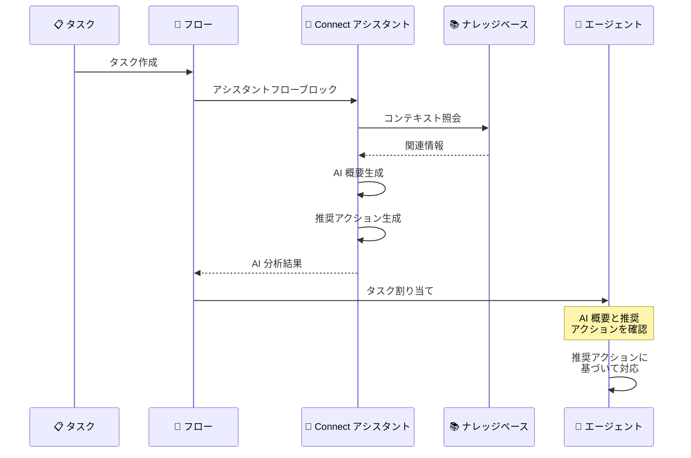

# Amazon Connect - タスク向け AI アシスタンス

**リリース日**: 2026 年 2 月 13 日
**サービス**: Amazon Connect
**機能**: タスク向けリアルタイム AI 概要と推奨アクション

📊 [このアップデートのインフォグラフィックを見る](https://takech9203.github.io/aws-news-summary/20260213-amazon-connect-tasks-ai-assistance.html)

## 概要

Amazon Connect がタスク向けにリアルタイムの AI パワード概要と推奨次アクションの提供を開始しました。この機能により、エージェントはタスクの内容を素早く理解し、より迅速に解決できるようになります。

例えば、返金リクエストに関するタスクがエージェントに割り当てられた場合、AI が過去のアクティビティ (注文確認、返品適格性の確認、決済情報の確認など) を要約し、次に取るべきステップを提示します。これにより、エージェントはタスクの背景情報を手動で調べる時間を削減し、即座にアクションに移ることが可能になります。

この機能を有効にするには、タスクの割り当て前にフロー内で Connect アシスタントフローブロックを追加します。ナレッジベースを追加することで、AI の推奨内容をガイドし、組織固有のプロセスに沿ったアクション提案を実現できます。

**アップデート前の課題**

- エージェントはタスクを受け取った際に、関連する過去のやり取りや対応履歴を手動で確認する必要があった
- タスクの文脈を把握するまでに時間がかかり、解決までのリードタイムが長くなっていた
- 次に取るべきアクションの判断にエージェントの経験や知識に依存しており、対応品質にばらつきがあった

**アップデート後の改善**

- AI がタスクに関連する過去のアクティビティを自動的に要約し、エージェントに提示
- 推奨される次のアクションが AI により提案され、エージェントの判断をサポート
- ナレッジベースとの連携により、組織固有のプロセスに基づいた推奨が可能

## アーキテクチャ図

タスクがフロー内の Connect アシスタントブロックを経由することで、AI が概要と推奨アクションを生成し、エージェントに提供される流れを示しています。

## サービスアップデートの詳細

### 主要機能

1. **AI パワードタスク概要**
   - タスクに関連する過去のアクティビティを自動要約
   - 顧客との以前のやり取り、対応履歴、関連情報を集約
   - エージェントがタスクの全体像を即座に把握可能

2. **推奨次アクション**
   - AI がタスクの内容と文脈に基づいて次に取るべきアクションを提案
   - 組織のプロセスに沿ったステップバイステップの推奨
   - エージェントの判断を支援し、対応品質の均一化に貢献

3. **ナレッジベース連携**
   - Amazon Bedrock ナレッジベースを追加して AI の推奨内容をガイド
   - 社内ポリシー、手順書、FAQ などの情報に基づいた推奨が可能
   - 組織固有の業務フローに最適化された提案を実現

## 技術仕様

### 設定要件

| 項目 | 詳細 |
|------|------|
| フローブロック | Connect アシスタントフローブロック |
| 配置場所 | タスク割り当て前のフロー内 |
| ナレッジベース | Amazon Bedrock ナレッジベース (オプション) |
| AI 基盤 | Amazon Bedrock 上に構築 |

### タスク AI アシスタンスの動作

| 要素 | 説明 |
|------|------|
| 概要生成 | タスクに紐づく過去のコンタクト履歴とアクティビティを自動要約 |
| アクション推奨 | タスク内容とナレッジベースに基づく次ステップの提案 |
| リアルタイム | タスク割り当て時にエージェントのワークスペースに即座に表示 |
| カスタマイズ | プロンプトとナレッジベースにより推奨内容を調整可能 |

## 設定方法

### 前提条件

1. Amazon Connect インスタンスが構成済みであること
2. Amazon Q in Connect が有効化されていること
3. タスクフローが作成済みであること

### 手順

#### ステップ 1: Connect アシスタントフローブロックの追加

Amazon Connect フローデザイナーでタスク用フローを開き、タスクがエージェントに割り当てられる前の位置に Connect アシスタントフローブロックを追加します。

1. フローデザイナーを開く
2. タスク割り当てブロックの前に「Amazon Q in Connect」ブロックを配置
3. ブロックの設定で、タスクチャネル向けの AI アシスタンスを有効化

#### ステップ 2: ナレッジベースの追加 (オプション)

AI の推奨精度を向上させるために、ナレッジベースを設定します。

1. Amazon Connect 管理コンソールで Amazon Q in Connect の設定画面を開く
2. ナレッジベースを作成または既存のものを関連付け
3. 社内のポリシードキュメント、手順書、FAQ などをナレッジソースとして登録

#### ステップ 3: フローの公開とテスト

1. フローを保存して公開
2. テストタスクを作成して、AI 概要と推奨アクションが正しく表示されることを確認
3. 推奨内容の品質を検証し、必要に応じてナレッジベースやプロンプトを調整

## メリット

### ビジネス面

- **解決時間の短縮**: エージェントがタスクの背景情報を即座に把握できるため、調査時間を大幅に削減
- **対応品質の均一化**: AI による推奨アクションにより、経験の浅いエージェントでも適切な対応が可能
- **顧客満足度の向上**: 迅速かつ的確なタスク解決により、顧客体験を改善

### 技術面

- **フローベースの有効化**: 既存のフローに Connect アシスタントブロックを追加するだけで利用開始可能
- **ナレッジベースによるカスタマイズ**: 組織固有の情報を活用した高精度な推奨
- **Amazon Bedrock 基盤**: 高品質な生成 AI モデルによる自然な要約と推奨

## デメリット・制約事項

### 制限事項

- Connect アシスタントフローブロックをフロー内に追加する必要があり、既存フローの変更が必要
- AI の推奨精度はナレッジベースの品質と網羅性に依存する
- Amazon Q in Connect が利用可能なリージョンに限定される

### 考慮すべき点

- ナレッジベースの情報が最新かつ正確であることを定期的に確認する必要がある
- AI の推奨はあくまで提案であり、最終判断はエージェントが行う必要がある
- 初期設定とナレッジベースの構築に一定の時間とリソースが必要

## ユースケース

### ユースケース 1: 返金リクエストの処理

**シナリオ**: 顧客からの返金リクエストがタスクとしてエージェントに割り当てられる

**AI アシスタンスの動作**:

1. AI が過去のアクティビティを要約: 「注文 #12345 について、顧客が 2/10 に返品を申請。返品適格性は確認済み、決済方法はクレジットカード。」
2. 推奨次アクション: 「返金処理を開始してください。返金額は $49.99 です。処理後、顧客に確認メールを送信してください。」

**効果**: エージェントは背景調査なしに即座に返金処理に着手可能

### ユースケース 2: エスカレーションされた技術サポート

**シナリオ**: 一次対応で解決できなかった技術的な問題が、上位チームにタスクとしてエスカレーションされる

**AI アシスタンスの動作**:

1. AI が過去のやり取りを要約: 「顧客は 3 回のチャットセッションで API 接続エラーを報告。一次対応で認証情報の再設定を試行したが解決せず。」
2. 推奨次アクション: 「API エンドポイントの接続ログを確認し、ファイアウォール設定を検証してください。類似事例ではプロキシ設定の変更で解決しています。」

**効果**: エスカレーション先のエージェントが過去の対応を把握した状態で即座に高度な対応を開始可能

### ユースケース 3: 契約更新のフォローアップ

**シナリオ**: 契約更新期限が近い顧客へのフォローアップタスクがエージェントに割り当てられる

**AI アシスタンスの動作**:

1. AI が顧客情報を要約: 「顧客は現在のプランを 2 年間利用。過去 6 か月間にサポートへの問い合わせが 3 件あり、すべて解決済み。」
2. 推奨次アクション: 「更新プランの提案と、プレミアムプランへのアップグレードオプションを提示してください。過去のサポート履歴から、24 時間サポート付きプランが適している可能性があります。」

**効果**: 顧客の利用状況に基づいた的確な提案により、契約更新率を向上

## 料金

タスク向け AI アシスタンスの料金は Amazon Q in Connect の料金体系に含まれます。詳細は [Amazon Connect 料金ページ](https://aws.amazon.com/connect/pricing/) を参照してください。

## 利用可能リージョン

Amazon Connect のリアルタイムエージェントアシスタンス (Amazon Q in Connect) が利用可能なすべてのリージョンで提供されます。

- US East (N. Virginia) - us-east-1
- US West (Oregon) - us-west-2
- Asia Pacific (Seoul) - ap-northeast-2
- Asia Pacific (Singapore) - ap-southeast-1
- Asia Pacific (Sydney) - ap-southeast-2
- Asia Pacific (Tokyo) - ap-northeast-1
- Canada (Central) - ca-central-1
- Europe (Frankfurt) - eu-central-1
- Europe (London) - eu-west-2

## 関連サービス・機能

- **Amazon Q in Connect**: タスク AI アシスタンスの基盤となるリアルタイムエージェント支援機能
- **Amazon Bedrock**: AI モデルの基盤サービス。ナレッジベースの構築にも使用
- **Amazon Connect Tasks**: タスクの作成、割り当て、追跡を管理する機能
- **Amazon Connect Contact Lens**: 会話分析とエージェントパフォーマンス管理

## 参考リンク

- 📊 [インフォグラフィック](https://takech9203.github.io/aws-news-summary/20260213-amazon-connect-tasks-ai-assistance.html)
- [公式発表 (What's New)](https://aws.amazon.com/about-aws/whats-new/2026/02/amazon-connect-tasks-ai-assistance/)
- [Amazon Connect 管理者ガイド](https://docs.aws.amazon.com/connect/latest/adminguide/what-is-amazon-connect.html)
- [Amazon Q in Connect ドキュメント](https://docs.aws.amazon.com/connect/latest/adminguide/amazon-q-connect.html)
- [料金ページ](https://aws.amazon.com/connect/pricing/)

## まとめ

Amazon Connect のタスク向け AI アシスタンスは、エージェントのタスク処理効率を大幅に向上させるアップデートです。AI が過去のアクティビティを自動要約し、推奨アクションを提示することで、エージェントは調査時間を削減し、迅速な解決に集中できます。既存のフローに Connect アシスタントブロックを追加するだけで有効化できるため、Amazon Q in Connect を利用中の環境では早期の導入を推奨します。
