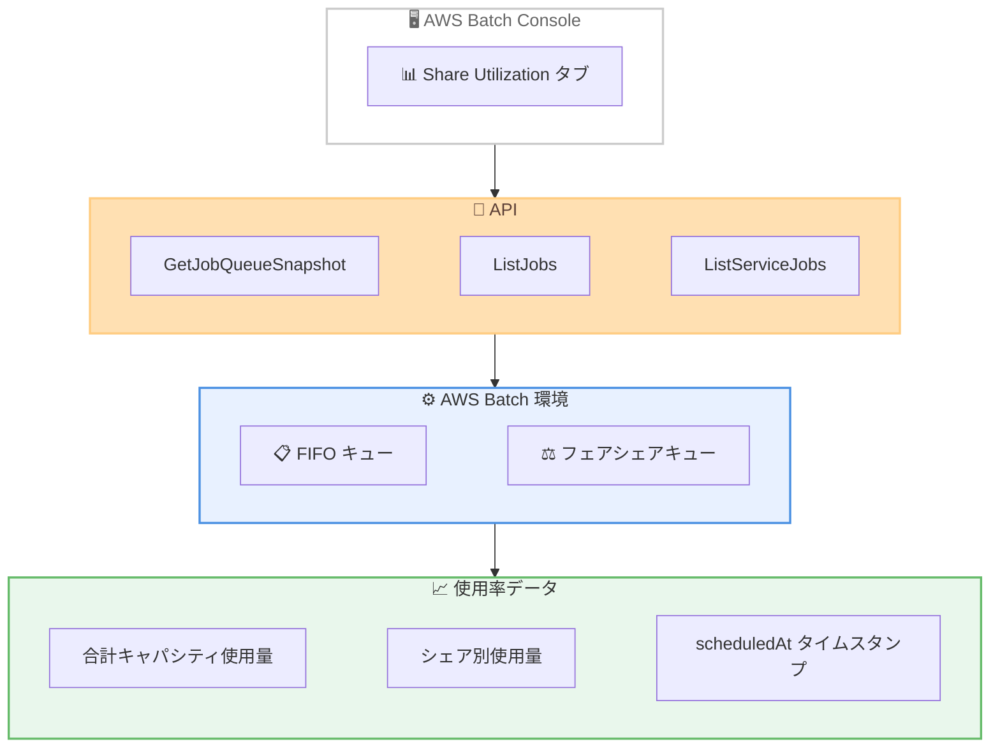

# AWS Batch - ジョブキューとシェア使用率の可視化

**リリース日**: 2026 年 2 月 13 日
**サービス**: AWS Batch
**機能**: Job Queue and Share Utilization Visibility

📊 [このアップデートのインフォグラフィックを見る](https://takech9203.github.io/20260213-aws-batch-provides-job-queue-share-utilization.html)

## 概要

AWS Batch がジョブキューとフェアシェアスケジューリングにおけるキャパシティ使用率の可視化機能を提供開始しました。ジョブキュースナップショットにキュー使用率データが追加され、FIFO およびフェアシェアジョブキューで使用されているコンピュートキャパシティを確認できるようになりました。

このアップデートにより、フェアシェアスケジューリングの個々のシェア識別子ごとのキャパシティ消費量を把握でき、どのシェアアロケーションが最も多くのキャパシティを消費しているかを理解できます。また、ListServiceJobs API に scheduledAt タイムスタンプが追加され、ジョブのスケジュール情報の追跡が可能になりました。

**アップデート前の課題**

- ジョブキューごとのコンピュートキャパシティ使用率を把握する手段が限られていた
- フェアシェアスケジューリングにおいて、個々のシェアアロケーションのキャパシティ消費パターンを分析できなかった
- ジョブのスケジュールタイミングを追跡するタイムスタンプ情報が不足していた

**アップデート後の改善**

- GetJobQueueSnapshot API でキュー使用率データを取得可能になった
- シェア識別子ごとのキャパシティ消費量をリアルタイムで確認できるようになった
- ListServiceJobs API に scheduledAt タイムスタンプが追加され、ジョブスケジュールの追跡が可能になった
- コンソールの新しい Share Utilization タブでビジュアルに使用率を確認できるようになった

## アーキテクチャ図



API とコンソールを通じて、ジョブキューのキャパシティ使用率データを取得し、FIFO キューとフェアシェアキューの両方の使用状況を可視化する構成を示しています。

## サービスアップデートの詳細

### 主要機能

1. **キュー使用率データの可視化**
   - ジョブキュースナップショットにキャパシティ使用率データを追加
   - FIFO ジョブキューとフェアシェアジョブキューの両方で利用可能
   - 合計キャパシティ使用量とシェア別の内訳を提供

2. **フェアシェアアロケーション別のキャパシティ消費量**
   - 個々のフェアシェアアロケーションのキャパシティ消費量を表示
   - シェア識別子でジョブをフィルタリングし、消費パターンを分析可能
   - アクティブなシェア数とトップキャパシティ使用量を確認可能

3. **scheduledAt タイムスタンプの追加**
   - ListServiceJobs API のレスポンスに scheduledAt タイムスタンプを追加
   - ジョブがスケジュールされたタイミングを正確に追跡可能
   - ジョブのライフサイクル分析に活用可能

4. **コンソールでの Share Utilization タブ**
   - AWS Batch コンソールに新しい Share Utilization タブを追加
   - ビジュアルなインターフェースでシェア使用率を確認可能
   - API を直接呼び出さずにブラウザから使用率データを閲覧可能

## 技術仕様

### GetJobQueueSnapshot API レスポンス

| 項目 | 詳細 |
|------|------|
| queueUtilization | キュー全体のキャパシティ使用率情報 |
| totalCapacityUsage | 合計キャパシティ使用量 (capacityUnit と quantity) |
| fairshareUtilization | フェアシェアスケジューリングの使用率情報 |
| activeShareCount | アクティブなシェアの数 |
| topCapacityUtilization | シェア識別子ごとのキャパシティ使用量 |
| lastUpdatedAt | 使用率データの最終更新タイムスタンプ |

### API 変更履歴

| 日付 | サービス | 変更内容 |
|------|----------|----------|
| 2026/02/11 | [AWS Batch](https://awsapichanges.com/archive/changes/b18289-batch.html) | 4 updated methods - シェア識別子によるジョブのリストアップとジョブキューおよびシェアのアクティブキャパシティ使用率スナップショットの取得をサポート |

### API レスポンス例

```json
{
  "frontOfQueue": {
    "jobs": [
      {
        "earliestTimeAtPosition": 1707800000,
        "jobArn": "arn:aws:batch:us-east-1:123456789012:job/example-job-id"
      }
    ],
    "lastUpdatedAt": 1707800100
  },
  "queueUtilization": {
    "fairshareUtilization": {
      "activeShareCount": 3,
      "topCapacityUtilization": [
        {
          "capacityUsage": [
            {
              "capacityUnit": "VCPU",
              "quantity": 128
            }
          ],
          "shareIdentifier": "team-a"
        }
      ]
    },
    "lastUpdatedAt": 1707800100,
    "totalCapacityUsage": [
      {
        "capacityUnit": "VCPU",
        "quantity": 256
      }
    ]
  }
}
```

## 設定方法

### 前提条件

1. AWS アカウントと AWS Batch への適切な IAM アクセス権限
2. 既存の AWS Batch ジョブキュー (FIFO またはフェアシェアスケジューリング)
3. AWS CLI v2 または AWS SDK の最新バージョン

### 手順

#### ステップ 1: ジョブキュースナップショットの取得

```bash
# GetJobQueueSnapshot API を使用してキュー使用率データを取得
aws batch get-job-queue-snapshot \
  --job-queue my-fairshare-queue
```

ジョブキューのスナップショットを取得し、キャパシティ使用率データを確認します。レスポンスには合計キャパシティ使用量とフェアシェアアロケーション別の内訳が含まれます。

#### ステップ 2: シェア識別子によるジョブのフィルタリング

```bash
# ListJobs API でシェア識別子によるフィルタリング
aws batch list-jobs \
  --job-queue my-fairshare-queue \
  --filters name=SHARE_IDENTIFIER,values=team-a
```

特定のシェア識別子に関連するジョブをフィルタリングし、そのシェアの消費パターンを分析します。

#### ステップ 3: サービスジョブのスケジュール情報を確認

```bash
# ListServiceJobs API で scheduledAt タイムスタンプを含むジョブ情報を取得
aws batch list-service-jobs \
  --job-queue my-fairshare-queue
```

ListServiceJobs API のレスポンスに含まれる scheduledAt タイムスタンプを確認し、ジョブのスケジュールタイミングを追跡します。

## メリット

### ビジネス面

- **コスト最適化**: キャパシティ使用率を可視化することで、リソースの無駄を特定し、コストを最適化
- **公平なリソース配分**: フェアシェアアロケーションの消費パターンを把握し、チーム間の公平なリソース配分を実現
- **意思決定の改善**: データに基づいたキャパシティプランニングと予算配分が可能

### 技術面

- **リアルタイムモニタリング**: キュー使用率をリアルタイムで監視し、ボトルネックを迅速に特定
- **詳細な分析**: シェア識別子ごとの消費パターンを分析し、スケジューリングポリシーを最適化
- **ジョブライフサイクル追跡**: scheduledAt タイムスタンプにより、ジョブのスケジュールから完了までのライフサイクルを正確に追跡

## デメリット・制約事項

### 制限事項

- GetJobQueueSnapshot API は先頭 100 件の RUNNABLE ジョブのみを返却する
- キャパシティ使用率データはスナップショットであり、リアルタイムの正確な値ではない場合がある
- フェアシェアスケジューリングの使用率データは、フェアシェアスケジューリングが有効なキューでのみ利用可能

### 考慮すべき点

- 大量のジョブキューを持つ環境では、API 呼び出しの頻度とコストに注意が必要
- 使用率データの解釈には、AWS Batch のスケジューリングメカニズムの理解が前提

## ユースケース

### ユースケース 1: マルチチーム環境でのキャパシティ管理

**シナリオ**: 複数のチームがフェアシェアスケジューリングを使用して AWS Batch クラスターを共有しており、各チームのキャパシティ消費量を監視したい。

**実装例**:
```bash
# 定期的にスナップショットを取得してキャパシティ使用率を監視
aws batch get-job-queue-snapshot \
  --job-queue shared-fairshare-queue \
  --query 'queueUtilization.fairshareUtilization.topCapacityUtilization'
```

**効果**: 各チームのキャパシティ消費量を定量的に把握し、リソース配分の調整やスケジューリングポリシーの見直しに活用できます。

### ユースケース 2: ジョブスケジューリングのパフォーマンス分析

**シナリオ**: ジョブの投入からスケジュールまでの待機時間を分析し、キュー設定を最適化したい。

**実装例**:
```bash
# scheduledAt タイムスタンプを活用してスケジューリング遅延を分析
aws batch list-service-jobs \
  --job-queue my-queue \
  --query 'results[].{jobId:jobArn,scheduled:scheduledAt}'
```

**効果**: ジョブのスケジュール遅延を定量的に把握し、コンピュート環境のサイジングやキュー構成の最適化に活用できます。

### ユースケース 3: コスト配分とチャージバック

**シナリオ**: 組織内の各部門に対して、AWS Batch のキャパシティ使用量に基づいたコスト配分を行いたい。

**実装例**:
```bash
# シェア識別子ごとの使用量を取得してコスト配分に活用
aws batch get-job-queue-snapshot \
  --job-queue department-queue \
  --query 'queueUtilization.{total:totalCapacityUsage,shares:fairshareUtilization.topCapacityUtilization}'
```

**効果**: シェア識別子ごとのキャパシティ消費量データを基に、正確なコスト配分とチャージバックを実現できます。

## 料金

この機能は AWS Batch の標準料金に含まれており、追加料金は発生しません。AWS Batch 自体には追加料金はなく、ジョブの実行に使用する AWS リソース (Amazon EC2 インスタンス、AWS Fargate など) に対してのみ課金されます。

## 利用可能リージョン

AWS Batch が利用可能なすべての AWS リージョンで提供されています。

## 関連サービス・機能

- **AWS Batch フェアシェアスケジューリング**: シェア識別子ごとのキャパシティ配分を管理するスケジューリング機能
- **Amazon CloudWatch**: AWS Batch のメトリクスを監視し、アラームを設定
- **AWS Cost Explorer**: キャパシティ使用率データと組み合わせて、コスト分析を実施

## 参考リンク

- 📊 [インフォグラフィック](https://takech9203.github.io/20260213-aws-batch-provides-job-queue-share-utilization.html)
- [公式発表 (What's New)](https://aws.amazon.com/about-aws/whats-new/2026/02/aws-batch-job-queue-share-utilization-visibility/)
- [ドキュメント: GetJobQueueSnapshot API](https://docs.aws.amazon.com/batch/latest/APIReference/API_GetJobQueueSnapshot.html)
- [API 変更履歴](https://awsapichanges.com/archive/changes/b18289-batch.html)
- [料金ページ](https://aws.amazon.com/batch/pricing/)

## まとめ

AWS Batch のジョブキューとシェア使用率の可視化機能により、FIFO およびフェアシェアジョブキューのキャパシティ使用率をリアルタイムで把握できるようになりました。GetJobQueueSnapshot API、ListJobs API、ListServiceJobs API、およびコンソールの Share Utilization タブを通じて、キャパシティの最適化とコスト管理を効率的に行えます。特にマルチチーム環境でフェアシェアスケジューリングを利用している場合、シェア識別子ごとの消費パターン分析はリソース配分の最適化に大きく貢献します。
