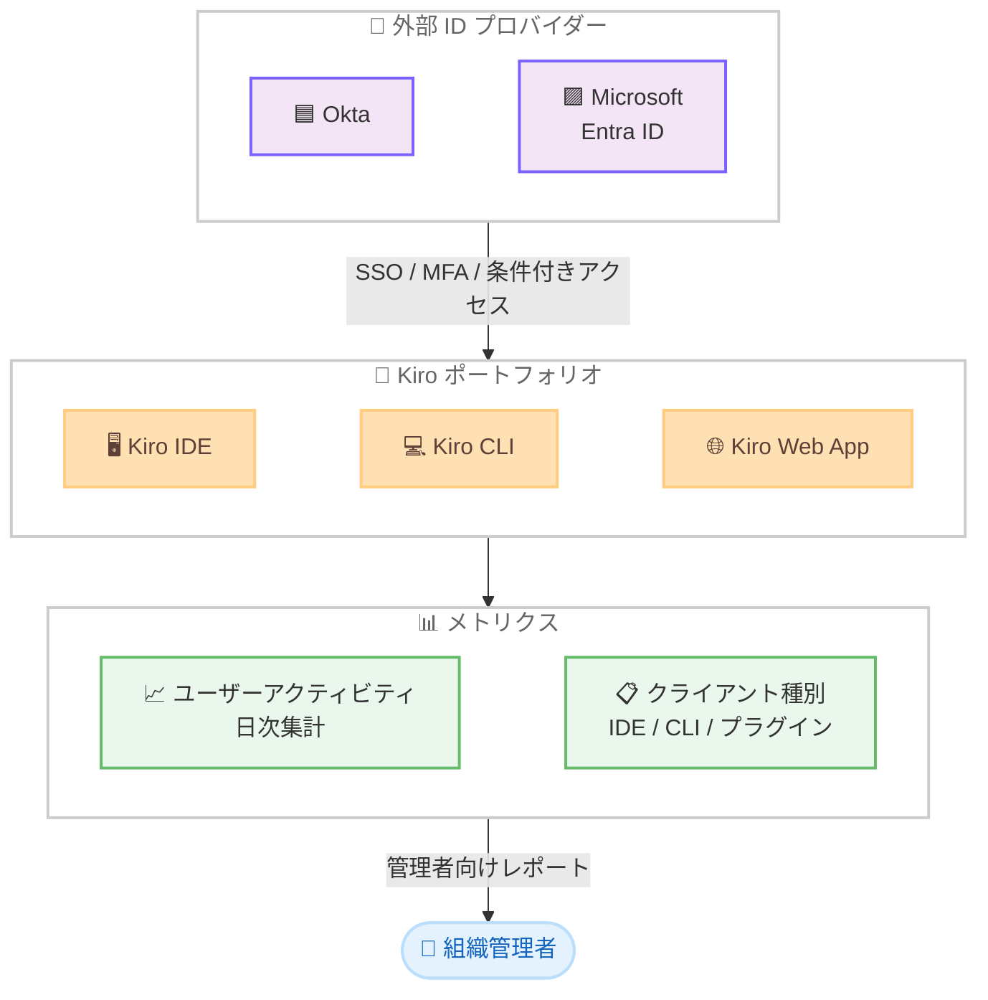

# Kiro - エンタープライズ ID プロバイダーとユーザーアクティビティメトリクス

**リリース日**: 2026 年 2 月 13 日
**サービス**: Kiro
**機能**: 外部 ID プロバイダー (Okta, Microsoft Entra ID)、ユーザーレベルアクティビティメトリクス

📊 [このアップデートのインフォグラフィックを見る](https://takech9203.github.io/awsnews-summary/20260213-kiro-enterprise-identity-and-usage-metrics.html)

## 概要

Kiro は、2025 年 11 月 17 日の GA 以降、Rackspace、Smugmug、Netsmart などの企業がスペック駆動開発を採用し、一部のケースでは最大 90% の効率化を実現しています。今回のブログでは、エンタープライズ導入をさらに加速する 2 つの新機能が発表されました。

1 つ目は、外部 ID プロバイダーとして Okta および Microsoft Entra ID のサポートです。開発者は既存の企業認証情報をそのまま使用して Kiro にサインインでき、新しいログインを作成する必要がありません。2 つ目は、ユーザーレベルのアクティビティメトリクスで、組織管理者がチーム全体の使用状況を日次で集計・把握できる機能です。

**アップデート前の課題**

- エンタープライズ環境で既存の ID プロバイダーを使用した Kiro への認証ができず、別途ログインが必要だった
- 組織の SSO ポリシー、条件付きアクセスルール、MFA 設定を Kiro に適用できなかった
- チーム全体の Kiro 使用状況を可視化する手段がなく、導入効果の測定が困難だった

**アップデート後の改善**

- Okta および Microsoft Entra ID の資格情報で Kiro IDE、CLI、Web アプリに直接サインイン可能
- 既存の SSO ポリシー、条件付きアクセスルール、MFA 設定がそのまま適用される
- ユーザーレベルのアクティビティメトリクスでチーム全体の使用状況を日次集計で確認可能

## アーキテクチャ図

この図は、外部 ID プロバイダーから Kiro ポートフォリオ全体への認証フローと、ユーザーアクティビティメトリクスが組織管理者に提供される流れを示しています。

## サービスアップデートの詳細

### 主要機能

1. **外部 ID プロバイダーサポート: Okta および Microsoft Entra ID**
   - Okta または Microsoft Entra ID を使用している組織は Kiro に直接接続可能
   - Kiro ポートフォリオ全体 (IDE、CLI、Web アプリ) で動作
   - 開発者は既存の資格情報で認証し、新しいログイン作成が不要
   - 組織で設定済みの SSO ポリシー、条件付きアクセスルール、MFA が適用される
   - SCIM プロビジョニングによるユーザーおよびグループの同期をサポート
   - 追加の OIDC プロバイダー対応も開発中

2. **ユーザーレベルアクティビティメトリクス**
   - 組織管理者がユーザーアクティビティレポートを有効化可能
   - チーム全体の使用状況を日次集計データとして提供
   - クライアント種別 (IDE、CLI、IDE プラグイン) ごとの内訳を表示
   - 基盤となるメトリクスとして提供され、今後トレンドビュー、チームレベル集計、エクスポート可能なダッシュボードを追加予定
   - エージェント駆動開発の生産性に関するインサイトの提供を目指して構築中

## 技術仕様

### 外部 ID プロバイダー対応状況

| ID プロバイダー | Kiro IDE | Kiro CLI | Kiro Web App | プロビジョニング |
|-----------------|----------|----------|--------------|-----------------|
| Okta | 対応 | 対応 | 対応 | SCIM |
| Microsoft Entra ID | 対応 | 対応 | 対応 | SCIM |
| AWS IAM Identity Center | 対応 | 対応 | 対応 | ネイティブ |

### 認証フロー

| 項目 | 詳細 |
|------|------|
| IDE 認証 | 既存の Okta / Entra ID 資格情報による直接サインイン |
| CLI 認証 | ブラウザベースの OAuth フロー |
| SSO ポリシー | 組織で設定済みのポリシーがそのまま適用 |
| 条件付きアクセス | 既存の条件付きアクセスルールが有効 |
| MFA | 組織の MFA 設定がそのまま適用 |
| ユーザー同期 | SCIM プロビジョニング |
| 設定の適用範囲 | 一度の設定で IDE、CLI、Web アプリ全体に適用 |

### アクティビティメトリクス

| 項目 | 詳細 |
|------|------|
| データ粒度 | ユーザーレベル |
| 集計頻度 | 日次 |
| クライアント内訳 | IDE、CLI、IDE プラグイン |
| 有効化方法 | 組織管理者がオプトイン |
| 今後の予定 | トレンドビュー、チームレベル集計、エクスポート可能なダッシュボード |

## 設定方法

### 前提条件

1. Kiro IDE、CLI、または Web アプリのアカウント
2. Okta または Microsoft Entra ID の組織アカウント
3. AWS IAM Identity Center が設定済みであること
4. 組織管理者による IdP 連携の事前設定

### 手順

#### ステップ 1: 外部 ID プロバイダーの連携設定

組織管理者が Kiro の組織設定で外部 ID プロバイダーを設定します。

1. Kiro の管理コンソールにアクセス
2. 外部 ID プロバイダーとして Okta または Microsoft Entra ID を選択
3. SAML/OIDC 連携を設定
4. SCIM プロビジョニングエンドポイントを設定してユーザー・グループ同期を有効化

この設定は一度行えば、Kiro IDE、CLI、Web アプリの全体で利用可能になります。

#### ステップ 2: 開発者のサインイン

開発者は既存の企業認証情報を使用して Kiro にサインインします。

1. Kiro IDE または Web アプリを起動
2. サインイン画面で SSO を選択
3. Okta または Entra ID の資格情報を入力して認証

新しいログインを作成する必要はなく、既存の資格情報がそのまま使用できます。

#### ステップ 3: アクティビティメトリクスの有効化

組織管理者がユーザーアクティビティレポートを有効化します。

1. Kiro の管理コンソールにアクセス
2. アクティビティメトリクスの設定を開く
3. ユーザーレベルのアクティビティレポートを有効化

有効化後、チーム全体の使用状況が日次集計で確認できるようになります。

## メリット

### ビジネス面

- **導入障壁の低減**: 既存の企業認証情報をそのまま使用でき、新規ログイン不要で開発者のオンボーディングがスムーズに
- **セキュリティ強化**: 組織の SSO ポリシー、条件付きアクセスルール、MFA がそのまま適用され、セキュリティ基準を維持
- **ROI の可視化**: ユーザーレベルのアクティビティメトリクスにより、Kiro 導入効果を定量的に測定可能
- **管理コスト削減**: SCIM プロビジョニングでユーザー・グループ管理が自動化

### 技術面

- **ゼロ追加設定**: 一度の IdP 設定で Kiro ポートフォリオ全体 (IDE、CLI、Web アプリ) に適用
- **既存インフラ活用**: 組織の認証基盤をそのまま活用し、追加のインフラ構築が不要
- **自動プロビジョニング**: SCIM によるユーザーライフサイクル管理の自動化
- **使用状況の透明性**: クライアント種別ごとの内訳で、チームの開発ツール利用パターンを把握可能

## デメリット・制約事項

### 制限事項

- 外部 IdP サポートは Okta と Microsoft Entra ID に限定 (他の OIDC プロバイダーは今後対応予定)
- アクティビティメトリクスは基盤的な機能で、トレンドビューやエクスポート可能なダッシュボードは今後の追加予定
- アクティビティメトリクスの有効化には組織管理者権限が必要
- メトリクスデータの粒度は日次集計で、リアルタイムのモニタリングには対応していない

### 考慮すべき点

- 外部 IdP 連携には AWS IAM Identity Center の事前設定が必要
- 組織の IdP 設定変更が Kiro のアクセスに影響する可能性がある
- アクティビティメトリクスの有効化はオプトインのため、管理者が明示的に設定する必要がある
- 今後のロードマップに記載されている機能 (トレンドビューなど) は提供時期が未定

## ユースケース

### ユースケース 1: エンタープライズ SSO による全社展開

**シナリオ**: Okta を企業の標準 ID プロバイダーとして使用している組織が、全開発チームに Kiro を展開したい

**効果**: 開発者は Okta の既存アカウントでそのまま Kiro にサインインでき、MFA や条件付きアクセスなどの組織のセキュリティポリシーがそのまま適用される。SCIM プロビジョニングにより、Okta でのユーザー追加・削除が Kiro に自動反映され、管理者の手動作業が不要になる

### ユースケース 2: AI ツール導入効果の可視化

**シナリオ**: CTO がエージェント駆動開発ツールの導入効果を経営層に報告するために、定量的なデータが必要

**効果**: ユーザーレベルのアクティビティメトリクスにより、チーム全体の Kiro 使用状況を日次で集計し、クライアント種別 (IDE、CLI、プラグイン) ごとの利用パターンを把握できる。導入前後の生産性変化を数値で示すことが可能になる

### ユースケース 3: マルチクライアント環境での統一認証

**シナリオ**: 開発チームが Kiro IDE、CLI、Web アプリを使い分けており、各クライアントの認証管理を統一したい

**効果**: 外部 IdP の設定を一度行えば Kiro ポートフォリオ全体に適用されるため、IDE での GUI 操作、CLI でのスクリプト実行、Web アプリでのブラウザアクセスすべてで統一された認証体験を提供できる

## 利用可能リージョン

グローバル

## 関連サービス・機能

- **AWS IAM Identity Center**: Kiro の外部 IdP 連携の基盤となるサービス
- **Okta**: Kiro がサポートする外部 ID プロバイダーの 1 つ
- **Microsoft Entra ID**: Kiro がサポートする外部 ID プロバイダーの 1 つ
- **Kiro IDE**: AI を活用したスペック駆動開発環境
- **Kiro CLI**: コマンドラインからの Kiro 利用を可能にするツール

## 参考リンク

- 📊 [インフォグラフィック](https://takech9203.github.io/awsnews-summary/20260213-kiro-enterprise-identity-and-usage-metrics.html)
- [公式ブログ](https://kiro.dev/blog/enterprise-identity-and-usage-metrics/)
- [Kiro Changelog](https://kiro.dev/changelog/)
- [Kiro ドキュメント](https://kiro.dev/docs/)
- [Kiro 料金](https://kiro.dev/pricing/)

## まとめ

Kiro に Okta と Microsoft Entra ID による外部 ID プロバイダーサポートおよびユーザーレベルアクティビティメトリクスが追加されました。企業は既存の認証基盤をそのまま活用して開発者の Kiro オンボーディングを効率化でき、アクティビティメトリクスにより導入効果の定量的な測定が可能になります。Kiro のエンタープライズ機能は今後もさらに拡充される予定で、ID 基盤に加えてチケット管理、バージョン管理、デプロイメントなどの企業ツールとの接続が計画されています。エンタープライズ環境で Kiro を活用している場合は、これらの新機能の導入を検討してください。
