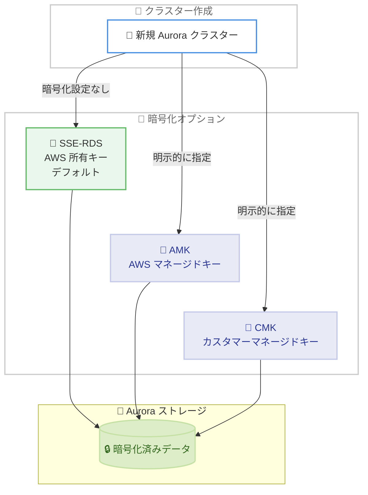

# Amazon Aurora - デフォルトのサーバーサイド暗号化

**リリース日**: 2026 年 2 月 16 日
**サービス**: Amazon Aurora
**機能**: 新規クラスターへのサーバーサイド暗号化の自動適用

📊 [このアップデートのインフォグラフィックを見る](https://takech9203.github.io/aws-news-summary/20260216-amazon-aurora-server-side-encryption-at-rest.html)

## 概要

Amazon Aurora が新規データベースクラスターに対してサーバーサイド暗号化をデフォルトで自動適用するようになった。本日以降に作成されるすべての新規クラスターは、カスタム暗号化設定を指定しない場合、AWS 所有キーを使用したサーバーサイド暗号化が自動的に適用される。この暗号化は完全にマネージドで、コストやパフォーマンスへの影響はない。

既存のクラスターには影響せず、従来通りカスタマーマネージドキーや AWS マネージドキーを使用した暗号化設定を引き続き利用できる。新規クラスターで暗号化を無効にすることはできないが、クラスター作成時にカスタマーマネージドキーや AWS マネージドキーを選択することは可能である。

**アップデート前の課題**

- 新規 Aurora クラスターの暗号化はオプション設定であり、明示的な設定が必要だった
- 暗号化設定の見落としにより、非暗号化クラスターが作成されるリスクがあった
- セキュリティポリシーの一貫した適用に運用上の労力が必要だった

**アップデート後の改善**

- すべての新規クラスターがデフォルトで暗号化され、設定漏れのリスクが排除
- キーの管理、プロビジョニング、ローテーションが不要なサーバーサイド暗号化を提供
- コストやパフォーマンスへの影響なしにセキュリティベースラインが向上

## アーキテクチャ図



新規 Aurora クラスターは暗号化設定を指定しない場合、自動的に AWS 所有キーによるサーバーサイド暗号化が適用される。

## サービスアップデートの詳細

### 主要機能

1. **デフォルト暗号化の自動適用**
   - 暗号化設定を指定しない新規クラスターに自動的に SSE-RDS が適用
   - AWS 所有キーによるフルマネージド暗号化
   - ユーザーの操作や設定変更は不要

2. **暗号化キーの選択肢**
   - SSE-RDS (AWS 所有キー) - デフォルト、追加料金なし
   - AWS マネージドキー (AMK) - 明示的に指定可能
   - カスタマーマネージドキー (CMK) - 明示的に指定可能

3. **既存クラスターへの非影響**
   - 既存の暗号化/非暗号化クラスターには変更なし
   - 既存の暗号化設定は引き続き有効

### 暗号化タイプの確認

新しい `StorageEncryptionType` フィールドにより、クラスターの暗号化状態を確認可能。

## 技術仕様

### 暗号化タイプ比較

| 暗号化タイプ | キー管理 | 追加コスト | ローテーション | ユースケース |
|-------------|---------|-----------|--------------|-------------|
| SSE-RDS | AWS が完全管理 | なし | 自動 | 一般的な暗号化要件 |
| AWS マネージドキー | AWS が管理 | KMS 料金 | 自動 | 監査要件がある場合 |
| カスタマーマネージドキー | ユーザーが管理 | KMS 料金 | ユーザー制御 | 厳格なキー管理要件 |

### API 変更

| 項目 | 詳細 |
|------|------|
| 新フィールド | `StorageEncryptionType` |
| 動作変更 | 暗号化未指定の新規クラスターにデフォルト暗号化を適用 |
| 制約 | 新規クラスターで暗号化の無効化は不可 |

## 設定方法

### 前提条件

1. Amazon Aurora へのアクセス権限があること
2. 必要に応じて KMS キーの設定が完了していること

### 手順

#### ステップ 1: デフォルト暗号化での新規クラスター作成

```bash
# 暗号化を明示的に指定しない場合、SSE-RDS が自動適用
aws rds create-db-cluster \
  --db-cluster-identifier my-aurora-cluster \
  --engine aurora-mysql \
  --master-username admin \
  --master-user-password <password>
```

暗号化パラメータを指定しない場合、AWS 所有キーによるサーバーサイド暗号化が自動的に適用される。

#### ステップ 2: 暗号化状態の確認

```bash
aws rds describe-db-clusters \
  --db-cluster-identifier my-aurora-cluster \
  --query 'DBClusters[0].{StorageEncrypted:StorageEncrypted,StorageEncryptionType:StorageEncryptionType}'
```

クラスターの暗号化状態と暗号化タイプを確認する。

#### ステップ 3: カスタムキーでの作成 (オプション)

```bash
# カスタマーマネージドキーを使用する場合
aws rds create-db-cluster \
  --db-cluster-identifier my-aurora-cluster \
  --engine aurora-mysql \
  --master-username admin \
  --master-user-password <password> \
  --storage-encrypted \
  --kms-key-id arn:aws:kms:us-east-1:123456789012:key/xxxxxxxx
```

カスタマーマネージドキーを使用したい場合は、明示的に `--kms-key-id` を指定する。

## メリット

### ビジネス面

- **セキュリティベースライン向上**: すべての新規クラスターがデフォルトで暗号化され、組織のセキュリティポリシー準拠が容易
- **運用コスト削減**: 暗号化設定の確認や修正にかかる運用工数を削減
- **コンプライアンス対応**: 暗号化をデフォルトにすることで、監査対応が簡素化

### 技術面

- **設定漏れの防止**: 暗号化を忘れるリスクが完全に排除
- **パフォーマンス影響なし**: AES-256 暗号化がハードウェアレベルで処理され、性能への影響がない
- **シームレスな移行**: Sonnet 4.5 からの移行と同様に既存のワークフローに影響なし

## デメリット・制約事項

### 制限事項

- 新規クラスターで暗号化を無効にすることはできない
- 既存の非暗号化クラスターには自動適用されない
- 非暗号化クラスターから暗号化クラスターへの直接変換は不可 (スナップショット経由での移行が必要)

### 考慮すべき点

- 既存の非暗号化クラスターを暗号化したい場合は、スナップショットを取得し暗号化を有効にしてリストアする必要がある
- IaC テンプレートで明示的に暗号化を無効にしている場合、新規クラスター作成がエラーになる可能性がある

## ユースケース

### ユースケース 1: セキュリティポリシーの自動適用

**シナリオ**: 大規模組織で多数の開発チームが Aurora クラスターを作成しており、暗号化ポリシーの一貫した適用を確保したい

**効果**: デフォルト暗号化により、チームが暗号化設定を忘れても自動的にセキュリティベースラインが確保される

### ユースケース 2: 規制対応の簡素化

**シナリオ**: 金融機関がすべてのデータベースに暗号化を義務付ける規制要件を満たす必要がある

**効果**: デフォルト暗号化により、新規クラスターは必ず暗号化された状態で作成され、規制準拠が自動的に確保

## 料金

SSE-RDS (AWS 所有キー) によるデフォルト暗号化は追加料金なし。AWS マネージドキーまたはカスタマーマネージドキーを使用する場合は [AWS KMS 料金](https://aws.amazon.com/kms/pricing/) が適用される。

## 利用可能リージョン

AWS GovCloud (US) リージョンを含むすべての AWS リージョンで利用可能。

## 関連サービス・機能

- **AWS KMS**: 暗号化キーの管理
- **Amazon RDS**: RDS でも同様のデフォルト暗号化が提供されている
- **AWS CloudTrail**: 暗号化関連の API 操作の監査ログ

## 参考リンク

- 📊 [インフォグラフィック](https://takech9203.github.io/aws-news-summary/20260216-amazon-aurora-server-side-encryption-at-rest.html)
- [公式発表 (What's New)](https://aws.amazon.com/about-aws/whats-new/2026/02/amazon-aurora-server-side-encryption-at-rest)
- [AWS Blog - Use default encryption at rest for new Amazon Aurora clusters](https://aws.amazon.com/blogs/database/use-default-encryption-at-rest-for-new-amazon-aurora-clusters/)
- [Aurora 暗号化ドキュメント](https://docs.aws.amazon.com/AmazonRDS/latest/AuroraUserGuide/Overview.Encryption.html)

## まとめ

Amazon Aurora のデフォルトサーバーサイド暗号化は、セキュリティベースラインの大幅な向上をもたらす重要なアップデートである。すべての新規クラスターが自動的に暗号化されるため、設定漏れによるセキュリティリスクが排除される。既存の非暗号化クラスターを運用している場合は、スナップショットリストアによる暗号化移行を計画的に進めることを推奨する。
