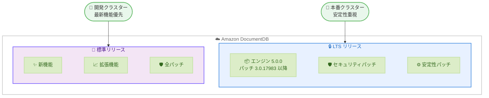

# Amazon DocumentDB - エンジンバージョン 5.0 長期サポート (LTS) の提供開始

**リリース日**: 2026 年 2 月 16 日
**サービス**: Amazon DocumentDB (with MongoDB compatibility)
**機能**: Long-Term Support (LTS) on DocumentDB 5.0

📊 [このアップデートのインフォグラフィックを見る](https://takech9203.github.io/aws-news-summary/20260216-announcing-amazon-documentdb-5-0-long-term-support.html)

## 概要

Amazon DocumentDB (with MongoDB compatibility) が、エンジンバージョン 5.0 において長期サポート (LTS) リリースの提供を開始しました。LTS リリースを使用することで、データベースのアップグレード頻度を削減し、メンテナンスのオーバーヘッドを軽減できます。LTS バージョンでは、新機能の導入は行われず、重要な安定性およびセキュリティパッチのみが提供されます。

LTS を利用するには、新しい DocumentDB クラスターをエンジンバージョン 5.0.0 で作成するか、既存のエンジンバージョン 5.0.0 クラスターを次回のメンテナンスウィンドウでパッチ適用します。LTS の対象となるには、エンジンパッチバージョン 3.0.17983 以降が必要です。

**アップデート前の課題**

- DocumentDB クラスターは定期的なエンジンアップグレードが必要で、アップグレード頻度が高いとメンテナンスの負担が大きかった
- アップグレードのたびに新機能が導入されるため、アプリケーションの互換性テストが頻繁に必要だった
- 厳格な稼働時間要件を持つ本番環境では、アップグレードの機会が限られ、運用上の制約となっていた

**アップデート後の改善**

- LTS リリースにより、同じバージョンを長期間維持でき、アップグレードサイクルが大幅に削減された
- 重要な安定性およびセキュリティパッチのみが適用されるため、予期しない動作変更のリスクが低減された
- 本番環境での安定性を重視するお客様が、より少ないメンテナンスでデータベースを運用できるようになった

## アーキテクチャ図



LTS リリースでは重要なセキュリティおよび安定性パッチのみが適用されるのに対し、標準リリースでは新機能や拡張機能も含まれます。ワークロードの要件に応じて適切なリリースを選択できます。

## サービスアップデートの詳細

### 主要機能

1. **長期サポート (LTS) リリース**
   - エンジンバージョン 5.0.0 を LTS リリースとして指定
   - LTS クラスターは同じバージョンを長期間使用でき、アップグレードサイクルが少ない
   - 重要な安定性およびセキュリティパッチのみが提供され、新機能は導入されない

2. **パッチ管理**
   - 必須パッチ: 重要な更新が含まれ、メンテナンスウィンドウで自動的に適用される
   - オプションパッチ: 非重要な改善が含まれ、自動適用日は設定されない
   - `describe-pending-maintenance-actions` コマンドでパッチの種類を確認可能

3. **柔軟な導入パス**
   - 新規クラスターをエンジンバージョン 5.0.0 で作成して LTS を利用開始
   - 既存のエンジンバージョン 3.6.0 または 4.0.0 からメジャーバージョンアップグレードで 5.0.0 に移行可能
   - 既存の 5.0.0 クラスターはパッチ適用で LTS バージョンに対応

## 技術仕様

### LTS バージョン要件

| 項目 | 詳細 |
|------|------|
| エンジンバージョン | 5.0.0 |
| 必須パッチバージョン | 3.0.17983 以降 |
| パッチ提供範囲 | 重要な安定性およびセキュリティパッチのみ |
| アップグレード元 | エンジンバージョン 3.6.0 または 4.0.0 |

### パッチの種類

| パッチ種別 | 説明 | 自動適用 |
|-----------|------|----------|
| 必須パッチ | 重要な安定性・セキュリティ更新 | メンテナンスウィンドウで自動適用 |
| オプションパッチ | 非重要な改善 | 自動適用なし |

## 設定方法

### 前提条件

1. AWS アカウント
2. Amazon DocumentDB へのアクセス権限
3. エンジンバージョン 5.0.0 のクラスター (新規または既存)

### 手順

#### ステップ 1: LTS クラスターの作成または既存クラスターのアップグレード

**新規クラスターの場合:**

AWS マネジメントコンソールで、エンジンバージョン 5.0.0 を選択して新しい DocumentDB クラスターを作成します。

**既存クラスターのアップグレードの場合:**

```bash
# エンジンバージョン 3.6.0 または 4.0.0 から 5.0.0 へのメジャーバージョンアップグレード
aws docdb modify-db-cluster \
  --db-cluster-identifier my-cluster \
  --engine-version 5.0.0 \
  --apply-immediately
```

既存のエンジンバージョン 3.6.0 または 4.0.0 のクラスターを 5.0.0 にアップグレードします。

#### ステップ 2: エンジンパッチバージョンの確認

```javascript
// クラスターに接続して以下のコマンドを実行
db.runCommand({getEngineVersion: 1})
```

実行結果の例は以下のとおりです。

```json
{
    "engineVersion": "3.0.17983",
    "ok": 1,
    "operationTime": { "t": 1234567890, "i": 1 }
}
```

`engineVersion` が `3.0.17983` 以降であることを確認します。この値が LTS の必須パッチバージョンを満たしていれば、クラスターは LTS リリースで動作しています。

#### ステップ 3: 保留中のパッチの確認

```bash
# 保留中のメンテナンスアクションを確認
aws docdb describe-pending-maintenance-actions \
  --resource-identifier arn:aws:rds:us-east-1:123456789012:cluster:my-cluster
```

必須パッチには `CurrentApplyDate`、`ForcedApplyDate`、`AutoAppliedAfterDate` に具体的な日付が表示されます。オプションパッチにはこれらのフィールドに null 値が表示されます。

## メリット

### ビジネス面

- **運用コストの削減**: アップグレード頻度が減少するため、メンテナンス作業に費やす時間とリソースを削減できる
- **ビジネス継続性の向上**: 安定したバージョンを長期間維持できるため、アップグレードに伴うダウンタイムリスクが低減される
- **計画性の向上**: アップグレードサイクルが予測可能になり、IT 運用の計画が立てやすくなる

### 技術面

- **安定性の確保**: 重要なパッチのみが適用されるため、予期しない動作変更のリスクが低い
- **互換性テストの削減**: 新機能が導入されないため、アプリケーションの互換性テスト頻度を削減できる
- **セキュリティの維持**: 重要なセキュリティパッチは引き続き提供されるため、セキュリティレベルを維持できる

## デメリット・制約事項

### 制限事項

- LTS バージョンでは新機能や拡張機能は提供されない
- パッチの適用は一方向の操作であり、ダウングレードはできない
- パッチ適用時にクラスターの短時間のダウンタイムが発生する

### 考慮すべき点

- 最新の機能や拡張が必要な場合は、LTS ではなく標準リリースを選択する必要がある
- LTS を利用するには、エンジンパッチバージョン 3.0.17983 以降が必要であり、古いパッチバージョンの場合は事前にパッチ適用が必要
- 次回の LTS バージョンは AWS の標準通信チャネルを通じて発表される予定

## ユースケース

### ユースケース 1: ミッションクリティカルな本番環境

**シナリオ**: 金融機関のコアバンキングシステムが Amazon DocumentDB を使用しており、厳格な稼働時間要件 (99.99% 以上) を満たす必要がある

**効果**: LTS リリースを使用することで、アップグレード頻度を最小限に抑え、計画的なメンテナンスウィンドウのみでパッチを適用できるため、サービスの安定性が大幅に向上する

### ユースケース 2: 規制対応が必要なヘルスケアシステム

**シナリオ**: ヘルスケアアプリケーションが患者データを DocumentDB に保存しており、データベースのバージョン変更には厳格な変更管理プロセスと規制当局への報告が必要

**効果**: LTS リリースにより変更管理プロセスの実施回数が減少し、コンプライアンス対応のオーバーヘッドが軽減される。セキュリティパッチは引き続き提供されるため、規制要件も満たすことができる

### ユースケース 3: 大規模マイクロサービスアーキテクチャ

**シナリオ**: 数十のマイクロサービスが個別の DocumentDB クラスターを使用しており、すべてのクラスターを同時にアップグレードすることが困難

**効果**: LTS リリースにより、各クラスターのアップグレード頻度が削減され、運用チームの負担が軽減される。段階的なアップグレード計画がより柔軟に策定できる

## 料金

Amazon DocumentDB LTS の利用自体に追加料金は発生しません。料金は通常の Amazon DocumentDB の料金体系に基づきます。

| 項目 | 課金方式 |
|------|----------|
| オンデマンドインスタンス | インスタンス作成から削除まで秒単位で課金 |
| データベース I/O | 読み取り・書き込み I/O 操作に基づく課金 |
| データベースストレージ | 使用されたストレージ容量に基づく課金 |
| バックアップストレージ | クラスターストレージの 100% まで無料、超過分は課金 |

詳細は [Amazon DocumentDB 料金ページ](https://aws.amazon.com/documentdb/pricing/) を参照してください。

## 利用可能リージョン

この LTS リリースは、Amazon DocumentDB が提供されているすべての AWS リージョンで利用可能です。

## 関連サービス・機能

- **Amazon DocumentDB**: MongoDB 互換のフルマネージドドキュメントデータベースサービス
- **Amazon DocumentDB Elastic Clusters**: 数百万の読み取り・書き込みとペタバイト規模のストレージに対応するエラスティッククラスター
- **Amazon DocumentDB Serverless**: ワークロードに応じて自動スケールするサーバーレスデータベース

## 参考リンク

- 📊 [インフォグラフィック](https://takech9203.github.io/aws-news-summary/20260216-announcing-amazon-documentdb-5-0-long-term-support.html)
- [公式発表 (What's New)](https://aws.amazon.com/about-aws/whats-new/2026/02/announcing-amazon-documentdb-5-0-long-term-support/)
- [ドキュメント: LTS リリースの使用](https://docs.aws.amazon.com/documentdb/latest/developerguide/docdb-lts-release.html)
- [関連ブログ: Extended Support for Amazon DocumentDB version 3.6](https://aws.amazon.com/blogs/database/announcing-extended-support-for-amazon-documentdb-with-mongodb-compatibility-version-3-6/)
- [料金ページ](https://aws.amazon.com/documentdb/pricing/)

## まとめ

Amazon DocumentDB がエンジンバージョン 5.0 で長期サポート (LTS) リリースの提供を開始しました。LTS を利用することで、重要な安定性およびセキュリティパッチのみを受け取りながら、データベースのアップグレード頻度を大幅に削減できます。厳格な稼働時間要件を持つ本番環境や、変更管理プロセスが複雑な規制産業のお客様に特に有効です。既存のエンジンバージョン 5.0.0 クラスターをお持ちのお客様は、エンジンパッチバージョン 3.0.17983 以降であることを確認し、LTS の活用を検討することをお勧めします。
