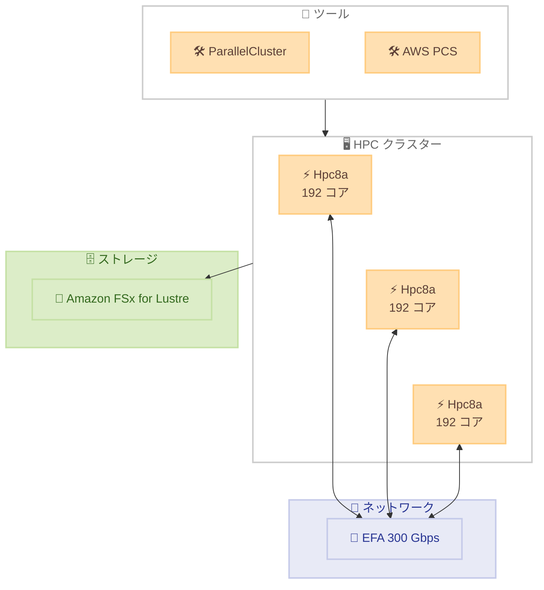

# Amazon EC2 - Hpc8a インスタンスの提供開始

**リリース日**: 2026 年 2 月 16 日
**サービス**: Amazon EC2
**機能**: Hpc8a インスタンス (次世代 HPC 最適化インスタンス)

📊 [このアップデートのインフォグラフィックを見る](https://takech9203.github.io/aws-news-summary/20260216-announcing-amazon-ec2-hpc8a-instances.html)

## 概要

AWS は次世代のハイパフォーマンスコンピューティング (HPC) 最適化インスタンスである Amazon EC2 Hpc8a インスタンスを発表した。第 5 世代 AMD EPYC プロセッサ (コード名 Turin) を搭載し、最大周波数 4.5GHz で動作する。Hpc7a インスタンスと比較して最大 40% の性能向上と最大 25% のコストパフォーマンス改善を実現する。

第 6 世代 AWS Nitro Cards をベースに構築された Hpc8a インスタンスは、192 コア、768 GiB メモリ、300 Gbps の Elastic Fabric Adapter (EFA) ネットワーク帯域を備える。メモリ帯域は Hpc7a と比較して最大 42% 向上しており、メモリ集約型のシミュレーションや科学計算ワークロードのパフォーマンスが改善される。

**アップデート前の課題**

- Hpc7a インスタンスでは計算集約型ワークロードのパフォーマンスに改善の余地があった
- メモリ帯域の制約により、大規模シミュレーションの処理速度が制限されていた
- HPC ワークロードのコストパフォーマンスのさらなる最適化が求められていた

**アップデート後の改善**

- Hpc7a 比で最大 40% の性能向上を実現
- 最大 42% のメモリ帯域向上により、メモリ集約型ワークロードが高速化
- 最大 25% のコストパフォーマンス改善で、HPC ワークロードの費用対効果が向上

## アーキテクチャ図



Hpc8a インスタンスは EFA 300 Gbps ネットワークで接続され、ParallelCluster や AWS PCS で管理される HPC クラスターを構成する。

## サービスアップデートの詳細

### 主要機能

1. **第 5 世代 AMD EPYC プロセッサ搭載**
   - コード名 Turin の最新プロセッサ
   - 最大周波数 4.5GHz
   - 192 コアによる高い並列処理能力

2. **大容量メモリとメモリ帯域**
   - 768 GiB DDR5 メモリ
   - Hpc7a 比 42% のメモリ帯域向上
   - メモリ集約型シミュレーションに最適化

3. **高速ネットワーキング**
   - 300 Gbps EFA ネットワーク帯域
   - 低レイテンシのノード間通信
   - 大規模クラスターでの高速スケーリング

4. **第 6 世代 AWS Nitro Cards**
   - 最新世代の Nitro インフラストラクチャ
   - セキュリティとパフォーマンスの強化

## 技術仕様

### インスタンス仕様

| 項目 | Hpc8a | Hpc7a | 改善率 |
|------|-------|-------|--------|
| コア数 | 192 | 192 | - |
| メモリ | 768 GiB | 768 GiB | - |
| プロセッサ | AMD EPYC 第 5 世代 | AMD EPYC 第 4 世代 | - |
| 最大周波数 | 4.5 GHz | - | - |
| EFA 帯域 | 300 Gbps | 300 Gbps | - |
| パフォーマンス | - | - | 最大 40% 向上 |
| メモリ帯域 | - | - | 最大 42% 向上 |
| コストパフォーマンス | - | - | 最大 25% 改善 |

### 対象ワークロード

| ワークロード | 説明 |
|-------------|------|
| 計算流体力学 (CFD) | 流体の挙動をシミュレーション |
| 天気予報 | 大規模気象モデルの計算 |
| 陽解法有限要素解析 (FEA) | 構造解析や衝突シミュレーション |
| マルチフィジックスシミュレーション | 複数の物理現象を統合的にシミュレーション |

## 設定方法

### 前提条件

1. AWS アカウントを保有していること
2. US East (Ohio) または Europe (Stockholm) リージョンへのアクセス
3. 必要に応じて Savings Plans の設定

### 手順

#### ステップ 1: インスタンスの起動

```bash
aws ec2 run-instances \
  --instance-type hpc8a.96xlarge \
  --image-id <ami-id> \
  --region us-east-2 \
  --placement GroupName=<placement-group-name> \
  --network-interfaces "InterfaceType=efa,DeviceIndex=0,Groups=<security-group-id>,SubnetId=<subnet-id>"
```

EFA を有効にしたプレイスメントグループ内で Hpc8a インスタンスを起動する。

#### ステップ 2: クラスター構成

AWS ParallelCluster や AWS Parallel Computing Service (PCS) を使用してクラスターを構成する。

```yaml
# ParallelCluster 設定例
Scheduling:
  Scheduler: slurm
  SlurmQueues:
    - Name: hpc
      ComputeResources:
        - Name: hpc8a
          InstanceType: hpc8a.96xlarge
          MinCount: 0
          MaxCount: 100
```

ParallelCluster の設定ファイルで Hpc8a インスタンスをコンピュートリソースとして定義する。

## メリット

### ビジネス面

- **コスト削減**: Hpc7a 比で最大 25% のコストパフォーマンス改善により、HPC 予算を効率化
- **Time-to-Result の短縮**: 40% の性能向上により、シミュレーションの完了時間を大幅に短縮
- **競争力の向上**: より迅速な結果取得により、研究開発や製品設計のサイクルを加速

### 技術面

- **メモリ帯域の大幅向上**: 42% のメモリ帯域向上により、メモリバウンドなワークロードが高速化
- **最新プロセッサ**: 第 5 世代 AMD EPYC の最新命令セットと最適化を活用
- **高速ネットワーク**: 300 Gbps EFA により、密結合ワークロードの通信遅延を最小化

## デメリット・制約事項

### 制限事項

- 利用可能リージョンは US East (Ohio) と Europe (Stockholm) の 2 リージョンのみ
- インスタンスサイズは 96xlarge の 1 種類のみ
- 購入方法は Savings Plans またはオンデマンドのみ (リザーブドインスタンスは非対応の可能性)

### 考慮すべき点

- 既存の Hpc7a ベースのワークロードからの移行には AMI やソフトウェアの互換性確認が必要
- EFA ドライバーの最新バージョンへの更新が推奨される

## ユースケース

### ユースケース 1: 自動車衝突シミュレーション

**シナリオ**: 自動車メーカーが新車の安全性評価のために大規模な衝突シミュレーションを実行

**効果**: 40% の性能向上により、シミュレーション時間が短縮され、設計イテレーションを高速化できる

### ユースケース 2: 天気予報モデルの高解像度化

**シナリオ**: 気象機関がより高解像度の天気予報モデルを運用したい

**効果**: メモリ帯域の 42% 向上により、より大規模なグリッドでの気象モデル計算が実用的になる

### ユースケース 3: 創薬のための分子動力学シミュレーション

**シナリオ**: 製薬会社が新薬候補のタンパク質-リガンド相互作用シミュレーションを大規模に実行

**効果**: コストパフォーマンスの 25% 改善により、より多くのシミュレーションを同じ予算内で実行可能

## 料金

Hpc8a インスタンスは Savings Plans またはオンデマンドで購入可能。詳細な料金は [Amazon EC2 Hpc8a インスタンスページ](https://aws.amazon.com/ec2/instance-types/hpc8a/) を参照。

## 利用可能リージョン

- US East (Ohio)
- Europe (Stockholm)

## 関連サービス・機能

- **AWS ParallelCluster**: HPC クラスターの自動デプロイと管理
- **AWS Parallel Computing Service (PCS)**: マネージド HPC サービス
- **Elastic Fabric Adapter (EFA)**: 低レイテンシ・高スループットのネットワーキング
- **Amazon FSx for Lustre**: HPC ワークロード向け高性能ファイルシステム

## 参考リンク

- 📊 [インフォグラフィック](https://takech9203.github.io/aws-news-summary/20260216-announcing-amazon-ec2-hpc8a-instances.html)
- [公式発表 (What's New)](https://aws.amazon.com/about-aws/whats-new/2026/02/announcing-amazon-ec2-hpc8a-instances/)
- [AWS Blog](https://aws.amazon.com/blogs/aws/amazon-ec2-hpc8a-instances-powered-by-5th-gen-amd-epyc-processors-are-now-available)
- [Amazon EC2 Hpc8a インスタンスページ](https://aws.amazon.com/ec2/instance-types/hpc8a/)

## まとめ

Amazon EC2 Hpc8a インスタンスは、第 5 世代 AMD EPYC プロセッサと第 6 世代 Nitro Cards を搭載した次世代 HPC 最適化インスタンスである。Hpc7a 比で最大 40% の性能向上と 25% のコストパフォーマンス改善を実現し、CFD、天気予報、FEA などの計算集約型ワークロードに最適である。HPC ワークロードを運用している組織は、パフォーマンスとコスト効率の向上を目的としてアップグレードを検討すべきである。
