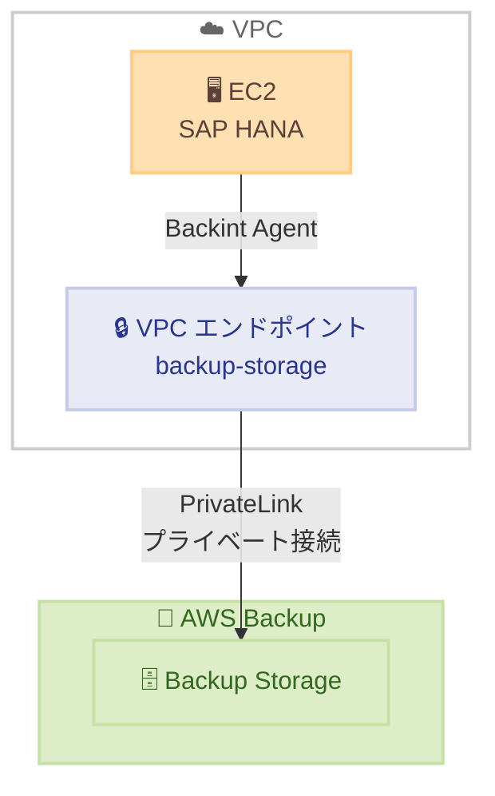

# AWS Backup - SAP HANA 向け PrivateLink サポート

**リリース日**: 2026 年 2 月 16 日
**サービス**: AWS Backup
**機能**: SAP HANA on EC2 向け AWS PrivateLink サポート

📊 [このアップデートのインフォグラフィックを見る](https://takech9203.github.io/aws-news-summary/20260216-aws-backup-announces-privatelink-sap-hana-aws.html)

## 概要

AWS Backup が Amazon EC2 上で動作する SAP HANA システム向けに AWS PrivateLink をサポートするようになった。これにより、バックアップトラフィックをパブリックインターネットを経由せずにプライベートネットワーク接続経由でルーティングでき、規制対象ワークロードのセキュリティとコンプライアンス要件を満たすことができる。

金融サービス、ヘルスケア、政府機関など規制産業のお客様は、すべてのトラフィックをプライベートネットワーク内に維持する必要がある場合が多い。今回のリリースにより、SAP HANA ワークロードのアプリケーショントラフィックとバックアップデータの両方でエンドツーエンドのプライベート接続を実現できる。

**アップデート前の課題**

- SAP HANA のアプリケーションワークロードは PrivateLink を使用できたが、バックアップトラフィックはパブリックエンドポイントを経由する必要があった
- HIPAA、PCI DSS などの規制要件を完全に満たすプライベートデータ保護戦略の実装が困難だった
- バックアップ通信のセキュリティに懸念があった

**アップデート後の改善**

- AWS Backup ストレージエンドポイント向けの PrivateLink により、バックアップトラフィックも完全にプライベートに
- アプリケーションとバックアップの両方でエンドツーエンドのプライベート接続を確保
- HIPAA、EU/US Privacy Shield、PCI DSS 規制に対応した完全プライベートデータ保護戦略を実装可能

## アーキテクチャ図



SAP HANA on EC2 から Backint Agent を通じて VPC エンドポイント経由で AWS Backup ストレージにプライベート接続する。

## サービスアップデートの詳細

### 主要機能

1. **プライベートバックアップ接続**
   - AWS Backup ストレージエンドポイント向けの VPC エンドポイントを提供
   - バックアップデータがパブリックインターネットを経由しない
   - 既存の PrivateLink インフラストラクチャと統合

2. **規制コンプライアンス対応**
   - HIPAA 対応のプライベートデータ保護
   - EU/US Privacy Shield 準拠
   - PCI DSS 規制要件の充足

3. **エンドツーエンドプライベート接続**
   - SAP HANA のアプリケーションとバックアップの両方でプライベート通信を実現
   - 完全に閉域網内でのデータ保護が可能

## 技術仕様

### 設定要件

| 項目 | 詳細 |
|------|------|
| VPC エンドポイントサービス | backup-storage |
| Backint Agent | 最新バージョンへの更新が必要 |
| 対象ワークロード | SAP HANA on EC2 |
| プロトコル | HTTPS (プライベート) |

### 対応コンプライアンス

| 規制 | 対応状況 |
|------|---------|
| HIPAA | 対応 |
| EU/US Privacy Shield | 対応 |
| PCI DSS | 対応 |

## 設定方法

### 前提条件

1. SAP HANA が Amazon EC2 上で稼働していること
2. AWS Backup が SAP HANA データベースのバックアップに設定済みであること
3. VPC に適切なサブネットとセキュリティグループが設定されていること

### 手順

#### ステップ 1: Backint Agent の更新

```bash
# Backint Agent を最新バージョンに更新
# 詳細は AWS ドキュメントを参照
```

SAP HANA の Backint Agent を PrivateLink 対応の最新バージョンに更新する。[更新手順](https://docs.aws.amazon.com/sap/latest/sap-hana/aws-backint-agent-backup.html#backint-backup-install) を参照。

#### ステップ 2: VPC エンドポイントの作成

```bash
aws ec2 create-vpc-endpoint \
  --vpc-id vpc-xxxxxxxx \
  --service-name com.amazonaws.<region>.backup-storage \
  --vpc-endpoint-type Interface \
  --subnet-ids subnet-xxxxxxxx \
  --security-group-ids sg-xxxxxxxx \
  --private-dns-enabled
```

VPC 内に backup-storage サービス向けのインターフェース VPC エンドポイントを作成する。[ネットワーク設定ガイド](https://docs.aws.amazon.com/aws-backup/latest/devguide/backup-network.html) を参照。

#### ステップ 3: セキュリティグループの設定

VPC エンドポイントのセキュリティグループで、SAP HANA インスタンスからの HTTPS トラフィックを許可する。

## メリット

### ビジネス面

- **コンプライアンス強化**: バックアップトラフィックのプライベート化により、規制要件を完全に充足
- **リスク軽減**: パブリックインターネット経由の通信を排除し、データ漏洩リスクを低減
- **監査対応**: エンドツーエンドのプライベート通信により、監査要件への対応が容易

### 技術面

- **セキュリティ向上**: バックアップデータの転送経路がプライベートネットワークに限定
- **ネットワーク制御**: セキュリティグループやネットワーク ACL でバックアップトラフィックを制御
- **既存インフラとの統合**: VPC エンドポイントによる標準的な PrivateLink パターンで実装

## デメリット・制約事項

### 制限事項

- AWS Backup が SAP HANA をサポートするリージョンに限定
- VPC エンドポイントの追加料金が発生
- Backint Agent の更新が必要

### 考慮すべき点

- VPC エンドポイントの可用性とパフォーマンスへの影響を確認する必要がある
- 既存のネットワーク設計に VPC エンドポイントを追加する際のセキュリティグループ設定の見直し

## ユースケース

### ユースケース 1: 金融機関の SAP HANA バックアップ

**シナリオ**: 銀行が SAP HANA で基幹業務システムを運用しており、すべてのデータ通信をプライベートネットワーク内に維持する必要がある

**効果**: バックアップトラフィックもプライベート化でき、PCI DSS や内部セキュリティポリシーに完全準拠

### ユースケース 2: 医療機関の HIPAA 対応

**シナリオ**: 医療機関が患者データを含む SAP HANA データベースのバックアップを HIPAA 準拠で行いたい

**効果**: エンドツーエンドのプライベート接続により、患者データのバックアップが HIPAA 要件を満たす形で実施可能

## 料金

VPC エンドポイントの標準料金が適用される。AWS Backup 自体の機能利用に追加料金はない。詳細は [AWS PrivateLink 料金ページ](https://aws.amazon.com/privatelink/pricing/) を参照。

## 利用可能リージョン

AWS Backup が SAP HANA データベース on EC2 をサポートするすべての AWS リージョンで利用可能。

## 関連サービス・機能

- **AWS PrivateLink**: VPC とサービス間のプライベート接続
- **AWS Backup**: 一元的なバックアップ管理サービス
- **Amazon EC2**: SAP HANA のホスティング基盤

## 参考リンク

- 📊 [インフォグラフィック](https://takech9203.github.io/aws-news-summary/20260216-aws-backup-announces-privatelink-sap-hana-aws.html)
- [公式発表 (What's New)](https://aws.amazon.com/about-aws/whats-new/2026/02/aws-backup-announces-privatelink-sap-hana-aws/)
- [Backint Agent 更新手順](https://docs.aws.amazon.com/sap/latest/sap-hana/aws-backint-agent-backup.html#backint-backup-install)
- [AWS Backup ネットワーク設定](https://docs.aws.amazon.com/aws-backup/latest/devguide/backup-network.html)

## まとめ

AWS Backup の SAP HANA 向け PrivateLink サポートにより、規制産業のお客様はバックアップトラフィックを含むすべての通信をプライベートネットワーク内に維持できるようになった。HIPAA、PCI DSS などの厳格なコンプライアンス要件を持つ組織は、この機能を活用してエンドツーエンドのプライベートデータ保護戦略を実装すべきである。
