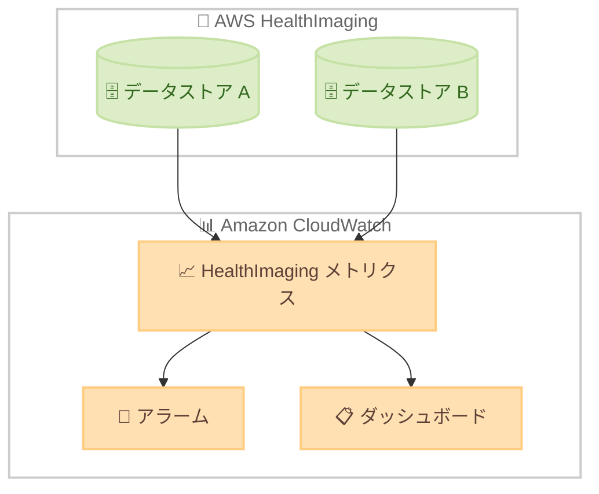

# AWS HealthImaging - データストア監視用メトリクスの追加

**リリース日**: 2026 年 2 月 16 日
**サービス**: AWS HealthImaging
**機能**: Amazon CloudWatch による追加メトリクスの提供

📊 [このアップデートのインフォグラフィックを見る](https://takech9203.github.io/aws-news-summary/20260216-aws-healthimaging-additional-metrics.html)

## 概要

AWS HealthImaging が Amazon CloudWatch を通じてデータストア監視用の追加メトリクスを提供開始した。これにより、アカウントレベルおよびデータストアレベルでのストレージ監視が可能になり、医用画像ストレージの利用状況と成長トレンドの把握が容易になる。

新しいメトリクスにより、ストレージ容量、イメージセット数、DICOM スタディ・シリーズ・インスタンス数を追跡でき、シングルテナントおよびマルチテナントのワークロードをペタバイトスケールで管理するための洞察が得られる。

**アップデート前の課題**

- データストアのストレージ使用量の詳細な監視手段が限られていた
- DICOM スタディ、シリーズ、インスタンスレベルでの粒度の高い追跡ができなかった
- ストレージの成長トレンドをリアルタイムに把握することが困難だった

**アップデート後の改善**

- CloudWatch メトリクスによりストレージ容量、イメージセット数、DICOM 要素数を詳細に追跡可能
- アカウントレベルとデータストアレベルの両方で監視が可能
- ペタバイトスケールのワークロード管理に必要な洞察を提供

## アーキテクチャ図



HealthImaging のデータストアから CloudWatch にメトリクスが送信され、ダッシュボードやアラームで監視できる。

## サービスアップデートの詳細

### 主要機能

1. **ストレージ容量メトリクス**
   - データストアごとのストレージ使用量を追跡
   - アカウントレベルでの集計ストレージ量を表示
   - 時系列での成長トレンドを可視化

2. **イメージセット数メトリクス**
   - データストア内のイメージセット数を監視
   - マルチテナント環境でのリソース配分を把握

3. **DICOM 要素メトリクス**
   - DICOM スタディ数の追跡
   - DICOM シリーズ数の追跡
   - DICOM インスタンス数の追跡

## 技術仕様

### メトリクス一覧

| メトリクス | レベル | 説明 |
|-----------|--------|------|
| ストレージ容量 | アカウント / データストア | 使用中のストレージ容量 |
| イメージセット数 | データストア | 格納されているイメージセットの数 |
| DICOM スタディ数 | データストア | DICOM スタディの総数 |
| DICOM シリーズ数 | データストア | DICOM シリーズの総数 |
| DICOM インスタンス数 | データストア | DICOM インスタンスの総数 |

### CloudWatch 名前空間

| 項目 | 詳細 |
|------|------|
| 名前空間 | `AWS/HealthImaging` |
| メトリクスタイプ | API メトリクスおよび HealthImaging メトリクス |
| 前提条件 | サービスリンクロールの作成が必要 |

## 設定方法

### 前提条件

1. AWS HealthImaging データストアが作成済みであること
2. Amazon CloudWatch へのアクセス権限があること
3. HealthImaging のサービスリンクロールが作成されていること

### 手順

#### ステップ 1: サービスリンクロールの確認

HealthImaging メトリクスを受信するには、サービスリンクロールが必要。未作成の場合は自動的に作成される。

#### ステップ 2: CloudWatch コンソールでメトリクスを確認

CloudWatch コンソールで `AWS/HealthImaging` 名前空間のメトリクスを確認する。

#### ステップ 3: アラームの設定

```bash
aws cloudwatch put-metric-alarm \
  --alarm-name "HealthImaging-Storage-High" \
  --namespace "AWS/HealthImaging" \
  --metric-name "StorageBytes" \
  --dimensions Name=DatastoreId,Value=<datastore-id> \
  --statistic Average \
  --period 86400 \
  --threshold 1099511627776 \
  --comparison-operator GreaterThanThreshold \
  --evaluation-periods 1 \
  --alarm-actions <sns-topic-arn>
```

ストレージ使用量が閾値を超えた場合にアラートを送信するアラームを設定する例。

## メリット

### ビジネス面

- **コスト管理**: ストレージ使用量の成長トレンドを把握し、コスト予測に活用
- **キャパシティプランニング**: データ量の増加に基づいた将来のリソース計画が可能
- **マルチテナント管理**: テナントごとのリソース消費を正確に把握

### 技術面

- **運用可視化**: CloudWatch ダッシュボードで一元的にモニタリング可能
- **自動アラート**: 閾値ベースのアラームで異常を早期検知
- **既存ツールとの統合**: CloudWatch エコシステムとのシームレスな統合

## デメリット・制約事項

### 制限事項

- 利用可能リージョンは US East (N. Virginia)、US West (Oregon)、Asia Pacific (Sydney)、Europe (Ireland) の 4 リージョンのみ
- サービスリンクロールの作成が前提条件

### 考慮すべき点

- メトリクスの詳細な粒度やデータ保持期間は CloudWatch の標準設定に準拠

## ユースケース

### ユースケース 1: 医療機関のストレージ管理

**シナリオ**: 大規模病院が複数の診療科からの医用画像を一元管理しており、ストレージ使用量の増加を監視したい

**効果**: 診療科ごとのデータストア使用量を可視化し、ストレージの拡張計画を事前に立案できる

### ユースケース 2: マルチテナント SaaS 提供

**シナリオ**: 医療画像 SaaS プロバイダーが複数の医療機関にサービスを提供しており、テナントごとの使用量を把握したい

**効果**: データストアレベルのメトリクスにより、テナントごとの課金やキャパシティ管理が正確に行える

## 料金

CloudWatch メトリクスの標準料金が適用される。HealthImaging メトリクス自体の追加料金はない。詳細は [Amazon CloudWatch 料金ページ](https://aws.amazon.com/cloudwatch/pricing/) を参照。

## 利用可能リージョン

- US East (N. Virginia)
- US West (Oregon)
- Asia Pacific (Sydney)
- Europe (Ireland)

## 関連サービス・機能

- **Amazon CloudWatch**: メトリクスの収集、ダッシュボード、アラーム機能を提供
- **AWS CloudTrail**: HealthImaging API 呼び出しの監査ログ
- **Amazon EventBridge**: HealthImaging イベントに基づく自動化

## 参考リンク

- 📊 [インフォグラフィック](https://takech9203.github.io/aws-news-summary/20260216-aws-healthimaging-additional-metrics.html)
- [公式発表 (What's New)](https://aws.amazon.com/about-aws/whats-new/2026/02/aws-healthimaging-additional-metrics/)
- [ドキュメント - Using Amazon CloudWatch with HealthImaging](https://docs.aws.amazon.com/healthimaging/latest/devguide/monitoring-cloudwatch.html)

## まとめ

AWS HealthImaging の CloudWatch メトリクス追加により、医用画像ストレージの詳細な監視と管理が可能になった。DICOM 要素レベルの粒度でデータを追跡できるため、医療機関や SaaS プロバイダーのストレージ運用管理が大幅に改善される。
