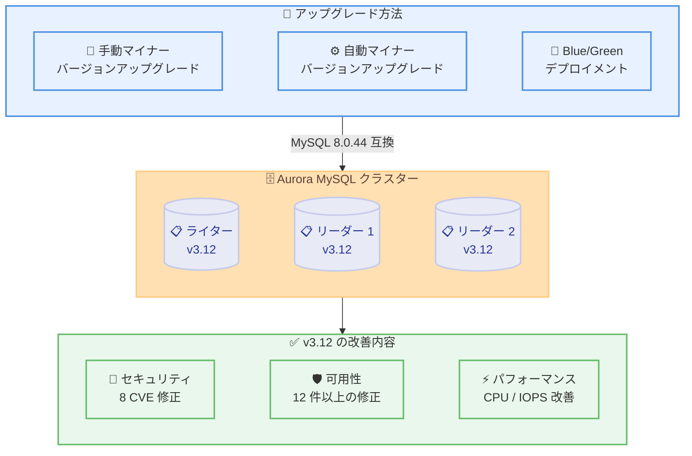

# Amazon Aurora MySQL 3.12 - MySQL 8.0.44 互換の一般提供開始

**リリース日**: 2026 年 2 月 17 日
**サービス**: Amazon Aurora MySQL
**機能**: Aurora MySQL v3.12 (MySQL 8.0.44 互換) の一般提供開始

📊 [このアップデートのインフォグラフィックを見る](https://takech9203.github.io/aws-news-summary/20260217-amazon-aurora-mysql-312-available.html)

## 概要

Amazon Aurora MySQL - Compatible Edition 3 が MySQL 8.0.44 をサポートする Aurora MySQL v3.12 の一般提供を開始しました。このリリースには、多数のセキュリティ強化、バグ修正、および複数の可用性改善が含まれています。

Aurora MySQL v3.12 では、監査ログにおける SQL ステートメントのログ記録の問題修正や caching_sha2_password プラグインのパスワード検証の一貫性向上など、重要なセキュリティ修正が行われています。また、セミコンシステント読み取り時のデータベースインスタンス再起動やバイナリログレプリカの再起動を引き起こす可能性のある問題など、12 件以上の可用性改善が含まれています。さらに、暗号化処理の CPU オーバーヘッド削減や write IOPS パフォーマンスの向上など、一般的なパフォーマンス改善も実施されています。

**アップデート前の課題**

- 既知のセキュリティ脆弱性 (CVE-2025-53040 など複数の Medium CVE) への対応が必要だった
- セミコンシステント読み取りやバイナリログリカバリ時にデータベースインスタンスが再起動する可能性があった
- ライターとリーダー間でパスワード検証の一貫性に問題があった

**アップデート後の改善**

- 8 件の Medium CVE を含むセキュリティ脆弱性が修正され、セキュリティリスクが軽減
- 12 件以上の可用性改善により、予期しないデータベース再起動のリスクが大幅に低減
- ストレージレイヤーとの暗号化通信における CPU オーバーヘッドが削減され、パフォーマンスが向上

## アーキテクチャ図



Aurora MySQL v3.12 へのアップグレードは、手動マイナーバージョンアップグレード、自動マイナーバージョンアップグレード、または Blue/Green デプロイメントを使用して実行できます。

## サービスアップデートの詳細

### 主要機能

1. **セキュリティ修正**
   - 監査ログに一部の SQL ステートメントがログ記録されない問題を修正
   - caching_sha2_password プラグインでリーダーとライターのパスワード検証の一貫性を改善
   - CVE-2025-53040 を含む 8 件の Medium CVE に対応

2. **可用性改善**
   - セミコンシステント読み取り中のロックテーブル満杯時のデータベース再起動を修正
   - `aurora_in_memory_relaylog` とマルチスレッドレプリケーション使用時のバイナリログレプリカ再起動を修正
   - グローバルライトフォワーディングまたはローカルライトフォワーディング無効化時のライター再起動を修正
   - 過剰な thread_stack 設定によるサーバー起動失敗を防止する自動リセット機能を追加
   - パラレルクエリ実行中の `KILL` コマンドによるエンジン再起動を修正
   - マルチ TiB ストレージサイズのインスタンスにおける再起動時のダウンタイム増加を修正

3. **一般的な改善**
   - ストレージレイヤーとの暗号化通信における CPU オーバーヘッドを削減
   - `innodb_flush_log_at_trx_commit` が 0 に設定された場合の write IOPS パフォーマンスを向上
   - `rds_superuser_role` に `FLUSH_OPTIMIZER_COSTS`、`FLUSH_STATUS`、`FLUSH_TABLES`、`FLUSH_USER_RESOURCES` 権限を追加
   - ゼロダウンタイムパッチ適用 (ZDP) / ゼロダウンタイムリスタート (ZDR) 時の接続処理の問題を修正
   - 論理データディクショナリリカバリ時のメモリ使用量を最適化

## 技術仕様

### バージョン情報

| 項目 | 詳細 |
|------|------|
| Aurora MySQL バージョン | 3.12.0 |
| 互換 MySQL バージョン | 8.0.44 |
| リリース日 | 2026 年 2 月 17 日 |
| 対象 | Aurora MySQL - Compatible Edition 3 |

### 修正された CVE

| CVE | 重要度 |
|-----|--------|
| CVE-2025-53040 | Medium |
| CVE-2025-53042 | Medium |
| CVE-2025-53044 | Medium |
| CVE-2025-53045 | Medium |
| CVE-2025-53053 | Medium |
| CVE-2025-53054 | Medium |
| CVE-2025-53062 | Medium |
| CVE-2025-53069 | Medium |

### アップグレード方法の比較

| 方法 | ダウンタイム | 適用範囲 | 推奨シナリオ |
|------|------------|---------|-------------|
| 手動マイナーバージョンアップグレード | DB クラスター変更時に再起動 | 個別クラスター | 即座にアップグレードしたい場合 |
| 自動マイナーバージョンアップグレード | メンテナンスウィンドウ中 | 個別クラスター | 自動的にアップグレードしたい場合 |
| Blue/Green デプロイメント | 最小限 (通常数秒) | 個別クラスター | ダウンタイムを最小化したい場合 |
| ゼロダウンタイムパッチ適用 (ZDP) | ほぼゼロ | インプレース | 接続を維持したままアップグレードしたい場合 |

### API 変更履歴

| 日付 | サービス | 変更内容 |
|------|----------|----------|
| 2026/02/17 | [Amazon Relational Database Service](https://awsapichanges.com/archive/changes/9d9af7-rds.html) | 47 updated api methods - StorageEncryptionType フィールドのサポート追加 |

## 設定方法

### 前提条件

1. 既存の Aurora MySQL v3.x クラスターが稼働していること
2. 適切な IAM 権限 (rds:ModifyDBCluster) を持つこと
3. アップグレード前にスナップショットを取得しておくこと

### 手順

#### ステップ 1: 現在のバージョンの確認

```bash
aws rds describe-db-clusters \
  --db-cluster-identifier my-aurora-cluster \
  --query 'DBClusters[0].EngineVersion'
```

現在の Aurora MySQL クラスターのエンジンバージョンを確認します。

#### ステップ 2: 手動マイナーバージョンアップグレードの実行

```bash
aws rds modify-db-cluster \
  --db-cluster-identifier my-aurora-cluster \
  --engine-version 8.0.mysql_aurora.3.12.0 \
  --apply-immediately
```

DB クラスターを変更して Aurora MySQL v3.12.0 にアップグレードします。`--apply-immediately` を指定すると即座に適用されます。省略するとメンテナンスウィンドウ中に適用されます。

#### ステップ 3: 自動マイナーバージョンアップグレードの有効化

```bash
aws rds modify-db-instance \
  --db-instance-identifier my-aurora-instance \
  --auto-minor-version-upgrade \
  --apply-immediately
```

自動マイナーバージョンアップグレードを有効にすると、新しいマイナーバージョンがメンテナンスウィンドウ中に自動的に適用されます。

#### ステップ 4: アップグレード後のバージョン確認

```bash
aws rds describe-db-clusters \
  --db-cluster-identifier my-aurora-cluster \
  --query 'DBClusters[0].{EngineVersion:EngineVersion,Status:Status}'
```

アップグレードが完了し、クラスターが `available` ステータスであることを確認します。

## メリット

### ビジネス面

- **セキュリティリスクの軽減**: 8 件の Medium CVE を含むセキュリティ脆弱性が修正され、データベースのセキュリティ態勢が向上
- **可用性の向上**: 12 件以上の再起動原因となる問題が修正され、サービスの安定稼働に貢献
- **運用コスト削減**: 予期しない再起動による緊急対応の削減

### 技術面

- **パフォーマンス改善**: 暗号化通信の CPU オーバーヘッド削減と write IOPS パフォーマンス向上
- **レプリケーションの安定性**: バイナリログレプリカやライトフォワーディングに関する複数の修正
- **メモリ管理の改善**: データディクショナリリカバリ時のメモリ使用量最適化とバッファプール操作のレースコンディション修正

## デメリット・制約事項

### 制限事項

- MySQL 8.0.44 コミュニティ版で導入された、接続失敗時に performance_schema テーブルに行が追加される変更は、過剰なメモリ消費を引き起こすため意図的に除外されている
- マイナーバージョンアップグレードにはデータベースの再起動が必要 (ZDP を除く)
- Aurora MySQL v2 からのアップグレードはメジャーバージョンアップグレードとなり、別途計画が必要

### 考慮すべき点

- アップグレード前にアプリケーションの互換性を開発環境でテストすること
- カスタムパラメータグループの設定が新バージョンと互換性があることを確認すること
- バイナリログレプリケーションを使用している場合は、レプリカのアップグレード順序に注意すること
- `thread_stack` を大きな値に設定している場合、v3.12 ではシステムメモリを超過するとエンジンデフォルト値 (1 MB) に自動リセットされる動作に変更

## ユースケース

### ユースケース 1: セキュリティ脆弱性への迅速な対応

**シナリオ**: CVE-2025-53040 などのセキュリティ脆弱性に対応するため、本番環境の Aurora MySQL クラスターを早急にアップグレードしたい。

**実装例**:
```bash
# Blue/Green デプロイメントで安全にアップグレード
aws rds create-blue-green-deployment \
  --blue-green-deployment-name security-upgrade \
  --source arn:aws:rds:ap-northeast-1:123456789012:cluster:prod-aurora-cluster \
  --target-engine-version 8.0.mysql_aurora.3.12.0

# Green 環境でのテスト完了後にスイッチオーバー
aws rds switchover-blue-green-deployment \
  --blue-green-deployment-identifier security-upgrade \
  --switchover-timeout 300
```

**効果**: Blue/Green デプロイメントにより、最小限のダウンタイムでセキュリティパッチを適用でき、問題発生時のロールバックも容易。

### ユースケース 2: 大規模環境での段階的アップグレード

**シナリオ**: 複数の Aurora MySQL クラスターを運用しており、開発環境から順にアップグレードを適用したい。

**実装例**:
```bash
# 開発環境のクラスターを先にアップグレード
aws rds modify-db-cluster \
  --db-cluster-identifier dev-aurora-cluster \
  --engine-version 8.0.mysql_aurora.3.12.0 \
  --apply-immediately

# 開発環境での検証完了後、本番環境をアップグレード
aws rds modify-db-cluster \
  --db-cluster-identifier prod-aurora-cluster \
  --engine-version 8.0.mysql_aurora.3.12.0 \
  --apply-immediately
```

**効果**: 開発環境で互換性を十分に検証した後に本番環境をアップグレードすることで、リスクを最小化。

### ユースケース 3: 自動マイナーバージョンアップグレードによる運用自動化

**シナリオ**: 今後のマイナーバージョンリリースも含めて、自動的にアップグレードが適用されるようにしたい。

**実装例**:
```bash
# 全インスタンスで自動マイナーバージョンアップグレードを有効化
aws rds modify-db-instance \
  --db-instance-identifier my-aurora-instance-1 \
  --auto-minor-version-upgrade \
  --apply-immediately
```

**効果**: メンテナンスウィンドウ中にセキュリティ修正やバグ修正を含むマイナーバージョンアップグレードが自動的に適用され、運用負荷を軽減。

## 料金

Aurora MySQL v3.12 へのアップグレード自体に追加料金はありません。標準の Amazon Aurora MySQL 料金が適用されます。Blue/Green デプロイメントを使用する場合は、デプロイメント期間中の追加クラスターリソース料金が発生します。

| 項目 | 料金 |
|------|------|
| マイナーバージョンアップグレード | 無料 |
| Aurora MySQL クラスター | [標準料金](https://aws.amazon.com/rds/aurora/pricing/) |
| Blue/Green デプロイメント | デプロイメント期間中の追加リソース料金 |

## 利用可能リージョン

Aurora MySQL が利用可能なすべての AWS リージョンで利用可能です。

## 関連サービス・機能

- **Amazon RDS Blue/Green Deployments**: 最小限のダウンタイムでのデータベースアップグレード
- **Zero Downtime Patching (ZDP)**: 接続を維持したままのパッチ適用
- **Amazon CloudWatch**: アップグレード中および後のデータベースモニタリング
- **AWS Backup**: アップグレード前のスナップショット取得

## 参考リンク

- 📊 [インフォグラフィック](https://takech9203.github.io/aws-news-summary/20260217-amazon-aurora-mysql-312-available.html)
- [公式発表 (What's New)](https://aws.amazon.com/about-aws/whats-new/2026/02/amazon-aurora-mysql-312-available/)
- [Aurora MySQL 3.12.0 リリースノート](https://docs.aws.amazon.com/AmazonRDS/latest/AuroraMySQLReleaseNotes/AuroraMySQL.Updates.3120.html)
- [Aurora MySQL バージョン 3 アップデート一覧](https://docs.aws.amazon.com/AmazonRDS/latest/AuroraMySQLReleaseNotes/AuroraMySQL.Updates.30Updates.html)
- [MySQL 8.0.44 リリースノート](https://dev.mysql.com/doc/relnotes/mysql/8.0/en/news-8-0-44.html)
- [Aurora MySQL の開始方法](https://docs.aws.amazon.com/AmazonRDS/latest/AuroraUserGuide/CHAP_GettingStartedAurora.html)
- [API 変更履歴](https://awsapichanges.com/archive/changes/9d9af7-rds.html)

## まとめ

Amazon Aurora MySQL v3.12 (MySQL 8.0.44 互換) の一般提供により、8 件の Medium CVE を含むセキュリティ修正、12 件以上の可用性改善、および暗号化通信の CPU オーバーヘッド削減や write IOPS パフォーマンス向上などの一般的な改善が利用可能になりました。手動マイナーバージョンアップグレード、自動マイナーバージョンアップグレード、Blue/Green デプロイメント、または ZDP を使用してアップグレードを実行できます。セキュリティ脆弱性への対応として、早期のアップグレードを推奨します。
