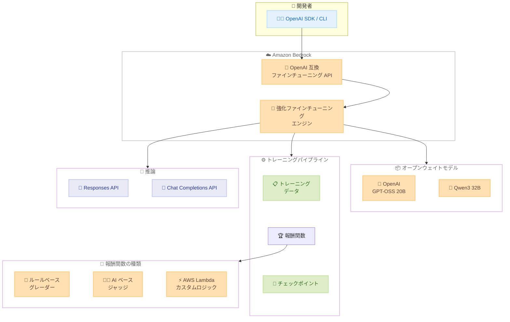

# Amazon Bedrock - 強化ファインチューニングがオープンウェイトモデルと OpenAI 互換 API に対応

**リリース日**: 2026 年 2 月 17 日
**サービス**: Amazon Bedrock
**機能**: 強化ファインチューニング (RFT) のオープンウェイトモデルおよび OpenAI 互換 API サポート

📊 [このアップデートのインフォグラフィックを見る](https://takech9203.github.io/aws-news-summary/20260217-amazon-bedrock-reinforcement-fine-tuning-openai.html)

## 概要

Amazon Bedrock の強化ファインチューニング (Reinforcement Fine-Tuning: RFT) が、OpenAI GPT-OSS および Qwen モデルを含む人気のオープンウェイトモデルに対応し、OpenAI 互換のファインチューニング API を導入した。これにより、開発者は深い機械学習の専門知識や大量のラベル付きデータを必要とせずに、オープンウェイトモデルの精度を向上させることが可能になる。

強化ファインチューニングは、従来の大規模なトレーニングデータセットではなく、少数のプロンプトセットを使用し、複数の応答に対するフィードバックからモデルを学習させる。報酬関数 (ルールベースのグレーダーまたは AI ベースのジャッジ) を使用してエンドツーエンドのカスタマイズワークフローを自動化し、ベースモデルと比較して平均 66% の精度向上を実現する。

**アップデート前の課題**

- 強化ファインチューニングは Amazon Nova 2 Lite のみに限定されており、オープンウェイトモデルでは利用できなかった
- オープンウェイトモデルのカスタマイズには専門的な ML インフラストラクチャと専門知識が必要であり、開発コストが高かった
- 既存の OpenAI SDK やツールを使用したファインチューニングワークフローとの互換性がなかった
- ファインチューニング後のモデルデプロイに追加の手順が必要だった

**アップデート後の改善**

- OpenAI GPT-OSS 20B および Qwen3 32B のオープンウェイトモデルで強化ファインチューニングが利用可能に
- OpenAI 互換のファインチューニング API により、既存の OpenAI SDK やコードベースからシームレスに移行可能
- ファインチューニング完了後、追加のデプロイ手順なしで Responses API や Chat Completions API を通じてオンデマンド推論が即座に利用可能
- AWS Lambda を使用したカスタムグレーディングロジックと中間チェックポイントへのアクセスにより、トレーニングの効率が向上

## アーキテクチャ図



開発者は OpenAI 互換 API を通じて強化ファインチューニングジョブを作成し、報酬関数でモデルを最適化する。ファインチューニング完了後は、追加デプロイなしで Responses API または Chat Completions API を通じて推論が可能になる。

## サービスアップデートの詳細

### 主要機能

1. **オープンウェイトモデルの強化ファインチューニング対応**
   - OpenAI GPT-OSS 20B および Qwen3 32B モデルをサポート
   - 少数のプロンプトセットでモデルの精度を向上
   - ベースモデルと比較して平均 66% の精度向上を実現
   - より小さく、高速で、コスト効率の高いモデルバリアントの最適化が可能

2. **OpenAI 互換ファインチューニング API**
   - Files API: トレーニングデータのアップロードと管理
   - Fine-tuning Jobs API: ジョブの作成、監視、管理
   - Checkpoints API: 中間モデルチェックポイントの取得と評価
   - 既存の OpenAI SDK やコードベースとの互換性

3. **報酬関数によるフィードバック駆動型最適化**
   - ルールベースのグレーダー: コード生成や数学的推論などの客観的タスクに最適
   - AI ベースのジャッジ: 指示追従やコンテンツモデレーションなどの主観的タスクに最適
   - AWS Lambda を使用したカスタムグレーディングロジックの実装
   - 7 種類のすぐに使える報酬関数テンプレートを提供

4. **デプロイレスの推論**
   - ファインチューニング完了後、追加デプロイ手順なしでオンデマンド推論が利用可能
   - Responses API および Chat Completions API を通じてアクセス
   - ファインチューニング済みモデル ID を直接指定して推論

## 技術仕様

### サポートモデルとリージョン

| プロバイダー | モデル | モデル ID | リージョン | リージョンコード |
|-------------|--------|-----------|-----------|----------------|
| OpenAI | GPT-OSS 20B | openai.gpt-oss-20b | US West (Oregon) | us-west-2 |
| Qwen | Qwen3 32B | qwen.qwen3-32b | US West (Oregon) | us-west-2 |

### API エンドポイント

| モデル | エンドポイント |
|--------|-------------|
| OpenAI GPT-OSS 20B | bedrock-mantle.us-west-2.api.aws |
| Qwen3 32B | bedrock-mantle.us-west-2.api.aws |

### 強化ファインチューニングのワークフロー

| ステップ | 説明 |
|---------|------|
| 1. データアップロード | Files API でトレーニングデータを JSONL 形式でアップロード |
| 2. 報酬関数設定 | ルールベースグレーダーまたは AI ジャッジを定義 |
| 3. ジョブ作成 | ベースモデル、データセット、報酬関数を指定してジョブを起動 |
| 4. トレーニング監視 | ジョブステータス、イベント、メトリクスを追跡。チェックポイントにアクセス |
| 5. 推論実行 | ファインチューニング済みモデル ID で即座に推論開始 |

### トレーニングアルゴリズム

強化ファインチューニングは Group Relative Policy Optimization (GRPO) を使用する。モデルはトレーニングデータセットからプロンプトを受け取り、プロンプトごとに複数の応答を生成する。これらの応答は報酬関数によってスコア付けされ、スコア付きのプロンプト-応答ペアを使用してポリシーベースの学習でモデルを最適化する。

## 設定方法

### 前提条件

1. AWS アカウントを保有していること
2. Amazon Bedrock へのアクセス権限があること
3. OpenAI SDK または HTTP クライアントが利用可能であること
4. カスタムグレーダーを使用する場合、AWS Lambda 関数の作成権限があること
5. トレーニングデータを JSONL 形式で準備していること

### 手順

#### ステップ 1: トレーニングデータのアップロード

```python
from openai import OpenAI

client = OpenAI(
    base_url="https://bedrock-mantle.us-west-2.api.aws/v1",
    api_key="AWS_CREDENTIALS"
)

# トレーニングデータを Files API でアップロード
file = client.files.create(
    file=open("training_data.jsonl", "rb"),
    purpose="fine-tune"
)
print(f"File ID: {file.id}")
```

Files API を使用してトレーニングデータを JSONL 形式でアップロードする。purpose には `fine-tune` を指定する。

#### ステップ 2: 報酬関数の設定

```python
# AWS Lambda によるカスタム報酬関数の例
import json

def lambda_handler(event, context):
    prompt = event["prompt"]
    response = event["response"]

    # カスタムグレーディングロジック
    score = evaluate_response(prompt, response)

    return {
        "statusCode": 200,
        "body": json.dumps({"score": score})
    }

def evaluate_response(prompt, response):
    # 正確性、構造、トーンなどに基づいて 0.0-1.0 のスコアを返す
    score = 0.0
    if len(response) > 0:
        score += 0.5
    # 追加の評価ロジック
    return min(score, 1.0)
```

AWS Lambda 関数でカスタムグレーディングロジックを実装する。ルールベースのグレーダーまたは AI ベースのジャッジも使用可能。

#### ステップ 3: ファインチューニングジョブの作成

```python
# 強化ファインチューニングジョブを作成
job = client.fine_tuning.jobs.create(
    model="openai.gpt-oss-20b",
    training_file=file.id,
    method={
        "type": "reinforcement",
        "reinforcement": {
            "grader": {
                "type": "custom_code",
                "lambda_arn": "arn:aws:lambda:us-west-2:123456789012:function:my-grader"
            }
        }
    }
)
print(f"Job ID: {job.id}")
```

OpenAI 互換 API でファインチューニングジョブを作成する。ベースモデル、トレーニングデータ、報酬関数を指定する。

#### ステップ 4: トレーニングの監視

```python
# ジョブステータスの確認
job_status = client.fine_tuning.jobs.retrieve(job.id)
print(f"Status: {job_status.status}")

# イベントログの取得
events = client.fine_tuning.jobs.list_events(job.id)
for event in events.data:
    print(f"{event.created_at}: {event.message}")

# チェックポイントの取得
checkpoints = client.fine_tuning.jobs.list_checkpoints(job.id)
for cp in checkpoints.data:
    print(f"Checkpoint: {cp.id}, Step: {cp.step_number}")
```

ジョブステータス、イベントログ、チェックポイントを監視して、トレーニングの進捗を追跡する。

#### ステップ 5: ファインチューニング済みモデルで推論

```python
# ファインチューニング済みモデルで推論
response = client.chat.completions.create(
    model=job_status.fine_tuned_model,
    messages=[
        {"role": "user", "content": "ファインチューニング済みモデルへの質問"}
    ]
)
print(response.choices[0].message.content)
```

ファインチューニング完了後、ファインチューニング済みモデル ID を指定して追加のデプロイ手順なしで推論を実行する。

## メリット

### ビジネス面

- **コスト効率**: より小さく高速なモデルバリアントをファインチューニングすることで、大規模モデルと同等以上の精度を低コストで実現
- **専門知識不要**: 深い ML の専門知識がなくても、報酬関数を定義するだけで高品質なモデルカスタマイズが可能
- **迅速な導入**: OpenAI 互換 API により、既存のコードベースや SDK をそのまま活用して移行が容易
- **セキュリティ**: 独自データは AWS のセキュアな環境内に保持され、カスタマイズプロセス全体を通じてコンプライアンスを維持

### 技術面

- **フィードバック駆動型最適化**: 大量のラベル付きデータではなく、報酬関数によるフィードバックで効率的にモデルを改善
- **チェックポイントアクセス**: 中間チェックポイントを評価・デバッグし、最適なモデルを選択可能
- **デプロイレス推論**: ファインチューニング完了後に追加デプロイなしで即座に推論開始
- **柔軟な報酬関数**: ルールベースグレーダー、AI ジャッジ、Lambda カスタムロジックから選択可能

## デメリット・制約事項

### 制限事項

- 対応リージョンは現時点で US West (Oregon) のみ
- サポートモデルは OpenAI GPT-OSS 20B と Qwen3 32B の 2 モデルに限定
- ファインチューニング API エンドポイントは bedrock-mantle.us-west-2.api.aws のみ
- トレーニングデータは JSONL 形式で準備する必要がある

### 考慮すべき点

- 報酬関数の設計がモデルの最終品質に大きく影響するため、適切な報酬関数の設計が重要
- Lambda 関数を報酬関数として使用する場合、実行時間は秒単位に抑え、外部 API 呼び出しを最小限にする必要がある
- トレーニング前にベースモデルのパフォーマンスをテストし、報酬スコアが常に 0% の場合は先に教師ありファインチューニングを検討すべき
- 報酬スコアが 95% を超える場合、強化ファインチューニングは不要な可能性がある
- トレーニング中のオーバーフィッティング (トレーニング報酬は増加するがバリデーション報酬は低下) に注意が必要

## ユースケース

### ユースケース 1: コード生成の精度向上

**シナリオ**: ソフトウェア開発チームが、特定のコーディング規約やフレームワークに準拠したコード生成の精度を向上させたい

**実装例**:
```python
# ルールベースグレーダーでコードの正確性を評価
def lambda_handler(event, context):
    generated_code = event["response"]

    score = 0.0
    # 構文チェック
    try:
        compile(generated_code, "<string>", "exec")
        score += 0.5
    except SyntaxError:
        return {"body": json.dumps({"score": 0.0})}

    # コーディング規約チェック
    if follows_coding_standards(generated_code):
        score += 0.3
    # テスト通過チェック
    if passes_unit_tests(generated_code):
        score += 0.2

    return {"body": json.dumps({"score": score})}
```

**効果**: ルールベースのグレーダーでコードの正確性と規約準拠を自動評価し、100-200 例の小規模データセットでモデルをカスタマイズすることで、チーム固有のコーディング標準に準拠した高品質なコード生成を実現

### ユースケース 2: ドメイン固有の質問応答

**シナリオ**: 金融機関が、社内の規制文書やポリシーに基づいた正確な回答を生成するモデルを構築したい

**実装例**:
```python
# AI ジャッジを使用した主観的評価
job = client.fine_tuning.jobs.create(
    model="qwen.qwen3-32b",
    training_file=file.id,
    method={
        "type": "reinforcement",
        "reinforcement": {
            "grader": {
                "type": "model_as_judge",
                "instructions": "回答が正確で、規制文書に基づいているか評価してください。"
            }
        }
    }
)
```

**効果**: AI ベースのジャッジでドメイン知識の正確性を評価し、専門的なラベル付きデータの収集コストを削減しながら、ドメイン固有の質問応答精度を大幅に向上

### ユースケース 3: カスタマーサポートの応答品質改善

**シナリオ**: EC サイトが、カスタマーサポートの応答品質 (丁寧さ、正確性、問題解決能力) を向上させたい

**実装例**:
```python
# 複数の評価基準を組み合わせた報酬関数
def lambda_handler(event, context):
    response = event["response"]
    prompt = event["prompt"]

    politeness_score = evaluate_politeness(response)
    accuracy_score = evaluate_accuracy(response, prompt)
    resolution_score = evaluate_resolution(response, prompt)

    # 加重平均スコア
    total_score = (
        0.3 * politeness_score +
        0.4 * accuracy_score +
        0.3 * resolution_score
    )

    return {"body": json.dumps({"score": total_score})}
```

**効果**: 丁寧さ、正確性、問題解決能力を複合的に評価する報酬関数により、カスタマーサポートの応答品質を多面的に最適化

## 料金

Amazon Bedrock の強化ファインチューニング料金は、トレーニング時間とトレーニングに使用されるトークン数に基づく。また、Lambda 関数を報酬関数として使用する場合は、Lambda の実行料金が別途発生する。ファインチューニング済みモデルの推論はオンデマンド方式で、入力トークンと出力トークンの使用量に基づいて課金される。

詳細な料金については、[Amazon Bedrock 料金ページ](https://aws.amazon.com/bedrock/pricing/)を参照。

## 利用可能リージョン

- US West (Oregon) - us-west-2

両モデル (OpenAI GPT-OSS 20B、Qwen3 32B) ともに US West (Oregon) リージョンで利用可能。

## 関連サービス・機能

- **Amazon Bedrock Responses API**: ファインチューニング済みモデルのオンデマンド推論に使用
- **Amazon Bedrock Chat Completions API**: OpenAI 互換の推論エンドポイント
- **AWS Lambda**: カスタムグレーディングロジックの実装に使用
- **Amazon S3**: トレーニングデータの保存に使用
- **Amazon Bedrock Custom Models**: 教師ありファインチューニングなど他のカスタマイズ手法

## 参考リンク

- 📊 [インフォグラフィック](https://takech9203.github.io/aws-news-summary/20260217-amazon-bedrock-reinforcement-fine-tuning-openai.html)
- [公式発表 (What's New)](https://aws.amazon.com/about-aws/whats-new/2026/02/amazon-bedrock-reinforcement-fine-tuning-openai/)
- [強化ファインチューニング ドキュメント](https://docs.aws.amazon.com/bedrock/latest/userguide/reinforcement-fine-tuning.html)
- [OpenAI 互換 API によるファインチューニング ドキュメント](https://docs.aws.amazon.com/bedrock/latest/userguide/fine-tuning-openai-apis.html)
- [AWS ブログ: 強化ファインチューニングの紹介](https://aws.amazon.com/blogs/aws/improve-model-accuracy-with-reinforcement-fine-tuning-in-amazon-bedrock/)
- [Amazon Bedrock 料金ページ](https://aws.amazon.com/bedrock/pricing/)

## まとめ

Amazon Bedrock の強化ファインチューニングがオープンウェイトモデル (OpenAI GPT-OSS 20B、Qwen3 32B) と OpenAI 互換 API に対応したことで、開発者は既存の OpenAI SDK やツールを活用しながら、深い ML の専門知識がなくてもモデルの精度を大幅に向上させることが可能になった。報酬関数によるフィードバック駆動型の最適化、中間チェックポイントへのアクセス、ファインチューニング後のデプロイレス推論により、モデルカスタマイズのワークフロー全体が簡素化されている。コード生成、ドメイン固有の質問応答、カスタマーサポートなど、明確な成功基準を定義できるユースケースにおいて、小規模なデータセットから高品質なカスタムモデルを効率的に構築できる。
