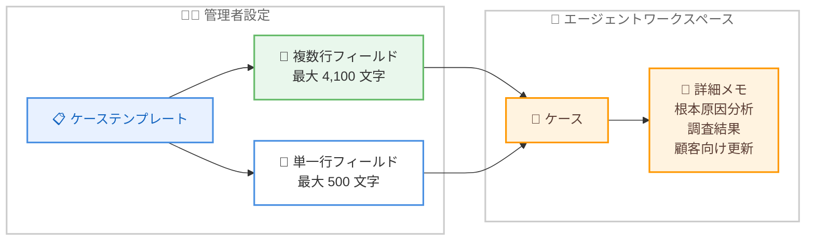

# Amazon Connect Cases - 複数行テキストフィールドのサポート

**リリース日**: 2026 年 2 月 17 日
**サービス**: Amazon Connect Cases
**機能**: ケーステンプレートでの複数行テキストフィールド

📊 [このアップデートのインフォグラフィックを見る](https://takech9203.github.io/aws-news-summary/20260217-amazon-connect-cases-multiline-text-fields.html)

## 概要

Amazon Connect Cases のケーステンプレートにおいて、より大きな複数行テキストフィールドがサポートされました。この機能により、エージェントはケース内で詳細な自由形式のメモや構造化されたデータを直接記録できるようになります。複数行テキストフィールドは複数の段落に対応して垂直方向に拡張されるため、根本原因分析、取引詳細、調査結果、顧客向けの更新情報などを記録することが容易になります。

従来のテキストフィールドは単一行で最大 500 文字までの入力に限定されていましたが、複数行テキストフィールドでは最大 4,100 文字まで入力可能です。これにより、エージェントが外部のメモツールやドキュメントに頼ることなく、ケース内に包括的な情報を一元管理できるようになります。

**アップデート前の課題**

- テキストフィールドが単一行で最大 500 文字に制限されていたため、詳細な情報を記録するにはフィールドを分割するか外部ツールを使用する必要があった
- 根本原因分析や調査結果など、複数段落にわたる詳細な記録がケース内で完結できなかった
- エージェントが詳細なメモを残すために別のアプリケーションやシステムを使用する必要があり、情報の分散が発生していた
- 長い文章を単一行フィールドに入力する際の視認性が低く、入力・編集作業が非効率だった

**アップデート後の改善**

- 複数行テキストフィールドにより最大 4,100 文字の詳細な情報をケース内に記録可能
- フィールドが複数段落に対応して垂直方向に拡張し、視認性と編集効率が向上
- 根本原因分析、取引詳細、調査結果、顧客向けアップデートなどを 1 つのフィールドに集約可能
- 外部ツールへの依存を削減し、ケース内での情報の一元管理を実現

## アーキテクチャ図



管理者がケーステンプレートにフィールドタイプ (単一行または複数行) を設定し、エージェントがケース内で詳細な情報を入力できる構成を示しています。

## サービスアップデートの詳細

### 主要機能

1. **複数行テキストフィールド**
   - ケーステンプレートのテキストフィールドで「複数行」表示オプションを選択可能
   - 最大 4,100 文字の入力をサポートし、複数段落にわたる詳細な記録が可能
   - フィールドは入力内容に応じて垂直方向に拡張され、視認性が向上

2. **単一行テキストフィールドとの使い分け**
   - 単一行テキストフィールドは最大 500 文字で、簡潔な情報 (参照番号、製品名、簡単な要約など) に適している
   - 複数行テキストフィールドは最大 4,100 文字で、詳細な説明 (ケース概要、顧客フィードバック、解決手順、エージェントの所見など) に適している
   - 管理者がフィールド作成時に「入力表示」セクションで表示タイプを選択

3. **ケーステンプレートへの統合**
   - 既存のケーステンプレートに複数行テキストフィールドを追加可能
   - 新規テンプレート作成時にも複数行テキストフィールドを設定可能
   - フィールドの説明 (管理者向け) とフィールド名 (エージェント向け) を個別に設定

## 技術仕様

### テキストフィールドの比較

| 項目 | 単一行テキストフィールド | 複数行テキストフィールド |
|------|--------------------------|--------------------------|
| 最大文字数 | 500 文字 | 4,100 文字 |
| 表示形式 | 横一行 | 垂直方向に拡張 |
| 適した用途 | 参照番号、製品名、簡潔な要約 | ケース概要、調査結果、解決手順 |
| 段落入力 | 非対応 | 複数段落対応 |

### 設定パラメータ

| 項目 | 詳細 |
|------|------|
| フィールドタイプ | Text |
| 入力表示オプション | Single line / Multi-line |
| 設定場所 | Amazon Connect 管理ウェブサイト > ケースフィールド |
| API サポート | Cases API で作成・更新可能 |

## 設定方法

### 前提条件

1. Amazon Connect インスタンスが作成済みであること
2. Amazon Connect Cases が有効化されていること (Customer Profiles が必要)
3. ケースフィールドを作成するための適切なセキュリティプロファイル権限を持っていること

### 手順

#### ステップ 1: 複数行テキストフィールドの作成

1. Amazon Connect 管理ウェブサイトに管理者アカウントでログインします
2. 左側のナビゲーションメニューから「エージェントアプリケーション」>「ケースフィールド」を選択します
3. 「+ 新しいフィールド」を選択します
4. フィールドタイプとして「テキスト」を選択します
5. 「入力表示」セクションで「複数行」を選択します
6. フィールドに名前を付けます (例: 「根本原因分析」「調査結果」「詳細メモ」)
7. 必要に応じて説明を入力します (管理者のみに表示)
8. 「保存」を選択します

#### ステップ 2: ケーステンプレートにフィールドを追加

1. 左側のナビゲーションメニューから「エージェントアプリケーション」>「ケーステンプレート」を選択します
2. 既存のテンプレートを編集するか、新しいテンプレートを作成します
3. 作成した複数行テキストフィールドをテンプレートに追加します
4. テンプレートを保存します

#### ステップ 3: 動作確認

1. エージェントワークスペースで新しいケースを作成します
2. 複数行テキストフィールドが垂直方向に拡張されることを確認します
3. 複数段落のテキストが正しく入力・表示されることを確認します

## メリット

### ビジネス面

- **情報の一元管理**: ケース内に詳細な情報を直接記録できるため、外部ツールへの依存を排除し、情報の散逸を防止
- **ケース引き継ぎの品質向上**: 詳細な根本原因分析や調査結果がケースに記録されるため、別のエージェントやチームへの引き継ぎがスムーズになる
- **コンプライアンスと監査対応**: 顧客対応の詳細な記録をケース内に残すことで、監査証跡としても活用可能
- **エージェントの業務効率向上**: アプリケーション間の切り替えが不要になり、ケース管理に集中できる

### 技術面

- **簡単な設定**: 管理ウェブサイトでフィールドタイプを選択するだけで利用開始可能
- **既存テンプレートとの互換性**: 既存のケーステンプレートに複数行フィールドを追加するだけで、既存のケースには影響なし
- **4,100 文字の入力容量**: 従来の 500 文字制限と比較して約 8 倍の容量で、包括的な情報記録が可能
- **動的な表示拡張**: 入力内容に応じてフィールドが自動的に拡張され、ユーザーエクスペリエンスが向上

## デメリット・制約事項

### 制限事項

- 複数行テキストフィールドの最大文字数は 4,100 文字に制限されている
- テキストフィールドはプレーンテキストのみで、リッチテキスト (太字、リンクなど) は非対応
- ケースフィールドの総数にはサービスクォータが適用される

### 考慮すべき点

- 大量の情報を自由形式で入力する場合、入力内容の一貫性を保つためにエージェント向けのガイドラインを策定することが推奨される
- 既存のワークフローで外部ツールを使用している場合、複数行テキストフィールドへの移行計画を検討する必要がある
- フィールドの命名規則を事前に定義し、用途が明確になるようにすることが重要

## ユースケース

### ユースケース 1: 根本原因分析の記録

**シナリオ**: 技術サポートチームが複雑な問題を調査する際に、根本原因の分析プロセスと発見事項をケースに詳細に記録する必要がある。

**実装例**:

複数行テキストフィールドの設定:
- フィールド名: 「根本原因分析」
- 入力表示: 複数行
- 最大 4,100 文字

エージェントの入力例:
```
2026/02/17 調査開始

問題の概要:
顧客の API 接続がタイムアウトエラーを返している。

調査結果:
1. ネットワークログを確認 - パケットロスは検出されず
2. API エンドポイントのヘルスチェック - 正常稼働を確認
3. 認証トークンの有効期限を確認 - 期限切れが原因と判明

根本原因:
OAuth2 トークンの自動更新が顧客側のプロキシ設定により
ブロックされていた。

対応策:
プロキシのホワイトリストにトークンエンドポイントを追加する
よう顧客に案内。
```

**効果**: 根本原因分析の全過程がケース内に記録され、同様の問題が再発した際のナレッジとして活用可能

### ユースケース 2: 取引詳細と顧客向けアップデートの記録

**シナリオ**: 金融機関のコンタクトセンターで、取引に関する調査の経過と顧客への通知内容を詳細に記録する必要がある。

**実装例**:

複数行テキストフィールドの設定:
- フィールド名: 「取引調査詳細」
- 入力表示: 複数行

- フィールド名: 「顧客向けアップデート」
- 入力表示: 複数行

**効果**: 取引調査の詳細と顧客コミュニケーションの履歴がケース内に一元管理され、コンプライアンス監査にも対応

### ユースケース 3: 保険請求の調査結果記録

**シナリオ**: 保険会社のクレームチームが、保険請求に関する調査結果、現場確認の報告、査定内容をケース内に記録する必要がある。

**実装例**:

複数行テキストフィールドの設定:
- フィールド名: 「調査結果」
- 入力表示: 複数行

エージェントの入力例:
```
現場確認日: 2026/02/15
担当者: 田中太郎

現場状況:
建物の 2 階北側の窓から浸水が確認された。窓枠の
経年劣化によるシーリング不良が原因と推定される。

損害範囲:
- 2 階北側の壁紙に水染み (約 2m x 1.5m)
- フローリングの膨張 (約 3m x 2m)
- 窓枠のシーリング劣化

査定金額: 450,000 円
```

**効果**: 調査結果の詳細をケース内に記録することで、査定プロセスの透明性が向上し、顧客への説明も容易に

## 料金

この機能は Amazon Connect Cases の標準料金に含まれます。複数行テキストフィールドの使用に追加料金は発生しません。

### 料金体系

| 項目 | 料金 |
|------|------|
| Amazon Connect Cases | アクティブケース数に基づく従量課金 |
| 複数行テキストフィールド | 追加料金なし |

最新の料金情報は [Amazon Connect 料金ページ](https://aws.amazon.com/connect/pricing/) をご確認ください。

## 利用可能リージョン

この機能は、以下の AWS リージョンで利用可能です。

- US East (N. Virginia) - us-east-1
- US West (Oregon) - us-west-2
- Canada (Central) - ca-central-1
- Europe (Frankfurt) - eu-central-1
- Europe (London) - eu-west-2
- Asia Pacific (Seoul) - ap-northeast-2
- Asia Pacific (Singapore) - ap-southeast-1
- Asia Pacific (Sydney) - ap-southeast-2
- Asia Pacific (Tokyo) - ap-northeast-1
- Africa (Cape Town) - af-south-1

## 関連サービス・機能

- **Amazon Connect Cases**: ケース管理機能。複数のやり取りや複数のオーナーを必要とする顧客の問題を追跡・解決
- **Amazon Connect Customer Profiles**: Cases を使用するために必要な顧客プロファイル管理機能
- **Amazon Connect Tasks**: ケースに関連するタスクを作成・管理し、解決に必要な作業を追跡
- **Amazon Connect Contact Lens**: 通話やチャットの分析結果をケースに関連付けて顧客理解を深化
- **Amazon Q in Connect**: AI を活用したリアルタイムのエージェント支援。ケースの概要や推奨アクションを提供

## 参考リンク

- 📊 [インフォグラフィック](https://takech9203.github.io/aws-news-summary/20260217-amazon-connect-cases-multiline-text-fields.html)
- [公式発表 (What's New)](https://aws.amazon.com/about-aws/whats-new/2026/02/amazon-connect-cases-multiline-text-fields/)
- [Amazon Connect Cases](https://aws.amazon.com/connect/cases/)
- [ドキュメント: Create case fields in Amazon Connect Cases](https://docs.aws.amazon.com/connect/latest/adminguide/case-fields.html)

## まとめ

Amazon Connect Cases の複数行テキストフィールドは、エージェントがケース内で詳細な情報を記録するための機能を大幅に強化するアップデートです。従来の 500 文字制限の単一行フィールドに加えて、最大 4,100 文字の複数行フィールドが利用可能になったことで、根本原因分析、取引詳細、調査結果、顧客向けアップデートなどの包括的な情報をケースに直接記録できます。

管理者は Amazon Connect 管理ウェブサイトでフィールド作成時に「複数行」表示オプションを選択するだけで、既存のテンプレートにも新規のテンプレートにも適用可能です。外部ツールへの依存を減らし、ケース内での情報の一元管理を実現することで、エージェントの業務効率とケース引き継ぎの品質向上が期待できます。
