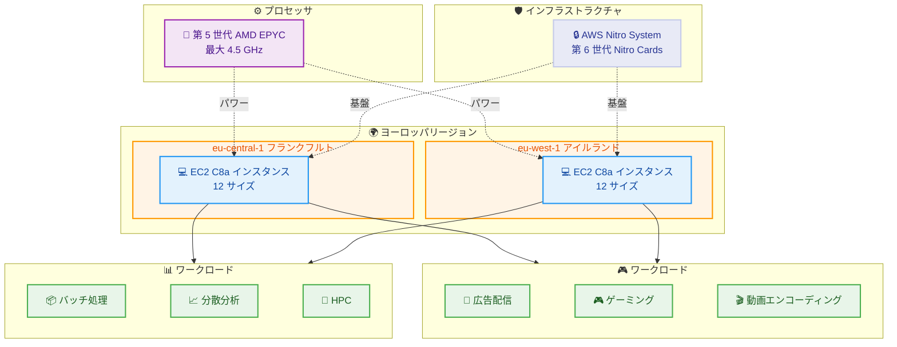

# Amazon EC2 C8a インスタンス - Europe (Frankfurt) および Europe (Ireland) リージョンで利用可能に

**リリース日**: 2026 年 2 月 17 日
**サービス**: Amazon EC2
**機能**: C8a コンピューティング最適化インスタンスのリージョン拡大

📊 [このアップデートのインフォグラフィックを見る](https://takech9203.github.io/aws-news-summary/20260217-amazon-ec2-c8a-instances-europe-frankfurt-europe-ireland-regions.html)

## 概要

AWS は 2026 年 2 月 17 日、Amazon EC2 C8a インスタンスがヨーロッパ (フランクフルト) およびヨーロッパ (アイルランド) リージョンで利用可能になったことを発表しました。C8a インスタンスは第 5 世代 AMD EPYC プロセッサ (コード名 Turin) を搭載し、最大周波数 4.5 GHz で動作します。C7a インスタンスと比較して最大 30% のパフォーマンス向上と最大 19% の価格パフォーマンス改善を実現します。

C8a インスタンスは C7a インスタンスと比較して 33% 多いメモリ帯域幅を提供し、レイテンシーに敏感なワークロードに最適です。GroovyJVM では最大 57% 高速化されており、Java ベースのアプリケーションのレスポンスタイムが向上します。2 つのベアメタルサイズを含む 12 サイズが提供され、ワークロード要件に正確にマッチさせることが可能です。

**アップデート前の課題**

- C8a インスタンスがフランクフルトおよびアイルランドリージョンで利用できなかった
- ヨーロッパリージョンのユーザーは前世代の AMD ベースコンピューティング最適化インスタンスを使用する必要があった
- データレジデンシー要件を満たしながら最新世代の AMD プロセッサによる高性能を活用できなかった

**アップデート後の改善**

- フランクフルトおよびアイルランドリージョンで C8a インスタンスを直接起動できるようになった
- C7a インスタンスと比較して最大 30% のパフォーマンス向上を享受できるようになった
- ヨーロッパのデータレジデンシー要件を満たしながら、最新世代の AMD ベースコンピューティングを利用可能になった

## アーキテクチャ図



このアーキテクチャ図は、C8a インスタンスが新たに利用可能になった 2 つのヨーロッパリージョンと、第 5 世代 AMD EPYC プロセッサおよび AWS Nitro System によって駆動され、バッチ処理、分散分析、HPC、広告配信、ゲーミング、動画エンコーディングなどのコンピューティング集約型ワークロードに最適化されていることを示しています。

## サービスアップデートの詳細

### 主要機能

1. **第 5 世代 AMD EPYC プロセッサ搭載**
   - コード名 Turin の最新 AMD プロセッサ
   - 最大周波数 4.5 GHz
   - 各 vCPU が物理 CPU コアに対応 (同時マルチスレッディングなし)
   - AMD Secure Memory Encryption (SME) による常時メモリ暗号化 (AES-256)

2. **大幅なパフォーマンス向上**
   - C7a インスタンスと比較して最大 30% のパフォーマンス向上
   - 33% 多いメモリ帯域幅
   - GroovyJVM で最大 57% 高速化
   - AVX-512、VNNI、bfloat16 命令セットをサポート

3. **柔軟なインスタンスサイズ**
   - 10 の仮想化サイズと 2 つのベアメタルサイズの計 12 サイズ
   - 1 vCPU (medium) から 192 vCPU (48xlarge/metal-48xl) まで対応
   - Instance Bandwidth Configuration (IBC) によりネットワークまたは EBS 帯域幅を最大 25% ブースト可能

4. **AWS Nitro System 基盤**
   - 第 6 世代 AWS Nitro Cards を搭載
   - I/O 機能のオフロードと高速化によるシステム全体のパフォーマンス向上

### API 変更履歴

| 日付 | サービス | 変更内容 |
|------|----------|----------|
| 2026/02/17 | [Amazon Elastic Compute Cloud](https://awsapichanges.com/archive/changes/9d9af7-ec2.html) | 2 updated api methods - CreatePlacementGroup および DescribePlacementGroup API に Operator フィールドを追加 |

## 技術仕様

### C8a インスタンスの主要仕様

| インスタンスサイズ | vCPU | メモリ (GiB) | ネットワーク帯域幅 (Gbps) | EBS 帯域幅 (Gbps) |
|-------------------|------|-------------|--------------------------|-------------------|
| c8a.medium | 1 | 2 | 最大 12.5 | 最大 10 |
| c8a.large | 2 | 4 | 最大 12.5 | 最大 10 |
| c8a.xlarge | 4 | 8 | 最大 12.5 | 最大 10 |
| c8a.2xlarge | 8 | 16 | 最大 15 | 最大 10 |
| c8a.4xlarge | 16 | 32 | 最大 15 | 最大 10 |
| c8a.8xlarge | 32 | 64 | 15 | 10 |
| c8a.12xlarge | 48 | 96 | 22.5 | 15 |
| c8a.16xlarge | 64 | 128 | 30 | 20 |
| c8a.24xlarge | 96 | 192 | 40 | 30 |
| c8a.48xlarge | 192 | 384 | 75 | 60 |
| c8a.metal-24xl | 96 | 192 | 40 | 30 |
| c8a.metal-48xl | 192 | 384 | 75 | 60 |

### パフォーマンス比較

| 指標 | C8a vs C7a |
|------|-----------|
| 全体パフォーマンス | 最大 30% 向上 |
| 価格パフォーマンス | 最大 19% 改善 |
| メモリ帯域幅 | 33% 向上 |
| GroovyJVM | 最大 57% 高速 |
| ネットワークスループット | 50% 増加 (最大 75 Gbps) |
| EBS 帯域幅 | 最大 60 Gbps |

## 設定方法

### 前提条件

1. AWS アカウントと適切な IAM 権限
2. フランクフルトまたはアイルランドリージョンへのアクセス
3. C8a インスタンスタイプのサービスクォータ確認

### 手順

#### ステップ 1: 利用可能なインスタンスタイプの確認

```bash
# フランクフルトリージョンで利用可能な C8a インスタンスタイプを確認
aws ec2 describe-instance-types \
  --filters "Name=instance-type,Values=c8a*" \
  --region eu-central-1 \
  --query "InstanceTypes[].{Type:InstanceType,vCPU:VCpuInfo.DefaultVCpus,Memory:MemoryInfo.SizeInMiB}" \
  --output table
```

フランクフルトリージョンで利用可能な C8a インスタンスタイプとスペックを表示します。

#### ステップ 2: インスタンスの起動

```bash
# フランクフルトリージョンで C8a インスタンスを起動
aws ec2 run-instances \
  --image-id ami-xxxxxxxxxxxxxxxxx \
  --instance-type c8a.4xlarge \
  --region eu-central-1 \
  --subnet-id subnet-xxxxxxxxxxxxxxxxx \
  --security-group-ids sg-xxxxxxxxxxxxxxxxx \
  --key-name my-key-pair
```

フランクフルトリージョン (eu-central-1) で C8a.4xlarge インスタンスを起動します。

#### ステップ 3: 購入オプションの選択

C8a インスタンスは、以下の購入オプションで利用できます。

- **Savings Plans**: 1 年または 3 年のコミットメントで割引
- **オンデマンドインスタンス**: 使用した分だけ支払い
- **スポットインスタンス**: 未使用の EC2 容量を大幅な割引で利用

## メリット

### ビジネス面

- **コスト効率の向上**: C7a インスタンスと比較して最大 19% の価格パフォーマンス改善により、コンピューティングコストを削減
- **フリートサイズの最適化**: 高いパフォーマンスにより、フリートサイズの縮小やより小さいインスタンスサイズの選択が可能
- **ヨーロッパでのデータレジデンシー**: フランクフルトとアイルランドリージョンでの提供により、GDPR などのヨーロッパのデータ保護要件に対応しながら最新の高性能コンピューティングを活用可能

### 技術面

- **高性能プロセッサ**: 第 5 世代 AMD EPYC プロセッサにより、C7a 比で最大 30% のパフォーマンス向上
- **メモリ帯域幅の大幅向上**: 33% のメモリ帯域幅向上により、メモリバウンドなワークロードが高速化
- **Java アプリケーションの高速化**: GroovyJVM で最大 57% の高速化により、Java ベースのアプリケーションのレスポンスタイムを改善
- **拡張命令セット**: AVX-512、VNNI、bfloat16 をサポートし、AI/ML やデータ分析ワークロードに対応
- **強化されたセキュリティ**: AMD SME による AES-256 の常時メモリ暗号化
- **高いネットワーク性能**: 最大 75 Gbps のネットワーク帯域幅と 60 Gbps の EBS 帯域幅

## デメリット・制約事項

### 制限事項

- C8a インスタンスが利用可能なリージョンは限定されている (順次拡大中)
- 既存の C7a インスタンスからの自動移行はサポートされていない
- EBS のみのストレージでインスタンスストレージは提供されていない

### 考慮すべき点

- 既存のワークロードを C7a から C8a に移行する場合、アプリケーションの互換性テストが必要
- AMD ベースのインスタンスであるため、一部のソフトウェアが特定のプロセッサアーキテクチャに依存している場合は確認が必要
- Savings Plans やスポットインスタンスを活用してコストを最適化することを推奨

## ユースケース

### ユースケース 1: バッチ処理と分散分析

**シナリオ**: 金融機関がヨーロッパリージョンで大量のトランザクションデータのバッチ処理と分析を実行

**実装例**:
```bash
# C8a.24xlarge インスタンスでバッチ処理を実行
aws ec2 run-instances \
  --image-id ami-xxxxxxxxxxxxxxxxx \
  --instance-type c8a.24xlarge \
  --region eu-central-1 \
  --iam-instance-profile Name=BatchProcessing-Role
```

**効果**: C7a と比較して最大 30% のパフォーマンス向上により、バッチ処理の完了時間を短縮し、GDPR 準拠のデータレジデンシー要件を満たしながら高速な分析を実現

### ユースケース 2: Java ベースのエンタープライズアプリケーション

**シナリオ**: 大規模な Java ベースの Web アプリケーションをヨーロッパのユーザーに低レイテンシーで提供

**実装例**:
```bash
# C8a.8xlarge インスタンスで Java アプリケーションサーバーを起動
aws ec2 run-instances \
  --image-id ami-xxxxxxxxxxxxxxxxx \
  --instance-type c8a.8xlarge \
  --region eu-west-1 \
  --user-data file://java-app-setup.sh
```

**効果**: GroovyJVM で最大 57% の高速化により、Java ベースのアプリケーションのレスポンスタイムが大幅に改善され、ヨーロッパのエンドユーザー体験が向上

### ユースケース 3: 動画エンコーディングとストリーミング

**シナリオ**: メディア企業がヨーロッパの視聴者向けに動画コンテンツのエンコーディングとトランスコードを実行

**実装例**:
```bash
# C8a.48xlarge インスタンスで動画エンコーディングワークロードを実行
aws ec2 run-instances \
  --image-id ami-xxxxxxxxxxxxxxxxx \
  --instance-type c8a.48xlarge \
  --region eu-west-1 \
  --block-device-mappings file://storage-config.json
```

**効果**: 192 vCPU と 384 GiB メモリにより大規模な並列エンコーディングが可能になり、最大 19% の価格パフォーマンス改善によってエンコーディングコストを削減

## 料金

C8a インスタンスの料金は、インスタンスサイズ、リージョン、購入オプションによって異なります。

購入オプション。

- **Savings Plans**: 1 年または 3 年の利用契約で割引
- **オンデマンド**: 時間単位の従量課金
- **スポットインスタンス**: 余剰キャパシティを活用して大幅割引

詳細な料金については、[Amazon EC2 料金ページ](https://aws.amazon.com/ec2/pricing/) を参照してください。

## 利用可能リージョン

C8a インスタンスは、以下のリージョンで利用可能です。

**新規対応リージョン (2026 年 2 月 17 日)**:
- ヨーロッパ (フランクフルト) - eu-central-1
- ヨーロッパ (アイルランド) - eu-west-1

最新のリージョン情報は [AWS Regional Services List](https://aws.amazon.com/about-aws/global-infrastructure/regional-product-services/) を参照してください。

## 関連サービス・機能

- **Amazon EC2 Auto Scaling**: C8a インスタンスを使用してワークロードに応じて自動的にスケーリング
- **AWS Savings Plans**: 1 年または 3 年のコミットメントで C8a インスタンスのコストを削減
- **Amazon CloudWatch**: C8a インスタンスのパフォーマンスメトリクスを監視
- **AWS Compute Optimizer**: ワークロードに最適なインスタンスタイプの推奨
- **Elastic Load Balancing**: C8a インスタンス間でトラフィックを分散

## 参考リンク

- 📊 [インフォグラフィック](https://takech9203.github.io/aws-news-summary/20260217-amazon-ec2-c8a-instances-europe-frankfurt-europe-ireland-regions.html)
- [公式発表 (What's New)](https://aws.amazon.com/about-aws/whats-new/2026/02/amazon-ec2-c8a-instances-europe-frankfurt-europe-ireland-regions/)
- [Amazon EC2 C8a インスタンスページ](https://aws.amazon.com/ec2/instance-types/c8a/)
- [Amazon EC2 料金ページ](https://aws.amazon.com/ec2/pricing/)
- [API 変更履歴: Amazon EC2](https://awsapichanges.com/archive/changes/9d9af7-ec2.html)

## まとめ

Amazon EC2 C8a インスタンスのヨーロッパ (フランクフルト) およびヨーロッパ (アイルランド) リージョンでの提供開始により、ヨーロッパのユーザーも第 5 世代 AMD EPYC プロセッサによる最新のコンピューティング最適化インスタンスの恩恵を受けられるようになりました。C7a インスタンスと比較して最大 30% のパフォーマンス向上、33% のメモリ帯域幅改善、GroovyJVM での最大 57% の高速化により、バッチ処理、分散分析、HPC、Java ベースアプリケーション、動画エンコーディングなどのコンピューティング集約型ワークロードを大幅に高速化できます。ヨーロッパリージョンでワークロードを実行している組織は、パフォーマンスとコスト効率の向上を目的として C8a インスタンスへの移行を検討してください。
